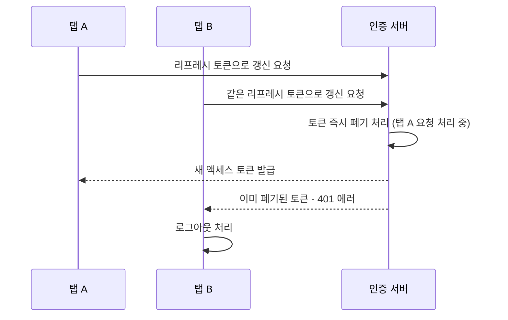

## 문제

여러 탭을 열어둔 사용자가 동시에 토큰을 갱신하면 한쪽 요청이 무효화된 토큰을 사용하게 되어 예기치 않게 로그아웃되는 현상이 있었습니다.

## 원인

리프레시 토큰을 1회용으로 즉시 폐기하면서, 거의 동시에 도착한 두 번째 요청이 이미 폐기된 토큰을 들고 오는 레이스 컨디션이 발생했습니다.

## 해결

- 재발급 시 이전 토큰을 즉시 삭제하지 않고 짧은 유예 시간(grace period) 동안 유효 처리
- 토큰 패밀리 단위로 재사용 감지 → 진짜 탈취 상황만 전체 무효화

## 결과

정상 사용자의 다중 탭 시나리오에서 로그아웃이 사라졌고, 토큰 재사용 공격 탐지 기능은 그대로 유지되었습니다.

