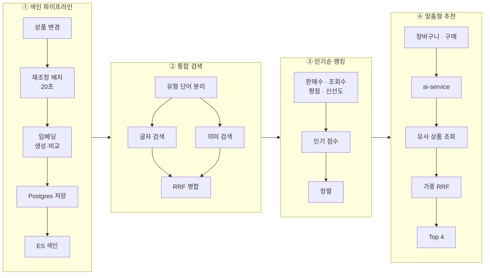

## 배경

검색을 Elasticsearch와 벡터로 옮기는 작업은 끝나 있었다. 남은 것은 **"이 사람에게 맞는 상품"**을
보여주는 일이었다.

여기서 두 가지를 정해야 했다.

1. 추천을 **어느 서비스**에 둘 것인가
2. 사용자의 활동이 여러 개일 때 그것을 **어떻게 하나의 기준으로** 만들 것인가

두 질문 모두 처음 답이 틀렸고, 실측으로 뒤집혔다. 그 과정을 포함해 정리한다.

---

## 전체 흐름 — 네 단계



**한 문장으로**: Postgres가 임베딩 원본을 보관하고, Elasticsearch가 검색을 담당하며,
ai-service가 사용자 활동을 조합해 개인화 추천을 만든다.

<details>
<summary><b>🔍 "임베딩"이 뭔가요?</b></summary>

상품 하나를 **숫자 1536개로 바꾼 것**이다. 지도 좌표를 생각하면 된다. 서울 (37.5, 127.0),
인천 (37.4, 126.7), 부산 (35.1, 129.0) — 좌표만 봐도 서울·인천이 가깝고 부산이 멀다는 걸
뺄셈으로 알 수 있다.

임베딩은 이걸 **"의미"에 대해** 한다. 좌표가 2개가 아니라 1536개일 뿐이다.

- "면접 답변 프롬프트" → `[0.12, -0.87, 0.33, …]`
- "자기소개서 첨삭 프롬프트" → `[0.14, -0.85, 0.31, …]` ← 숫자가 비슷 = 의미가 비슷

**단어가 하나도 안 겹쳐도** 의미가 가까우면 좌표가 가깝게 나온다. 글자 검색과의 결정적 차이다.
이 좌표는 OpenAI의 `text-embedding-3-small` 모델이 만든다.

</details>

---

## ① 색인 파이프라인 — 상품이 바뀌면 좌표도 따라간다

```
상품 등록·수정 → Postgres(원본)
  → 20초마다 도는 재조정 배치
     · 원문(제목+태그+소개글+본문) 해시가 그대로면 건너뜀
     · 바뀌었으면 OpenAI 호출 → 1536차원 좌표 → Postgres 갱신
  → Elasticsearch 색인
```

**결정 1 — 좌표의 원본은 Postgres, Elasticsearch는 사본이다.**

Elasticsearch가 날아가도 상품 데이터만 있으면 색인은 다시 만들 수 있다. 그런데 **좌표는
외부 API를 호출해 만든 값**이라 다시 만들려면 전 상품을 다시 호출해야 한다. "사본은 언제든
재생성 가능하다"는 전제가 좌표에서만 깨진다. 그래서 좌표만 원본을 DB에 둔다.

**결정 2 — 원문 해시로 한 번 더 거른다.**

배치는 `updated_at`으로 대상을 고르는데, **조회수가 1 오르기만 해도 그 값이 바뀐다.**
해시 비교가 없으면 상품을 열어보기만 해도 OpenAI를 호출하게 된다.

<details>
<summary><b>🔍 "재조정 배치"가 뭔가요?</b></summary>

DB와 검색 색인이 어긋났는지 주기적으로 확인하고 맞추는 작업이다. 도서관에 비유하면
**20초마다 서가를 둘러보는 사서**다. 새 책이 들어왔거나 내용이 바뀌었으면 색인 카드를 고쳐 쓴다.

이벤트로 즉시 반영하지 않고 배치를 쓴 이유는, 관리자 승인처럼 **이벤트가 발행되지 않는
경로**가 있기 때문이다. 그런 변화는 이벤트를 기다려도 영원히 안 온다. 대신 최대 20초 지연을
받아들였다.

</details>

---

## ② 통합 검색 — 글자와 의미를 동시에

```
검색어 → 유형 단어 분리 → ┬ 글자 검색 (이름·태그·설명)
                          └ 의미 검색 (좌표 거리, 유사도 0.35 이상)
                          → RRF로 순위 병합
```

**결정 3 — 두 결과를 점수가 아니라 "등수"로 합친다.**

글자 검색 점수(BM25)는 상한이 없고 의미 검색 유사도는 0~1이다. 그냥 더하면 스케일이 안 맞아
데이터가 바뀔 때마다 보정 상수를 다시 잡아야 한다. **RRF는 점수를 버리고 등수만 쓰기 때문에**
그 문제가 없다.

<details>
<summary><b>🔍 "RRF(순위 합산)"가 뭔가요?</b></summary>

여러 목록의 **등수**만 가지고 하나로 합치는 방법이다. 점수는 버린다.

각 목록에서의 등수로 `1 / (60 + 등수)`를 계산해 더한다. 1등이면 `1/61`, 2등이면 `1/62`…
등수가 낮을수록 조금씩 작아진다.

핵심은 **여러 목록에 공통으로 있는 항목이 위로 올라간다**는 것이다. 한쪽에서만 1등인 항목보다,
양쪽에서 고르게 상위인 항목이 이긴다. "두 방식이 모두 관련 있다고 본 것"을 우선하는 셈이다.

`60`이라는 값은 RRF 논문(Cormack et al., 2009)이 제시한 값이다. 작으면 1·2등 차이가
과도하게 벌어지고, 크면 순위 정보가 뭉개진다.

</details>

**결정 4 — 유형 단어는 글자로 찾지 않고 필터로 해석한다.**

`"주식 프롬프트"`라고 치는 사람이 원하는 건 "프롬프트라는 *글자가 들어간* 상품"이 아니라
**"프롬프트 유형 중 주식 관련"**이다. 유형 단어를 글자로 매칭하면 그 단어를 이름에 단 모든
상품이 꼬리로 딸려온다. 이 서비스는 상품 대부분이 프롬프트라 **"프롬프트"가 카탈로그 전체를
여는 만능 열쇠**가 됐다.

→ 자세한 경위: [보이지 않는 본문이 검색 결과를 결정하고 있었다](/troubleshooting/prompthub/search/search-false-positive-content-field)

**결정 5 — 의미 검색에 하한을 반드시 건다.**

kNN은 관련도와 무관하게 **상위 k건을 채워서** 돌려준다. 하한이 없으면 색인 문서가 k보다 적을 때
어떤 질의를 넣어도 전체 상품이 후보로 들어와 **"검색 결과 0건"이 발생할 수 없게 된다.**

<details>
<summary><b>🔍 "kNN"이 뭔가요?</b></summary>

k-Nearest Neighbors, "가장 가까운 k개 찾기"다. 좌표 공간에서 기준점과 가장 가까운 k개를 고른다.

**주의할 성질이 하나 있다.** 가까운 게 하나도 없어도 k개를 채워서 돌려준다. 반에서 키가 제일 큰
4명을 뽑으라고 하면 반 전체가 작아도 4명은 뽑히는 것과 같다.

그래서 "몇 등인가"와 별개로 **"기준을 넘었는가"**를 따로 물어야 한다. 그게 유사도 하한이다.

</details>

---

## ③ 인기순 랭킹 — 네 지표를 합산

```
판매수(log1p) × 0.3
조회수(log1p) × 0.1
평점         × 0.1
신선도(가우시안 감쇠 30일) × 0.2
────────────────────────
합산 → 검색 점수에 더함
```

**결정 6 — 판매·조회에 로그를 씌운다.**

두 값은 상한이 없다. 그대로 더하면 **판매 3000건짜리 하나가 다른 모든 항을 압도한다.**
로그를 씌워 증가폭을 눌러 담는다. 평점은 0~5로 이미 유계라 변환하지 않는다.

<details>
<summary><b>🔍 "log1p"가 뭔가요?</b></summary>

`log(1 + x)`다. 큰 숫자의 차이를 눌러주는 변환이다.

```
판매 0건    → 0.0
판매 10건   → 2.4
판매 100건  → 4.6
판매 3000건 → 8.0
```

판매가 300배 차이나도 점수는 3배 정도만 차이난다. `1+`를 붙이는 이유는 판매 0건일 때
`log(0)`이 음의 무한대가 되는 걸 막기 위해서다.

</details>

**결정 7 — 신선도는 계단이 아니라 완만한 곡선으로.**

"등록 30일 이내면 가산점" 같은 계단식 분기를 쓰면 **경계에서 순위가 튄다.** 어제까지 상위였던
상품이 하루 지나 갑자기 밀린다. 가우시안 감쇠는 연속 함수라 그런 점프가 없다.

**이 가중치 네 개는 아직 실측으로 검증되지 않았다.** 조정 근거가 될 클릭률 지표를 수집하지
않고 있어서, 지금은 초기 추측값 그대로다. 이 사실을 문서에 남겨 "검증된 값"으로 오해하지 않게 했다.

---

## ④ 맞춤형 추천 — 여기가 이번에 새로 만든 부분

```
FE (장바구니 + 구매 목록을 실어 보냄)
  → ai-service
      ├ 활동에서 기준 상품 추림 (신호당 최대 3개)
      ├ gRPC로 product-service에 "이것들과 비슷한 상품" 요청
      ├ 가중 RRF로 합산 (장바구니 1.0 / 구매 0.7)
      ├ 이미 담았거나 산 상품 제외
      └ 상위 4개
```

### 결정 8 — 추천을 product-service가 아니라 ai-service에 뒀다

처음에는 product-service 안에 만들려 했다. 벡터도 상품 데이터도 거기 있으니 자연스러워 보였다.

**바꾼 이유는 요구사항이었다.** "AI 추천 기능을 독립된 서비스 형태로 구현한다"가 명시돼 있었다.
마침 `ai-service`가 이미 독립 서비스로 존재했고(상품 검수·정산 챗봇 담당) gRPC 클라이언트도
쓰고 있어서, 새 서비스를 만들지 않고 거기에 도메인을 하나 추가했다.

**기존 "비슷한 상품"은 옮기지 않았다.** 둘은 다른 기능이다.

| | 비슷한 상품 (기존) | 맞춤 추천 (신규) |
|---|---|---|
| 기준점 | **상품** — 지금 보는 것 | **사람** — 그 사용자의 활동 |
| 결과 | 누가 봐도 같음 | 사람마다 다름 |
| 위치 | product-service | ai-service |
| 계산 | 벡터 거리 | 같음 (gRPC로 위임) |

### 결정 9 — gRPC가 기준별 순위를 "합치지 않고" 돌려준다

이게 이번 설계에서 가장 중요한 선택이다.

```
ai-service  ──"이 상품들과 비슷한 것"──▶  product-service
            ◀──기준마다 순위를 따로──────
            (합쳐진 결과가 아니라 목록 여러 개)
```

product-service가 미리 합쳐서 주면 **"어떤 활동에 얼마나 무게를 둘지, 무엇을 빼고 몇 개를
보여줄지"라는 판단이 product-service로 넘어간다.** 그러면 ai-service는 결과를 통과시키는
껍데기가 되고, 추천을 독립 서비스로 둔 의미가 사라진다.

**product는 "이 상품과 가까운 것"만 답하고, 누구에게 무엇을 추천할지는 모른다.**

### 결정 10 — 여러 활동을 평균이 아니라 가중 순위 합산으로 합쳤다

처음 계획은 **구매한 상품들의 좌표를 평균 내** 취향 벡터를 만드는 것이었다. 흔한 방식이고
직관적이다.

**실측으로 기각했다.** 이 카탈로그는 좌표 공간이 좁게 뭉쳐 있다.

```
상품별 중심성(나머지 전체와의 평균 거리) 상위 15건
0.568 ~ 0.610   ← 폭이 0.042뿐
```

어느 상품도 특별히 중심에 있지 않은데, 이 말은 **주제가 다른 둘을 평균 내면 그 중간 지점이
"모든 것과 어중간하게 가까운 구역"**이 된다는 뜻이다. 그 자리에서 뽑으면 아무거나 나온다.
**평균은 취향을 잡는 게 아니라 지운다.**

```
장바구니: 면접 프롬프트  ●
                           ○ ← 평균 지점. 여기서 뽑으면 아무 상품이나
구매: 엑셀 가계부        ●
```

RRF는 **각 기준의 실제 위치에서 뽑은 등수만** 더하므로 중간 지점을 만들지 않는다. 그리고
여러 목록에서 공통으로 상위인 상품을 올려주므로, 한 목록에서만 우연히 상위인 상품은 밀린다.

### 결정 11 — 가중치는 장바구니 1.0 / 구매 0.7

```
점수 = Σ ( 가중치 × 1 / (60 + 등수) )
```

**장바구니가 더 무겁다.** 장바구니는 *지금* 사려는 것이고 구매는 이미 끝난 과거다. 3주 전
구매보다 방금 담은 것이 현재 관심사에 가깝다.

일반적으로는 "돈을 쓴 구매가 더 강한 신호"라고 보지만, **추천이 뜨는 자리가 탐색 페이지**라는
맥락에서는 지금 의도가 더 중요하다고 판단했다.

### 결정 12 — 활동 내역을 서버에 저장하지 않는다

장바구니와 주문은 order-service가 소유하고, ai-service에는 DB가 없다(Redis만).

세 가지 선택지가 있었다.

| | 방법 | 판단 |
|---|---|---|
| A | ai-service가 order-service를 gRPC로 조회 | 다른 팀원 서비스에 RPC 추가 필요 |
| B | product-service에 구매 이력 테이블 신설 | 카프카 이벤트로 적재. 테이블·컨슈머 추가 |
| C | **화면이 요청에 실어 보냄** | **채택** — order·product 데이터 모델 무변경 |

C를 택하면서 **order-service를 한 줄도 건드리지 않았다.** 장바구니는 이미 화면 전역 상태에
올라와 있어서 추가 호출도 없다.

B(서버에 행동 데이터 축적)는 별개 가치가 있지만 — 지금 이 시스템에는 개인 단위 행동 기록이
서버 어디에도 없다 — 추천에는 필요하지 않아 보류했다.

### 결정 13 — 실패하면 조용히 빈 목록

요구사항에 **"AI 추천이 중단되더라도 상품 구매는 정상 동작해야 한다"**가 있었다.

```
활동 없음        → 200 + 빈 배열 → 화면에서 섹션 숨김
gRPC 실패        → 200 + 빈 배열 (warn 로그) → 섹션 숨김
추천 결과 없음   → 200 + 빈 배열 → 섹션 숨김
```

에러를 올리지 않는다. **추천이 안 되는 것과 상품을 못 사는 것은 다른 문제**이기 때문이다.
다만 조용히 사라지면 고장을 아무도 모르므로 `warn` 로그는 남긴다.

이 설계는 실제로 검증됐다. 배포 순서가 어긋나 ai-service가 구버전 product-service를 호출했을 때
`UNIMPLEMENTED` 오류가 났는데, 화면은 섹션만 숨기고 상품 목록·구매 흐름은 그대로 동작했다.

<details>
<summary><b>🔍 "gRPC"가 뭔가요?</b></summary>

서버끼리 통신하는 방식이다. 브라우저가 서버를 부를 때 쓰는 REST(HTTP+JSON)와 목적이 다르다.

- **REST** — 사람이 읽는 JSON. 브라우저·외부 클라이언트용
- **gRPC** — 미리 정한 계약(`.proto` 파일)에 따라 압축된 이진 형식으로 주고받음. 서버 간 통신용

이 프로젝트는 "외부 클라이언트는 REST, 서비스끼리 동기 호출은 gRPC, 비동기는 Kafka"로
통일해 두었다. 그래서 ai-service → product-service도 gRPC를 썼다.

</details>

---

## 남은 한계 — 숨기지 않고 적어둔다

**추천 목록에 유사도 하한이 없다.**

검색(Elasticsearch)에는 하한 0.35가 있지만, 추천(Postgres 벡터)에는 없다. 두 경로가 저장소도
코드도 공유하지 않아 **같은 종류의 결함이 한쪽에만 고쳐진 상태**다.

거리순으로 줄을 세우고 앞에서 N개를 자를 뿐이라, 아무리 관련이 없어도 "그나마 덜 먼" 상품이
자리를 채운다. 실측하면 이렇다.

```
펭귄 생성 프롬프트 기준
  0.180  동물 이미지 생성 가이드        관련
  0.483  About Me.md 자동 생성          무관
  0.488  Claude Design + Figma          무관
  0.489  블로그 SEO 글쓰기              무관   ← 화면에 보이는 4개 끝
  0.505  웹툰 캐릭터 디자인             관련 — 잘림
  0.531  동화책 일러스트                관련 — 잘림
```

**상위 4건 중 1건만 관련 있고, 정작 관련 있는 상품이 5·8위로 밀려 잘린다.** 맞춤 추천도 같은
엔진을 쓰므로 이 한계를 그대로 물려받는다.

하한 값은 실측했지만 확정하지 못했다. 관련/무관이 거리로 깔끔하게 갈리지 않는 구간이 있었다.

→ 측정 전문: [추천에는 하한이 없었다 — 제안을 두 번 실측으로 뒤집은 기록](/reviews/prompthub/recommendation-similarity-threshold-2026-07-31)

---

## 자주 나오는 질문

<details>
<summary><b>Q. 상세 페이지의 "비슷한 상품"이 개인 맞춤 추천인가요?</b></summary>

**아니다.** 둘은 다른 기능이다.

- `/products/{id}/recommends` — 상세 페이지. **인증이 필요 없고** 사용자 ID를 받지 않는다.
  같은 상품을 열면 누가 봐도 결과가 같다
- `/ai/recommendations` — 탐색 페이지. 사용자 활동을 받아 **사람마다 다른** 결과를 낸다

한 문장으로: 상세 페이지 것은 *상품*이 기준이라 모두에게 같고, 맞춤 추천은 *사람의 활동*이
기준이라 사람마다 다르다.

</details>

<details>
<summary><b>Q. 그럼 추천 알고리즘을 새로 만든 건가요?</b></summary>

**아니다. 계산 엔진은 기존 것을 그대로 재사용한다.**

맞춤 추천도 내부적으로는 "이 상품과 비슷한 상품"을 찾는 같은 벡터 조회를 쓴다. 기존 코드를
한 글자도 고치지 않았다.

새로 만든 것은 그 **위층**이다 — 어떤 활동을 기준으로 삼을지, 여러 결과를 어떤 가중치로 합칠지,
무엇을 뺄지. 그게 ai-service가 하는 일이다.

</details>

<details>
<summary><b>Q. 임베딩은 어떻게 만들고 어디에 저장하나요?</b></summary>

**만들기** — 상품의 `제목 + 태그 + 소개글 + 본문(2000자까지)`을 한 덩어리 텍스트로 합쳐
OpenAI `text-embedding-3-small`에 보내면 숫자 1536개를 돌려준다.

**저장** — Postgres의 `product.embedding` 컬럼(pgvector 확장). Elasticsearch에도 같은 값을
복사해 넣는다.

**갱신** — 20초마다 도는 배치가 원문 해시를 비교해, 텍스트가 바뀐 상품만 다시 호출한다.
해시가 같으면 건너뛴다.

**호출 시점** — 상품 등록·수정 시 1회다. 추천을 조회할 때는 **OpenAI를 호출하지 않는다.**
이미 저장된 좌표끼리 거리만 계산한다.

</details>

<details>
<summary><b>Q. 가중치 1.0 / 0.7은 어떻게 정했나요?</b></summary>

**실측값이 아니라 판단이다.** 그 점을 분명히 해둔다.

근거는 "추천이 뜨는 자리가 탐색 페이지"라는 맥락이다. 지금 사려고 담은 것이 몇 주 전 구매보다
현재 관심사에 가깝다고 봤다.

조정하려면 **어떤 추천이 실제로 클릭됐는지**가 필요한데 그 데이터를 수집하지 않고 있다.
그래서 지금은 검증되지 않은 값이고, 문서에도 그렇게 적었다.

RRF 구조라 값을 바꾸는 것 자체는 상수 하나 수정이다.

</details>

<details>
<summary><b>Q. 전혀 관계없는 상품이 추천되면 어떻게 되나요?</b></summary>

**지금은 그대로 나온다. 이게 알려진 한계다.**

거리 하한이 없어서 "가까운 순으로 N개"만 뽑는다. 관련 있는 상품이 하나도 없어도 4개가 채워진다.
위 「남은 한계」의 펭귄 예시가 그 경우다.

고치는 방법은 쿼리에 조건 한 줄을 더하는 것이지만, **값을 정하지 못했다.** 실측해 보니
관련 있는 상품과 무관한 상품의 거리가 겹치는 구간이 있어서, 어떤 값을 잡아도 한쪽이 희생된다.

- 컷을 낮게(엄격하게) → 확실한 1건만 남고 섹션이 빈약해진다
- 컷을 높게(느슨하게) → 지금과 다를 바 없다

임의의 숫자를 넣기보다 **문제를 명시하고 남겨두는 쪽**을 택했다.

</details>

<details>
<summary><b>Q. 활동 내역을 화면에서 보내면 조작할 수 있지 않나요?</b></summary>

**가능하다. 다만 얻을 게 없다.**

이 API가 하는 일은 "이 상품들과 비슷한 공개 상품 목록"을 돌려주는 것뿐이다. 남의 구매 이력을
넣어도 **그 사람의 개인정보는 나오지 않고**, 공개 상품 정보만 나온다. 상세 페이지의
"비슷한 상품"과 같은 성질의 데이터다.

돈이나 권한이 걸린 판단이었다면 서버가 직접 조회해야 했겠지만, 추천 목록에는 그런 게 없다.

</details>

<details>
<summary><b>Q. 왜 활동을 서버에 저장하지 않았나요?</b></summary>

추천에 필요하지 않아서다.

장바구니·주문은 order-service가 소유하고 화면이 이미 갖고 있다. 저장하려면 테이블·이벤트
소비·정합성 처리가 따라오는데, 그 대가로 얻는 게 "이미 있는 데이터를 한 번 더 갖는 것"뿐이었다.

다만 **다른 목적**으로는 값이 있다. 지금 이 시스템에는 개인 단위 행동 기록이 서버 어디에도
없어서(리뷰 제외), 나중에 취향 분석이나 재구매 방지 같은 기능이 필요해지면 그때 만들면 된다.

</details>

<details>
<summary><b>Q. 사용자가 아무 활동도 안 했으면요?</b></summary>

**섹션을 통째로 숨긴다.** 인기순 같은 것으로 채우지 않는다.

개인화가 아닌 것을 개인화 자리에 채우면 사용자를 속이는 셈이고, 바로 아래에 이미 인기순
목록이 있어서 같은 내용이 두 번 나온다.

</details>

<details>
<summary><b>Q. 추천이 몇 개까지 나오나요? 활동이 20개면요?</b></summary>

**기준으로 삼는 활동은 신호당 최대 3개**다. 장바구니 3개 + 구매 3개 = 최대 6개 기준.

장바구니를 20개 담은 사용자 때문에 서버 호출이 20배가 되는 걸 막기 위한 상한이다. 최근 것이
앞에 온다는 전제로 앞에서 자른다.

최종 노출은 4개이고, 기준 하나당 후보는 16개(4 × 4)를 받아온다. 합산으로 순서가 바뀌고 이미
담았거나 산 상품이 빠지므로 넉넉히 받아야 자리가 안 빈다.

</details>

<details>
<summary><b>Q. 같은 상품을 장바구니에도 담고 구매도 했으면요?</b></summary>

**조회는 한 번만 하고, 가중치는 양쪽 다 받는다.** 1.0 + 0.7 = 1.7이 되어 그만큼 강한 신호로
취급된다.

그리고 이미 산 상품이므로 **결과에서는 제외**된다.

</details>

---

## 정리

이번 작업에서 **두 번 틀렸고 두 번 다 실측으로 바로잡았다.**

1. "추천을 product-service에 두면 된다" → 요구사항이 독립 서비스를 요구해 ai-service로
2. "여러 활동을 평균 내면 취향 벡터가 된다" → 좌표 공간이 압축돼 있어 평균이 취향을 지움. 순위 합산으로

두 번째는 특히, **재보지 않았으면 그럴듯한 코드가 조용히 나쁜 추천을 내고 있었을** 경우다.
"흔한 방식"이라는 이유로 넘어가지 않고 이 카탈로그에서 실제로 어떤 분포인지 잰 것이
설계를 바꿨다.

→ 관련: [검색어를 치면 무슨 일이 벌어지나 — 전 과정](/decisions/prompthub/product-service/es-vector-search-end-to-end-flow)
→ 관련: [검색 품질을 정하는 숫자들](/decisions/prompthub/product-service/search-quality-tuning-values-rationale)
