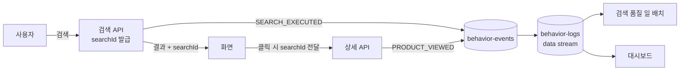

> **아직 구현하지 않았다.** 이 글은 "만든다면 이렇게 만든다"는 설계이고, 실제 코드는 없다.
> 왜 아직 안 만들었는지는 [안 만든 기능들](/decisions/prompthub/product-service/search-roadmap-deferred-issues-and-reopen-conditions)에 있다.

## 배경

앞선 두 글에서 같은 결론에 두 번 도달했다.

- [검색 품질을 정하는 숫자들](/decisions/prompthub/product-service/search-quality-tuning-values-rationale) —
  검색 순위를 실제로 결정하는 값 8개가 근거 없는 `추측`이다. 바꿔도 좋아졌는지 알 수 없다
- [안 만든 기능들](/decisions/prompthub/product-service/search-roadmap-deferred-issues-and-reopen-conditions) —
  중단한 기능 다섯 개가 전부 **행동 로그 하나**에 매달려 있다

그럼 그 하나를 만든다면 어떻게 만드나. 설계 문서는 이미 있었다. 그런데 그대로 만들 수 없다는
게 문제였다.

**원래 설계는 추천을 위한 것이었다.** 인기 검색어를 집계하고, 사용자별 취향 벡터를 만들고,
개인화 홈 추천에 쓰는 흐름이었다. 그런데 **그 소비자들이 지금 전부 닫혀 있다.**

소비자가 사라진 파이프라인을 원안대로 만들면, 아무도 안 읽는 데이터를 모으고 그걸 유지보수하게
된다.

### 비유 — 체중계

다이어트 계획을 아무리 정교하게 짜도 **체중계가 없으면 효과를 모른다.** 식단을 바꿨는데
살이 빠진 건지 그대로인지 알 수가 없으니, 다음에 무엇을 바꿔야 할지도 정할 수 없다.

지금 검색 랭킹이 정확히 그 상태다. 가중치를 바꿀 수는 있는데 **좋아졌는지 나빠졌는지 잴
방법이 없다.** 행동 로그의 첫 목적은 추천이 아니라 **체중계를 놓는 것**이다.

## 고려한 선택지

**1. 원래 설계대로 전부 만든다**

이벤트를 수집해서 인기 검색어 배치, 취향 프로필 배치, 검색 품질 배치, 대시보드 네 갈래로
소비하는 구조다. 설계가 이미 상세히 나와 있어 그대로 옮기면 된다. 다만 네 갈래 중 둘은
소비할 기능 자체가 닫혀 있다.

**2. 계속 안 만든다**

지금 상태 유지다. 검색 트래픽이 없으니 로그를 쌓아도 볼 게 없다는 논리는 여전히 유효하다.
대신 검색 품질을 개선할 방법도 계속 없다.

**3. 소비자를 하나로 줄인 최소 설계 (택함)**

"재는 것"만 남긴다. 수집하는 이벤트는 원안과 같고, 그걸 소비하는 쪽을 넷에서 하나로 줄인다.

## 결정

**행동 로그를 만들되, 첫 목적을 "검색 품질 측정" 하나로 좁힌다.**

### 원안에서 무엇을 뺐나

| 원안의 소비자 | 지금 | 왜 |
|---|---|---|
| 인기 검색어 배치 → 별도 인덱스 | **안 만듦** | 해당 기능이 닫혀 있다. 집계할 트래픽도 없다 |
| 취향 프로필 배치 → 사용자 인덱스 | **안 만듦** | 개인화 추천이 닫혀 있다 |
| 검색 품질 일 배치 | **만듦** | `추측` 8개를 실측으로 바꾸는 **유일한 수단** |
| 대시보드 연결 | **만듦** | ELK가 이미 있어 연결만 하면 된다 |

넷 중 둘을 뺀다. 빼는 기준은 **"지금 이걸 읽을 사람이 있는가"** 하나다.

<b>🔍 나중에 필요해질 텐데 미리 만들어두면 안 되나요?</b>

배치를 미리 만들어두면 그 순간부터 **아무도 안 보는 결과를 계속 계산하고 저장**한다.
공유 검색 엔진 노드에 인덱스가 두 개 더 생기고, 배치가 실패하면 원인을 조사해야 한다.

그리고 나중에 실제로 필요해졌을 때, 미리 만들어둔 것이 그때 요구사항과 맞을 확률이 높지
않다. 인기 검색어를 "최근 7일 상위 10개"로 만들어뒀는데 정작 필요한 게 "카테고리별 상위
5개"일 수 있다.

**수집은 미리 해도 되지만 가공은 필요할 때 한다.** 원본 로그가 남아 있으면 배치는 나중에
언제든 돌릴 수 있다.

### 무엇을 기록하나 — 이벤트 두 개

**검색 실행** — 검색어, 정규화한 검색어, 필터, 정렬, 결과 수, 소요 시간, 하이브리드가 발동
했는지, 폴백으로 넘어갔는지, 상위 결과 ID 목록

**상세 조회** — 어떤 검색에서 왔는지(있으면), 무슨 상품을 봤는지

**자동완성 타이핑은 기록하지 않는다.** 글자마다 이벤트가 나가면 실제 검색 의도보다 노이즈가
훨씬 많아진다.

<b>🔍 "하이브리드가 발동했는지"를 왜 기록하나요?</b>

하이브리드 검색은 항상 도는 게 아니라 조건이 맞을 때만 발동한다. 검색어 좌표를 만드는 데
300밀리초를 넘기면 글자 검색만으로 응답한다.

이걸 기록하지 않으면 나중에 "이 검색어는 결과가 나빴다"를 봤을 때 **랭킹이 나쁜 건지
하이브리드가 발동을 안 한 건지 구분할 수 없다.** 폴백 여부도 같은 이유다.

측정을 목적으로 하는 로그는 **결과뿐 아니라 "어떤 경로로 처리됐는지"를 같이 남겨야** 한다.

### 검색과 클릭을 잇는 것 — `searchId`

검색할 때마다 고유 번호를 발급해 응답에 실어 보낸다. 화면은 결과 링크에 그 번호를 붙여
상세 페이지로 넘기고, 상세 API가 그걸 받아 조회 이벤트에 실는다.

**비유 — 영수증 번호.** 매장에서 물건을 사면 영수증에 번호가 찍힌다. 나중에 교환하러 오면
그 번호로 "언제 무엇을 샀는지"를 정확히 찾는다. `searchId`가 같은 역할이다 — "이 클릭은
아까 그 검색에서 나온 것"을 정확히 잇는다.

이게 없으면 시간과 사용자로 추측해서 이어야 하는데, 사용자가 여러 탭을 열거나 뒤로 가기를
누르면 금방 틀어진다.

### 화면 작업이 필수다

**지금 화면 쪽에 이 코드가 하나도 없다.** 검색 결과를 클릭할 때 그냥 상세 페이지로 이동만
하고 아무것도 서버로 보내지 않는다.

서버만 만들면 **절반짜리**가 된다 — 검색은 기록되는데 "그래서 뭘 눌렀나"가 안 남는다.
클릭이 없으면 클릭률을 못 구하고, 클릭률이 없으면 랭킹이 좋아졌는지 나빠졌는지 여전히
알 수 없다. **측정이 목적인데 측정이 안 되는 상태로 끝난다.**

그래서 이 작업은 서버와 화면을 **같이** 해야 한다. 서버만 먼저 하는 분할은 의미가 없다.

### 어디에 쌓나

시계열 로그라 **추가만 되고 오래된 것은 버리는** 형태(data stream)로 쌓는다.

- 문서 ID를 이벤트 ID로 쓴다 → 같은 이벤트가 두 번 와도 두 번째는 거부된다(멱등)
- 필드는 전부 키워드·날짜·숫자·불리언. **분석기가 필요 없다** — 로그는 검색 대상이 아니라
  집계 대상이다
- 오래된 조각은 자동으로 삭제한다

**자동 삭제는 선택이 아니라 생존 장치다.** 공유 검색 엔진 노드가 heap 1GB 단일 구성인데,
이미 상품 인덱스와 게이트웨이 접근 로그와 애플리케이션 로그가 들어와 있다. 여기에 무한히
자라는 인덱스를 하나 더 얹는 건 노드를 죽이는 일이다.

<b>🔍 컨슈머를 새로 만들어야 하나요?</b>

**안 만들어도 될 가능성이 있다.** 이미 ELK 파이프라인이 붙어 있어서, Logstash가 Kafka에서
직접 읽어 검색 엔진에 넣도록 설정만 하면 된다. 자바 컨슈머 코드·역직렬화·에러 처리·중복
처리를 전부 안 만들어도 되는 셈이다.

다만 이건 **아직 검증하지 않은 아이디어**다. 멱등 처리(같은 이벤트가 두 번 왔을 때)를
Logstash 쪽에서 원하는 대로 할 수 있는지 확인이 필요하고, 파이프라인 소유자와 조율도 해야
한다. 구현 전에 이것부터 확인하는 게 순서다.

### 구매까지 잇는 건 나중에

원래 설계에는 "이 검색에서 클릭한 상품이 실제로 팔렸는가"까지 잇는 흐름이 있었다. 지금은
만들지 않는다.

구매 건수가 적어서 **전환율이 통계적으로 의미를 갖지 못한다.** 검색 100건에 구매 2건이면
전환율 2%인데, 그 2건이 어느 검색어에서 나왔는지는 우연에 가깝다. 클릭률까지만 봐도 랭킹
조정에는 충분하다.

### 이벤트를 발행하는 주체

검색 실행 이벤트는 **검색 기능을 실제로 수행하는 패키지**가 발행한다. 공개 API를 상품
도메인이 단독으로 소유한다는 원칙([D11](/decisions/prompthub/product-service/public-api-ownership-product-single-entry))의
예외가 아니다 — 그 원칙은 **바깥으로 열리는 입구**에 대한 것이고, 내부 이벤트 발행은 그
일을 실제로 하는 쪽이 담당한다.

## 결과

- 수집 범위는 원안과 같게 두고 **소비자를 넷에서 하나로 줄였다.** 기준은 "지금 이걸 읽을
  사람이 있는가"였다
- **화면 작업이 선택이 아니라 필수**라는 게 분명해졌다. 서버만 만드는 분할은 측정이라는
  목적 자체를 달성하지 못한다
- 새 컨슈머 코드를 안 만들 수 있는 길(기존 로그 파이프라인 재사용)이 보였다. 구현 전에
  확인할 첫 번째 항목이다

### 만들고 나면 무엇이 달라지나

`추측` 등급이던 값들을 하나씩 **재면서** 바꿀 수 있게 된다.

| 지금 | 로그가 쌓인 뒤 |
|---|---|
| 이름 가중치를 3에서 4로 올려볼까? → **모름** | 올려보고 클릭률 변화를 본다 |
| 의미 검색 문턱 0.35가 적당한가? → **모름** | 문턱 아래로 잘린 검색어의 결과 0건 비율을 본다 |
| 하이브리드가 실제로 도움이 되나? → **모름** | 발동한 검색과 안 한 검색의 클릭률을 비교한다 |

지금은 세 질문 모두 답이 "모름"이다. **이게 행동 로그를 만드는 이유 전부다.**

### 관련 문서

- [검색어를 치면 무슨 일이 벌어지나 — 전 과정](/decisions/prompthub/product-service/es-vector-search-end-to-end-flow)
- [검색 품질을 정하는 숫자들](/decisions/prompthub/product-service/search-quality-tuning-values-rationale)
- [안 만든 기능들 — 왜 멈췄고 언제 다시 여나](/decisions/prompthub/product-service/search-roadmap-deferred-issues-and-reopen-conditions)
- [검색 로그 파이프라인의 범위를 화면 의존으로 정한 판단](/decisions/prompthub/product-service/search-log-pipeline-scope-by-fe-dependency)
- [검색 이벤트 로그 파이프라인](/study/es/search-event-log-pipeline)
- [행동 기반 추천 설계](/study/es/behavioral-recommendation-design)
