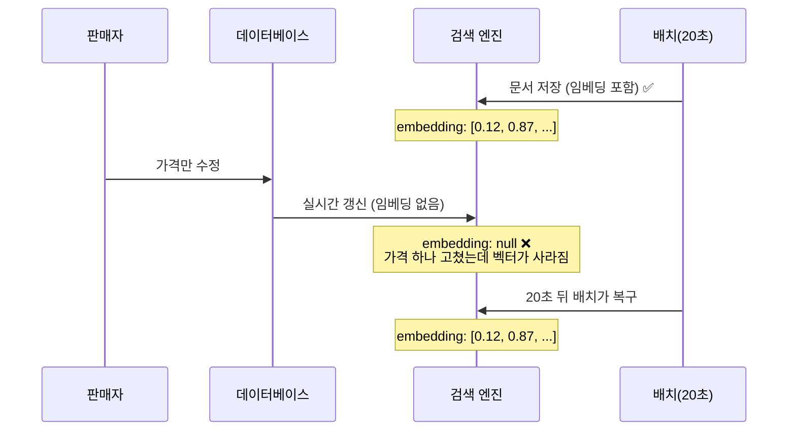

## 배경

앞선 결정에서 **임베딩은 데이터베이스가 원본, 검색 엔진은 검색용 복사본**으로 정했다.
검색 엔진 색인이 통째로 날아가도 원본이 남아 있어, 다시 만들 때 유료 AI 호출을 한 번도 하지
않아도 되는 구조다.

관련 결정: [상품 임베딩은 Postgres가 원본, Elasticsearch는 검색용 복사본](/decisions/prompthub/product-service/embedding-postgres-source-es-replica)

이번 작업은 그 설계의 첫 절반이었다. 임베딩을 만들어 데이터베이스에 저장하는 것까지 끝내고,
검색 엔진 문서에도 같이 실어 보내려던 참이었다.

**실으려고 코드를 열었다가 문제를 발견했다.**

## 고려한 선택지

문제는 검색 엔진 문서를 만드는 코드를 **두 경로가 함께 쓴다**는 것이었다.

<b>🔍 "두 경로"가 뭔가요?</b>

상품 정보를 검색 엔진에 반영하는 길이 두 개다.

- **실시간 경로** — 판매자가 상품을 수정하면 즉시 검색 엔진을 갱신한다. 빠르지만, 알림이
  오는 변경만 잡는다.
- **배치 경로** — 20초마다 데이터베이스를 훑어 어긋난 걸 맞춘다. 느리지만 빠짐이 없다.

둘 다 결국 "검색 엔진에 넣을 문서 한 장"을 만들어야 하니, 그 문서를 조립하는 코드는 하나를
같이 쓰고 있었다. 중복을 줄이려고 그렇게 짠 것이고, 여기까지는 맞는 설계다.

문제는 그 공용 코드에 임베딩을 넣는 순간 드러난다. **배치 경로는 임베딩을 갖고 있지만 실시간
경로는 없다.**

**가격 하나 고쳤을 뿐인데 벡터가 지워진다.** 20초 뒤 배치가 되살리지만, 그 사이에 들어온
의미 기반 검색은 그 상품을 못 찾는다.

<b>🔍 왜 "덮어쓴다"가 아니라 "지운다"가 되나요?</b>

검색 엔진에 문서를 반영하는 방식이 **"문서 전체를 새 것으로 교체"** 이기 때문이다. 바뀐 필드만
골라 고치는 게 아니라 한 장을 통째로 갈아끼운다.

그래서 새로 만든 문서에 임베딩 칸이 비어 있으면, 원래 있던 값이 남는 게 아니라 **빈 값으로
교체된다.** 실시간 경로는 임베딩을 읽어오지 않으니 항상 빈 칸으로 문서를 만든다.

### 1. 실시간 경로에서도 저장된 벡터를 읽어오기

막으려면 실시간 경로가 데이터베이스에서 벡터를 읽어 문서에 실어야 한다. 그러면 상품 수정
요청 하나마다 조회가 하나 늘고, **벡터를 코드에서 다루는 코드가 양쪽에 붙는다.**

<b>🔍 벡터를 읽어오는 게 왜 번거로운가요?</b>

이 벡터 타입은 데이터베이스 확장 기능이 제공하는 특수 타입이라, 자바 쪽 표준 매핑이 없다.
읽으면 `[0.12,0.87,...]` 같은 **문자열로 온다.** 숫자 1,536개짜리 문자열을 잘라서 배열로
되돌리는 변환을 직접 써야 한다.

한 곳에서만 하면 감당되는데, 실시간·배치 양쪽에 붙으면 그 변환이 두 군데서 유지보수 대상이 된다.

### 2. 실시간 경로를 문서 조립 코드에서 분리

두 경로가 각자 문서를 만들게 한다. 그러면 서로 영향이 없다. 대신 방금 하나로 합친 코드를 다시
쪼개는 셈이라, 필드가 늘 때마다 두 곳을 고쳐야 한다.

### 3. 검색 엔진 쪽 복사본 자체를 미루기 ← 채택

여기서 한 걸음 물러나 물었다. **지금 이 값을 읽는 코드가 어디 있나?**

없었다.

- 비슷한 상품 추천은 앞선 결정에 따라 **데이터베이스에서 직접** 조회한다. 검색 엔진을 안 거친다.
- 검색 엔진 쪽 복사본이 처음 필요해지는 건 **하이브리드 검색**인데, 그건 다음 단계 작업이다.

<b>🔍 하이브리드 검색이 뭔가요?</b>

글자 기반 검색과 의미 기반 검색을 **동시에 돌리고 결과를 섞는** 방식이다.

둘은 서로 못 잡는 걸 잡는다. 글자 검색은 "노션 템플릿"처럼 정확한 단어에 강하고, 의미 검색은
"회의록 정리해주는 거"처럼 단어가 안 겹치는 질문에 강하다. 하나만 쓰면 반대쪽이 통째로
빠지므로 둘을 합친다.

이때 의미 검색 쪽을 검색 엔진 안에서 돌리려면, 벡터가 검색 엔진에도 있어야 한다.
그래서 그 작업 전까지는 복사본이 필요 없다.

**아무도 안 읽는 필드를 채우려고 실시간 경로에 복잡도를 얹는 셈**이었다.

## 결정

**검색 엔진 문서에 임베딩을 싣는 작업을 하이브리드 검색 단계로 미룬다.** 이번 단계는 데이터베이스
저장까지만 한다.

원래 설계(원본은 데이터베이스, 복사본은 검색 엔진)는 그대로다. 복사본을 만드는 **시점만** 뒤로
옮긴 것이고, 복사본이 실제로 필요해지는 시점과 맞춘 것이다.

검색 엔진 색인의 스키마에는 벡터 칸이 이미 정의돼 있다. 칸은 비어 있고, 채우는 코드만 없다.

함께 미룬 것이 하나 더 있다. **"검색 엔진에 벡터가 제대로 들어갔나"를 확인하는 테스트**다.
지금 만들면 빈 값을 넣고 빈 값이 나오는 걸 확인하는 테스트가 된다. 통과해도 아무것도 보장하지
않는다.

## 결과

**이번 단계 범위가 줄었고 그만큼 확실해졌다.** 검색 동작이 전혀 바뀌지 않으므로, 이 변경은
사용자에게 보이는 영향 없이 반영할 수 있다.

**다음 단계에서 두 경로 문제를 정면으로 풀어야 한다.** 미룬 것이지 사라진 게 아니다. 하이브리드
검색을 만들 때는 선택지 1과 2 중 하나를 골라야 하고, 그때는 벡터를 읽는 소비자가 실제로 있으니
비용을 낼 이유가 생긴다.

**판단 기준을 하나 확인했다.** "설계에 있으니 지금 만든다"가 아니라 **"읽는 쪽이 생겼을 때
만든다"** 로 가면, 지금 알 수 없는 조건(실시간 경로를 어떻게 다룰지)을 지금 결정하지 않아도
된다. 같은 작업에서 쓰지 않는 필드 두 개를 지운 것도 같은 이유였다.
