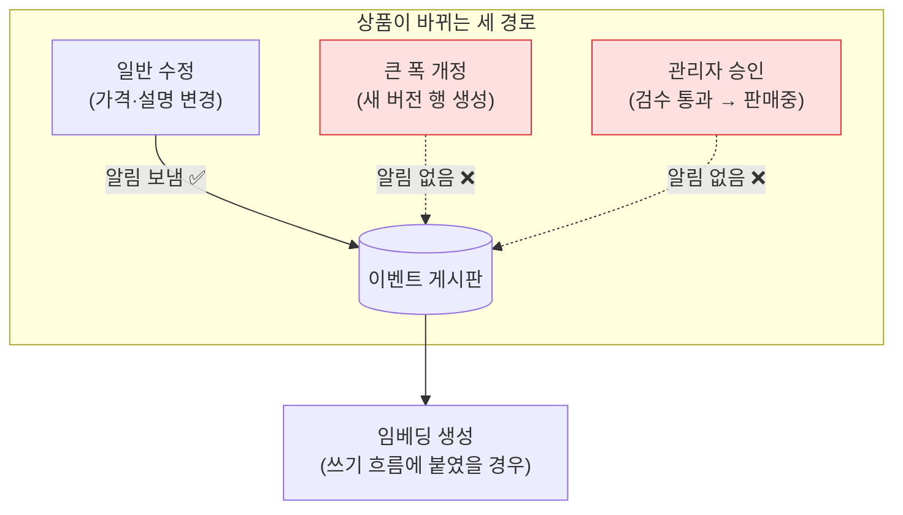
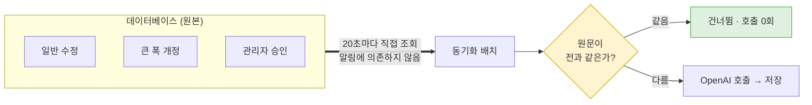

## 배경

의미 기반 검색을 붙이려면 상품마다 **임베딩**을 만들어 저장해야 한다.

<b>🔍 임베딩이 뭔가요?</b>

문장을 **숫자 배열로 바꾼 것**이다. "뜻이 비슷한 문장은 숫자도 비슷하게" 나오도록 미리 학습된
변환이라, 글자가 하나도 안 겹쳐도 의미가 가까우면 숫자상으로 가까워진다.

이 프로젝트에서는 상품 하나당 숫자 1,536개짜리 배열을 만든다. 만드는 일은 외부 AI 서비스
(OpenAI)에 문장을 보내고 결과를 받아오는 것이라, **네트워크 호출이고 돈이 든다.** 이 두 가지가
이 글의 모든 판단을 좌우한다.

관련 결정: [상품 임베딩은 Postgres가 원본, Elasticsearch는 복사본](/decisions/prompthub/product-service/embedding-postgres-source-es-replica)

작업 계획에는 "상품을 저장할 때 임베딩을 만든다"라고 적혀 있었다. 상품이 바뀌면 바로 새
임베딩을 만드는, 가장 자연스러워 보이는 방식이다.

구현 직전에 **정말 모든 변경이 그 지점을 지나가는지** 코드를 따라가 봤다. 지나가지 않았다.

## 고려한 선택지

### 1. 상품 저장 흐름에 직접 붙이기 (원래 계획)

상품을 저장하는 코드 옆에서 임베딩을 만든다. 지연이 없고 이해하기 쉽다.

문제는 **판매 상태가 되는 경로가 하나가 아니라는 것**이었다. 코드를 따라가 보니 세 갈래였고,
그중 둘은 다른 서비스에 알림조차 보내지 않고 있었다.

<b>🔍 "알림을 보낸다"가 무슨 뜻인가요?</b>

서비스가 여러 개로 쪼개져 있으면, A 서비스에서 일어난 일을 B 서비스가 알 방법이 필요하다.
이 프로젝트는 **이벤트**를 쓴다 — A가 "상품이 바뀌었다"는 쪽지를 중앙 게시판(Kafka)에 붙이면,
관심 있는 서비스가 그걸 읽어 각자 할 일을 한다.

쪽지를 안 붙이면 B는 아무것도 모른다. **에러가 나는 게 아니라 조용히 아무 일도 안 일어난다.**
이게 이 문제가 눈에 안 띄었던 이유다.

관리자 승인 경로는 상품 검수가 별도 서비스로 이관되면서 생긴 것인데, **그 서비스에는 이벤트를
보내는 기능 자체가 없다.** 큰 폭 개정은 기존 행을 고치지 않고 새 행을 만드는 방식이라 수정
알림이 나가지 않는다.

즉 쓰기 흐름에 붙이면 **"관리자가 승인해서 막 판매를 시작한 상품"의 임베딩이 영원히 생기지
않는다.** 그런데 그게 정확히 검색에 노출되는 상품이다. 가장 필요한 대상이 통째로 빠진다.

### 2. 빠진 경로에 알림 기능을 새로 추가

검수 서비스에 이벤트 발행을 넣고, 개정 경로에도 알림을 추가한다. 근본 해결처럼 보인다.

하지만 검수 서비스는 다른 팀원이 소유한 코드이고, 이벤트 계약을 새로 정하는 협의가 필요하다.
그리고 **이미 이 셋을 전부 덮는 경로가 하나 있었다.**

### 3. 이미 도는 동기화 배치에서 만들기 ← 채택

검색 색인을 데이터베이스와 맞추는 배치가 20초마다 돌고 있다. 이 배치는 알림에 의존하지 않고
**데이터베이스를 직접 보기 때문에** 세 경로를 모두 잡는다. 어떻게 판매중이 됐든 상관없다.

<b>🔍 이 배치가 뭐 하는 건가요?</b>

검색 결과를 빠르게 주려고, 상품 정보의 사본을 검색 엔진(Elasticsearch)에도 둔다. 원본은
데이터베이스에 있으니 **둘이 어긋날 수 있다.** 이걸 주기적으로 맞추는 게 이 배치다.

20초마다 "마지막 실행 이후 바뀐 상품"만 찾아 검색 엔진에 반영한다. 변경이 없으면 조회 2번으로
끝나고 아무것도 쓰지 않는다.

관련 결정: [검색 색인 동기화를 증분 방식으로](/decisions/prompthub/product-service/incremental-reconcile-over-outbox-event)

이 자리에는 예상 밖의 장점이 하나 더 있었다. **이 배치는 트랜잭션 안에서 돌지 않는다.**

<b>🔍 트랜잭션 안에서 외부 호출을 하면 왜 문제인가요?</b>

트랜잭션은 "여러 데이터베이스 작업을 하나로 묶어, 중간에 실패하면 전부 되돌리는" 장치다.
묶여 있는 동안 데이터베이스 연결을 **붙잡고 있다.**

연결 개수는 한정돼 있다(보통 수십 개). 그 안에서 외부 API를 부르면, 상대가 느릴 때 연결이
그만큼 오래 묶인다. 임베딩 생성처럼 수백 밀리초씩 걸리는 호출이 여러 건 겹치면 연결이 바닥나고,
**임베딩과 아무 상관 없는 다른 요청들이 데이터베이스를 못 써서 같이 멈춘다.**

실시간 알림을 처리하는 코드는 트랜잭션 안에서 검색 엔진을 호출하고 있었다. 거기에 외부 AI
호출까지 넣는 건 위험했다. 배치에는 그 제약이 없다.

대가는 지연이다. 상품이 판매중이 되고 최대 20초 뒤에 임베딩이 생긴다. 다만 이 20초는 이미
"관리자 승인 → 검색 노출"에 합의된 예산이라, 새로 지불하는 비용이 아니다.

## 결정

**임베딩 생성 경로를 주기 배치 하나로 통일한다.** 실시간 훅을 따로 만들지 않는다.

이 결정에는 **반드시 따라붙어야 하는 안전장치**가 하나 있다. 배치는 "마지막 실행 이후 수정된
상품"을 대상으로 고르는데, 그 기준값은 **조회수가 1 오르기만 해도 바뀐다.** 그대로 두면 누군가
상품을 열어보기만 해도 유료 AI 호출이 나간다.

그래서 임베딩의 재료가 되는 텍스트(제목·태그·설명·본문)를 하나로 합쳐 **지문**을 만들어 함께
저장하고, 지문이 같으면 호출하지 않는다.

<b>🔍 "지문"이 정확히 뭔가요?</b>

**해시**라고 부른다. 아무리 긴 글이든 넣으면 정해진 길이(여기선 64글자)의 문자열이 나오는
계산이다. 성질이 두 가지다.

- 같은 글을 넣으면 **항상** 같은 결과가 나온다
- 글이 한 글자만 달라도 결과가 완전히 달라진다

그래서 "예전에 임베딩을 만들 때 쓴 글"과 "지금의 글"이 같은지를, 원문을 통째로 비교하지 않고
64글자만 비교해서 알 수 있다. 사람 지문으로 동일인을 확인하는 것과 같은 발상이다.

이 안전장치가 이 결정에서 가장 중요한 부분이다. 없으면 배치로 옮긴 것 자체가 손해가 된다.

## 결과

**세 경로가 모두 덮인다.** 어떻게 판매중이 됐든 20초 안에 임베딩이 생긴다. 다른 팀원의 서비스를
고치지 않고 해결했다.

**호출량이 실제 변경에 비례한다.** 조회수·판매수 변동만으로는 호출이 나가지 않는다. 상품 텍스트가
실제로 바뀐 경우에만 나간다.

**재시도를 따로 만들지 않았다.** 호출이 실패하면 지문을 저장하지 않으므로, 그 상품은 20초 뒤
다음 회차에 자동으로 다시 대상이 된다. **주기 자체가 재시도**라 별도 재시도 코드는 중복이다.
한 상품이 실패해도 예외를 밖으로 던지지 않고 그 건만 건너뛰어, 나머지 상품의 색인이 멈추지 않게
했다.

**감수한 것은 지연이다.** 상품 등록 직후 20초 동안은 의미 기반 검색에 걸리지 않는다. 글자
기반 검색은 그대로 동작하므로 상품이 안 보이는 건 아니다.

**남은 위험** — 상품이 대량으로 한꺼번에 판매중이 되면 한 회차에 호출이 몰린다. 지금 규모
(65건)에서는 문제가 아니지만, 초기 적재 같은 상황에서는 회차당 처리 개수 제한이 필요해질 수
있다. 실제로 몰리는 걸 확인하기 전에는 넣지 않는다.
