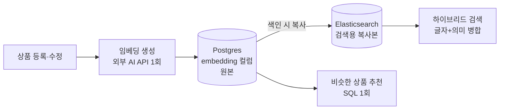

## 배경

상품 검색에 **의미 기반 검색**을 붙이는 작업을 준비하고 있었다.

<details>
<summary><b>🔍 의미 기반 검색이 뭔가요?</b></summary>

기존 검색은 **글자가 겹쳐야** 걸린다. "PPT 템플릿"이라고 쳐야 제목에 그 단어가 있는 상품이
나온다. 그런데 사용자가 "발표자료 이쁘게 만들어주는 거"라고 검색하면? 이 문장엔 "PPT"도
"템플릿"도 없어서 아무것도 안 나온다.

의미 기반 검색은 문장을 **숫자 배열(벡터)로 바꿔서** 비교한다. 이 변환은 "뜻이 비슷한 문장은
숫자도 비슷하게" 나오도록 미리 학습돼 있어서, 글자가 하나도 안 겹쳐도 의도가 같으면 찾아낸다.
이 숫자 배열을 **임베딩(embedding)** 이라고 부른다.

</details>

원래 설계는 이 벡터를 Elasticsearch에만 저장하는 것이었다. 검색 엔진이 이미 거기 있으니
벡터도 같이 두자는 판단이었다.

설계를 다시 검토하면서 두 가지 문제가 드러났다.

**1. Elasticsearch가 날아가면 벡터도 같이 날아간다**

이 프로젝트는 "Elasticsearch는 언제든 데이터베이스로부터 다시 만들 수 있는 사본"이라는
전제로 설계돼 있었다. 그런데 벡터만은 예외였다 — 벡터는 데이터베이스에 없고 외부 AI API를
호출해서 만든 값이라, 인덱스가 유실되면 전 상품을 다시 호출해야 한다.

**2. 비슷한 상품 추천이 검색 엔진 장애에 끌려간다**

상품 상세 페이지의 "비슷한 상품" 추천도 이 벡터를 쓴다. 벡터가 Elasticsearch에만 있으면
검색 엔진이 죽거나 점검 중일 때 추천도 같이 품질이 떨어진다.

## 고려한 선택지

**1. 원안 — 벡터를 Elasticsearch에만 저장**

추가 작업이 없다. 다만 위의 두 문제를 그대로 안고 간다. 그리고 추천 조회 시 "상품의 벡터를
꺼내고 → 그 벡터로 비슷한 것 찾기"로 왕복이 두 번 생긴다.

**2. 벡터를 Postgres에만 저장하고 검색도 Postgres에서**

데이터베이스 하나로 끝나 단순하다. 그런데 의미 기반 검색은 **글자 검색과 의미 검색을 둘 다
돌려서 결과를 합치는** 방식이라(하이브리드 검색), 두 검색이 서로 다른 시스템에 있으면 각각
조회해서 교차 병합해야 한다. 왕복·실패 지점·페이지 처리가 전부 복잡해진다.

**3. Postgres가 원본, Elasticsearch는 복사본 (택함)**

벡터를 상품 테이블의 컬럼으로 저장하고, 검색 색인을 만들 때 그 값을 복사해 넣는다.

## 결정

**Postgres에 pgvector 확장을 도입해 벡터의 원본을 두고, Elasticsearch는 검색용 복사본만
갖는다. 비슷한 상품 추천은 Postgres에서 SQL 한 번으로 처리한다.**



| 용도 | 어디서 |
|---|---|
| 벡터 원본 보관 | **Postgres** — 상품 테이블의 컬럼 |
| 비슷한 상품 추천 | **Postgres** — SQL 한 번 |
| 하이브리드 검색의 의미 검색 부분 | **Elasticsearch** — Postgres에서 복사받음 |
| 목록·정렬·자동완성 | **Elasticsearch** |

<details>
<summary><b>🔍 pgvector가 뭔가요?</b></summary>

Postgres에 벡터를 저장하고 "가장 비슷한 것 N개 찾기"를 할 수 있게 해주는 **확장 기능**이다.
Postgres 자체에는 없고 따로 설치해야 한다.

설치하면 `vector(1536)` 같은 컬럼 타입을 쓸 수 있고, `<=>` 연산자로 두 벡터가 얼마나 비슷한지
계산한다. 비교를 빠르게 하려고 별도 색인(HNSW)도 걸 수 있다.

</details>

**왜 Postgres를 원본으로 두는가**

- Elasticsearch가 유실돼도 벡터는 남는다. 전체 재색인이 외부 AI API 호출 **0회**로 끝난다.
  "검색 엔진은 언제든 재생성 가능한 사본"이라는 전제가 벡터에도 실제로 성립하게 된다
- 벡터가 특별한 검색 전용 산출물이 아니라 상품명·가격처럼 **평범한 컬럼**이 된다.
  쓰는 곳이 하나(상품 저장), 복사하는 곳이 하나(색인)로 단순해진다

**왜 추천은 Postgres에서 조회하는가**

```sql
SELECT ... FROM product
WHERE status = 'ON_SALE' AND 자기_상품_계열 <> :현재상품계열
ORDER BY embedding <=> (SELECT embedding FROM product WHERE id = :현재상품)
LIMIT :후보수
```

- **SQL 한 번**으로 끝난다 (검색 엔진 경유는 왕복 2회)
- 판매중 여부, 자기 상품 제외 같은 조건이 **실제 컬럼**이라 정확하다. 검색 색인은 동기화에
  최대 20초 지연이 있어 방금 판매중지한 상품이 잠시 남을 수 있는데, 원본에는 그 틈이 없다
- 검색 엔진 장애·점검과 무관하게 동작한다. 덕분에 "장애 시 예전 방식으로 되돌아가는" 이중
  경로 자체가 필요 없어졌다

**왜 검색은 여전히 Elasticsearch인가**

하이브리드 검색은 글자 검색 순위와 의미 검색 순위를 합치는 방식이라, 두 순위가 **같은
시스템 안에서** 나와야 한 번의 요청으로 끝난다. 벡터만 Postgres에 두면 두 시스템을 각각
조회해 병합해야 하고, 그건 원안보다 복잡하다.

<details>
<summary><b>🔍 두 순위를 "합친다"는 게 왜 어려운 일인가요?</b></summary>

글자 검색 점수와 의미 검색 점수는 **단위가 다르다.** 글자 검색은 상한이 없는 점수(0~50 등)로
나오고, 의미 검색은 0~1 사이 값으로 나온다. 그냥 더하면 한쪽이 다른 쪽을 압도해버린다.

그래서 점수 대신 **등수**만 쓴다. "이 상품이 글자 검색에서 3등, 의미 검색에서 1등"이라는
정보만 가지고 합치는 방식이다. 등수는 둘 다 1등부터 시작하는 같은 단위라 섞어도 문제가 없다.

이걸 하려면 두 검색 결과가 한 시스템에서 동시에 나와야 편하다. 서로 다른 두 시스템에서
따로 받아오면 페이지 처리와 중복 제거가 꼬인다.

</details>

### 이 결론에 이르기까지

pgvector는 **한 번 제안됐다가 기각됐고 다시 채택됐다.** 기각했던 근거와 그게 왜 틀렸는지를
남겨둔다.

**기각 근거는 규모였다.** 왕복 2회와 1회는 밀리초 차이이고, 검색 색인에는 판매중 상품만
들어가므로 필터링도 이미 정확하며, 20초 지연은 "비슷한 상품" 영역에서 체감되지 않는다고
봤다. 커스텀 이미지를 만들고 공유 인프라를 건드릴 만한 이득이 아니라는 결론이었다.

**빠진 것은 지연 구간과 장애 구간이었다.** "필터링이 이미 정확하다"는 말은 색인이 최신일
때만 참이다. 재조정이 아직 돌지 않은 최대 20초 동안, 그리고 검색 엔진이 죽어 있는 동안에는
참이 아니다. 정상 동작만 확인하고 그 두 구간을 계산에 넣지 않은 판단이었다. 추천이라는 기능이
검색 엔진의 상태에 묶여야 할 이유가 없다는 점도 그 과정에서 분명해졌다.

**용량 우려는 실제로 계산해서 해소했다.** "벡터를 두 곳에 저장하면 리소스가 과하지 않냐"는
물음에 수치를 뽑아보니 상품당 약 20KB, 상품 50개 기준 1MB였다 — 상품 썸네일 한 장보다 작다.
**저장 용량은 애초에 논점이 아니었고**, 실제 비용은 커스텀 이미지 제작과 공유 Postgres를
건드리는 데 따르는 조율이었다. 비용의 정체를 잘못 짚고 있었던 셈이다.

이 과정에서 얻은 기준이 하나 있다. **규모를 근거로 무언가를 기각할 때는, 정상 동작뿐 아니라
지연·장애 구간까지 같은 규모로 따져야 한다.** 평시에 무의미한 차이가 비정상 구간에서는
기능의 가용성을 가르는 차이가 된다.

## 결과

- 검색 엔진 인덱스가 유실돼도 벡터는 보존되고, 재색인 비용이 외부 API 호출 0회가 됐다
- 비슷한 상품 추천이 검색 엔진에 대한 의존을 완전히 끊었다. 장애 대비 이중 경로 코드가
  설계에서 사라졌다
- 추천의 필터 조건이 색인 동기화 지연과 무관해져, 관리자가 상품을 승인하면 즉시 반영된다

**대가**: pgvector는 Postgres 확장이라 기본 이미지에 없어서, 확장을 포함한 커스텀 이미지를
만들어야 한다. Postgres는 전 서비스가 공유하는 인프라라 검색 엔진 이미지보다 영향 범위가
넓고, 적용 시점에 팀 조율이 필요하다.

<details>
<summary><b>🔍 왜 공식 pgvector 이미지를 그냥 쓰지 않았나요?</b></summary>

공식 이미지는 Debian 계열인데 현재 쓰는 건 Alpine 계열이다. 이 둘은 문자열을 정렬하는 규칙이
미묘하게 다르다.

기존 데이터를 그대로 둔 채 이미지 계열을 바꾸면, **문자 컬럼에 걸어둔 색인의 정렬 순서가
어긋나** 조회 결과가 조용히 틀어질 수 있다. Postgres에서 잘 알려진 사고 유형이다.

그래서 Alpine 기반 이미지에 확장만 직접 설치하는 방식을 택했다. 검색 엔진에 한국어 분석기를
설치할 때 이미 쓰고 있던 방식과 동일하다.

</details>
