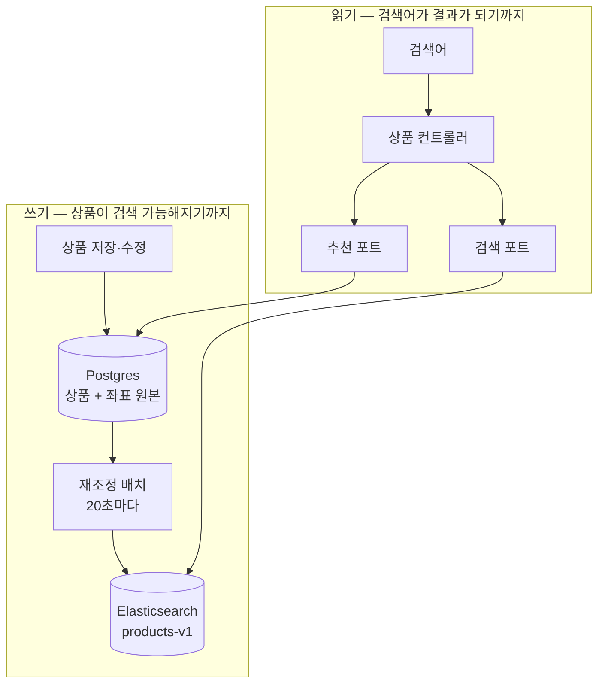
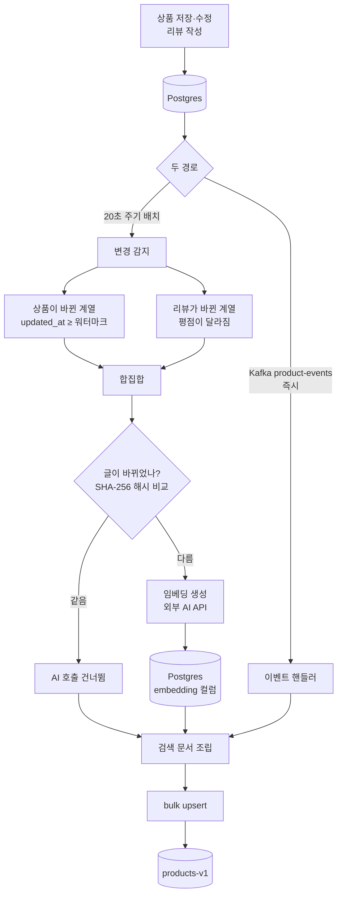
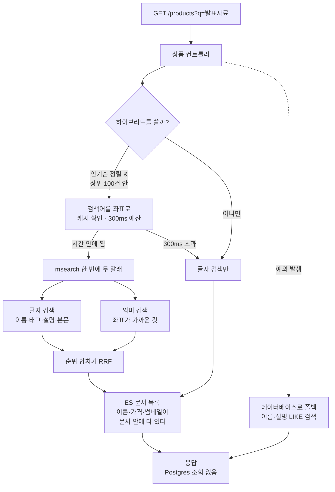

## 배경

상품 검색을 Elasticsearch로 옮기고 의미 기반 검색과 추천을 붙이는 작업을 이슈 다섯 개로 쪼개
진행했다. 각 이슈마다 왜 그렇게 정했는지는 따로 기록했다.

그런데 **그 결정들이 실제로 어떻게 맞물려 돌아가는지를 한 번에 보는 문서가 없다.** 지금은
결정 아홉 편을 순서 없이 읽어서 전체 그림을 머릿속에서 다시 조립해야 한다. 반년 뒤에 이
시스템을 다시 만져야 할 때 그게 가능할 것 같지 않았다.

이 글은 새로운 결정을 내리는 글이 아니다. **이미 내린 결정들이 하나의 흐름으로 어떻게
이어지는지**를 정리하고, 개별 문서에 흩어져 있어 보이지 않던 연결과 빈틈을 드러내는 것이
목적이다.

### 먼저 그림 하나 — 도서관

이 시스템은 도서관과 구조가 같다.

- **서가에 꽂힌 책** = Postgres의 상품 데이터. 이게 원본이다
- **색인 카드 상자** = Elasticsearch. 책을 빨리 찾으려고 따로 만들어 둔 것이다. 카드가 다
  타버려도 서가가 있으면 다시 만들 수 있다
- **20초마다 서가를 둘러보는 사서** = 재조정 배치. 새 책이 들어왔거나 책 내용이 바뀌었으면
  카드를 고쳐 쓴다
- **책 내용을 좌표로 바꿔 적어둔 카드** = 임베딩. "이 책은 대략 이 근처 주제"라는 위치를
  숫자로 적어둔 것이라, 제목이 하나도 안 겹쳐도 가까운 책을 찾을 수 있다

이 비유를 계속 쓴다. 아래 모든 설명은 "서가 / 카드 상자 / 사서 / 좌표"의 조합이다.

## 고려한 선택지

**1. 데이터베이스 하나로 — 이름에 검색어가 들어가는지 훑기**

`WHERE lower(name) LIKE '%검색어%'`. 서가를 처음부터 끝까지 훑는 방식이다. 인프라가 늘지
않는다. 다만 글자가 정확히 겹쳐야만 걸리고, 정렬을 판매량·평점·최신순으로 섞으면 쿼리가
빠르게 감당하기 어려워진다.

**2. Elasticsearch 하나로 — 벡터까지 전부 검색 엔진에**

색인 카드 상자에 좌표까지 전부 넣는다. 저장소가 하나라 단순하다. 대신 카드 상자가 날아가면
좌표도 같이 날아가는데, 좌표는 외부 AI API를 호출해 만든 값이라 다시 만들려면 전 상품을
다시 호출해야 한다. "카드는 언제든 다시 만들 수 있다"는 전제가 좌표에서만 깨진다.

**3. Postgres가 원본, Elasticsearch는 검색용 사본 (택함)**

좌표의 원본은 서가(상품 테이블의 컬럼)에 두고, 카드를 만들 때 그 값을 복사해 넣는다.
추천은 서가에서 직접 찾고, 검색은 카드 상자에서 찾는다.

## 결정

**Postgres를 원본으로 두고 Elasticsearch를 검색 전용 사본으로 유지한다. 공개 API는 상품
컨트롤러 하나만 소유하고, 검색·추천은 그 뒤에 포트로 붙는다.**

두 결정 각각의 자세한 근거는 별도 문서에 있다.

- [상품 임베딩은 Postgres가 원본, Elasticsearch는 검색용 복사본](/decisions/prompthub/product-service/embedding-postgres-source-es-replica)
- [공개 API의 주체는 상품 도메인 하나 — 검색·추천은 포트로만 참여](/decisions/prompthub/product-service/public-api-ownership-product-single-entry)

전체 구조는 이렇게 생겼다.



핵심은 **화살표가 한 방향으로만 흐른다**는 점이다. Postgres에서 Elasticsearch로 복사가
흐르고 그 반대는 없다. 카드 상자는 서가에게 아무것도 알려주지 않는다.

---

### 쓰기 경로 — 상품이 검색되기까지

상품을 저장하면 그 즉시 검색되지 않는다. 사서가 한 바퀴 돌아야 한다.



**상품 하나 = 문서 하나가 아니다.** 이 서비스는 상품을 수정하면 새 행이 생기고 예전 행이
남는 구조(버전 이력)라, 한 상품에 여러 행이 존재한다. 검색 카드는 그 계열 전체에 대해
**하나만** 만든다. 판매 중인 최신 버전 하나만 카드에 적힌다.

<details>
<summary><b>🔍 왜 리뷰가 바뀌어도 카드를 다시 쓰나요?</b></summary>

카드에는 평점과 리뷰 수도 적혀 있다. 검색 결과를 평점순으로 정렬하려면 그 값이 카드에
있어야 하기 때문이다.

그래서 사서는 두 가지를 본다 — **상품 자체가 바뀐 계열**과 **리뷰가 달린 계열**. 둘을 합쳐서
카드를 고쳐 쓴다. 상품만 봤다면 리뷰가 100개 달려 평점이 뒤집혀도 검색 순위는 그대로일
것이다.

</details>

**AI 호출을 아끼는 장치가 하나 있다.** 사서는 "마지막으로 본 시각 이후에 바뀐 것"을
기준으로 대상을 고르는데, 상품을 **조회만 해도** 그 시각이 갱신된다. 아무 조치가 없으면
누가 상품을 열어보기만 해도 좌표를 다시 계산하려고 외부 AI를 호출하게 된다.

그래서 상품 글(제목·태그·설명·본문)만 뽑아 해시를 만들어 저장해 두고, 그 값이 그대로면
호출을 건너뛴다. **조회수가 올라도 글이 그대로면 좌표는 다시 만들지 않는다.**

<details>
<summary><b>🔍 좌표를 저장할 때 "수정 시각"을 안 건드리는 이유는요?</b></summary>

좌표를 저장하면서 상품의 수정 시각도 함께 갱신하면, **그 상품이 다음 배치에서 또 변경
대상으로 잡힌다.** 그럼 또 처리하고, 또 시각이 갱신되고, 다음 배치에서 또 잡힌다.

배치가 자기 꼬리를 무는 셈이다. 그래서 좌표 저장만은 수정 시각을 건드리지 않는 방식으로
따로 처리한다.

</details>

임베딩을 만드는 곳은 **이 배치 한 곳뿐**이다. 상품 저장 흐름에 직접 붙이지 않았는데, 그
이유는 상품이 검색 가능해지는 경로가 저장만이 아니기 때문이다 — 관리자가 승인해서 판매
상태가 되는 경우와 큰 폭의 수정으로 새 버전이 생기는 경우에는 저장 이벤트가 발행되지
않는다. 저장 흐름에만 붙였다면 그 두 경우의 좌표가 **영원히 만들어지지 않는다.**
자세한 근거: [임베딩 생성을 재조정 배치 안에 둔 이유](/decisions/prompthub/product-service/embedding-generation-in-reconcile-batch)

대가는 **최대 20초 지연**이다. 이 값은 비용이 아니라 사용자 경험으로 정했다 — 관리자가
승인하고 나서 "잘 올라갔나" 확인하는 작업 루프가 대략 5~15초인데, 그걸 크게 넘기지 않아야
한다는 기준이다. 주기와 방식의 근거:
[전체 재작성 대신 변경분만 반영하는 재조정](/decisions/prompthub/product-service/incremental-reconcile-over-outbox-event)

---

### 읽기 경로 — 검색어가 결과가 되기까지



**목록 응답은 Elasticsearch 문서를 그대로 변환한 것이다. Postgres를 조회하지 않는다.**
상품명·가격·썸네일이 전부 색인 문서 안에 들어 있어서 데이터베이스를 볼 이유가 없다.

이 사실이 실제로 문제를 만들었다. 데이터베이스의 상품을 전부 지웠는데 **목록에는 계속
나오고 눌러보면 없는** 상태가 됐다. 목록은 색인만 보고(고아 문서가 남아 있음), 상세는
데이터베이스를 보기(행이 없음) 때문이다. 카드 상자는 서가에서 책이 빠진 것을 스스로
알아채지 못한다.

<details>
<summary><b>🔍 그럼 그 고아 문서는 언제 정리되나요?</b></summary>

**20초 증분 재조정으로는 정리되지 않는다.** 증분은 "수정 시각이 바뀐 상품"을 찾는데, 행이
통째로 사라지면 바뀐 것으로 잡힐 대상이 아예 없다. 변경 신호가 발생하지 않아서 배치는 매
주기마다 "변경 없음"으로 판단하고 색인을 건드리지 않는다.

고아 문서를 지우는 것은 **전체 재조정**뿐이고, 그건 기동 시 1회와 하루 1회만 돈다. 수동
트리거 엔드포인트는 없다. 그래서 즉시 정리하려면 **서비스를 재시작**해 첫 순회의 전체
재조정을 유발하는 것이 유일한 방법이다.

</details>

**하이브리드가 무엇의 합인지가 자주 헷갈린다.** 저장소 두 개(Postgres와 Elasticsearch)를
섞는 게 아니다. **검색 방법 두 개**를 섞는 것이다.

| | 글자 검색 (lexical) | 의미 검색 (semantic) |
|---|---|---|
| 무엇을 보나 | 검색어의 **글자**가 문서에 있나 | 검색어의 **뜻**이 문서와 가까운가 |
| "발표자료 이쁘게" | 이 글자가 없으면 0건 | "PPT 템플릿"을 찾아냄 |
| "이력서" | 정확히 찾음 | 관련은 있지만 덜 정확할 수 있음 |
| 어디서 도나 | Elasticsearch | Elasticsearch (좌표 사본) |

둘 다 Elasticsearch 안에서 돈다. 요청 한 번(`msearch`)으로 두 갈래를 동시에 던지고 결과를
합친다. **이 흐름에는 Postgres가 아예 등장하지 않는다.** 상세보기와 비슷한 상품 추천은
Postgres를 보지만, 목록·검색은 색인만 본다.

<details>
<summary><b>🔍 두 결과를 어떻게 "합치나요"?</b></summary>

점수를 더하면 안 된다. 글자 검색 점수는 상한이 없고(0~50 같은 값) 의미 검색 점수는 0~1
사이라, 그냥 더하면 한쪽이 다른 쪽을 압도한다.

그래서 **점수를 버리고 등수만 쓴다.** "이 상품이 글자 검색에서 3등, 의미 검색에서 1등"이라는
정보만 가지고 합친다. 등수는 양쪽 다 1등부터 시작하는 같은 단위라 섞어도 왜곡이 없다.

이 방식의 이름이 RRF(Reciprocal Rank Fusion)다. 각 등수를 `1 / (60 + 등수)`로 바꿔 더한다.
1등은 큰 값, 100등은 아주 작은 값이 되고, 양쪽에서 모두 상위인 문서가 결국 앞으로 나온다.

</details>

**하이브리드는 항상 도는 게 아니다.** 인기순 정렬이면서 상위 100건 안일 때만 발동한다.
평점순·가격순으로 정렬하면 순위를 섞는다는 개념 자체가 성립하지 않고, 100건을 넘어가는
페이지에서는 두 갈래를 합칠 재료가 창 밖에 있다.

검색어를 좌표로 바꾸는 데는 **300밀리초 예산**이 걸려 있다. 외부 AI 호출이라 느릴 수 있는데,
그 때문에 검색 전체가 느려지면 안 된다. 시간을 넘기면 그냥 글자 검색만으로 응답한다. 사용자
입장에서는 "결과가 조금 덜 똑똑한" 것이지 "느린" 게 아니다.

---

### 추천 경로 — 비슷한 상품


추천은 **Elasticsearch를 거치지 않는다.** 서가에서 직접 찾는다. 이유가 셋 있다.

- SQL 한 번으로 끝난다. 검색 엔진을 거치면 "이 상품의 좌표를 꺼내고 → 그 좌표로 가까운 것
  찾기"로 왕복이 두 번이다
- "판매 중인가", "자기 자신 계열은 빼라" 같은 조건이 **실제 컬럼**이라 정확하다. 카드 상자는
  최대 20초 뒤처져 있어서 방금 판매중지한 상품이 잠깐 남아 있을 수 있다
- 검색 엔진이 죽어도 추천은 산다. 덕분에 "장애 시 다른 경로로" 같은 이중 코드가 필요 없다

**후보를 20건 뽑아서 4건으로 줄이는 이유**는 재정렬 때문이다. 같은 유형(프롬프트끼리,
템플릿끼리)이면 점수를 조금 올려주는데, 데이터베이스가 이미 4건만 주고 끝냈다면 재정렬할
여지가 없다.

<details>
<summary><b>🔍 왜 그 가산점을 SQL 안에서 계산하지 않나요?</b></summary>

`ORDER BY`에 산술을 얹으면 **인덱스를 못 타기 때문**이다.

좌표 비교를 빠르게 하려고 특수한 인덱스(HNSW)를 걸어뒀는데, 이 인덱스는 `ORDER BY 거리연산`
형태일 때만 동작한다. `ORDER BY 거리연산 + 보너스`처럼 계산식이 되는 순간 데이터베이스는
인덱스를 포기하고 전체를 훑는다.

그래서 데이터베이스에는 순수하게 "가까운 순 20건"만 시키고, 가산점 재정렬은 애플리케이션
메모리에서 한다. 20건을 정렬하는 비용은 무시할 수 있다.

</details>

---

### 한 장으로 — 어느 API가 어디를 읽나

세 경로를 따로 보면 헷갈린다. **읽는 곳이 API마다 다르다**는 게 이 구조의 핵심이다.

| API | 읽는 곳 | 색인이 낡으면 |
|---|---|---|
| 목록·검색 | **Elasticsearch만** (실패 시 데이터베이스 폴백) | 낡은 결과가 그대로 노출 |
| 자동완성 | **Elasticsearch만** (폴백 없음) | 낡은 상품명이 그대로 노출 |
| 상세보기 | **Postgres** | 영향 없음 |
| 비슷한 상품 | **Postgres** (pgvector) | 영향 없음 |

위쪽 둘은 사본을 보고 아래쪽 둘은 원본을 본다. **사본이 낡으면 두 그룹의 답이 갈린다** —
목록에는 있는데 눌러보면 없는 상태가 정확히 이것이다.

추천을 Postgres에 둔 이유가 여기서 드러난다. 판매 상태나 자기 계열 제외 같은 조건이 **실제
컬럼**이라 색인 지연에 끌려가지 않는다. 같은 조건을 색인에서 걸렀다면 추천도 목록과 같이
틀어졌을 것이다.

---

### 왜 목록은 색인만 읽나

단점을 먼저 세보면 셋이다.

1. 표시 값이 낡을 수 있다 — 가격을 고쳤는데 목록에는 잠시 옛 가격이 뜬다
2. 목록과 상세가 서로 다른 답을 할 수 있다
3. 데이터베이스를 직접 건드리면 증분 재조정이 알아채지 못한다

이점은 "쿼리 한 번으로 끝난다" 하나로 보인다. **숫자만 세면 3대 1로 지는 거래다.** 그런데
셋을 하나씩 뜯어보면 달라진다.

#### 1. 복사는 선택이 아니라 이미 지불된 비용이다

색인 매핑에 어떤 필드가 왜 들어있는지 세어보면 이렇다.

| 쓰임 | 필드 |
|---|---|
| **검색** | 이름, 설명, 본문, 태그 |
| **정렬·랭킹** | 판매량, 조회수, 평점, 최초 공개일, 가격 |
| **필터** | 상품 유형 |
| **표시 전용** | 썸네일 |

**검색과 정렬을 색인에서 하는 한 위쪽 필드들은 색인에 있어야 한다.** 표시 전용으로 추가된
것은 썸네일 정도이고, 매핑에서 이 필드만 `"index": false`로 선언돼 있다 — 색인이 스스로
"이건 검색에 안 쓴다"고 밝히고 있는 셈이다.

그러니까 **"표시 필드를 복사해야 한다"는 단점은 읽는 방식과 무관하게 이미 발생한다.** 목록을
데이터베이스에서 채우도록 바꿔도 복사는 그대로 남는다. 이미 복사해 둔 값을 안 읽고 원본으로
되돌아가는 쪽이 오히려 낭비다.

#### 2. 데이터베이스에서 채워도 문제가 사라지지 않는다 — 모양만 바뀐다

"색인에서 ID만 받고 상세 값은 데이터베이스에서 채우면 되지 않나"가 자연스러운 대안이다.
그런데 그렇게 하면 이렇게 된다.

```
전체 개수는 색인이 센 값이다
20건 요청 → 색인이 ID 20개를 준다 → 데이터베이스에 3건이 없다 → 17건만 응답
다음 페이지 여부는 (건너뛴 수 + 응답 수 < 전체 수)로 계산한다 → 어긋난다
```

**"없는 상품이 보인다"가 "페이지마다 개수가 들쭉날쭉하고 총 개수가 안 맞는다"로 바뀐다.**
둘 다 틀린 상태이고, 후자는 원인을 찾기가 더 어렵다. 개수를 맞추려면 색인에서 여유분을 더
받아오거나 전체 개수를 다시 세야 하고, 그건 쿼리를 하나 더 늘리는 일이다.

**어느 쪽을 택하든 진짜 해법은 하나다 — 색인을 최신으로 유지하는 것.** 그게 재조정 배치가
하는 일이고 이미 있다. 읽는 곳을 바꾸는 것은 증상의 모양만 바꾼다.

#### 3. 되돌아가면 색인으로 옮긴 이유를 반납한다

애초에 목록을 색인으로 옮긴 이유가 **판매량·평점·신선도를 섞은 정렬을 데이터베이스에서
감당하기 어려웠기** 때문이다. 목록은 가장 많이 호출되는 API이기도 하다.

순서 문제도 따라온다. SQL은 `IN` 목록에 넣은 순서를 보장하지 않으므로, 색인이 정한 순위를
데이터베이스에서 다시 꺼내면 **애플리케이션에서 원래 순서로 재정렬해야 한다.** 비슷한 상품
추천에 이미 그 재정렬 코드가 있다 — 목록에도 같은 코드가 생긴다.

#### 그래서 — 단점 셋은 사실 하나다

셋 다 **"사본은 원본보다 늦다"**는 한 가지 성질의 다른 얼굴이다. 사본을 쓰는 순간 생기는
성질이고, 사본을 안 쓰면 검색 자체를 못 한다.

남은 질문은 "얼마나 늦나"뿐이다.

| 무엇이 바뀌면 | 색인에 반영되는 시점 |
|---|---|
| 판매자가 상품을 수정·삭제 | **즉시** (이벤트 발행 → 색인 반영) |
| 관리자가 승인을 취소 | **20초 안에** (수정 시각이 바뀌므로 증분이 잡는다) |
| 데이터베이스를 직접 조작 | 전체 재조정까지 (기동 시 / 하루 1회) |

앞의 둘은 정상 경로이고 자동으로 수렴한다. 세 번째는 애플리케이션을 우회한 조작이라
애플리케이션이 알 방법이 없다 — 행이 사라지면 "바뀐 것"으로 잡힐 대상 자체가 없다.

**결론: 이 구조는 "사본이 최대 20초 늦는 것"과 "목록 조회마다 원본을 한 번 더 보는 것"을
맞바꾼 것이다.** 20초는 정상 경로에서만 생기고 그 안에 스스로 수렴한다. 원본 조회는 모든
요청에서 상시 발생한다. 지금 규모에서는 전자가 싸다.

**이 판단을 다시 볼 조건**: 가격처럼 즉시 정확해야 하는 값이 목록에 노출되면서 20초 오차가
실제 불만이 될 때. 그때는 전체를 되돌리는 대신 **그 필드만 원본에서 채우는 부분 채움**을
검토하는 것이 순서다.

---

### 실패하면 어떻게 되나

이 시스템에서 **실패는 조용히 일어난다.** 어디가 어떻게 무너지는지 미리 적어둔다.

| 무엇이 | 어떻게 되나 | 사용자가 알아채나 |
|---|---|---|
| 목록·검색 | 데이터베이스 `LIKE` 검색으로 폴백 | **거의 못 느낀다** — 결과 품질만 떨어짐 |
| 자동완성 | 빈 목록. **폴백 없음** | 드롭다운이 안 뜬다. 조용하다 |
| 비슷한 상품 | 빈 배열. 화면에서 섹션이 사라짐 | 섹션이 없는 걸로 보인다 |
| 재조정 배치 | 워터마크를 전진시키지 않고 재시도 | **영구 손실 없음** |

가장 먼저, 그리고 가장 조용히 깨지는 곳은 **자동완성**이다. 검색은 폴백이 있어서 계속
동작하지만 자동완성은 없다. 검색 엔진에 문제가 생겼을 때 "검색은 되는데 자동완성만 안 뜬다"면
그건 우연이 아니라 설계된 순서다.

배치에 영구 손실이 없는 이유는 **성공했을 때만 워터마크를 전진**시키기 때문이다. 실패한
구간의 변경분은 다음 시도에 다시 걸린다. 그 사이 서비스가 재시작되면 워터마크가 메모리에서
사라져 첫 순회가 전체를 훑으므로 그것도 안전하다.

---

### 아직 안 된 것

정직하게 남긴다. 다만 처음에는 이걸 그냥 목록으로 늘어놓았는데, **크기가 전혀 다른 것들을
한 덩어리로 적어놓아서 무엇이 급한지 보이지 않았다.** 실제 사용자 영향을 기준으로 다시 나눴다.

#### 실제로 터진 것 — 색인 부트스트랩이 조용히 반쯤 실패한다

별칭(`products` → `products-v1`)이라는 간접층은 만들어 뒀지만, 그 별칭을 안전하게 다루는
절차가 없다. 그리고 이게 실제 장애로 이어졌다.

```
색인을 손으로 지웠다 → 별칭도 함께 사라짐
  ↓
색인 시도가 들어오자 검색 엔진이 그 이름의 인덱스를 자동 생성
  ↓
기동 시 부트스트랩: 별칭이 없으니 새로 만들려는데,
같은 이름의 인덱스가 이미 있어 별칭 생성만 실패
  ↓
"색인이 존재하나?"를 별칭으로 판정하므로 영구히 false
  ↓
재조정이 20초마다 건너뜀 · 헬스체크 DOWN · 재시작 반복
  ↓
목록 API 500
```

**가장 나쁜 점은 아무 데도 에러가 남지 않았다는 것이다.** 부트스트랩은 절반만 성공한 채
넘어가고, 재조정이 건너뛰는 로그는 `INFO` 레벨이라 20초마다 조용히 반복됐다. 원인을 찾는
데 여러 단계를 헤맸고, 처음에는 전혀 다른 곳(파일 URL 생성)을 의심했다.

빈틈이 세 겹이었다.

| 빈틈 | 내용 |
|---|---|
| 교체 절차 없음 | 별칭 간접층만 있고 무중단 교체 코드가 없어 색인 조작이 수동 작업이 된다 |
| **부분 실패가 조용함** | 절반만 성공해도 앱은 뜨고, 건너뜀이 `INFO`라 눈에 안 띈다 |
| **자동 생성 방어 없음** | 실시간 색인 경로가 존재 확인 없이 별칭 이름으로 써서, 엔진이 엉뚱한 인덱스를 만든다 |

가운데 것이 핵심이다. **고장이 났는데 조용한 것이 고장 자체보다 비쌌다.**

#### 규모가 커지면 문제가 되는 것

- **고아 문서 탐지에 1만 건 상한이 있다.** 카드 상자에만 남고 서가에는 없는 문서를 찾을 때
  한 번에 1만 건까지만 조회한다. 카탈로그가 그보다 커지면 일부가 탐지에서 빠진다
- **재조정 배치에 N+1이 남아 있다.** 지금 규모에서는 무해하지만 카탈로그가 커지면 주기보다
  이 쿼리 구조가 먼저 문제가 된다

#### 사용자 영향이 없는 것 — 기록만 해둔다

이 둘은 처음에 빈틈으로 적었으나, 실제로 확인해보니 사용자에게 닿지 않는다.

- **색인의 리뷰 수 필드가 `0`으로 고정돼 있다.** 집계 쿼리가 없어서다. 다만 이 필드는 **응답
  DTO 어디에도 실리지 않는다** — 화면에 "리뷰 0개"가 뜨는 게 아니라, 아무도 읽지 않는 죽은
  필드다. 향후 리뷰 수를 노출할 때 채우면 된다
- **가격 내림차순 정렬이 검색 경로에 없다.** 데이터베이스 경로에는 있다. 다만 화면의 정렬
  옵션이 인기순·평점순·가격순(오름차순) 세 개뿐이라 **내림차순을 보낼 방법이 UI에 없다.**
  API를 직접 호출하면 조용히 인기순으로 바뀌는데, 계약상 흠이지 사용자가 겪는 문제는 아니다

<details>
<summary><b>🔍 사용자 영향이 없으면 왜 적어두나요?</b></summary>

두 가지 이유다.

첫째, **나중에 노출하려는 순간 조용히 틀린 값이 나간다.** 리뷰 수를 화면에 붙이기로 하면
`0`이 그대로 사용자에게 간다. 그때 원인을 찾는 것보다 지금 적어두는 게 싸다.

둘째, **"영향 없음"의 근거가 UI 쪽에 있다는 게 중요하다.** 가격 내림차순은 화면에 버튼이
없어서 안전한 것이지, 서버가 막고 있는 게 아니다. 화면에 옵션 하나 추가하면 그 순간
버그가 된다. 안전의 근거가 어디에 있는지를 적어두지 않으면 이 연결이 보이지 않는다.

</details>

## 결과

- 상품이 저장되고 검색되기까지의 전 과정이 한 문서에서 추적 가능해졌다. 개별 결정 문서는
  "왜"를, 이 문서는 "어떻게 이어지는가"를 담당한다
- 흩어져 있어 보이지 않던 것 두 가지가 드러났다 — 실패가 **자동완성에서 가장 먼저 조용히**
  나타난다는 점과, 좌표 저장이 수정 시각을 건드리면 **배치가 자기 꼬리를 문다**는 점이다
- 남은 빈틈을 사용자 영향 기준으로 세 층(실제로 터진 것 / 규모 문제 / 영향 없음)으로 나눴다.
  처음에는 다섯 개를 한 목록으로 늘어놓았는데, **크기가 다른 것을 나란히 적으면 무엇이 급한지
  보이지 않는다**는 걸 실제 장애를 겪고 나서 알았다
- 이 문서를 쓴 것이 장애 대응에 실제로 쓰였다. 다만 처음 판단은 틀렸다 — 목록 경로가
  데이터베이스를 조회한다고 적어둔 오류 때문에 원인을 엉뚱한 곳에서 찾았다. 그 서술은
  정정했고, **문서가 틀리면 장애 시간이 길어진다**는 걸 값으로 배웠다

### 관련 문서

**같은 시리즈**

- [검색 품질을 정하는 숫자들 — 무엇을 재보고 정했고 무엇을 감으로 정했나](/decisions/prompthub/product-service/search-quality-tuning-values-rationale)
- [안 만든 기능들 — 왜 멈췄고 언제 다시 여나](/decisions/prompthub/product-service/search-roadmap-deferred-issues-and-reopen-conditions)
- [행동 로그를 만든다면 — 추천이 아니라 "측정"을 위한 최소 설계](/decisions/prompthub/product-service/behavior-log-minimum-design-for-measurement)

**이 흐름을 이루는 결정들**

- [상품 목록·검색을 Elasticsearch로 전환](/decisions/prompthub/product-service/product-list-search-elasticsearch-migration)
- [상품 임베딩은 Postgres가 원본, Elasticsearch는 검색용 복사본](/decisions/prompthub/product-service/embedding-postgres-source-es-replica)
- [임베딩 생성을 재조정 배치 안에 둔 이유](/decisions/prompthub/product-service/embedding-generation-in-reconcile-batch)
- [전체 재작성 대신 변경분만 반영하는 재조정](/decisions/prompthub/product-service/incremental-reconcile-over-outbox-event)
- [공개 API의 주체는 상품 도메인 하나](/decisions/prompthub/product-service/public-api-ownership-product-single-entry)
- [벡터 사본을 Elasticsearch에 두는 것을 미룬 판단](/decisions/prompthub/product-service/defer-es-embedding-replica)
- [검색 색인기에 전용 직렬화 설정을 둔 이유](/decisions/prompthub/product-service/es-indexer-dedicated-object-mapper)
- [상품 버전 이력을 행 체인으로](/decisions/prompthub/product-service/product-version-history-row-chain)

**이 흐름의 다음 단계 (2026-07-31 추가)**

여기까지가 "검색어를 치면 무슨 일이 벌어지나"였다면, 그 위에 **"검색하지 않아도 맞는 상품을
보여주는"** 단계가 얹혔다. 같은 벡터 엔진을 쓰되 기준점을 *상품*에서 *사용자의 활동*으로 바꾼
것이고, 요구사항에 따라 별도 서비스(ai-service)에 두었다.

- [AI 추천을 독립 서비스로 — 검색·추천 전체 흐름과 그 안의 결정들](/decisions/prompthub/product-service/ai-recommendation-independent-service)

**같은 흐름에서 겪은 문제들**

- [한국어 분석기가 조용히 검색을 망가뜨린 건](/troubleshooting/prompthub/search/nori-analyzer-silent-mismatch)
- [Elasticsearch 자바 클라이언트 9.x의 gzip 오류](/troubleshooting/prompthub/search/elasticsearch-java-client-9x-rest5-gzip)
- [색인기에서 날짜 직렬화가 실패한 건](/troubleshooting/prompthub/search/elasticsearch-indexer-jackson-javatimemodule)

**개념이 궁금하면**

- [벡터 검색과 kNN](/study/es/vector-search-knn)
- [Query DSL과 관련도 점수](/study/es/query-dsl-and-relevance)
- [매핑과 필드 타입](/study/es/mapping-and-field-types)
