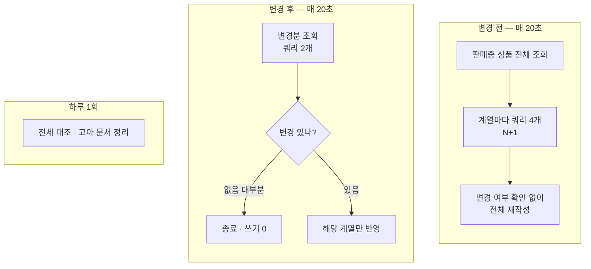

## 배경

상품 검수(승인·반려)가 별도 서비스로 이관되면서, 상품이 판매 상태로 바뀌어도 검색 엔진이
그 사실을 알 방법이 없어졌다. 검수 서비스에는 이벤트 발행 코드가 없었기 때문이다.

당시 이 문제를 **아웃박스 패턴**으로 풀기로 했다. 상태 변경과 이벤트 기록을 한 트랜잭션으로
묶어 유실 없이 알리는 방식이다. 그때 검토했던 대안 중 "주기적 배치 폴링"은 *실시간성이
떨어지고 팀 컨벤션과 어긋난다*는 이유로 기각했다.

<b>🔍 아웃박스 패턴이 뭔가요?</b>

데이터베이스에 상태를 저장하고, 그 사실을 다른 서비스에 알리는 메시지를 보내야 한다고 하자.
둘을 따로 하면 **저장은 됐는데 메시지 전송 직전에 서버가 죽는** 경우 알림이 조용히 사라진다.

아웃박스 패턴은 "보낼 메시지"를 **같은 데이터베이스의 별도 테이블에 같은 트랜잭션으로**
기록한다. 저장이 성공하면 메시지 기록도 반드시 함께 성공한다. 별도 프로세스가 그 테이블을
주기적으로 읽어 실제 전송을 담당한다. 유실 가능성을 구조적으로 없애는 방식이다.

그런데 아웃박스를 실제로 구현하기 전, 임시로 넣어둔 폴링 배치(20초 주기)의 실제 동작을
코드로 확인하면서 상황이 달라졌다.

## 고려한 선택지

**1. 계획대로 아웃박스 이벤트 도입**

근본 원인(이벤트가 없다)을 해결한다. 다만 검수 서비스 수정, 아웃박스 테이블 신설, 전송
프로세스 구현, 그리고 서비스 간 조율이 필요하다.

**2. 폴링 배치를 그대로 두고 주기만 늘린다**

비용은 줄지만 관리자가 승인한 상품이 검색에 뜨기까지의 지연이 커진다.

**3. 폴링 배치를 증분 방식으로 바꿔 비용 자체를 없앤다 (택함)**

주기는 그대로 두고, 한 번 도는 비용을 사실상 0으로 만든다.

## 결정

### 먼저 — 배치가 실제로 뭘 하고 있었는지

코드를 읽어보니 문제가 두 가지였다.

**상품 계열 하나당 쿼리 4개가 나갔다.** 배치 API가 이미 있는데도 단건 API를 반복 호출하고
있었다.

<b>🔍 이게 왜 문제인가요? (N+1 문제)</b>

목록을 하나 가져온 뒤, 그 목록의 항목마다 추가 조회를 반복하는 패턴을 **N+1 문제**라고
부른다. 항목이 100개면 쿼리가 101번 나간다.

해법은 대개 단순하다 — "이 100개에 해당하는 값을 한 번에 달라"는 조회 하나로 바꾸면 된다.
이 코드에는 그런 일괄 조회 메서드가 **이미 만들어져 있었지만 아무도 호출하지 않고 있었다.**

**변경 여부와 무관하게 전 상품을 매번 다시 썼다.** 주석에는 "다른 부분만 반영한다"고 적혀
있었지만 실제 코드는 비교를 하지 않았다. 아무것도 바뀌지 않아도 20초마다 판매중 상품 전체가
검색 엔진에 재작성됐다.

| 판매중 상품 계열 수 | 20초당 쿼리 | 초당 |
|---|---|---|
| 50 (현재) | 201 | 약 10 |
| 1,000 | 4,001 | 약 200 |
| 5,000 | 20,001 | 약 1,000 |

여기에 의미 기반 검색용 벡터(문서당 약 6KB)가 추가될 예정이었다. 상품 1,000개 기준
20초마다 6MB를 검색 엔진에 밀어 넣고, 문서가 교체될 때마다 벡터 색인을 다시 만드는 구조가
된다. 검색 엔진은 메모리 1GB짜리 단일 노드이고, 게이트웨이·전 서비스 로그가 같은 노드로
들어올 예정이었다.

### 그리고 — 필요한 코드가 이미 있었다

"변경된 것만 골라내는" 조회 메서드가 **인터페이스·어댑터·구현 3계층 모두 완성된 채로,
호출하는 곳 없이** 남아 있었다. 상품 변경과 리뷰 변경을 합쳐서 잡도록 만들어져 있어,
필요한 기능을 정확히 충족했다.

### 결정 내용

- **20초 주기 유지, 방식만 증분으로.** 변경이 없으면 조회 2건으로 끝나고 쓰기는 0이다
- **하루 1회 전체 대조를 별도로.** 증분이 잡지 못하는 불일치(수동 수정, 검색 엔진 쪽 유실)를
  거른다
- **기동 시 1회 전체 대조.** 마지막 확인 시각을 메모리에 두므로 재시작 시 유실을 보완한다
- **조회 기준 시각을 주기만큼 겹치게 잡는다.** 커밋 시각은 기준보다 이르지만 조회에는 늦게
  보이는 데이터가 영구 누락되는 것을 막는다. 같은 항목을 두 번 반영해도 결과가 같으므로
  중복 처리는 무해하다

### 주기 20초의 근거를 새로 기록했다

기존 20초는 **근거가 남아 있지 않은 값**이었다. 계획서에는 "짧은 값(15~30초, 예: 20000)",
코드 주석에는 "카탈로그 규모상 매 실행 비용은 무시할 수 있다"고만 적혀 있었다. 후자는
*감당 가능한 이유*이지 *적절한 지연인 이유*가 아니다.

이번에 다음과 같이 확정해 설정과 주석에 남겼다.

> 이 주기는 **관리자 승인부터 검색 노출까지의 지연 예산**이다. 관리자가 승인한 뒤 실제
> 노출을 확인하는 작업 흐름(화면 이동·검색, 대략 5~15초)을 크게 넘기지 않아야 한다. 넘기면
> "승인이 반영되지 않았다"는 오인과 재승인·오탐 신고를 유발한다. 증분 전환 후 한 번 도는
> 비용이 조회 2건이므로 **비용이 이 값을 제약하지 않으며, 기준은 사용자 경험이다.**

### 그 결과 아웃박스가 불필요해졌다

증분 전환 후 폴링 한 사이클은 인덱스 범위 조회 2번, 대부분 0건 반환이다. 하루로 환산하면
약 4,300건 — 상품 상세 페이지 한 번 여는 것보다 적다.

아웃박스를 도입해도 이벤트 유실·불일치 대비 안전망 대조는 남겨야 하므로 폴링이 완전히
사라지지 않는다. 남는 이득은 **"지연 20초 → 즉시"** 하나인데, 그것을 위해 다른 서비스를
수정하고 테이블을 신설하고 조율할 필요가 없다고 판단했다.

## 결과

- 변경이 없는 사이클의 비용이 사실상 사라졌다. 벡터가 추가돼도 불필요한 쓰기가 발생하지 않는다
- 이미 구현돼 있던 증분 조회와 일괄 조회 메서드를 실제로 사용하게 됐다 — 새로 만든 것이 아니라
  **쓰이지 않던 것을 연결**했다
- 아웃박스 도입 작업이 범위에서 빠지면서, 다른 서비스를 건드리지 않게 됐다
- 물려받은 설정값에 근거를 기록해, 다음에 조정할 때 판단 기준이 생겼다

### 이 결론에 이르기까지

시작은 "20초마다 몇천 건을 다시 색인하는 게 리소스를 많이 먹지 않나"라는 물음이었다. 코드를
확인해보니 **짐작보다 나빴다** — N+1에 더해 변경 감지 자체가 없었다.

여기서 두 번 판단을 수정했다.

**하나 — 배치를 없애면 되지 않냐는 물음에 "없애면 기능이 깨진다"고 답했는데, 그 다음 질문이
정확했다.** "그럼 20초여야 하는 근거는?" 확인해보니 근거가 기록된 적이 없었다. **물려받은
값을 근거처럼 인용하고 있었던 것이다.** 값 자체는 유지했지만, 이번에는 왜 그 값인지를
남겼다.

**둘 — 증분 방식이 리뷰로 인한 평점 변화를 놓칠 거라고 우려했는데 기우였다.** 이미 있던
메서드가 상품 변경과 리뷰 변경을 합쳐서 처리하도록 만들어져 있었다. **우려를 제기하기 전에
기존 코드를 먼저 읽었어야 했다.** 이 프로젝트에서 반복해 확인한 것인데, 필요한 것이 이미
구현돼 있는 경우가 드물지 않다.

이 결정은 [admin-service의 상품 판매전환 이벤트 발행 — 아웃박스 패턴](/decisions/prompthub/product-service/admin-onsale-event-outbox-pattern)을
대체한다. 그 결정에서 기각했던 "주기적 배치 폴링"을 이번에 채택한 셈인데, 기각 사유였던
"실시간성이 떨어진다"는 20초 지연을 근거 있게 수용하는 것으로, "비용이 크다"는 증분 전환으로
각각 해소했다.

## 후속: 배포 후 실측 검증 (2026-08-12)

이후 상품 검수 승인 흐름과 별도로 남아 있던 검색용 Kafka 이벤트 소비 경로를 정리해
재조정 스케줄러 하나만 검색 색인을 갱신하도록 좁히고, 배포 직후 설계값과 실제 동작이
일치하는지 실측했다.

**반영 지연**

| 시나리오 | 측정값 |
|---|---|
| 판매중 상품 제목 수정 저장 → 검색 반영 | 21초 |
| 신규 상품 등록 → 관리자(AI) 검수 승인 → 검색 노출 | 42초 이내 |
| 판매중지·반려 상품이 검색에서 제외 | 즉시 반영 확인 |

20초 주기 + 조회·화면 갱신 시간을 더한 설계 목표치와 어긋나지 않았다.

**배포 직후 인프라 상태**

- 기동 로그에서 alias·index 무결성 검사 통과, 전체 재조정(50건) 정상 완료 확인 — CrashLoop 없음
- 이후 재조정은 대부분 조회 2건·쓰기 0으로 끝나고, 변경이 있을 때만 소량 반영되는 것을 로그로 확인
- 정리 대상이던 검색용 Kafka consumer group은 활성 멤버 없이(예전 오프셋만 잔존) 실제로 더 이상
  쓰이지 않음을 확인
- 물려받은 설정값(재조정 주기 20초, 청크 크기 500, 고아 스캔 페이지 크기 1000)이 배포된 설정
  서버에 실제로 반영됨을 확인

**"겹치게 조회한다"는 설계가 로그에도 그대로 나타났다**

위에서 "조회 기준 시각을 주기만큼 겹치게 잡는다"고 정한 부분 그대로, 짧은 구간에서 같은
변경 1건이 여러 재조정 사이클에 걸쳐 반복 감지되는 로그를 실제로 확인했다. 설계에서 예상한
대로 결과는 무해했다 — 멱등한 삭제·upsert라 반복 반영해도 색인 상태는 달라지지 않는다.
