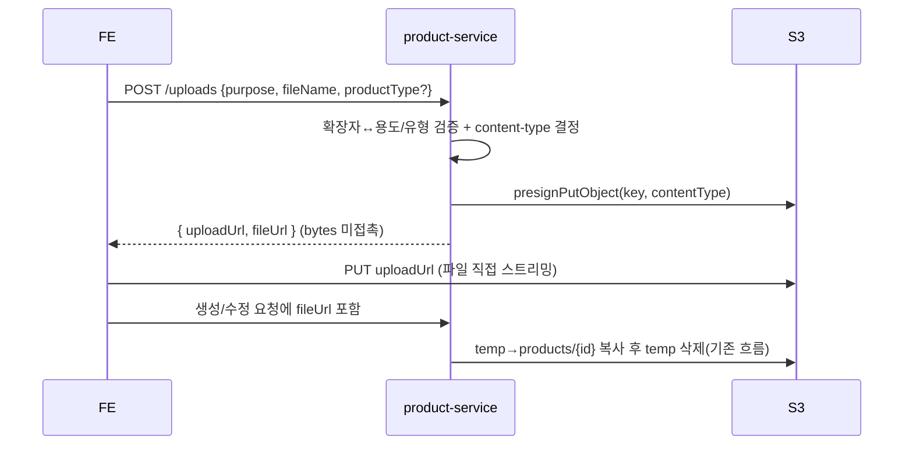

## 배경

판매자 파일 업로드가 서버 경유 multipart 방식이었다. `FileUploadController`가 `MultipartFile`을
받아 `file.getBytes()`로 **파일 전체를 JVM heap에 byte[]로 올린 뒤** S3로 전송했다. 대용량
산출물(ppt/excel)과 동시 업로드가 겹치면 heap이 배수로 부풀고, 큰 배열이 G1의 humongous
object로 잡혀 GC를 압박했다. product-service만 유독 heap을 크게 쓰던 원인이 여기였다.

## 고려한 선택지

1. **presigned PUT — 프론트가 S3로 직접 스트리밍 업로드**
   백엔드는 서명된 업로드 URL만 발급하고 파일 bytes를 만지지 않는다. heap이 파일 크기·동시성과
   무관해진다.
2. **서버 경유 유지 + heap/GC 튜닝**
   힙 크기·GC 옵션을 조정. 증상은 완화되나 "파일을 heap에 올린다"는 근본 원인은 그대로다.
3. **presigned POST(policy)로 크기 제한까지 강제**
   content-type + 최대 크기를 정책으로 서명. 방어는 강하지만 서명·프론트 구현이 더 복잡하다.

## 결정

선택지 1(presigned PUT)을 택했다. 이미지·산출물 파일 업로드를 모두 전환해 **서버 경유 byte
업로드(`upload(byte[])`, `MultipartFile`)를 완전히 제거**했다. 보안은 content-type 서명 강제까지(크기
제한은 범위 밖, 필요 시 presigned POST로 보강).



- 발급 엔드포인트는 통합 `POST /uploads` 하나. `purpose`(thumbnail/image/file)와, file이면
  `productType`으로 **확장자를 엄격 검증**(PPT→pptx/ppt, EXCEL→xlsx/xls)하고 content-type을
  서명에 포함한다. 발급 후엔 프론트가 S3로 직접 PUT하므로 검증은 **발급 시점**에 건다.
- 어댑터는 이미 GET presign에 쓰던 `S3Presigner`를 그대로 재사용한다.

```java
public String generatePresignedUploadUrl(String key, String contentType) {
    PutObjectRequest objectRequest = PutObjectRequest.builder()
        .bucket(bucket).key(key).contentType(contentType).build();
    PutObjectPresignRequest presignRequest = PutObjectPresignRequest.builder()
        .signatureDuration(Duration.ofMinutes(10))
        .putObjectRequest(objectRequest).build();
    return s3Presigner.presignPutObject(presignRequest).url().toString();
}
```

- 업로드는 항상 임시 키(`products/temp/...`)로 올라가고, 상품 생성/수정 시 기존
  `moveToProductPath`가 상품 경로로 복사 후 임시본을 삭제한다(S3엔 move가 없어 copy+delete).
  이 흐름은 그대로 재사용했다.

## 결과

- product-service의 heap이 파일 크기·동시 업로드와 무관하게 평평해졌다. 서버 경유 byte
  업로드 경로(`upload(byte[])`, `MultipartFile`)가 사라졌다.
- 클라이언트에 AWS 자격증명을 노출하지 않고(서명된 URL만), 버킷은 private을 유지한다.
- 트레이드오프: 실제 S3로의 PUT 왕복은 로컬에서 재현이 어려워 **배포 환경에서만 수동 검증**이
  가능하다. 자동 테스트는 발급 로직(확장자 검증·content-type·키 형식)만 커버한다.
