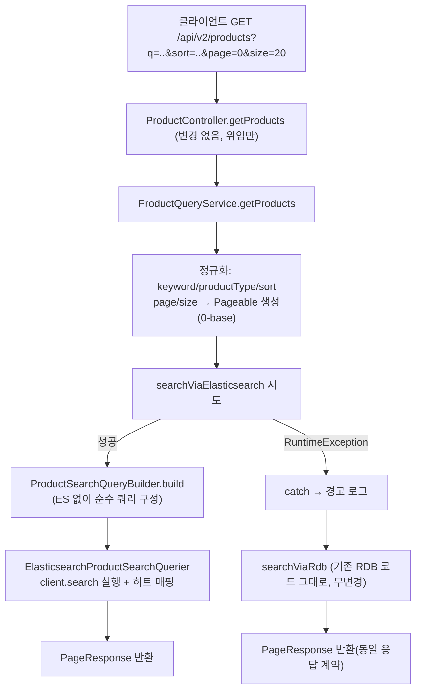

## 배경

> **2026-07-29 정정 — 이 글의 nori 전제는 이후 폐기됐다.**
> 실측해보니 한국어 형태소 분석기(nori)가 이 서비스의 어휘를 잘못 쪼개고 있었다. `"보고서"`로
> 검색했을 때 `"보고서를"`이 든 문서가 **0건** 나오는 식이었다. 기본 분석기로 전환했고 커스텀
> 이미지 의존도 함께 사라졌다. 아래 본문에서 "nori 형태소 검색"으로 서술된 부분은 현재
> 구현과 다르다 — 근거는 [한국어 분석기가 조용히 검색을 망가뜨린 건](/troubleshooting/prompthub/search/nori-analyzer-silent-mismatch).
> ES 우선 조회 + RDB 폴백이라는 이 글의 전환 결정 자체는 그대로 유효하다.
> 전체 흐름은 [검색어를 치면 무슨 일이 벌어지나](/decisions/prompthub/product-service/es-vector-search-end-to-end-flow)에 정리했다.

#376에서 상품 변경 이벤트를 ES에 색인하는 파이프라인 자체는 이미 만들어져 있었다. 하지만 실제
사용자가 부르는 공개 목록·검색 API(`GET /api/v2/products`)는 여전히 RDB만 조회했다 — ES는
만들어지기만 하고 아무도 읽지 않는 사본이었다. 이 이슈(#377)의 목표는 이 API의 조회 엔진을
ES로 전환해 nori 형태소 검색과 인기 가산 랭킹을 실제로 동작시키는 것이었다.

브레인스토밍 과정에서 단순히 "조회 경로만 바꾸면 끝"이 아니라는 게 드러났다:

1. **#376 재설계 문서가 이미 경고해둔 문제** — "판매중단/삭제/admin 승인취소가 최대 7일
   지연되어도 무해하다"는 전제는 "공개 API가 아직 RDB만 본다"에 의존하고 있었다. ES로
   전환하는 순간 그 전제가 깨진다.
2. **코드를 파다가 발견한 기존 버그** — 상품을 등록만 해도(관리자 승인 전 DRAFT 상태) ES
   색인 로직의 폴백 분기 때문에 검색에 노출될 수 있는 버그가 있었다.
3. **로컬에서 실제로 재현된 레이스 컨디션(#553)** — ES 인덱스 부트스트랩과 재조정 배치의
   첫 실행 순서가 보장되지 않아 `index_not_found_exception`이 날 수 있었다.
4. **좌표계 불일치** — 이 API의 `page` 파라미터가 1-based인데, 정작 FE의 실제 관례(admin
   페이지들)와 같은 프로젝트의 다른 서비스(settlement-service)는 0-based였다.

이 문서는 이 4가지를 하나씩 어떻게 풀었는지, 그리고 왜 그렇게 풀었는지를 실제 코드 흐름과
함께 정리한다.

## 고려한 선택지

**A. 컨트롤러 소유** — 원 설계 문서는 "목록/검색 컨트롤러 소유를 `search` 패키지로 이관"을
제시했지만, #376이 실제로 만든 `ReindexController`가 이미 `product` 패키지에 남아 `search`의
서비스를 직접 호출하는 선례를 만들어뒀다.
1. `search` 패키지로 이관(원 설계) — 원칙엔 맞지만 기존 선례와 어긋나 컨벤션이 둘로 갈린다.
2. `product` 패키지 유지, `search`는 조회 전용 포트만 제공(택함) — 기존 선례와 일관.

**B. 정렬 계약** — 원 설계는 `popular`/`sales`/`latest` 3종을 가정했지만, 실제 계약
(`docs/api-spec/product.md`, `ProductQueryService.normalizeSort`)은
`popular|rating|price-asc|price-desc` 4종이었다.
1. 원 설계의 3종 채택 — 실제 계약을 깨는 breaking change.
2. 실제 계약 4종 그대로 이식 — "계약 유지"엔 충실하지만, FE 코드(`app/browse/page.tsx`,
   `app/page.tsx`) 확인 결과 `price-desc`는 FE가 한 번도 보낸 적 없는 죽은 옵션이었다.
3. `price-desc`를 뺀 3종(택함) — 실사용 계약만 남긴다.

**C. 페이지네이션** — 원 설계는 `search_after`(커서)를 가정했지만, 실제 계약은 정수 `page`
파라미터(오프셋)이고 opaque cursor가 없다.
1. `search_after` 유지 + 계약 변경 — "URL 계약 유지"와 정면 충돌.
2. ES `from`/`size`로 통일(택함) — 카탈로그 규모상 deep pagination 비용 문제가 없고 기존
   계약과 자연히 맞음.

여기에 더해 `page`가 1-based라는 걸 재확인했는데, 같은 프로젝트의 `settlement-service`는
이미 0-based이고 FE에서 실제로 페이지네이션이 동작하는 곳(admin 페이지들)은 전부
`useState(0)`이었다.
1. 1-based 유지 — 문서와는 일치하지만 실제 동작하는 FE 코드 전부와 어긋난다.
2. 0-based로 전환(택함) — FE 실제 관례·`settlement.md`와 일치. 아직 이 API에 `page`를
   명시적으로 보내는 FE 호출이 없어 지금 바꾸면 영향이 없다.

**D. 삭제 정합성** — ES는 "문서 존재=ON_SALE"이라 필터가 아니라 삭제로 걸러낸다. 감지
방법은 이벤트(실시간) 아니면 폴링(배치)뿐.
1. 배치만 유지, 주기만 단축 — 구현은 간단하지만 product-service 자신이 이미 아는
   변화(판매중단)조차 배치만큼 지연.
2. admin-service까지 전부 실시간 이벤트화 — admin에 Kafka 발행 경로를 새로 만들어야
   해서, #376 재설계가 걷어낸 outbox 복잡도가 재점화된다.
3. 하이브리드(택함) — product-service 자신의 행동은 실시간, admin발 변화(승인취소)만
   트리거할 이벤트가 없어 배치.

**E. #553 레이스 컨디션**
1. `ProductIndexBootstrap`을 더 이른 라이프사이클로 옮겨 순서 강제 — Spring 이벤트 순서
   가정에 의존하는 fragile한 해법.
2. 재조정 로직 진입부에 방어적 가드(택함) — 이미 있는 `existsAlias` 체크 패턴 재사용.

이 5가지는 PR을 만들기 전 브레인스토밍·구현 단계에서 발견한 것들이다. 그런데 커밋을 다
끝내고 PR을 실제로 올리기 직전, 마지막 점검(다른 열려 있는 PR과의 충돌 확인, PR 본문 작성)을
하는 과정에서 **완전히 새로운 문제 2개를 추가로 발견**했다. 둘 다 PR이 아직 GitHub에
올라가기 전에(즉 커밋만 하고 push는 안 한 상태에서) 발견해서 같은 브랜치의 커밋으로 추가할지
말지부터 판단해야 했다 — PR 본문에 이 둘을 나중에 별도 PR로 미루지 않고 포함한 이유는 각
섹션 하단의 토글에 정리했다.

**F. page/size를 계층 간에 전달하는 방식** — PR을 올리기 전, 같은 시기에 열려 있던 다른
PR(#558, admin-service 상품 목록 필터)이 이 브랜치와 충돌 없이 머지되는지 확인하던 김에
그쪽 리뷰 코멘트도 같이 살펴보다가, 정확히 같은 패턴이 지적된 걸 발견했다: "int page, int
size가 여러 계층을 개별 값으로 관통하다 끝에서 다시 조합된다." 이번 브랜치가 새로 추가한
조회 경로(`ProductQueryService`→`ProductSearchQueryService`→
`ElasticsearchProductSearchQuerier`→`ProductSearchQueryBuilder`, 4개 계층)를 다시 보니 정확히
같은 모양이었다 — 즉 이 PR엔 아직 아무도 리뷰를 달지 않은 시점에, 다른 PR의 리뷰를 참고해서
선제적으로 고친 것이다.
1. 그대로 둔다 — 지금 당장은 동작하지만, 정렬 기준이 하나 늘거나 계층이 하나 더 생길
   때마다 시그니처 4곳을 전부 고쳐야 한다. 실제로 리뷰에서 지적된 패턴을 알면서 그냥
   두는 것도 이상하다.
2. Pageable로 통일(택함) — Spring Data가 이미 제공하는 표준 페이징 객체. `getOffset()`/
   `getPageNumber()`/`getPageSize()`가 캡슐화돼 있어 계층마다 offset 계산식을 다시 쓸 필요가
   없다.

**G. 구매로 인한 salesCount 반영 대상** — popular 정렬의 salesCount 가중치가 실제로 정확한지
검증하려고 "구매 시 salesCount가 정확히 어디에 반영되는지"를 코드로 끝까지 추적하다가 발견한
버그다.
1. 그대로 둔다(`family.currentOnSale()`에 반영) — "salesCount는 family 전체 합산으로
   노출되니 가족 중 어느 row에 붙어도 최종 합계는 같다"는 전제 자체는 맞다. 하지만 결제
   이벤트가 비동기로 처리되는 사이(주문 완료 → Kafka 이벤트 전파 → 소비 처리) 판매자가 이미
   그 상품을 판매중단해버리면 `currentOnSale()`이 통째로 비어서, `ifPresent`가 아무것도 안
   하고 그 주문의 카운트 자체가 조용히 사라진다.
2. `currentOnSale()`이 비었을 때 family 내 다른 멤버로 폴백(`decrementSalesCount`가 이미
   쓰던 방식과 대칭) — 유실을 줄이긴 하지만 "어떤 멤버로 폴백할지"를 고르는 로직이 또
   필요해지고, 여전히 "우연히 그 순간 조건에 맞는 멤버가 하나도 없으면" 실패할 수 있는
   구조는 남는다.
3. 구매된 그 productId(anchor row) 자신에 직접 반영(택함) — anchor row는 구매 시점에
   `ON_SALE`이었던 게 보장되므로, 그 뒤에 무슨 일이 있어도(판매중단이든 뭐든) row 자체는
   항상 존재한다. 유실이 설계상 원천적으로 불가능해지고, family 재조회 자체가 없어져
   코드도 더 단순해진다.

## 결정

### A. 컨트롤러는 `product` 패키지에 그대로

컨트롤러는 위임만 하고 로직 없음. `search`는 `ProductSearchQueryService` 포트 +
`ElasticsearchProductSearchQuerier` 구현만 제공한다.

### B/C. ES 우선 조회 + RDB 폴백, 정렬 3종, from/size 0-based — 전체 조회 플로우


```mermaid
flowchart TD
    Client["클라이언트 GET /api/v2/products?q=..&sort=..&page=0&size=20"]
    Client --> Controller["ProductController.getProducts (변경 없음, 위임만)"]
    Controller --> Service["ProductQueryService.getProducts"]
    Service --> Normalize["정규화: keyword/productType/sort<br/>page/size → Pageable 생성(0-base)"]
    Normalize --> TryES["searchViaElasticsearch 시도"]
    TryES -->|성공| Builder["ProductSearchQueryBuilder.build<br/>(ES 없이 순수 쿼리 구성)"]
    Builder --> Query["ElasticsearchProductSearchQuerier<br/>client.search 실행 + 히트 매핑"]
    Query --> Response1["PageResponse 반환"]
    TryES -->|RuntimeException| Catch["catch → 경고 로그"]
    Catch --> RDB["searchViaRdb (기존 RDB 코드 그대로, 무변경)"]
    RDB --> Response2["PageResponse 반환(동일 응답 계약)"]
```

<details>
<summary>🔍 폴백 분기는 정확히 어떻게 동작하나</summary>

`ProductQueryService.getProducts()`는 ES 경로 전체를 `try`로 감싸고 `RuntimeException`을
잡아서 RDB로 넘어간다:

```java
Pageable pageable = PageRequest.of(normalizePage(page), normalizePositive(size));
try {
    return searchViaElasticsearch(keyword, selectedProductType, selectedSort, pageable);
} catch (RuntimeException e) {
    log.warn("ES 조회에 실패해 RDB로 폴백합니다.", e);
    return searchViaRdb(keyword, selectedProductType, selectedSort, pageable);
}
```

`pageable`은 **딱 한 번만** 만들어져서 ES 경로와 RDB 경로 양쪽에 그대로 전달된다(각 경로가
자기 나름대로 page/size를 다시 계산하거나 재조합하지 않는다) — 이 "한 번만 만들어서 그대로
넘긴다"는 원칙이 뒤에 나올 F번 결정(Pageable 통일)의 핵심이다.

`RuntimeException`을 넓게 잡는 이유는, `ElasticsearchProductSearchQuerier.search()`가 ES
클라이언트에서 나올 수 있는 어떤 실패든(연결 거부, 타임아웃, 응답 파싱 실패 등) 전부
`IllegalStateException`(RuntimeException의 일종)으로 감싸서 던지기 때문이다:

```java
try {
    SearchResponse<ProductSearchDocument> response = client.search(request, ProductSearchDocument.class);
    ...
} catch (IOException | RuntimeException e) {
    throw new IllegalStateException("ES 검색에 실패했습니다.", e);
}
```

즉 "ES가 완전히 죽은 경우"만 폴백하는 게 아니라, ES 쪽에서 발생 가능한 모든 예외 상황을
동일하게 RDB 폴백으로 처리한다 — 실패 종류별로 재시도할지 말지를 구분하는 로직은 일부러
넣지 않았다(이 규모의 프로젝트에서 그 정교함이 아직 필요하지 않다고 판단).

</details>

<details>
<summary>🔍 normalize 단계에서 정확히 무슨 일이 일어나나</summary>

`ProductQueryService.getProducts()`가 ES/RDB 어느 경로로도 넘어가기 전에 4개 값을 정규화하고,
그중 페이지 관련 2개는 곧바로 `Pageable` 객체 하나로 합쳐진다:

- `normalizeKeyword(q)` — 앞뒤 공백 제거 + 소문자화, null/공백이면 `""`
- `normalizeProductType(productType)` — null/공백/"all"이면 `"all"`, 아니면 `ProductType`
  enum 값인지 검증(아니면 400 `P004` 예외 — 이 시점에 던져지므로 ES/RDB 어느 쪽도 아직
  호출 전이다)
- `normalizeSort(sort)` — `"rating"`/`"price-asc"`만 그대로 인정, 나머지(빈 값, 오타,
  `"price-desc"` 등)는 전부 `"popular"`로 떨어진다(에러 아님)
- `normalizePage(page)`/`normalizePositive(size)` — 각각 음수→0, 0/음수→1로 올림 보정한 뒤
  바로 `Pageable pageable = PageRequest.of(normalizePage(page), normalizePositive(size))`로
  묶인다. 처음엔(리팩터 전) 이 둘을 `normalizedPage`/`normalizedSize`라는 별개의 `int` 값
  두 개로 두고 ES/RDB 양쪽에 각각 전달했는데, 뒤의 F번 결정에서 이 둘을 애초에 `Pageable`
  하나로 만들어서 넘기는 지금 형태로 바꿨다.

이 정규화 결과(`keyword`, `selectedProductType`, `selectedSort`, `pageable`)가 ES 경로
(`searchViaElasticsearch`)와 RDB 경로(`searchViaRdb`) 양쪽에 **동일하게** 전달된다 — 그래서
정렬/필터/페이징 계약이 두 경로에서 어긋날 일이 없다.

</details>

`popular`만 인기 가산(`function_score`), 나머지는 단순 필드 정렬:

```java
Query base = (keyword == null || keyword.isBlank())
    ? Query.of(q -> q.matchAll(m -> m))
    : Query.of(q -> q.multiMatch(m -> m
        .query(keyword).type(TextQueryType.BestFields).tieBreaker(0.3)
        .fields("name^3", "tags.text^2", "description^1.5", "content")));
Query filtered = Query.of(q -> q.bool(b -> b.must(base).filter(filters)));
return SORT_POPULAR.equals(sort) ? withPopularityBoost(filtered) : filtered;
```

<details>
<summary>🔍 popular 점수는 정확히 어떻게 계산되고, 왜 이렇게 만들었나</summary>

`popular` 정렬일 때만 base 쿼리를 `function_score`로 감싼다:

```java
private Query withPopularityBoost(Query base) {
    List<FunctionScore> functions = List.of(
        FunctionScore.of(fn -> fn.weight(rankingProperties.salesWeight())
            .fieldValueFactor(fv -> fv.field("salesCount").modifier(FieldValueFactorModifier.Log1p))),
        FunctionScore.of(fn -> fn.weight(rankingProperties.viewWeight())
            .fieldValueFactor(fv -> fv.field("viewCount").modifier(FieldValueFactorModifier.Log1p))),
        FunctionScore.of(fn -> fn.weight(rankingProperties.ratingWeight())
            .fieldValueFactor(fv -> fv.field("ratingAvg").missing(0.0))),
        FunctionScore.of(fn -> fn.weight(rankingProperties.freshnessWeight())
            .gauss(g -> g.date(d -> d.field("firstPublishedAt")
                .placement(p -> p.scale(Time.of(t -> t.time(rankingProperties.freshnessScale())))
                    .decay(rankingProperties.freshnessDecay())))))
    );
    return Query.of(q -> q.functionScore(fs -> fs
        .query(base).functions(functions)
        .scoreMode(FunctionScoreMode.Sum).boostMode(FunctionBoostMode.Sum)));
}
```

**각 요소가 왜 이 형태인지:**

- **`salesCount`/`viewCount`에 `log1p`(자연로그(1+x))를 쓰는 이유** — 판매수·조회수는 편차가
  아주 크다(베스트셀러 수천 건 vs 신상품 0~1건). 원시값을 그대로 쓰면 인기 압도적인 상품이
  텍스트 관련도와 무관하게 항상 1등을 차지해버린다. `log1p`로 스케일을 눌러서 "판매량이 10배
  많다고 점수도 10배 주지 않고, 조금만 더 준다"로 완화한다.
- **`weight`가 `fieldValueFactor` 안이 아니라 `FunctionScore` 바깥에 있는 이유** — 이건
  `factor`(field_value_factor 자체의 배율)와는 다른, 함수 결과 전체에 곱하는 별도 배율이다.
  `salesWeight`/`viewWeight`/`ratingWeight`/`freshnessWeight` 네 값 전부
  `SearchRankingProperties`(yml 설정)에서 오는데, 이게 "등급 A 노브"(코드 재배포 없이 yml만
  고치고 재기동하면 끝)로 설계된 이유다 — 나중에 "판매량이 너무 과하게 반영된다"는 지표가
  나오면 `salesWeight` 값만 낮추면 된다.
- **`gauss` 감쇠로 신선도를 표현하는 이유** — "최근 N일 이내면 가산, 아니면 0"처럼 딱딱한
  컷오프를 쓰면 N일째와 N+1일째 사이에 부자연스러운 절벽이 생긴다. `gauss`는 종 모양
  곡선이라 `firstPublishedAt`이 `scale`(30일)만큼 지나면 최대 가산의 `decay`(0.7)만큼만
  남고, 그 이후로도 완만하게 계속 줄어든다.
- **`score_mode: Sum` + `boost_mode: Sum`인 이유** — 네 함수의 결과를 다 더한 값을, base
  관련도 점수에 **곱하지 않고 더한다**. 이건 최초 설계 문서(튜닝 노브 문서)에서부터 정해둔
  값을 그대로 가져온 것인데, 곱하기(`Multiply`)를 썼다면 인기 점수가 관련도를 배수로
  증폭시켜서 "관련 없는데 인기만 많은 상품"이 튀어 오를 위험이 있다. 더하기는 "관련도가
  비슷한 상품들 사이에서만 순위를 살짝 흔드는" 약한 가산으로 동작한다.

</details>

페이지 좌표계는 `-1` 변환을 완전히 제거하고, 최종적으로는 offset 계산 자체도 `Pageable`에
위임했다(이 형태에 이르기까지의 경위는 F번 결정 참고):

```java
// ProductQueryService.java — 한 번만 만들어서 ES/RDB 양쪽에 그대로 전달
Pageable pageable = PageRequest.of(normalizePage(page), normalizePositive(size));

// ProductSearchQueryBuilder.java (ES) — offset을 직접 계산하지 않고 Pageable에서 받음
// 예전: int from = Math.max(page - 1, 0) * size;  (1-based 시절)
// 그다음: int from = Math.max(page, 0) * size;    (0-based 전환 직후, 여전히 수동 계산)
.from((int) pageable.getOffset())
.size(pageable.getPageSize())

// ProductRepository.findPublicProducts (RDB) — #377 이전부터 이미 Pageable을 받고 있어 무변경
findPublicProducts(keyword, productType, sort, pageable)
```

<details>
<summary>🔍 ES 실행과 히트 매핑은 어디서 어떻게 일어나나</summary>

`ProductSearchQueryBuilder.build()`는 `SearchRequest` 객체를 조립만 할 뿐 ES에 아무것도
보내지 않는다(그래서 ES 없이 유닛 테스트가 가능하다). 실제 실행은
`ElasticsearchProductSearchQuerier`가 한다:

```java
public ProductSearchPageResult search(String keyword, String productType, String sort, Pageable pageable) {
    SearchRequest request = queryBuilder.build(keyword, productType, sort, pageable);
    try {
        SearchResponse<ProductSearchDocument> response = client.search(request, ProductSearchDocument.class);
        List<ProductSearchHit> hits = response.hits().hits().stream()
            .map(hit -> toHit(hit.source()))
            .toList();
        long total = response.hits().total() != null ? response.hits().total().value() : hits.size();
        return new ProductSearchPageResult(hits, total);
    } catch (IOException | RuntimeException e) {
        throw new IllegalStateException("ES 검색에 실패했습니다.", e);
    }
}
```

`client.search(request, ProductSearchDocument.class)`에서 `ProductSearchDocument.class`를
넘기면 ES 클라이언트가 각 히트의 `_source` JSON을 이 레코드로 자동 역직렬화해준다(#376에서
만든 Jackson 설정 그대로 재사용). `toHit(...)`은 이 `ProductSearchDocument`(ES 매핑 그대로의
필드명)를 `ProductSearchHit`(application 계층 DTO)으로 옮겨 담는데, 이건 단순 변환이 아니라
**계층 경계**다 — `product` 패키지가 `search.infra.es.ProductSearchDocument`(infra 타입)를
직접 import하지 않고 `search.application.ProductSearchHit`(application 타입)만 알게 하기
위해서다.

`response.hits().total()`은 쿼리에 `track_total_hits: true`를 명시적으로 켰기 때문에(안
켜면 ES가 기본적으로 1만 건에서 카운트를 멈춘다) 정확한 값이 나온다 — RDB 경로의
`countPublicProducts`(정확한 `COUNT(*)`)와 동일한 정밀도를 맞추기 위한 선택이다.

</details>

정렬 enum도 `docs/api-spec/product.md`에서 `price-desc`를 빼고 3종으로 확정했다.

### D. 삭제 정합성 — 실시간과 배치는 "같은 원칙, 다른 코드"

핵심은 "하이브리드"라고 해서 완전히 새로운 메커니즘 두 개를 만든 게 아니라는 점이다. 이미
있던 `reconcileFamily()`(family 하나 단위로 재조회 후 색인을 맞추는 메서드,
`ProductSearchEventHandler` 안에 있음 — Kafka 이벤트가 실시간으로 호출)에 원래 빠져 있던
분기(ON_SALE 없으면 삭제)를 채워 넣었을 뿐이다. 배치 쪽(`ProductReindexService.reconcileAll()`)은
이 메서드를 호출하는 게 아니라 완전히 별도 코드로 같은 원칙(있으면 upsert, 없으면 delete)을
전체 family 단위로 한 번에 계산한다 — 둘이 진짜로 공유하는 건 그 원칙과, 결과를 ES에 실제로
반영하는 `ProductSearchIndexer` 포트(`bulkReconcile`)뿐이다.

```java
// ProductSearchEventHandler.java — 실시간 경로(family 하나)
private void reconcileFamily(UUID familyRootId) {
    List<Product> members = productRepository.findAllByFamilyRootIds(List.of(familyRootId));
    ProductFamily family = ProductFamily.of(familyRootId, members);
    Optional<Product> currentOnSale = family.currentOnSale();
    if (currentOnSale.isEmpty()) {
        productSearchIndexer.bulkReconcile(List.of(), List.of(familyRootId)); // 삭제
        return;
    }
    Product representative = currentOnSale.get();
    // ... 있으면 upsert (family 합산 salesCount/viewCount 포함)
}
```

이 수정 하나로 두 문제가 동시에 없어졌다: (1) 생성 직후 DRAFT가 색인되던 버그 —
`currentOnSale()`이 비어 있으니 이제 upsert 자체를 안 한다. (2) 판매중단이 실시간으로 안
사라지던 문제 — 컨슈머가 `PRODUCT_STOPPED`도 같은 메서드로 라우팅하도록 확장했다:

```java
// ProductSearchEventConsumer.java
switch (type) {
    case PRODUCT_CHANGED -> { /* familyRootId로 reconcileFamily */ }
    case PRODUCT_STOPPED, PRODUCT_DELETED -> {
        UUID productId = UUID.fromString(event.payload().get("productId").asText());
        productSearchEventHandler.handleProductRemovalCandidate(
            event.eventId(), event.occurredAt(), type.name(), productId);
    }
    default -> log.info("색인 컨슈머가 처리하지 않는 eventType입니다. eventType={}", type);
}
```

<details>
<summary>🔍 reconcileFamily는 어디 있는 코드고, reconcileAll과 정확히 어떤 관계인가</summary>

**`reconcileFamily(UUID familyRootId)`**는 `search.application.ProductSearchEventHandler`
안에 있는 `private` 메서드다. 호출자는 두 곳뿐이다:
- `handleProductChanged(...)` — `PRODUCT_CHANGED`(생성/패치버전) Kafka 이벤트를 받았을 때
- `handleProductRemovalCandidate(...)` — `PRODUCT_STOPPED`/`PRODUCT_DELETED` Kafka
  이벤트를 받았을 때(payload의 `productId`로 familyRootId를 먼저 찾은 뒤 호출)

즉 **`reconcileFamily`는 전부 Kafka 이벤트로 트리거되는 실시간 경로에만 존재**한다.

**`reconcileAll()`**은 완전히 다른 클래스(`search.application.ProductReindexService`)에
있고, `reconcileFamily`를 호출하지 않는다. 대신 자기 안에서 전체 family를 한 번에 훑는다:

```java
public void reconcileAll() {
    if (!productSearchIndexer.indexExists()) { /* ...; */ return; }
    List<Product> onSaleProducts = productRepository.findAllByStatus(ProductStatus.ON_SALE);
    Map<UUID, List<Product>> byFamily = onSaleProducts.stream().collect(Collectors.groupingBy(Product::familyRootId));
    List<FamilyUpsertInput> toUpsert = new ArrayList<>();
    for (UUID familyRootId : byFamily.keySet()) {
        // family별로 재조회 → currentOnSale() 있으면 toUpsert에 담음
    }
    Set<UUID> indexedFamilyRootIds = productSearchIndexer.findAllIndexedFamilyRootIds();
    List<UUID> toDelete = indexedFamilyRootIds.stream()
        .filter(id -> !byFamily.keySet().contains(id)).toList(); // ES엔 있는데 RDB엔 ON_SALE 없는 것
    productSearchIndexer.bulkReconcile(toUpsert, toDelete); // 한 번에 반영
}
```

이 메서드는 **두 군데에서 호출된다**: `ProductReconcileScheduler.reconcile()`(`@Scheduled`,
20초마다)와 `ReindexController.reindex()`(`POST /internal/search/reindex`, 수동 트리거).
이 둘이 진짜로 "같은 메서드를 공유"하는 사례다.

정리하면 실시간(`reconcileFamily`)과 배치(`reconcileAll`)는 **서로 다른 코드**로 "ON_SALE
있으면 upsert, 없으면 delete"라는 같은 원칙을 각자 구현한 것이고, 실제로 코드 레벨에서
공유되는 건 그 결과를 ES에 쓰는 마지막 한 걸음, `ProductSearchIndexer.bulkReconcile(...)`
뿐이다(`reconcileFamily`는 단일 family라 `bulkReconcile(List.of(), List.of(familyRootId))`처럼
한쪽 리스트만 채워서 호출하고, `reconcileAll`은 전체 diff를 양쪽 다 채워서 호출한다).

</details>

admin-service발 변화(승인취소)만 트리거할 이벤트가 없어 배치가 안전망으로 남는다. 배치
주기는 7일 → 20초로 줄였다(이미 config 노브였던 값 — `prompthub.search.reconcile.fixed-delay-ms`).

### E. #553 — 이미 있던 `existsAlias` 체크를 재조정 진입부에 재사용

```java
// ProductReindexService.java
public void reconcileAll() {
    if (!productSearchIndexer.indexExists()) {
        log.info("ES 인덱스가 아직 없어 이번 재조정 사이클을 건너뜁니다.");
        return;
    }
    // ... 기존 로직
}
```

```java
// ElasticsearchProductSearchIndexer.java — ProductIndexBootstrap이 이미 쓰던 패턴 재사용
@Override
public boolean indexExists() {
    return client.indices().existsAlias(e -> e.name(ProductIndexBootstrap.ALIAS)).value();
}
```

<details>
<summary>🔍 정확히 무엇과 무엇이 경합하나</summary>

`ProductIndexBootstrap.createIndexIfMissing()`은 `@EventListener(ApplicationReadyEvent.class)`로
등록되어 있어 스프링 컨텍스트가 완전히 뜬 직후 한 번 실행된다. `ProductReconcileScheduler.reconcile()`은
`@Scheduled(fixedDelayString=...)`로 등록되어 있는데, `fixedDelay` 스케줄의 첫 실행은
스케줄러 인프라(TaskScheduler)가 초기화되는 시점 근처에 걸리며, 이 시점도 마찬가지로
"앱이 거의 다 떴을 때"다. 문제는 `ApplicationReadyEvent` 리스너와 `@Scheduled` 스케줄러가
서로 다른 스프링 메커니즘이라 **둘 사이의 실행 순서가 명세상 보장되지 않는다**는 점이다.
그래서 인덱스가 아직 없는 상태(최초 배포 등)에서, 운이 나쁘면 스케줄러의 첫 tick이
부트스트랩보다 먼저 돌아 `findAllIndexedFamilyRootIds()`가 존재하지 않는 인덱스를 조회하다
`index_not_found_exception`을 던진다. 실제로 로컬에서 재현했을 때도 재조정 스킵 로그
(12:56:10.390)가 부트스트랩 완료 로그(12:56:12.847)보다 **먼저** 찍혔다 — 딱 이 순서로
경합이 일어난 것.

</details>

<details>
<summary>🔍 "이미 있던 패턴"이 정확히 어떤 코드인지</summary>

`ProductIndexBootstrap.createIndexIfMissing()`(#376에서 만든 코드)은 애초에 이 정확한
표현식을 쓰고 있었다 — "인덱스가 이미 있으면 생성을 건너뛴다"는 판단에:

```java
if (client.indices().existsAlias(e -> e.name(ALIAS)).value()) {
    log.info("alias={} 이미 존재합니다. 인덱스 생성을 건너뜁니다.", ALIAS);
    return;
}
```

`indexExists()`는 이 표현식(`client.indices().existsAlias(...).value()`)을 토씨 하나 안
바꾸고 그대로 새 메서드로 옮긴 것뿐이다. 새로운 ES API를 알아낸 게 아니라, 이미 한 곳에서
검증된 호출을 다른 곳(재조정 진입부)에서도 쓸 수 있게 포트 인터페이스에 노출한 것 — 그래서
"재사용"이다.

</details>

이 가드는 스케줄러와 온디맨드 리인덱스 컨트롤러(`/internal/search/reindex`) 양쪽에 자동으로
적용된다 — 둘 다 같은 `reconcileAll()`을 부르기 때문이다.

### F. 다른 PR의 리뷰를 참고해 선제적으로 반영 — page/size를 Pageable로 통일

PR을 올리기 전 마지막 점검(다른 PR과의 충돌 확인) 과정에서, 같은 시기에 열려 있던 다른
PR(#558, admin-service 상품 목록 필터)의 리뷰 코멘트를 함께 살펴보다가 정확히 같은 패턴이
지적된 걸 발견했다: "`int page, int size`가 컨트롤러 → 서비스 → 리포지토리 여러 계층을
개별 값으로 관통하다가, 마지막 계층에서 다시 `PageRequest`로 조립된다"는 지적이었다. 이번
브랜치가 새로 추가한 조회 경로를 다시 보니 정확히 같은 모양이었다 — `ProductQueryService`가 `int page, int size`를 받아서
`ProductSearchQueryService.search(..., int page, int size)`로 넘기고, 그게 다시
`ElasticsearchProductSearchQuerier`를 거쳐 `ProductSearchQueryBuilder`까지 4단계 내내 두
값을 원시 타입 그대로 들고 다니다가, `ProductSearchQueryBuilder.build()` 안에서야
`from = page * size` 계산이 벌어지고 있었다.

```java
// Before — 4개 계층 시그니처 전부 (int page, int size)
public PageResponse<ProductListItemResponse> getProducts(String q, String productType, String sort, int page, int size) { ... }
ProductSearchPageResult search(String keyword, String productType, String sort, int page, int size);
SearchRequest build(String keyword, String productType, String sort, int page, int size) {
    int from = Math.max(page, 0) * size;
    ...
}

// After — Pageable 하나로 통일
Pageable pageable = PageRequest.of(normalizePage(page), normalizePositive(size)); // 컨트롤러 바로 다음, 딱 한 번
ProductSearchPageResult search(String keyword, String productType, String sort, Pageable pageable);
SearchRequest build(String keyword, String productType, String sort, Pageable pageable) {
    .from((int) pageable.getOffset())
    .size(pageable.getPageSize())
    ...
}
```

<details>
<summary>🔍 왜 새로 추가한 코드에만 적용하고 기존 RDB 리포지토리는 안 건드렸나</summary>

`ProductRepository.findPublicProducts(keyword, productType, sort, Pageable pageable)`는
`#377` 이전부터 이미 `Pageable`을 받는 메서드였다 — 즉 RDB 쪽은 애초에 문제가 없었다. 이번에
문제가 있었던 건 ES 조회를 위해 **새로 추가한** `ProductQueryService`/
`ProductSearchQueryService`/`ElasticsearchProductSearchQuerier`/`ProductSearchQueryBuilder`
4개뿐이었다. PR 범위를 "이번에 새로 작성한 코드"로 한정한 이유는, 이미 잘 동작하고 테스트도
갖춰진 기존 코드를 굳이 건드려서 리스크를 늘릴 이유가 없었기 때문이다 — 리뷰 지적이 아니었다면
안 건드렸을 코드까지 "겸사겸사" 고치는 건 이 PR의 목적(ES 전환)과 무관한 스코프 확장이 된다.

</details>

<details>
<summary>🔍 Pageable로 바꾸면 구체적으로 뭐가 좋아지는지</summary>

`int page, int size`를 계층마다 따로 들고 다니면, 나중에 "정렬 기준을 하나 더 받는다"거나
"페이지 크기 상한을 검증한다" 같은 요구가 생길 때마다 관련된 모든 계층의 메서드 시그니처를
전부 고쳐야 한다. `Pageable`은 Spring Data가 표준으로 제공하는 페이징 값 객체라 `getOffset()`
/`getPageNumber()`/`getPageSize()`가 이미 캡슐화돼 있고, 나중에 `Sort`가 필요해지면 같은
객체 안에 자연스럽게 얹을 수 있다. 이번 리팩터로 실제 효과를 본 부분은 `from` 계산이다 —
`ProductSearchQueryBuilder`가 `page * size`를 직접 계산하던 걸 `pageable.getOffset()` 호출
하나로 대체해서, "오프셋을 어떻게 계산하는지"에 대한 지식이 한 곳(Spring Data 내부)에만
있게 됐다.

</details>

### G. 버그 수정 — 구매로 인한 salesCount가 조용히 유실되던 문제

`popular` 정렬의 salesCount 가중치(F번 앞, B/C 섹션의 `withPopularityBoost` 참고)가 실제로
정확한 값을 반영하고 있는지 검증하려고 "구매 시 salesCount가 정확히 어떻게 오르는지"를 코드로
끝까지 추적하다가 발견한 버그다. 결제가 완료되면 `ProductSalesCountService.incrementSalesCount`가
호출되는데, 원래 코드는 이랬다:

```java
// Before
public void incrementSalesCount(List<UUID> productIds) {
    forEachFamily(productIds, family ->
        family.currentOnSale().ifPresent(onSale -> {
            onSale.incrementSalesCount();
            productRepository.save(onSale);
        }));
}
```

문제는 "구매된 그 상품 버전"이 아니라 family의 **"지금 시점 판매중인 버전"**을 다시 찾아서
거기에 카운트를 올린다는 점이다. 주문 → 결제 완료 → Kafka 이벤트 전파 → 소비 처리는
비동기라 시간차가 있는데, 그 사이 판매자가 이미 그 상품을 판매중단해버리면
`family.currentOnSale()`이 완전히 비어서 `ifPresent`가 아무것도 안 하고 지나간다 — **그
주문의 salesCount 반영 자체가 에러도 없이 조용히 사라진다.**

```java
// After
public void incrementSalesCount(List<UUID> productIds) {
    productRepository.findAllByIdIn(productIds).forEach(product -> {
        product.incrementSalesCount();
        productRepository.save(product);
    });
}
```

family를 다시 찾지 않고, **구매 시점에 실제로 존재가 보장되는 그 productId(anchor row)
자신**에 바로 카운트를 올리도록 바꿨다. `decrementSalesCount`(환불)도 같은 방식으로
통일하면서, 기존에 있던 "판매중인 버전 우선, 없으면 판매수>0인 최신 버전을 찾는" 복잡한
폴백 로직(`decrementTarget`)도 함께 걷어냈다.

<details>
<summary>🔍 왜 anchor row에 바로 반영해도 안전한가</summary>

검색에 노출되는 salesCount 값은 어차피 `sumSalesCountByFamilyRootId`로 family 전체 버전을
합산한 값이다. 즉 salesCount 숫자가 family의 어느 멤버 row에 붙어있든, family 전체를
다시 더하면 최종 합계는 똑같다. anchor row(구매된 그 버전)는 구매 시점에 `ON_SALE`이었던
게 보장되므로, 그 뒤에 무슨 일이 있어도(판매중단이든 다른 버전으로 교체든) row 자체는
항상 존재한다 — family를 다시 찾아서 "지금 판매중인 버전"을 조회하는 간접 경로를 거치지
않아도 되니, 유실 가능성이 코드 구조상 원천적으로 없어진다.

</details>

<details>
<summary>🔍 이 파일이 왜 #377/#553 스코프에 포함됐는가</summary>

`ProductSalesCountService`는 검색(ES)과 직접 관련 없는, 주문 결제 도메인의 salesCount 반영
로직이다. 원래 이 PR(#377/#553)의 범위 밖이지만, 인기순 랭킹 가중치를 리뷰하는 과정에서
발견한 실제 데이터 유실 버그였고, 이번 PR이 popular 정렬 자체를 처음 사용자에게 노출시키는
계기라 "인기순이 정확한 salesCount를 기반으로 계산되는지"까지 같은 브랜치에서 함께
검증·수정하는 게 맞다고 판단했다. 별도 이슈로 미루면 이 PR의 popular 정렬은 처음부터
부정확한 salesCount 위에서 동작을 시작하게 된다.

</details>

## 결과

- 로컬 docker-compose로 이 레이스 컨디션이 실제로 재현되는 것과, 고친 뒤엔 크래시 없이
  로그만 남기고 넘어가는 것을 직접 확인했다(`ES 인덱스가 아직 없어...` 로그 → 2초 뒤
  부트스트랩 정상 완료).
- 실제 상품 7건으로 정렬 3종·nori 검색(`이력서` 검색이 정확히 매칭)·productType 필터가
  ES 경로로 정상 응답(RDB 폴백 0건) 확인.
- ES를 강제로 내려도 계속 200 응답 + 로그에 RDB 폴백 확인.
- 유닛(쿼리 빌더/삭제 분기/재조정 가드/ES-RDB 분기/컨트롤러 기본값) + Testcontainers
  통합(정렬·검색·필터·페이지네이션 정확성) 테스트 전부 추가, `clean build` 통과.
- `page` 좌표계 변경은 계약상 breaking change지만, 현재 이 API에 `page`를 명시적으로
  보내는 FE 호출이 없어 실질 영향은 없음 — FE 페이지네이션 구현 시점(후속 이슈)부터
  의미가 생김.
- PR 생성 완료(`Closes #377, Closes #553`), PR을 올리기 전 마지막 점검 과정에서 F/G
  (Pageable 통일, 구매 salesCount 유실 수정) 2건을 추가로 발견해 같은 브랜치에 포함.
- FE 후속 이슈(`browse` 페이지 "더보기" 페이지네이션 구현)를 별도 저장소(`beadv6_6_3JMT_FE`)에
  생성 완료 — BE 계약은 이미 준비돼 있어 FE 구현만 남은 상태.
