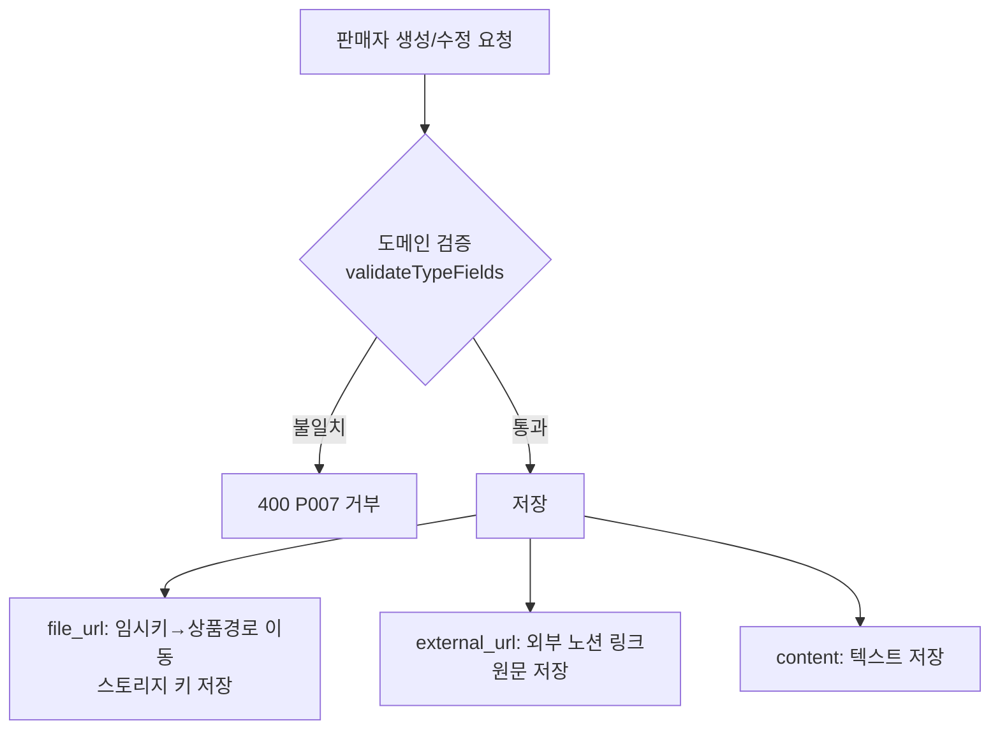

## 배경

product-service의 상품은 유형이 4가지(PROMPT/NOTION/PPT/EXCEL)이고, 유형마다 판매자가 올리는
산출물의 형태가 다르다. 그런데 `product` 테이블에는 본문 텍스트용 `content` 컬럼 하나뿐이라
파일(ppt/excel)이나 외부 링크(notion 템플릿)를 담을 자리가 없었다. 요청 DTO도 `content`를
`@NotBlank`(전 유형 필수)로 강제해, content를 쓰지 않는 유형과 맞지 않았다.

| 유형 | 사용 필드 | 성격 |
|---|---|---|
| PROMPT | content | 프롬프트 본문 텍스트 |
| PPT / EXCEL | file_url | 우리가 호스팅하는 산출물 파일(.pptx/.xlsx) |
| NOTION | external_url | 판매자 외부 노션 링크(업로드 아님) |

## 고려한 선택지

1. **nullable sparse 컬럼 + 도메인 검증** — `product`에 `file_url`, `external_url`을 nullable로
   추가하고, 유형에 안 맞는 컬럼은 NULL로 비운다. 유형별 정합성은 도메인 팩토리가 강제.

<details>
<summary><b>💡 sparse 컬럼이 뭐야?</b></summary>

컬럼을 여러 개 두되 각 행(상품)은 그중 일부만 채우고 나머지는 NULL로 비우는 방식.
유형마다 쓰는 필드가 달라 `file_url` / `external_url` 중 하나는 대개 비어(sparse=듬성듬성) 있다.
대신 테이블 하나로 단순하게 간다.

</details>

2. **단일 URL 컬럼으로 통합** — `resource_url` 하나에 유형에 따라 파일 URL이든 노션 링크든 저장.
   컬럼은 적지만 값의 의미가 productType에 종속되고, "우리가 올린 파일"과 "외부 링크"의 출처·검증
   차이가 스키마에서 사라진다.
3. **유형별 테이블 분리 / JSON 컬럼** — 유형마다 테이블을 쪼개거나 JSON blob에 담기. 이 도메인
   규모(필드 1~2개 차이)에 과하고 조회가 복잡해진다.

<details>
<summary><b>🔍 resource_url / JSON blob 은 무슨 말이야? (둘 다 채택 안 함)</b></summary>

둘 다 **실제 코드에 없는, 검토만 한 대안**이다.

- `resource_url` — 선택지 2에서 *만약 컬럼을 하나로 합쳤다면* 그 하나에 붙였을 가상의 이름.
  파일 URL이든 노션 링크든 한 컬럼에 담는 안이라 붙여본 이름일 뿐, 채택하지 않아 코드엔 없다.
- **JSON blob** — 유형별 필드를 개별 컬럼 대신 한 컬럼에 JSON 문자열로 뭉쳐 저장하는 방식
  (예: `extra` 컬럼에 `{"fileUrl":"..."}`). 조회·검증이 불편해 역시 채택하지 않았다.

</details>

## 결정

선택지 1을 택했다. 핵심은 **컬럼을 "본문(구매 전 노출)"과 "산출물(구매 후)"의 의미로 나눈 것**이다.

- `content` / `external_url` = 상세페이지에 노출되는 본문 계열
- `file_url` = 구매해야 받는 산출물(호스팅 파일)

### 유형별 필드 검증 (도메인 팩토리)

각 유형은 정확히 한 필드만 채우고 나머지는 비어야 한다. 불일치는 `create`/`update`/`nextVersion`
진입점에서 거부한다.

```java
private static void validateTypeFields(
    ProductType productType, String content, String fileUrl, String externalUrl
) {
    boolean hasContent = content != null && !content.isBlank();
    boolean hasFileUrl = fileUrl != null && !fileUrl.isBlank();
    boolean hasExternalUrl = externalUrl != null && !externalUrl.isBlank();

    boolean ok = switch (productType) {
        case PROMPT -> hasContent && !hasFileUrl && !hasExternalUrl;
        case PPT, EXCEL -> hasFileUrl && !hasContent && !hasExternalUrl;
        case NOTION -> hasExternalUrl && !hasContent && !hasFileUrl;
    };
    if (!ok) {
        throw new ProductException(ProductErrorCode.PRODUCT_TYPE_FIELD_MISMATCH); // 400 P007
    }
}
```

<details>
<summary><b>💡 도메인 팩토리가 뭐야?</b></summary>

`Product`를 만드는 정적 메서드 `create()`(그리고 새 버전 `nextVersion()`, 상태 변경 `update()`)를
말한다. 객체 생성 책임을 가진 메서드라 "팩토리". 여기에 검증을 넣으면 **잘못된 조합의 Product는
애초에 만들어지지 못하게** 막힌다 — 만든 뒤 따로 검사하는 게 아니라, 생성 시점에 불변식을 강제한다.

</details>

검증을 도메인 팩토리에 둔 이유: 기존 상태 전이 검증(`submitForReview` 등)이 이미 도메인 메서드에서
예외를 던지는 패턴이라 일관되고, DTO Bean Validation으로 빼면 규칙이 presentation 계층에 묶여
이중화된다.

### 저장 흐름 — 유형 분기 없이

서비스는 유형으로 분기하지 않는다. `file_url`은 썸네일과 같은 방식으로 "스토리지 키"로 저장(임시
경로→상품 경로 이동), `external_url`은 외부 링크라 원문 그대로 저장한다. 상호배타성은 도메인
검증이 이미 보장하므로 서비스는 기계적으로 처리한다.

```java
// createProduct — 파일은 키로, 노션 링크는 원문으로
String fileKey = moveToProductPath(extractKey(request.fileUrl()), productId); // null-safe
Product product = Product.create(
    productId, sellerId, productType, request.title(), request.desc(),
    request.model(), amountType, request.amount(),
    thumbnailKey, imageKeys,
    request.content(), fileKey, request.externalUrl(), request.tags()
);
```



### 응답 — presign vs 원문, 공개 노출 차단

판매자 상세 응답에서 `file_url`은 presigned 다운로드 URL로 변환하고(호스팅 파일이므로),
`external_url`은 외부 링크라 원문 그대로 준다.

```java
// SellerProductDetailResponse.from(...)
toUrl(product.getFileUrl(), storageClient),  // presigned (null이면 null)
product.getExternalUrl(),                    // 원문
```

**공개 상세(구매 전) 응답에는 두 필드를 넣지 않는다.** 유료 산출물이 구매 전에 노출되면 안 되기
때문이다. 공개 상세는 기존 `createPreviewContent()` 미리보기만 유지하고, 구매자에게의 산출물
전달은 별도(gRPC)로 다룬다.

## 결과

- PROMPT·NOTION은 이 변경만으로 등록·수정·조회가 완결된다(S3 불필요). PPT·EXCEL은 컬럼·검증·응답까지
  준비됐고, 실제 파일 업로드 UX는 후속(presigned PUT 업로드)에 의존한다.
- 스키마가 "본문 vs 산출물"의 접근제어 의도를 드러낸다 — 단일 컬럼 통합안이었다면 사라졌을 구분이다.
- 유형별 필수 필드가 도메인 한 곳(`validateTypeFields`)에 모여, 잘못된 조합은 400으로 일관되게 막힌다.
