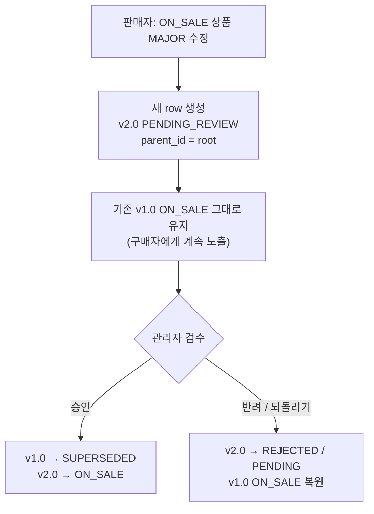
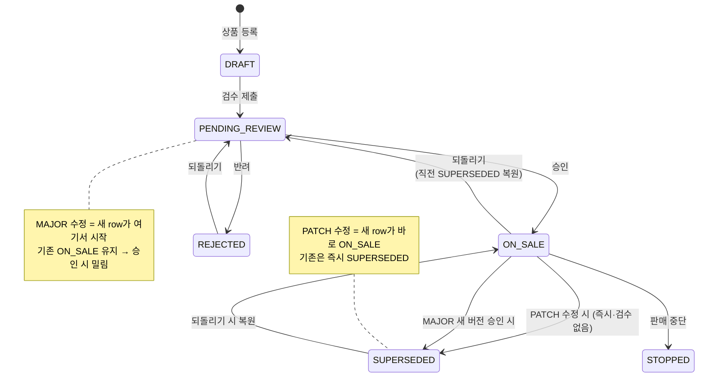
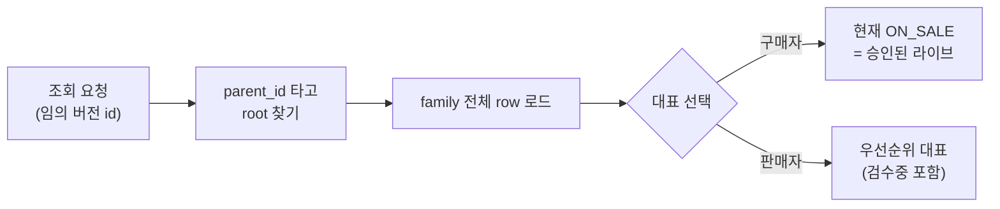

## 배경

product-service에서 판매 중(ON_SALE)인 상품을 판매자가 크게 수정(MAJOR)하면, 검수 승인 전인데도
기존 승인 콘텐츠가 즉시 덮어써지고 비공개로 전환됐다. 상품 수정이 엔티티를 in-place로 갱신했기
때문이다. 승인 대기/반려 중에도 노출되던 콘텐츠가 사라지고, 반려돼도 원래 버전으로 되돌릴 방법이
없었다. major/patch 버전 필드는 있었지만 이력이 물리적으로 남지 않아 스냅샷·롤백이 불가능했다.

<details>
<summary><b>💡 이해 포인트 — "row-chain"이 뭐야?</b></summary>

DB 테이블에서 한 줄(row) = 상품 하나다. 기존엔 수정하면 그 줄을 덮어썼지만, 이제는 버전마다
새 줄을 만들고 `parent_id`로 원본을 가리키게 한다.

```text
id          parent_id    version  status
──────────  ───────────  ───────  ──────────────
...015      (없음)        1.0      ON_SALE          ← 최초 등록 = 뿌리(root)
69aed452    ...015        2.0      PENDING_REVIEW   ← 수정본, parent_id가 root를 가리킴
```

같은 테이블 안에서 여러 줄이 `parent_id`로 한 뿌리에 매달린 묶음을 **family**라 부른다.
덮어쓰기 대신 줄을 쌓으니 과거 버전이 물리적으로 남는다.

</details>

## 고려한 선택지

1. **별도 이력 테이블(product_history)에 수정 전 스냅샷 저장**
   원본은 그대로 두고 이력만 별도 적재. 조회 변경은 적지만 "지금 어떤 버전이 라이브인가"를
   원본과 이력 테이블 사이에서 조율해야 하고, 상태 전이를 두 테이블에 걸쳐 관리해 정합성 부담이 크다.

2. **같은 테이블에 parent_id 자기참조 체인(row-chain)으로 버전마다 새 row 생성**
   각 버전이 독립 row. 최초 등록 row가 root, 이후 버전은 parent_id로 연결. 상태를 row별로 관리해
   "라이브 1개 + 검수 대기 + 과거 버전"이 한 family에 자연스럽게 공존한다.

3. **버전 필드만 증가(현행 유지) / 이벤트 소싱**
   전자는 이력 부재로 미해결, 후자는 이 도메인 규모에 과하다.

## 결정

선택지 2(parent_id row-chain)를 택했다. 쓰기 흐름은 다음과 같다.



- MAJOR 수정: 라이브 row는 두고 새 PENDING_REVIEW row 생성. 승인 시에만 기존 ON_SALE을 SUPERSEDED로
  밀고 새 버전을 ON_SALE로 전환.
- PATCH 수정: 새 버전 생성 + 기존 supersede.
- 반려/되돌리기: 밀려났던 SUPERSEDED 짝을 ON_SALE로 복원.
- 대표 row 선택 로직을 `ProductFamily` 값 객체로 캡슐화(판매자/공개/위시리스트 상황별 우선순위).
- 읽기 경로는 과거 버전 id로 요청해도 family의 현재 대표 row로 **resolve**하고, 응답 식별자는
  요청한 원본 id를 유지한다. 리뷰/평점은 family root 기준 집계로 버전업에도 유지.

### 상태 전이 (반려·되돌리기 포함)

위 흐름은 "버전 생성"이고, 각 row가 거치는 상태 전이는 다음과 같다.



- **반려**: 검수 대기(PENDING_REVIEW)인 버전만 → REJECTED. 기존 라이브(ON_SALE)는 건드리지 않는다.
- **되돌리기**: ON_SALE·REJECTED만 → PENDING_REVIEW. ON_SALE을 내릴 땐 직전 SUPERSEDED를 ON_SALE로 복원해 라이브 공백을 막는다.
- 상태 전이는 도메인 메서드(`reject` / `revertToPendingReview` / `restoreFromSuperseded`)가 강제해, 잘못된 전이는 예외로 막는다.

### family 구조와 root 찾기

새 버전의 `parent_id`는 바로 앞 버전이 아니라 **항상 root**를 가리킨다(flat 구조). 그래서 깊은 체인이 아니라 root 하나에 모든 버전이 매달린다.

```text
root(v1.0)
 ├── v1.1   (parent_id = root)
 └── v2.0   (parent_id = root)
```

```java
UUID familyRootId() { return parentId != null ? parentId : id; }  // 재귀 없이 한 줄
```

덕분에 `p.id = root or p.parentId = root` 한 쿼리로 family 전체를 모은다(재귀 트리 순회 불필요).

<details>
<summary><b>💡 이해 포인트 — "resolve"가 뭐야?</b></summary>

유저나 다른 서비스가 **아무 버전 id**로 조회할 수 있다(북마크, 장바구니에 담아둔 옛 id 등).
그때 "이 id가 속한 family에서 지금 보여줄 줄이 뭐지?"를 계산하는 게 resolve다.



핵심: **항상 물리적 최신 줄을 주는 게 아니다.** 구매자에겐 "현재 판매중(ON_SALE) 버전"을 준다.
검수 대기 중인 새 버전 id로 조회해도 구매자는 여전히 승인된 라이브 버전을 받는다 — 승인 안 된
버전은 구매자에게 노출되지 않는다(이게 이번 결정의 핵심 목적).

</details>

"family당 ON_SALE 최대 1개" 불변식은 DB 부분 유니크 인덱스 대신 트랜잭션 규율 + 테스트로 보장했다.
이 저장소가 마이그레이션 도구 없이 스키마를 자동 생성/유지하는 방식이라, 부분 유니크 인덱스를
안전하게 도입·롤백할 수단이 아직 없기 때문이다(도입 시 재검토).

## 결과

- 승인 전 라이브 콘텐츠가 보존되고 반려 시 원복이 가능해져 원 문제를 해소했다.
- 조회 경로가 통일된 resolve 규칙을 갖게 됐다(과거 id로 와도 현재 버전 응답, 식별자는 원본 유지).
- 트레이드오프로 쓰기·읽기 양쪽에 "family 로드 → 대표 선택" 로직이 더해져 복잡도와 쿼리가 늘었다.
  특히 대표 선택 우선순위에서 판매중단(STOPPED) 상태가 누락돼 판매자 목록이 깨지는 회귀가 있었고,
  전체 브랜치 리뷰 단계에서 발견해 보강했다 — 상태 우선순위 누락이 이 모델의 실질적 함정이었다.
- enum 상태값을 늘리면 기존 DB의 status CHECK 제약이 자동 갱신되지 않아, 배포 환경별 수동 반영이
  필요하다는 운영 포인트가 드러났다.
