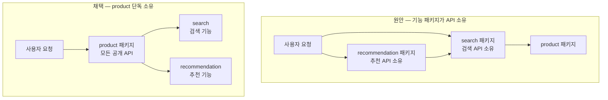

## 배경

상품 검색을 Elasticsearch로 전환하면서 `search` 패키지를 새로 만들었고, 이어서 추천 기능도
`recommendation` 패키지로 분리할 계획이었다. 하나의 서버 안에 기능별 경계를 그어두는 구조다.

<b>🔍 모듈러 모놀리스가 뭔가요?</b>

서버를 여러 개로 쪼개는 대신(마이크로서비스), **하나의 서버 안에서 기능별로 폴더 경계만
명확히 나눠두는** 방식이다. 배포는 한 덩어리라 운영이 단순하고, 나중에 특정 기능만 떼어내
별도 서버로 만들고 싶을 때 이미 그어둔 경계를 따라 자르면 된다.

이 프로젝트는 배포 자원이 넉넉하지 않아 서버를 더 늘리기 어려웠고, 그래서 "지금은 한 서버,
나중에 쪼갤 수 있게 경계만 미리" 전략을 택했다.

원래 설계 문서는 **각 기능 패키지가 자기 API 주소를 소유**하도록 정했다. 검색 API는 `search`
패키지가, 추천 API는 `recommendation` 패키지가 갖는 식이다. 근거는 "나중에 별도 서버로
분리할 때 잘라낼 선을 미리 만들어둔다"였다.

<b>🔍 "API를 소유한다"는 게 무슨 뜻인가요?</b>

웹 서버에서 외부 요청을 받는 입구 역할을 하는 코드를 **컨트롤러**라고 부른다.
`GET /products/123` 같은 요청이 들어오면 어떤 컨트롤러가 그걸 받을지 정해져 있다.

"API를 소유한다"는 곧 **그 컨트롤러 코드가 어느 폴더에 있느냐**의 문제다. 주소(URL) 자체는
어느 폴더에 있든 똑같이 동작한다 — 순수하게 코드 배치의 문제다.

그런데 실제로 검색 전환을 구현할 때 이 이관은 일어나지 않았다. 컨트롤러는 `product`에 그대로
남고, `search`는 조회 기능만 제공하는 형태로 붙었다. 그리고 그 상태로 리뷰를 통과해 잘
동작하고 있었다.

다음 단계(시맨틱 검색·자동완성·추천 전환·행동 로그 4개 작업)를 시작하기 전에, **어느 쪽을
표준으로 삼을지** 정해야 했다. 그대로 두면 컨벤션이 두 개로 갈린다.

## 고려한 선택지

**1. 원안대로 — 기능 패키지가 컨트롤러를 소유한다**

나중에 추천 기능을 별도 서버로 분리할 때 잘라낼 선이 명확하다. `recommendation` 폴더를
통째로 들어내면 되고, `product`는 손댈 필요가 없다.

다만 이미 동작 중인 검색 코드를 되돌려야 하고, 앞으로 만들 모든 API가 "이건 어느 패키지
소유지?"를 매번 판단해야 한다.

**2. product가 공개 API 주체, 기능 패키지는 내부 호출만 (택함)**

외부에 노출되는 입구는 `product` 하나로 고정하고, `search`와 `recommendation`은 그 안에서
호출되는 부품 역할만 한다.

## 결정

**공개 API의 주체는 `product` 하나로 통일한다.**

| 항목 | 결정 |
|---|---|
| 공개 API 입구 | `product` 패키지 단독 |
| 주소 체계 | 상품 관련은 전부 `/products/**` 아래 |
| `search` / `recommendation` | Elasticsearch·벡터 계산 같은 기술 구현을 감추고 기능만 제공 |
| 패키지 분리 자체 | 유지 — 바뀐 건 컨트롤러 위치뿐 |

판단 근거는 **역할 정의**였다. `recommendation`은 "무엇을 추천할지 계산하는 곳"이지
"사용자 요청을 받는 곳"이 아니다. 그리고 REST 관점에서도 상품이라는 자원의 대외 창구가
하나인 편이 자연스럽다.

<b>🔍 "기술 구현을 감춘다"는 게 왜 중요한가요?</b>

`product` 패키지는 "검색 결과를 달라"고 요청할 뿐, 그게 Elasticsearch로 조회되는지
데이터베이스로 조회되는지 모른다. 이렇게 해두면 나중에 검색 엔진을 바꿔도 `product` 쪽
코드는 한 줄도 안 바뀐다.

이 방식을 **포트-어댑터 패턴**이라고 부른다. "포트"는 기능의 규격서(무엇을 할 수 있는지만
적힌 것)이고, "어댑터"는 그 규격을 실제 기술로 구현한 것이다. 부르는 쪽은 규격서만 보고,
실물은 몰라도 된다.

**한 가지 예외**를 뒀다. 요청을 처리하다가 내부적으로 발생하는 기록(예: "검색이 실행됐다"는
이벤트)은 실제로 그 일을 하는 패키지가 남긴다. 검색 결과가 몇 건인지, 몇 밀리초 걸렸는지
같은 값은 검색을 실행하는 그 자리에만 있기 때문이다. 이 규칙은 *외부에 노출되는 API의
주인*을 정하는 것이지, 내부 동작까지 `product`로 끌어오라는 뜻이 아니다.

### 이 결론에 이르기까지

처음 판단은 원안 유지였다. "나중에 서비스로 분리할 때 잘라낼 선을 미리 만들어둔다"는 근거가
그럴듯했기 때문이다.

이 판단이 뒤집힌 계기는 두 가지였다.

**하나 — 원안이 이미 지켜지지 않고 있었다.** 검색 전환을 실제로 구현할 때 컨트롤러 이관은
일어나지 않았고, 그 코드가 리뷰를 통과해 동작 중이었다. 즉 이건 "원안을 지킬 것인가"의 문제가
아니라 **이미 존재하는 두 컨벤션 중 하나를 고르는** 문제였다. 코드를 먼저 확인하지 않고
문서만 보고 판단하면 이 사실을 놓친다.

**둘 — 역할 정의를 다시 물었다.** "recommendation은 추천 로직을 계산하는 단위이지 API의
주체가 아니다"라는 지적을 받고, 원안의 근거(분리 편의)와 역할 정의 중 무엇이 우선인지 다시
봤다. 분리 계획이 실재하지 않는 상태에서 분리 편의를 위해 역할 정의를 비트는 것은 순서가
뒤바뀐 판단이었다.

부수적으로 네이밍도 함께 정리했다. 내부 코드는 `related`인데 주소는 `/recommends`로 어긋나
있었다. 처음에는 "나중에 개인화 추천이 생기면 상품간 유사(related)와 개인 맞춤(recommended)을
구분해야 한다"는 이유로 유지를 제안했다. 그런데 그 개인화 추천 자체를 진행하지 않기로 이미
결정한 상태였다 — **전제부터 성립하지 않는 주장이었다.** 주소 기준으로 `recommended`로
통일했다.

## 결과

이후 진행한 4개 작업(시맨틱 검색, 자동완성, 추천 전환, 행동 로그)에 이 규칙을 일관되게
적용했다. 새로 생긴 주소는 자동완성 `GET /products/suggest` 하나뿐이고, 나머지는 주소가
그대로라 프론트엔드 영향이 없다.

**대가는 명시적으로 수용했다.** 나중에 추천을 별도 서버로 분리한다면 원안보다 손댈 곳이
많아진다 — 내부 호출을 네트워크 호출로 바꾸고 컨트롤러도 옮겨야 한다. 다만 현재 분리 계획이
없는 상태에서 그 비용을 지금 미리 지불하는 것보다, 필요해진 시점에 지불하는 편이 낫다고
판단했다.

이 결정은 [상품 목록·검색 API를 Elasticsearch 우선 조회로 전환](/decisions/prompthub/product-service/product-list-search-elasticsearch-migration)에서
개별 사례로 내렸던 판단을 규칙으로 일반화한 것이다.
