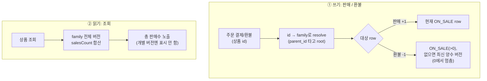

## 배경

상품 버전 이력을 [parent_id row-chain](/decisions/prompthub/product-service/product-version-history-row-chain)으로 관리하면서 상품 하나가 여러 개의 row(버전)로 존재하게 됐다. 판매수(salesCount)를 각 버전 row에 그대로 두면 버전업마다 판매수가 흩어져 "이 상품이 총 몇 개 팔렸나"를 알 수 없다. 판매(+1)·환불(-1)을 어느 row에 반영하고 화면엔 무엇을 보여줄지 정해야 했다.

## 고려한 선택지

1. **버전마다 salesCount를 따로 세고 버전별 표시** — 버전 이력엔 판매수 개념이 없고 사용자에겐 "상품 하나의 총 판매수"만 의미가 있다. 부적합.
2. **버전업 시 이전 판매수를 새 버전으로 이월** — 이월 시점·정합성 로직이 복잡하고 이력을 왜곡한다.
3. **쓰기는 현재 ON_SALE row, 읽기는 family 합산** (택함) — 어느 row에 쌓이든 합계는 정확하고 이월이 불필요하다.

## 결정 — 핵심 플로우

**쓰기**는 현재 ON_SALE row에 `+1`/`-1`, **읽기**는 family 전체 버전 합산. 아래 시나리오로 한눈에:

| 단계 | 일어난 일 | row별 salesCount | 조회 시 총합 |
| --- | --- | --- | --- |
| 1 | V1.0 등록(ON_SALE) | `V1.0=0` | **0** |
| 2 | 10개 판매 | `V1.0=10` | **10** |
| 3 | V1.1로 버전업 (V1.0→SUPERSEDED, V1.1=ON_SALE) | `V1.0=10, V1.1=0` | **10** |
| 4 | 5개 판매 → 현재 ON_SALE(V1.1)에 찍힘 | `V1.0=10, V1.1=5` | **15** |
| 5 | 1건 환불 → ON_SALE(V1.1>0)에서 감소 | `V1.0=10, V1.1=4` | **14** |

→ 3단계에서 판매수가 두 row로 **흩어지지만**, 읽기는 항상 **합산**이라 총합은 정확하다. 그래서 이월 로직이 필요 없다.

💡 왜 버전별 귀속을 추적하지 않나

판매(+1)도 "구매한 버전"이 아니라 결제 시점의 현재 ON_SALE에 찍힌다. 사용자는 버전업마다 최신 버전을 쓰므로 "어느 버전이 팔렸나"의 정답 자체가 없다. 개별 버전 salesCount는 화면에 노출되지 않는다. 따라서 환불(-1)을 family 내 어느 row에서 빼든 합계 결과는 동일하게 정확하다.

💡 환불을 어느 row에서 빼나 (재현성)

현재 ON_SALE의 판매수가 0이면(갓 버전업된 경우) 거기서 빼면 유실된다(0 밑으로 안 감). 그래서 "판매수>0인 가장 최신 버전(major.patch 내림차순)"에 적용한다. 어느 row에서 빼든 합은 같으므로, 이 결정론적 선택은 정확도가 아니라 재현성(순서 비보장 회피)이 목적이다.

## 결과

- 버전이 몇 개로 쪼개지든 총 판매수는 정확하고 이월 로직이 필요 없다.
- 인기순 정렬도 같은 합산 기준으로 통일했다.
- 트레이드오프: 조회마다 family 합산 상관 서브쿼리가 붙어 쿼리가 무거워졌고, 동시 판매(+1) 유실은 트랜잭션으로 보장한다.
