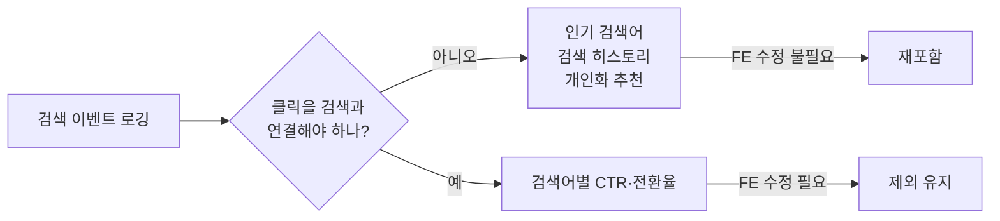

## 배경

상품 검색 기능을 세 단계로 나눠 구축하는 중이었다:

- **1단계**: 상품 검색을 RDB 기반에서 Elasticsearch로 전환(한글 형태소 분석 지원)
- **2단계**: 시맨틱(의미 기반) 검색·자동완성·비슷한 상품 추천
- **3단계**: 검색·조회 행동 로그를 쌓아 인기 검색어·검색 히스토리·개인화 추천으로 발전

3단계는 전체 로드맵 볼륨의 상당 부분을 차지해서, 남은 기간 대비 부담이 크다고 판단해 통째로 제외했었다. 이후 다시 검토하며 "정말 다 같이 빠져야 하나"를 물었다.

## 고려한 선택지

1. **3단계 전체 제외 유지** — 가장 단순하지만, FE 수정 없이도 되는 기능(인기 검색어·검색 히스토리)까지 같이 버리는 셈이다.
2. **3단계 전체 복원** — 원래의 부담(로드맵의 상당 비중)으로 그대로 돌아간다.
3. **"FE 저장소 수정이 꼭 필요한가"를 기준으로 재포함 범위를 가른다** (택함)

## 결정

검색 이벤트 로깅(검색 실행 기록, 상품 조회 기록) 자체는 서버 혼자서도 가능하다는 점에 착안해, "검색 결과 클릭을 그 검색과 연결하는 것"(FE가 상세 페이지 이동 시 검색 식별자를 붙여주는 부분)만 제외하고 나머지는 재포함했다.

| 기능 | FE 수정 필요? | 처리 |
|---|---|---|
| 인기 검색어 / 개인 검색 히스토리 | 불필요 | 재포함 |
| 개인화 홈 추천(취향벡터 기반) | 불필요 | 재포함(단, 실시간 세션 반영 등 부가 기능은 축소) |
| 검색어별 클릭률·전환율 지표 | **필요**(클릭이 어느 검색에서 왔는지 연결) | 제외 유지 |

## 결과

"다 아니면 전무"로 자를 뻔했던 것을, 기능 단위가 아니라 **의존성 단위**로 쪼개 판단하면서 실제로 지킬 수 있는 가치를 훨씬 많이 건졌다. 최종적으로 FE에 의존하는 조각(클릭 어트리뷰션, 검색 품질 지표)만 정확히 도려내고 나머지는 재포함했다.
