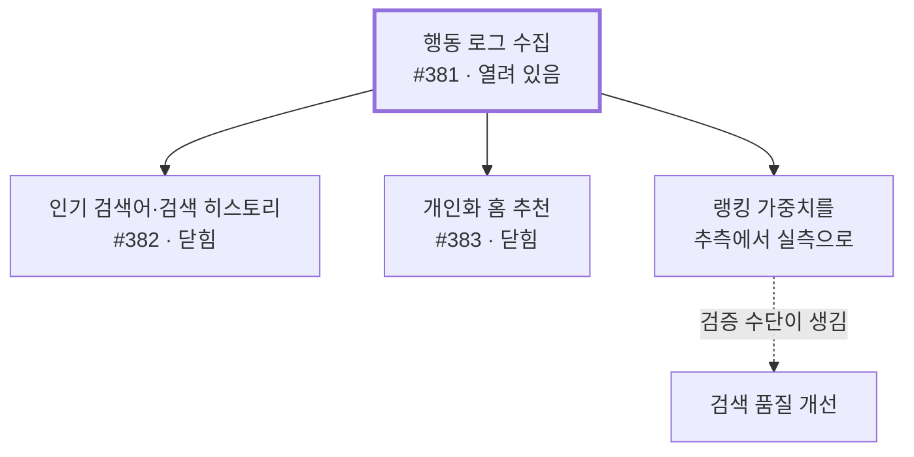
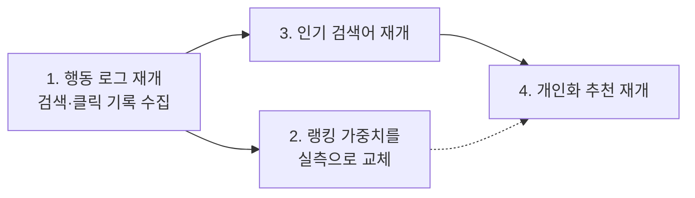

## 배경

상품 검색 고도화를 세 단계로 계획했다.

1. 검색을 Elasticsearch로 전환
2. 의미 기반 검색 · 자동완성 · 비슷한 상품 추천
3. **행동 로그 수집 · 인기 검색어와 검색 히스토리 · 개인화 홈 추천**

1·2단계는 구현했다. **3단계는 대부분 만들지 않았다.**

만들지 않은 것을 기록으로 남기는 이유는, 안 만든 이유가 시간이 없어서가 아니기 때문이다.
각각 구체적인 판단이 있었고, 그 판단이 언제 뒤집히는지도 정해뒀다. 그걸 적어두지 않으면
반년 뒤에 "왜 이건 없지?"에서 다시 시작하게 된다.

### 비유 — 닭과 달걀

인기 검색어를 만들려면 **사람들이 무엇을 검색했는지 기록**이 필요하다. 그 기록이 의미를
가지려면 **실제로 검색하는 사람**이 있어야 한다.

지금 이 서비스에는 상품이 65건 있고 실사용 검색 트래픽이 없다. 이 상태에서 인기 검색어
기능을 만들면, 화면에 뜰 내용이 없거나 몇 안 되는 테스트 검색어가 뜬다.

더 중요한 건 그 다음이다. **데이터가 없으면 만든 로직이 맞는지 틀린지도 알 수 없다.**
개인화 추천 알고리즘을 정교하게 짜도 검증할 방법이 없으면, 그건 동작하는 코드가 아니라
**검증되지 않은 채 유지보수 대상이 되는 코드**다.

## 고려한 선택지

**1. 계획대로 전부 구현한다**

설계 문서가 이미 상세하게 나와 있었다. 행동 이벤트 스키마, 로그 인덱스 구조, 취향 벡터
계산, 다양성 규칙, 콜드스타트 사다리까지 설계돼 있었다.

**2. 이슈를 열어둔 채 보류한다**

흔한 방식이다. 다만 백로그에 무기한 항목이 쌓이면 목록이 "언젠가 할 것"으로 가득 차서
지금 할 일이 안 보인다.

**3. 재개 조건을 명시하고 닫는다 (택함)**

이슈 본문에 왜 멈췄는지·언제 다시 여는지·범위가 무엇인지를 다 적어두고 닫는다. 유실되는
정보가 없고, 재개는 다시 여는 것 한 번이면 된다.

## 결정

**행동 데이터가 선행 조건인 기능들을 중단하고, 각 이슈에 재개 조건을 적어 닫는다.
행동 로그 수집 자체는 열어둔다.**

### 왜 이 순서로 막히나

**뒤의 셋은 전부 하나에 매달려 있다.** 행동 로그가 없으면 인기 검색어는 집계할 재료가 없고,
개인화 추천은 취향을 계산할 재료가 없고, 랭킹 가중치는 바꿔도 좋아졌는지 알 수 없다.

그래서 중단 결정은 세 개가 아니라 **사실상 하나**다 — "행동 로그를 아직 수집하지 않는다."

> ### 갱신 (2026-07-31) — 개인화 추천은 전제를 깨고 구현했다
>
> 위 판단의 전제는 **"개인화하려면 행동 로그를 먼저 쌓아야 한다"**였다. 그런데 다시 보니
> 그게 사실이 아니었다. 장바구니와 구매 내역은 **이미 서버에 있는 데이터**이고, 화면이
> 그것을 이미 들고 있었다. 새로 수집할 것이 없었다.
>
> 필요했던 건 "행동 로그 파이프라인"이 아니라 **이미 있는 활동을 기준점으로 삼는 것**뿐이었다.
> 그래서 #381 없이 개인화 추천을 만들었고, 취향 벡터 배치도 만들지 않았다 — 조회 시점에
> 계산하면 되는 것을 미리 계산해 저장할 이유가 없었다.
>
> **틀린 것은 "데이터가 없다"는 판단이었다.** 없었던 건 *조회·검색* 이력이지 *구매·장바구니*가
> 아니었는데, 셋을 묶어 "행동 데이터 없음"으로 처리했다. 재개 조건을 이슈에 적어둔 덕에
> 다시 열어볼 수 있었지만, 조건 자체가 부정확했다.
>
> #381(행동 로그)과 #382(인기 검색어)는 여전히 유효하게 닫혀 있다. 그쪽이 필요로 하는
> *검색어* 기록은 실제로 서버 어디에도 없다.
>
> → [AI 추천을 독립 서비스로 — 검색·추천 전체 흐름과 그 안의 결정들](/decisions/prompthub/product-service/ai-recommendation-independent-service)

> ### 갱신 (2026-08-13) — 검색 하한은 확정, 추천 하한은 별도 설계
>
> 검색의 Jina 최종 관련성 하한은 실제 운영 입력과 명시적 관련·무관 평가셋으로 재측정했다.
> 필수 관련 상품의 최저 점수 `0.06910534`와 무관 상품의 최고 점수 `-0.06565287` 사이에서
> `min-score=0.05`를 선택했고, #745로 설정과 코드 기본값을 함께 맞췄다.
>
> **회원님을 위한 추천도 무관 상품을 채워서 보여주지 않고 0건을 허용한다**는 정책은 같다.
> 그러나 검색은 한 질의와 RRF 후보를 Jina가 평가하고, 추천은 여러 활동 상품을 기준으로
> 거리 후보를 합치는 경로다. 검색의 `0.05`를 추천에 그대로 복사하지 않는다. 추천 후보를
> 만드는 각 질의와 병합 후 목록 중 어디에서 관련성을 판정할지 먼저 정하고, 관련·무관 평가셋을
> 만든 뒤 추천 전용 하한을 실측하는 것을 다음 설계 항목으로 둔다.

### 이슈별 상태

| 이슈 | 상태 | 왜 멈췄나 | 언제 다시 여나 |
|---|---|---|---|
| **#381** 행동 로그 파이프라인 | 열려 있음 · 미구현 | 뒤의 모든 것의 선행 조건. 우선순위상 뒤로 밀렸을 뿐 판단으로 중단한 게 아니다 | 검색 품질을 실측으로 개선할 필요가 생기면 |
| **#382** 인기 검색어·검색 히스토리 | 닫음 | 최근 검색어는 **이미 제공 중**(브라우저에 저장, 5개). 인기 검색어는 집계할 트래픽이 없음 | 실사용 검색 트래픽이 발생하면 |
| **#383** 개인화 홈 추천 | 닫음 → **다른 방식으로 구현됨** (아래 참조) | 행동 데이터가 없으면 콜드스타트 폴백(인기순)으로만 동작한다. 취향 벡터·다양성 규칙이 **검증할 수 없는 로직**으로 남는다 | — |
| **#594** 판매자 이름으로 검색 | 닫음 | 원래는 "검색창 안내 문구가 약속을 어긴다"는 버그였는데, 문구가 바뀌어 **불일치 자체가 해소**됐다. 남은 건 기능 요청이고 구현 방식도 미결 | 판매자 단위 탐색 요구가 생기거나 판매자 페이지가 도입될 때 |
| **#602** 첨부 파일 본문 텍스트 추출 | 닫음 | 상품 65건 규모에서 텍스트를 더 넣어 변별력이 오른다는 근거가 없음. 파일 파싱 의존성·다운로드·용량 제한·실패 처리가 따라오는 별도 덩어리 | 의미 검색 품질이 부족하다는 **구체적 근거가 관측될 때** |

<b>🔍 검색 히스토리를 닫으면 지금까지의 검색 기록은 사라지나요?</b>

사라질 기록이 애초에 없다. 지금 **서버에 검색 기록을 저장하지 않는다.**

화면에 뜨는 "최근 검색어"는 브라우저 안에만 저장된다(최대 5개). 서버로 보내지 않으므로
기기를 바꾸면 사라지고, 통계로도 쓸 수 없다.

그리고 서버 저장은 어차피 행동 로그 이슈의 범위다. 그쪽을 시작하면 그때부터 쌓인다.
**히스토리 기능을 닫는다고 유실되는 데이터가 없다**는 뜻이다.

### 보류를 "열어둠"이 아니라 "닫음"으로 정리한 이유

보류한 이슈를 열어둔 채 두면 백로그가 "언젠가 할 것"으로 채워진다. 시간이 지나면 그게 아직
유효한 계획인지, 이미 판단이 바뀐 건지 구분이 안 된다.

닫으면서 본문에 **왜 멈췄는지 · 재개 조건 · 원래 계획했던 범위**를 다 남긴다. 정보는 하나도
잃지 않고, 목록에는 지금 할 일만 남는다. 재개는 다시 여는 것 한 번이면 된다.

제목에 `(보류)`를 붙여서 "안 하기로 한 것"과 "못 해서 닫은 것"을 구분한다.

### 지금 상태에서 이미 조건이 반쯤 충족된 것

**첨부 파일 텍스트 추출**의 재개 조건은 "의미 기반 검색이 완료된 뒤 품질이 부족하다는 근거가
관측될 때"였다. 의미 기반 검색은 **완료됐다.** 앞 절반은 충족된 셈이다.

남은 건 "품질이 부족하다는 근거"인데, 그걸 관측하려면 다시 행동 로그가 필요하다. 여기서도
같은 병목으로 돌아온다.

## 결과

### 고도화는 이 순서로 한다

1. **행동 로그를 다시 연다.** 서버에서 검색 실행과 결과 클릭을 기록하고, 화면 쪽에서도
   "어떤 검색의 결과를 눌렀는지"를 함께 보내야 한다. 지금은 화면에서 클릭 정보를 서버로
   보내는 코드가 아예 없다 →
   **[행동 로그를 만든다면 — 추천이 아니라 "측정"을 위한 최소 설계](/decisions/prompthub/product-service/behavior-log-minimum-design-for-measurement)에
   범위를 다시 잡아뒀다.** 원래 설계는 추천을 위한 것이었는데 그 소비자가 닫혀서, 소비자를
   넷에서 하나(측정)로 줄였다
2. **쌓인 기록으로 랭킹 가중치를 실측으로 바꾼다.** 지금 `추측` 등급인 값 8개
   ([검색 품질을 정하는 숫자들](/decisions/prompthub/product-service/search-quality-tuning-values-rationale) 참고)가
   여기서 처음으로 검증 가능해진다
3. **인기 검색어를 다시 연다.** 집계할 재료가 생긴 뒤다
4. **개인화 추천을 다시 연다.** 취향을 계산할 재료가 생긴 뒤다

첨부 파일 텍스트 추출은 2번과 독립적으로, 의미 검색 품질이 부족하다는 근거가 나오면 연다.

### 이 판단들의 유효기간

**여기 적힌 중단 결정은 전부 "상품 65건, 실사용 트래픽 없음"을 전제로 한다.**

규모가 달라지면 판단도 달라진다. 상품이 수천 건이 되면 첨부 파일 텍스트가 변별력에 기여할
수 있고, 사용자가 늘면 인기 검색어에 띄울 내용이 생긴다. **전제를 명시해두는 이유가 이것이다**
— 나중에 이 문서를 읽는 사람이 "지금도 이 전제가 맞나"만 확인하면 되게 하려는 것이다.

### 남긴 것

- 안 만든 기능 5개의 사유와 재개 조건이 이슈 본문에 남았다. 목록에서는 사라졌지만 정보는
  그대로다
- 중단 결정 다섯 개가 사실은 **하나의 병목**(행동 로그 미수집)에서 파생됐다는 게 드러났다.
  개별 이슈로 볼 때는 보이지 않던 구조다
- 검색 품질 개선의 다음 한 걸음이 "가중치를 조정한다"가 아니라 **"측정 수단을 만든다"**라는
  게 분명해졌다

### 관련 문서

- [검색어를 치면 무슨 일이 벌어지나 — 전 과정](/decisions/prompthub/product-service/es-vector-search-end-to-end-flow)
- [검색 품질을 정하는 숫자들](/decisions/prompthub/product-service/search-quality-tuning-values-rationale)
- [행동 로그를 만든다면 — 추천이 아니라 \"측정\"을 위한 최소 설계](/decisions/prompthub/product-service/behavior-log-minimum-design-for-measurement)
- [\"아는 물건 검색\"이 아니라 \"의도 검색\"이다 — 범위 축소](/decisions/prompthub/product-service/search-feature-scope-by-intent-search-nature)
- [검색 로그 파이프라인의 범위를 화면 의존으로 정한 판단](/decisions/prompthub/product-service/search-log-pipeline-scope-by-fe-dependency)
- [행동 기반 추천 설계](/study/es/behavioral-recommendation-design)
- [검색 이벤트 로그 파이프라인](/study/es/search-event-log-pipeline)
