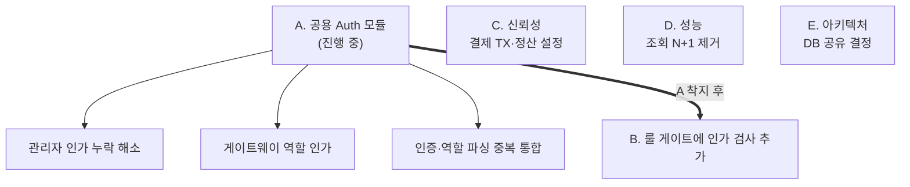

## 범위

PromptHub 백엔드 모노레포(Spring Boot 4.1 / Java 21, 8개 서비스: gateway·user·product·order·payment·settlement·admin·config/discovery)를 정적 리뷰했다. 보안 인가를 전 서비스 가로로 대조하고, 리스크가 큰 결제·주문·정산은 트랜잭션·멱등성·정합성까지 세로로 파고들었다.

## 요약

신뢰성 아키텍처는 인상적이다 — Outbox 패턴, Kafka DLT, 결정적 멱등키, 결제 트랜잭션 분리(외부 PG 호출 중 DB 커넥션 미점유), 서버측 결제금액 교차검증까지 실무 이커머스 수준으로 갖춰져 있다.

핵심은 개별 버그가 아니라 **근본 원인**이다. 관리자 인가 누락·인증 로직 중복·게이트웨이 역할검사 부재는 전부 **"인증/인가를 각 서비스가 제각기 재구현했다"**는 하나의 원인에서 나오며, 지금 진행 중인 **공용 auth 모듈**로 함께 수렴한다. 그리고 룰 검증 게이트가 인가를 검사하지 않아 이 구멍이 구조적으로 걸러지지 않았다 — 증상이 아니라 게이트를 고쳐야 한다.

## 워크스트림 & 시퀀싱

핵심 판단 세 가지:

1. 관리자 인가 구멍·인증 중복·게이트웨이 역할검사는 **auth 모듈 하나로** 수렴한다 — 따로 패치할 게 아니라 그 모듈의 필수 커버 범위다.
2. 관리자 인가는 **지금 열려 있는** 상태다. 모듈이 곧 들어오면 그것이 커버하고, 늦어지면 임시 인가 체크를 먼저 넣는다 — "모듈 작업 중"이 방치 사유가 되면 안 된다.
3. 룰 게이트의 인가 검사(B)는 **A 착지 후**에 온다. "올바른 인가 = auth 모듈 경유"라는 단일 기준이 생겨야 룰이 정오를 가릴 수 있다.

## 리스크 레지스터

### A. 인증/인가 (auth 모듈 워크스트림 · 진행 중)

| ID | 항목 | 심각도 | 근본원인 | 조치 | 상태 |
|---|---|---|---|---|---|
| A1 | 관리자 엔드포인트 인가 누락 | Critical | 서비스별 인가 재구현 | 공용 auth 모듈로 인가 일원화 | 이관 진행 중 |
| A2 | 게이트웨이 역할 기반 경로 인가 부재 | High | 경로 인가 미설계 | 모듈에 역할 경로 인가 포함 | 진행 중 |
| A3 | 인증 헤더·역할 파싱 중복(다수 서비스) | Med | 공용 컴포넌트 부재 | 모듈로 통합·마이그레이션 | 진행 중 |

### B. 프로세스 (A 이후)

| ID | 항목 | 심각도 | 근본원인 | 조치 | 상태 |
|---|---|---|---|---|---|
| B1 | 룰 게이트가 인가 미검사 | High | 보안 룰 범위가 시크릿 한정 | 인가 검사 룰 추가 | A 이후 예정 |

### C. 신뢰성

| ID | 항목 | 심각도 | 근본원인 | 조치 | 상태 |
|---|---|---|---|---|---|
| C1 | 환불 스케줄러 외부호출이 트랜잭션 내부 | Med | 승인의 TX분리 원칙 미적용 | 외부호출 트랜잭션 밖으로 | 미조치 |
| C2 | 결제 승인 고착 재조정 부재 | Med | 승인 경로 보상 로직 없음 | 재조정 스케줄러/대사 | 미조치 |
| C3 | 정산 이벤트 리스너 기본 비활성 | Med | 배포 설정 의존 | 설정 확인·기본값 재검토 | 확인 필요 |

### D. 성능

| ID | 항목 | 심각도 | 근본원인 | 조치 | 상태 |
|---|---|---|---|---|---|
| D1 | 상품 조회 판매자 N+1 | Med | 단건 호출 루프(배치 미사용) | 배치 조회로 교체 | → 결정: [판매자 정보 조합을 프론트엔드로 이관](/decisions/prompthub/product-service/seller-info-fe-composition) 에서 결정 |

### E. 아키텍처

| ID | 항목 | 심각도 | 근본원인 | 조치 | 상태 |
|---|---|---|---|---|---|
| E1 | 관리자↔정산 DB 직접 공유 | Med | 자율성보다 속도 우선 | 이벤트/gRPC 경유 vs 공유 결정 | 결정 필요(신규) |

## 권장 순서

- **지금**: A1 착지 시점 결정 · D1(N+1, 즉효) · C3 설정 확인 · E1 결정
- **auth 모듈 진행 중**: A2·A3를 모듈 스코프로 · C1/C2 병행
- **모듈 착지 후**: B1(인가 룰) · A3 서비스 마이그레이션
- **별도 트랙**: 커버리지 감사(아래)

## 분석 커버리지 / 한계

이 리뷰는 코드를 읽고 추론한 **정적 스냅샷**이다. 다음은 보지 않았고 별도 감사로 승격해야 한다: 빌드·테스트 실제 실행과 커버리지, DB 인덱스·실행계획, 관측성(로그·메트릭·알림), 의존성 CVE·CI/CD 파이프라인. 특히 승인 고착(C2)은 '탐지 수단이 있는가'를 별도로 확인해야 실질 리스크가 잡힌다.
