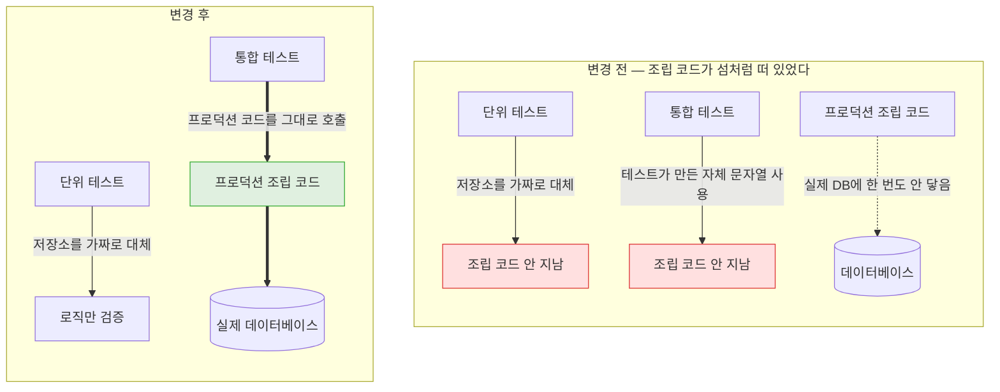

## 대상

**#378 상품 임베딩 저장 (PR #612)** — 상품마다 임베딩을 만들어 데이터베이스에 저장하는 작업.
설계 단계가 아니라 **코드를 쓰면서, 그리고 쓰고 나서** 점검한 결과다.

<details>
<summary><b>🔍 임베딩이 뭔가요?</b></summary>

문장을 **숫자 배열로 바꾼 것**이다. "뜻이 비슷한 문장은 숫자도 비슷하게" 나오도록 학습된
변환이라, 글자가 안 겹쳐도 의미가 가까우면 숫자상으로 가까워진다.

상품 하나당 숫자 1,536개짜리 배열을 만든다. 만드는 건 외부 AI 서비스(OpenAI)를 부르는 일이라
**시간이 걸리고 돈이 든다.** 아래 판단 대부분이 이 두 가지에서 나온다.

</details>

작업은 세 덩어리였다.

| 덩어리 | 내용 |
|---|---|
| 사전 정리 | 안 쓰는 필드 제거, 테스트 데이터베이스를 실제와 같은 것으로 교체 |
| 데이터베이스 준비 | 벡터 컬럼·지문 컬럼·전용 인덱스 추가 |
| 생성·저장 | 원문 조합, 지문 비교, 외부 호출, 저장 |

## 발견한 문제

### 1. 계획서에 적힌 전제가 성립하지 않았다

이슈 본문에는 "임베딩 생성 주체는 상품 쓰기 흐름"이라고 적혀 있었다. 구현 직전에 **정말 모든
변경이 그 지점을 지나가는지** 코드를 따라가 봤더니, 상품이 판매 상태가 되는 경로가 세 갈래였고
그중 둘은 다른 서비스에 알림을 보내지 않고 있었다.

| 경로 | 알림 발행 |
|---|---|
| 일반 수정 (가격·설명) | 발행 |
| **큰 폭 개정** (새 버전 행 생성) | **없음** |
| **관리자 승인** (검수 통과 → 판매중) | **없음.** 그 서비스에 발행 기능 자체가 없음 |

쓰기 흐름에 붙였으면 **"관리자가 방금 승인해 판매를 시작한 상품"의 임베딩이 영원히 안 생긴다.**
그게 정확히 검색에 노출되는 상품이라, 가장 필요한 대상이 통째로 빠질 뻔했다.

→ 결정: [상품 임베딩 생성을 쓰기 흐름이 아닌 주기 배치에 붙임](/decisions/prompthub/product-service/embedding-generation-in-reconcile-batch)

### 2. 조회수만 올라도 유료 AI 호출이 나갈 구조였다

배치는 "마지막 실행 이후 수정된 상품"을 대상으로 고르는데, 그 기준값(`updated_at`)은 **조회수가
1 오르기만 해도 바뀐다.** 상품 상세를 열어보는 것만으로 대상에 들어간다.

그대로 뒀으면 누가 상품을 구경할 때마다 돈이 나갔다.

### 3. 프로덕션 저장 코드가 어떤 테스트도 지나가지 않았다 ← 가장 위험했던 것

이게 리뷰하면서 나온 것 중 제일 컸다.

벡터를 데이터베이스에 넣으려면 자바 배열을 `[0.12,0.87,...]` 같은 **문자열로 조립**해야 한다.
그 조립 코드(`toVectorLiteral`)를 썼는데, 확인해 보니 **어떤 테스트도 그 코드를 실행하지
않고 있었다.**



<details>
<summary><b>🔍 "저장소를 가짜로 대체한다"가 무슨 뜻인가요?</b></summary>

단위 테스트는 로직 하나만 빠르게 검증하려고, 데이터베이스처럼 느리고 무거운 것을 **똑같이
생긴 가짜**로 바꿔 끼운다. 가짜는 "저장하라고 시켰다"는 사실만 기록하고 실제로는 아무것도 안 한다.

그래서 "지문이 같으면 AI를 안 부른다" 같은 판단은 잘 검증되는데, **진짜 데이터베이스가 그 값을
받아주는지는 전혀 확인되지 않는다.** 그 구간을 검증하는 건 통합 테스트의 몫인데, 통합 테스트가
프로덕션 코드를 안 쓰고 있었던 게 이번 문제다.

</details>

구체적인 위험이 있었다. `Float.toString(0.00001f)`은 `"1.0E-5"` 라는 **지수 표기**를 낸다.
임베딩 벡터는 이 크기의 값을 실제로 포함한다. 데이터베이스가 이 표기를 못 읽으면 저장 시점에
터지는데, 그걸 **배포한 뒤에 알게 될 구조**였다.

### 4. 이미 있는 픽스처를 두고 손수 만들고 있었다

검색 관련 테스트 7개 파일이 공통 픽스처를 쓰고 있는데, 이번에 추가한 테스트 2개만 상품 객체를
직접 조립하고 있었다. 한 파일은 **그 픽스처를 import해놓고 쓰지도 않았다.**

<details>
<summary><b>🔍 픽스처가 뭔가요?</b></summary>

테스트마다 필요한 **샘플 데이터를 만들어주는 공용 함수**다. "상품 하나 주세요" 하면 유효한
상품 객체를 돌려준다.

이걸 각 테스트가 직접 만들면, 나중에 상품에 필수 항목이 하나 추가될 때 **모든 테스트 파일을
찾아다니며 고쳐야 한다.** 픽스처를 쓰면 한 곳만 고치면 된다.

</details>

## 조치

### 1. 임베딩 생성을 배치 한 곳으로 통일

**무엇을** — 쓰기 흐름에 훅을 넣지 않고, 이미 20초마다 도는 검색 동기화 배치에서 만들게 했다.
이 배치는 알림에 의존하지 않고 데이터베이스를 직접 보기 때문에 세 경로를 모두 잡는다.

**왜 그 방법인가** — 다른 선택지는 "빠진 경로에 알림 기능을 새로 추가"였다. 근본 해결처럼
보이지만 다른 팀원 소유의 서비스를 고치고 이벤트 계약을 협의해야 한다. **이미 셋을 전부 덮는
경로가 있는데** 새 계약을 만들 이유가 없었다.

**근거** — 이 배치에는 예상 밖의 조건이 하나 더 맞았다. `@Transactional`이 없다.

<details>
<summary><b>🔍 그게 왜 중요한가요?</b></summary>

트랜잭션은 여러 데이터베이스 작업을 하나로 묶는 장치인데, 묶여 있는 동안 **데이터베이스 연결을
붙잡고 있다.** 연결 수는 한정돼 있다(보통 수십 개).

그 안에서 외부 API를 부르면 상대가 느릴 때 연결이 오래 묶인다. 임베딩 호출처럼 수백 밀리초씩
걸리는 게 여러 건 겹치면 연결이 바닥나고, **임베딩과 무관한 다른 요청까지 같이 멈춘다.**

실시간 알림을 처리하는 코드는 트랜잭션 안에서 검색 엔진을 호출하고 있었다. 거기 외부 AI 호출을
더 넣는 건 위험했다. 배치에는 그 제약이 없다.

</details>

지연은 최대 20초인데, 이미 "관리자 승인 → 검색 노출"에 합의된 예산이라 새로 내는 비용이 아니다.

### 2. 원문 지문으로 불필요한 호출을 막음

**무엇을** — 임베딩 재료가 되는 텍스트(제목·태그·설명·본문)를 합쳐 64글자 **지문**을 만들어
함께 저장하고, 지문이 같으면 외부 호출을 건너뛴다.

<details>
<summary><b>🔍 지문이 정확히 뭔가요?</b></summary>

**해시**다. 아무리 긴 글을 넣어도 정해진 길이의 문자열이 나오는 계산인데, 성질이 두 가지다.

- 같은 글은 **항상** 같은 결과를 낸다
- 한 글자만 달라도 결과가 완전히 달라진다

덕분에 "예전 임베딩을 만들 때 쓴 글"과 "지금의 글"이 같은지를, 원문 전체를 비교하지 않고
64글자만 비교해서 알 수 있다.

</details>

**왜 그 방법인가** — 대안은 "조회수 증가는 `updated_at`을 안 바꾸게 한다"였다. 하지만 그건
조회수 기능 쪽을 고치는 것이라 임베딩과 무관한 코드에 영향이 간다. 지문 비교는 **임베딩 쪽에서만
완결**된다.

**근거** — 이 검증에 테스트를 하나 붙였고, PR에서 가장 중요한 테스트로 표시했다. 깨지면 조회수가
1 오를 때마다 유료 호출이 나간다.

또 하나, 저장을 **JPA가 아니라 직접 쓴 SQL**로 했다. 자동 기록 기능이 타지 않아 `updated_at`이
그대로 남기 때문이다.

<details>
<summary><b>🔍 이게 왜 중요한가요?</b></summary>

`updated_at`은 보통 자동으로 "지금 시각"이 찍힌다. 그런데 배치는 이 값으로 대상을 고른다.

임베딩을 저장할 때 이 값이 갱신되면, **그 상품이 다음 회차에 또 대상으로 걸린다.** 지문은
같으니 호출은 안 나가지만, 매 회차마다 같은 상품이 계속 조회 대상이 되는 **꼬리를 무는 루프**가
생긴다. 직접 쓴 SQL은 이 자동 기록을 타지 않아 그 루프가 애초에 안 생긴다.

</details>

### 3. 통합 테스트가 프로덕션 코드를 쓰게 바꿈

**무엇을** — 통합 테스트가 자체 문자열 조립 함수(17줄)를 갖고 있던 걸 지우고, 프로덕션 저장
코드를 그대로 호출하게 했다. 비교 대상이 되는 벡터도 리터럴 대신 **저장된 값을 다시 참조**하도록
쿼리를 바꿔, 테스트에서 문자열 조립이 완전히 사라졌다.

```
- private void setEmbedding(Product product, String prefix) {
-     entityManager.createNativeQuery("UPDATE product SET embedding = CAST(:v AS vector) ...")
-         .setParameter("v", pad(prefix))   // 테스트가 자체 조립
-         ...
+ private void setEmbedding(Product product, int hotDimension) {
+     float[] embedding = new float[DIMENSIONS];
+     embedding[hotDimension] = 1f;
+     productRepositoryAdapter.updateEmbedding(...);   // 프로덕션 경로 그대로
```

**왜 그 방법인가** — 조립 코드에만 테스트를 따로 붙일 수도 있었다. 하지만 그러면 "조립 결과
문자열이 예상과 같다"만 확인하게 된다. **정작 알고 싶은 건 데이터베이스가 그걸 받아주느냐**다.
기존 통합 테스트를 프로덕션 경로로 돌리면 그게 공짜로 검증되고, 중복 코드도 같이 사라진다.

**근거** — 지수 표기(`1.0E-5`) 값을 저장하는 케이스를 명시 테스트로 추가했고 **통과를 확인했다.**
추측이 아니라 실측이다. 삭제 35줄 / 추가 45줄.

### 4. 픽스처 재사용

**무엇을** — 손수 만들던 상품 조립을 공용 픽스처 호출로 바꾸고, 안 쓰는 import를 지웠다.

**왜 그 방법인가** — 원문 조합을 검증하는 테스트는 항목별 값을 하나씩 바꿔야 해서 픽스처의
고정값으로는 안 된다. 그 파일은 로컬 헬퍼를 남기고 **안 쓰는 import만** 지웠다. 나머지 한
파일은 상품 내용이 검증과 무관해서 픽스처로 완전히 대체했다.

## 직접 만들었다가 고친 것

**전용 에러 코드를 만들려다 뺐다.** 처음엔 다른 기능들처럼 임베딩 실패용 에러 코드를 정의하려
했다. 그런데 이 코드들은 **HTTP 상태 코드를 갖고 있다** — 사용자 응답으로 나가는 걸 전제로 한
구조다. 임베딩 실패는 배치에서 도는 백그라운드 작업이라 응답으로 나갈 일이 없다. 로그를 남기고
그 상품만 건너뛰는 걸로 충분했다.

**재시도 기능을 옮겨오려다 뺐다.** AI 서비스에 이미 재시도 코드가 있어서 가져오려 했는데,
**배치가 20초마다 돈다는 걸 다시 생각하니 중복**이었다. 실패하면 지문을 저장하지 않으므로 다음
회차에 자동으로 다시 대상이 된다. 주기 자체가 재시도다.

**ES 문서에 임베딩을 실으려다 멈췄다.** 구현 도중에 실시간 갱신이 문서를 통째로 교체하면서
임베딩을 지운다는 걸 발견했다. 막으려면 실시간 경로에도 벡터 조회·변환이 붙는데, **지금 그
값을 읽는 코드가 하나도 없었다.**

→ 결정: [검색 엔진 쪽 임베딩 복사본을 다음 단계로 미룸](/decisions/prompthub/product-service/defer-es-embedding-replica)

## 판단이 틀렸던 것

**테스트 데이터베이스를 바꾸면서 "그냥 환경 정리"라고 생각했다.** H2라는 가벼운 테스트용
데이터베이스를 실제와 같은 Postgres로 바꾸는 작업을 사전 정리로 취급했는데, 이게 이번 작업에서
**가장 값이 컸던 변경**이었다.

<details>
<summary><b>🔍 왜 그런가요?</b></summary>

H2는 "Postgres인 척"하는 모드가 있지만 완전히 같지는 않다. 특히 **벡터 확장 기능이 아예 없다.**

그리고 H2를 쓰는 동안에는 테이블 구조를 코드에서 자동 생성하고 있었다. 그러면 **실제 운영에
적용되는 마이그레이션 파일과 코드가 어긋나도 테스트가 통과한다.** 배포해야 알게 된다.

바꾸고 나서야 "마이그레이션이 만든 테이블과 코드가 정말 일치하는가"가 처음으로 검증됐다.
그리고 이번 3번 발견(프로덕션 코드가 실제 DB에 안 닿음)도 이 전환이 없었으면 아예 확인할
방법이 없었다.

</details>

## 남긴 것 · 하지 않은 것

**저장소 인터페이스 분리를 안 했다.** 메서드 2개가 추가되면서 22개가 됐다. 하나가 너무 많은
일을 하는 상태로 가고 있는데, 지금 쪼개면 이번 변경과 무관한 차이가 커진다. **다음 단계에서
검색용 조회 메서드까지 붙은 뒤** 임베딩 전용으로 분리하는 게 자연스러운 시점이다.

**회차당 처리 개수 제한을 안 걸었다.** 상품이 한꺼번에 대량으로 판매중이 되면 한 회차에 호출이
몰린다. 현재 65건 규모에서는 문제가 아니라, 실제로 몰리는 걸 확인하기 전에는 넣지 않는다.

**실제 AI 응답이 1,536개짜리인지 확인 못 했다.** 테스트는 전부 가짜 호출을 쓴다. 배포
데이터베이스에 벡터 확장이 올라간 뒤 실환경에서 한 번 봐야 한다.

## 검증

**자동 테스트 16건**

| 종류 | 개수 | 내용 |
|---|---|---|
| 단위 | 6 | 원문 조합·절단·지문 안정성/길이 |
| 단위 | 6 | 지문 같으면 호출 안 함, 없음/변경 시 생성, 실패 시 지문 미저장, 한 건 실패해도 계속, 빈 입력 무동작 |
| 통합 | 4 | 확장 설치, 벡터 저장 후 거리 정렬, 전용 인덱스 정의, **지수 표기 값 저장** |

통합 테스트는 실제 Postgres 컨테이너를 띄우고 운영과 같은 마이그레이션을 돌린 뒤 검증한다.

**빌드** — 모듈 전체 빌드 통과, 배포 설정 검증 스크립트 통과.

**확인하지 못한 것** — 실제 AI 응답 차원 수, 그리고 배포 환경에서의 동작. 배포 데이터베이스에
벡터 확장이 아직 안 올라가 있어서, 이 변경은 **그 작업이 끝난 뒤에만 반영할 수 있다.** PR 본문
맨 위에 이 조건을 적어 실수로 반영되지 않게 했다.
