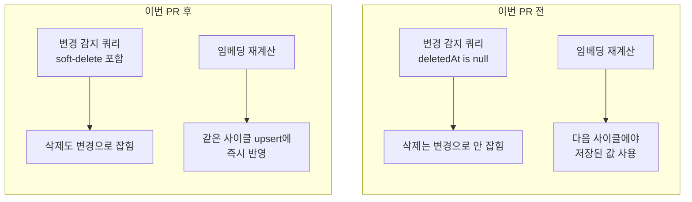
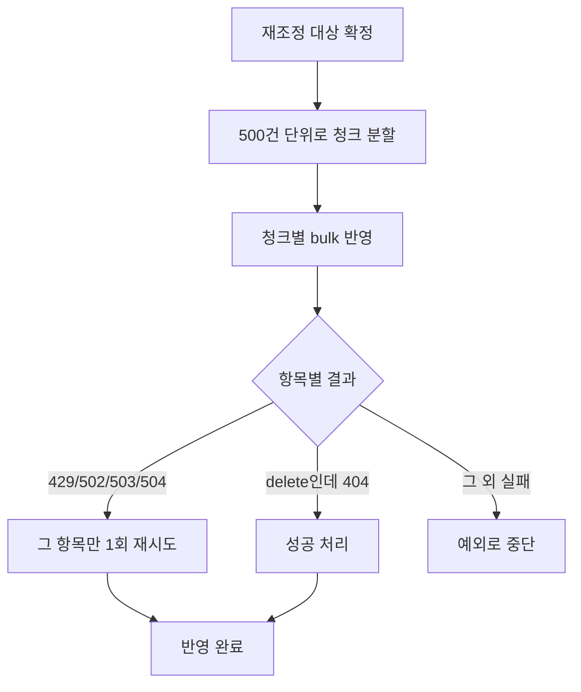

## 대상

이슈 #729, PR #730(브랜치 `feat/#729-es-scheduler-only-consistency`) — 품질 로드맵 I-2.
[PR4 리뷰](/reviews/prompthub/product-pr4-search-structure-2026-08-12)에서 다룬 재시도·관측성
다음으로, [스케줄러 전용 재조정](/decisions/prompthub/product-service/incremental-reconcile-over-outbox-event)
설계 자체의 남은 신뢰성 결함 5가지를 고쳤다.

## 발견한 문제

1. 증분 감지 쿼리가 `deletedAt is null`을 걸어 soft-delete를 놓친다 — 삭제해도 검색에서 안 사라짐
2. 새로 계산한 임베딩이 저장까지 한 사이클 늦게 반영된다
3. ES 대량 반영이 청크·재시도 없이 통짜로 나간다 — 일부 실패하면 그대로 끝
4. 색인 대상 조회가 `size(10000)` 고정이라 1만 건을 넘기면 스캔이 빠진다
5. alias가 실제 index(rogue index)에 이름을 점유당해도 무방비 — 과거 실제 겪은 장애

<b>🔍 soft-delete·alias/rogue index가 뭔가요?</b>

**soft-delete**: 행을 실제로 지우지 않고 `deletedAt`에 삭제 시각만 기록해 "삭제됨"으로
표시하는 방식. 이번 문제는 표시 자체는 잘 됐는데, 변경 감지 쿼리가 표시된 행을 조회
대상에서 아예 빼버려 ES에 삭제 사실이 전달되지 않은 것이다.

**alias / rogue index**: Elasticsearch에서 애플리케이션은 보통 alias(별칭, 예: `products`)를
통해 실제 index(예: `products-v1`)를 가리킨다. 나중에 무중단으로 index를 갈아끼우기 위한
간접 계층이다. 그런데 `products`라는 이름의 **실제 index**가 먼저 만들어져 있으면 그 이름을
alias로 쓸 수 없다 — 이걸 "rogue index가 alias 이름을 점유"했다고 한다. 기존 코드는
`existsAlias()`만 봐서 이 상황을 구분하지 못했다.

## 조치

### 감지·반영 파이프라인 — soft-delete 포함, 임베딩 즉시 반영

`deletedAt is null` 필터를 뺐고 리뷰 쿼리는 family root 기준으로 귀속시켰다(1). 임베딩은
`refresh()`(반환 없음)를 `refreshAndGet()`으로 바꿔, upsert 목록을 조립하기 **전에** 먼저
호출하도록 순서만 바꿨다(2) — 별도 캐시·이벤트 없이 호출 순서 변경만으로 충분했다.

- 근거: soft-delete 회귀 테스트 3건 반전(기존 테스트가 버그를 정답처럼 검증하고 있었다),
  "같은 사이클 반영"·"재계산 결과가 비면 기존 벡터 유지" 각각 별도 테스트로 확인.

### ES 대량 반영 — 청크·선별 재시도·전량 스캔

한 번에 큰 배치를 보내면 ES 과부하로 전체가 실패할 위험이 있고, 반대로 전체를 재시도하면
이미 성공한 항목까지 중복 반영된다 — 실패한 항목만 골라 재시도하는 게 둘 다 피하는
방법이었다(3). 색인 대상 조회는 `size(10000)` 고정 대신 PIT(그 순간의 스냅샷) +
`search_after`(마지막 항목 다음부터 이어서 조회)로 전량 순회하도록 바꿨다(4) — `size` 상한은
ES 자체 제약이라 코드로 늘릴 수 없었다.

- 근거: 청크 경계 넘는 5건 통합 테스트로 전부 반영 확인, 유닛 테스트로 `bulk()` 호출이
  정확히 2번(최초+재시도)임을 검증, 임베딩 API 없이 10,001건을 ES에 직접 삽입한 용량
  테스트로 전량 순회 실측.

### index/alias 무결성 — 기동 시 검증, 위반이면 기동 차단

`ProductIndexBootstrap`이 alias가 있으면 가리키는 index가 정확히 맞는지, alias가 없으면
같은 이름의 실제 index가 이미 선점하지 않았는지, 매핑 필드와 embedding 차원(1536)이
맞는지를 기동 시점에 검증한다(5). 불일치를 자동으로 재연결·덮어쓰기하는 대신, 사람이
확인할 때까지 기동을 막는 쪽(fail-fast)을 택했다 — 잘못된 index를 향해 계속 쓰기 시작하는
게 더 위험하다고 판단했다.

- 근거: 정상·alias 불일치·rogue index·매핑 불일치 등 신규 시나리오 6개.

### 부수 조치 — 검색용 Kafka 이벤트 제거

재조정이 스케줄러 하나로 이미 정합성을 보장하므로, 같은 목적의 Kafka 이벤트 4종과 발행·구독
코드를 지웠다. 로드맵 I-6("Kafka 컨슈머 정리")이 이걸로 자연히 해소됐다.

- 근거: 삭제 후 전체 테스트 452개 통과. [품질 스냅샷](/quality/prompthub/product-service-2026-08-12-post-pr730)에서
  Kafka consumer 설정 세트가 3개→2개로 줄어든 것도 확인.

## 직접 만들었다가 고친 것

Kafka 이벤트를 지우면서 order-service의 구독 코드까지 함께 정리하려 했다. "이제 아무도
발행 안 하니 같이 지우자"는 판단이었는데, "아무도 안 쓴다"는 이 PR이 **만드는** 결과이지
이 PR이 **검증할 수 있는** 사실이 아니었다 — order-service 배포 안전성은 그쪽 작업 범위다.
전량 `git restore`로 되돌리고, product-service가 더는 그 이벤트를 발행하지 않는다는 사실만
문서에 반영했다.

## 판단이 틀렸던 것

1. **"테스트 452개 전부 통과"가 실제로는 틀렸다.** Gradle `compileTestJava`가 테스트 소스
   변경에도 `UP-TO-DATE`를 찍어 캐시된 결과를 재사용했고, 그사이 작성한 유닛 테스트 하나가
   실제로는 실행조차 안 되는 상태였는데 통과로 보고했다. `--rerun-tasks`로 강제 재실행해서야
   드러났다(원인·재발방지는 별도 트러블슈팅으로 정리 예정).
2. **10,001건 테스트가 단독 실행에서만 통과했다.** 공유 Testcontainers ES에 문서를 심어두고
   정리를 안 해서 무관해 보이는 다른 통합 테스트(정렬 검증)가 깨졌다. 클래스 단위 실행과
   전체 스위트 실행을 비교해 원인을 좁혔다(마찬가지로 별도 트러블슈팅 예정).

## 남긴 것 · 하지 않은 것

- `QueryEmbeddingCache`의 동시 요청 병합(single-flight) 부재, S3/ES 클라이언트 타임아웃
  미설정 — 로드맵에 별도 항목으로 이미 계획됨.
- 502/503/504 개별 케이스, bulk 호출 횟수 세부 어서션처럼 상위 케이스로 이미 커버되는
  테스트는 추가하지 않음.
- CodeFlow 등 자동 채점은 이번 PR 안에서 재실행하지 않음 — 서비스 전체 재측정은
  [품질 스냅샷](/quality/prompthub/product-service-2026-08-12-post-pr730)으로 별도 게시.

## 검증

- product-service 전체 테스트 452개 통과(`--rerun-tasks`로 캐시 우회 재확인)
- Codex 외부 리뷰 5건(설정값 검증 누락·테스트 커버리지 과대 서술·임베딩 실패 무로깅·죽은
  Kafka 빈·낡은 주석) 전부 수정, 재검토 결과 "No findings"
- 배포 후 실서비스에서 PATCH 저장→검색 반영 21초(설계 목표 20초+refresh와 일치), 판매중지·반려
  상품 검색 제외 확인
- [품질 스냅샷](/quality/prompthub/product-service-2026-08-12-post-pr730) 재측정 — integration-robustness
  Medium 4→2로, 이 PR이 겨냥한 항목(alias 무결성·10k 상한)만 정확히 해소됐음을 재확인
