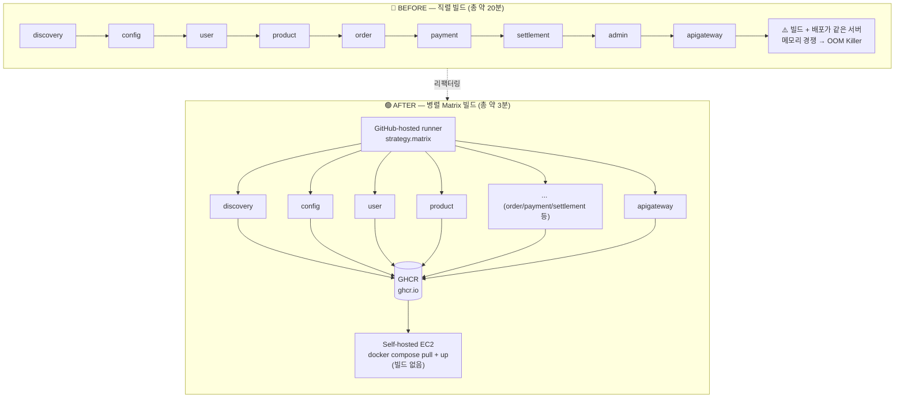

## 문제

CD 파이프라인이 self-hosted 배포 서버(EC2) 하나에서 9개 마이크로서비스(discovery, config, user, product, order, payment, settlement, admin, apigateway) Docker 이미지를 하나씩 순서대로 빌드하고 있었다. 배포 시간이 오래 걸렸고, 빌드 서버가 종종 OOM(메모리 부족)으로 죽었다.

## 원인

빌드와 배포가 같은 self-hosted 서버에서 일어나는 구조였다. 이미지 빌드는 서비스마다 독립적인 작업인데도 직렬로 처리해서, 전체 소요 시간이 "서비스 개수 × 개별 빌드 시간"에 가까웠다. 배포 서버가 무거운 빌드 작업까지 떠안다 보니 메모리 부족으로 죽는 경우가 있었다.

## 해결

1. **빌드를 GitHub-hosted runner로 이전 + Matrix 병렬화** — 변경된 서비스들을 GitHub Actions Matrix 전략으로 동시에 빌드하도록 바꿨다. 배포 서버는 빌드 없이 이미지 pull + `docker compose up`만 수행한다.
2. **이미지 레지스트리를 ECR → GHCR로 교체** — AWS 자격증명 없이 GitHub Actions 안에서 자동 발급되는 `GITHUB_TOKEN`만으로 인증되도록 바꿨다. 이미지 태그는 `SHORT_SHA`와 `latest` 둘 다 push한다.
3. **권한 정리** — AWS OIDC용 `id-token: write`를 GHCR push용 `packages: write`로 교체했다.

## 결과

배포 서버가 모든 이미지를 직렬로 빌드하던 구조에서, GitHub 클라우드가 변경된 서비스들을 동시에 병렬 빌드하고 배포 서버는 완성된 이미지만 받아 띄우는 구조로 바뀌었다. 체감 소요 시간이 약 20분에서 3분으로 줄었고, 배포 서버의 CPU/메모리 부담이 크게 줄었다.

## 배운 점

- **빌드와 배포는 관심사가 다르다.** 빌드는 무상태(stateless) 작업이라 어디서든 실행 가능하지만, 배포는 실제 서버 상태를 바꾸는 작업이라 대상 서버에 남겨야 한다.
- **Matrix 전략은 "합"이 아니라 "최댓값"으로 시간을 줄인다.** 직렬이면 9개 서비스 빌드 시간의 합이지만, 병렬 matrix로 돌리면 가장 느린 서비스 1개의 빌드 시간까지만 걸린다.
- **컨테이너 레지스트리 선택은 인증 모델과 직결된다.** GHCR은 GitHub 생태계 안에서 `GITHUB_TOKEN`만으로 끝나는 대신, ECR이 기본 제공하는 취약점 스캔 같은 보안 기능은 없다.
