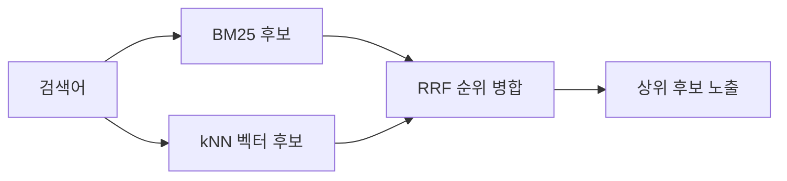
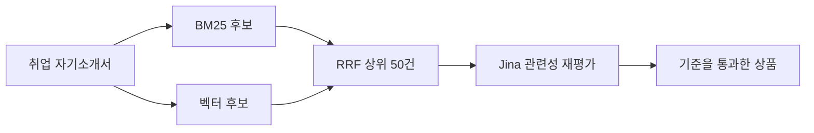

## 문제

사용자가 `취업 자기소개서`를 검색했는데 다음 상품들이 함께 노출됐다.

| 검색 결과 | 판단 |
| --- | --- |
| 합격하는 자기소개서 첨삭 | 관련 |
| 스터디 운영 템플릿 | 무관 |
| 프로젝트 종료 보고서 작성 | 무관 |
| 주식 분석 프롬프트 | 무관 |

`자기소개서` 단독 검색에서는 관련 상품만 나왔지만, `취업 자기소개서`처럼 검색어가 길어지자 오히려 무관한 상품이 추가됐다.

사용자가 입력한 단어와 일부 관련 있어 보이는 후보를 찾는 것과, 검색 의도에 맞는 상품을 최종 결과로 보여주는 것은 다른 문제였다. 이 서비스는 무관한 상품을 보여주기보다 결과가 적은 편을 선택했기 때문에 최종 관련성 검증이 필요했다.

## 원인

기존 검색은 BM25와 kNN 벡터 검색 결과를 RRF로 합쳤다.



RRF는 서로 다른 점수 체계를 직접 비교하지 않고 각 결과의 순위를 합치는 알고리즘이다. 두 목록에 모두 등장한 상품을 위로 올리는 데는 적합하지만, 해당 상품이 실제 검색 의도와 관련 있는지는 검증하지 않는다.

```text
RRF 점수 = 1 / (60 + BM25 순위)
         + 1 / (60 + 벡터 순위)
```

벡터 검색에서 낮은 순위로 들어온 프로젝트 보고서나 주식 분석 상품도 RRF 후보에 포함될 수 있었다. 작은 RRF 점수는 관련성이 낮다는 뜻도, 큰 점수는 반드시 관련 있다는 뜻도 아니었다.

<details>
<summary><b>BM25, kNN, RRF는 각각 무엇을 하나?</b></summary>

- **BM25**는 검색어가 상품명·태그·설명에 얼마나 잘 등장하는지 평가한다.
- **kNN 벡터 검색**은 단어가 달라도 의미가 가까운 상품을 찾는다.
- **RRF**는 서로 다른 점수 대신 각 검색 결과의 순위만 사용해 후보 목록을 합친다.

RRF는 후보 병합기이지 관련·무관을 판정하는 검증기가 아니다.

</details>

## 해결

### 1. Jina를 최종 관련성 재평가 단계에 추가했다

BM25와 벡터 검색을 없애는 대신 각각의 책임을 유지하고, RRF 상위 50건을 Jina Reranker v3에 전달했다.



Jina는 검색어와 각 후보를 함께 읽어 관련성 순서를 다시 계산한다. 검색 판단에 필요한 상품명, 태그, 설명과 PROMPT 상품의 모델명만 입력으로 구성했다.

<details>
<summary><b>Reranker는 벡터 검색과 무엇이 다른가?</b></summary>

벡터 검색은 전체 상품에서 의미상 가까운 후보를 빠르게 찾는다. Reranker는 이미 좁혀진 후보와 검색어를 함께 읽어 더 정교하게 순서를 다시 매긴다.

전체 상품을 매번 Reranker에 보내면 느리고 비용이 커지므로, 빠른 검색으로 후보를 모은 뒤 상위 후보만 재평가한다.

</details>

초기 운영 기준은 `min-score=0.5`였다. 기준보다 낮은 후보를 제거하고, Jina 호출이 실패하거나 API 키가 없으면 의미 후보를 버리고 BM25-only 검색으로 축소했다. 외부 API 장애가 검색 API 전체 장애로 번지는 것도 막았다.

그 결과 `취업 자기소개서` 검색에서 프로젝트 보고서와 주식 분석 상품이 제거됐다.

### 1-1. 실제 입력으로 하한을 `0.05`로 다시 잡았다

초기값 `0.5`는 관련성 필터가 필요하다는 정책을 코드로 먼저 표현한 값이지, 이 카탈로그와
`jina-reranker-v3`의 실제 점수 분포를 측정해 정한 값은 아니었다. 상품명만 보낸 간이 실험도
실제 애플리케이션의 입력과 달랐다. 운영 경로와 동일하게 상품명·태그·설명·모델명을 묶어
직접 관련, 약한 관련, 무관 쌍을 다시 측정했다.

| 검색어 | 후보 | 판단 | Jina 점수 |
| --- | --- | --- | ---: |
| Java 코드 버그 찾기 | 버그 잡는 코드 리뷰 리팩토링 | 직접 관련 | `0.16739694` |
| Java 코드 버그 찾기 | Spring Java 코드 리뷰 | 직접 관련 | `0.06910534` |
| 프로젝트 일정 관리 | WBS 일정표 자동 생성 | 직접 관련 | `0.23196099` |
| 동물 그림 만들기 | 동물 이미지 생성 가이드 | 직접 관련 | `0.17336046` |
| 동물 그림 만들기 | 펭귄 생성 프롬프트 | 약한 관련 | `-0.00439767` |
| 반려동물 병원 진료 예약 | 여행 일정 추천 플래너 | 무관 | `-0.06565287` |
| 반려동물 병원 진료 예약 | 동물 이미지 생성 가이드 | 무관 | `-0.07934325` |
| 동물 그림 만들기 | 주식 분석 프롬프트 | 무관 | `-0.12223881` |

필수 관련 상품의 최저 점수는 `0.06910534`였고, 무관 상품은 모두 음수였다. 따라서 관측된
안전 구간은 `0.05 <= min-score < 0.06910534`였고, 여유를 두어 하한을 `0.05`로 정했다.
`0.5`를 유지하면 직접 관련 상품까지 모두 제거되고, 필터를 없애면 후보 중 가장 덜 무관한
상품이 억지로 노출된다.

이 하한의 목적은 상위 N건을 채우는 것이 아니다. 후보가 전부 무관하면 **0건을 반환하는 것**이
정상 동작이다. 다만 이 값은 현재 상품과 평가 질의에서 얻은 운영값이므로 모델, 입력 조합,
카탈로그 분포가 바뀌면 같은 평가셋으로 다시 측정한다.

### 2. 해결 후 관련 상품 누락 회귀를 다시 추적했다

무관 결과는 사라졌지만 운영 E2E에서 반대 문제가 발견됐다.

| 검색어 | 기대 상품 | 실제 결과 |
| --- | --- | --- |
| 취업 자기소개서 | 자기소개서·이력서 첨삭 | 자기소개서 일부만 노출 |
| 이력서 작성 | 이력서·자기소개서 첨삭 | 0건 |
| 프로젝트 회고 | 프로젝트 종료 보고서 | 0건 |
| 종목 분석 | 주식 분석 상품 | 0건 |

처음에는 Jina의 점수 기준이 너무 엄격하다고 의심했다. 그러나 단계별로 추적해 보니 관련 상품은 Jina에서 탈락한 것이 아니라 Jina에 전달되기도 전에 BM25 후보 단계에서 제거되고 있었다.

과거 BM25 오탐을 막기 위해 설정한 다음 조건이 reranker 앞의 후보 수집에도 그대로 적용됐기 때문이다.

```text
minimum_should_match = "2<75%"
```

두 단어 검색은 두 단어가 모두 일치해야 했다.

```text
“이력서 작성” 검색
→ “이력서”만 포함한 관련 상품
→ BM25 후보 단계에서 제거
→ Jina에 전달되지 않음
→ 최종 결과 0건
```

Jina의 역할은 전달받은 후보를 재평가하는 것이다. 앞 단계가 관련 상품을 제거하면 reranker의 성능과 관계없이 복구할 수 없다.

### 3. 정상 경로와 장애 경로의 후보 정책을 분리했다

정상 하이브리드 검색에서는 Elasticsearch 기본 OR를 사용해 여러 단어 중 하나만 일치한 상품도 후보에 포함했다. 최종 관련성은 Jina가 평가하도록 책임을 나눴다.

반면 Jina 장애 시 사용하는 BM25-only 폴백에는 기존의 엄격한 `2<75%` 조건을 유지했다.

| 실행 경로 | BM25 후보 정책 | 선택 이유 |
| --- | --- | --- |
| Jina 정상 | 기본 OR | 관련 후보를 확보하고 Jina가 최종 검증 |
| Jina 장애 | `2<75%` | 검증 단계가 없으므로 무관 결과 노출 최소화 |

전역 조건을 단순히 완화하지 않은 이유는 정상 경로의 재현율을 높이면서도, 외부 API 장애 시 서비스의 정밀도 정책을 지켜야 했기 때문이다.

<details>
<summary><b>정밀도와 재현율은 무엇인가?</b></summary>

- **정밀도**는 보여준 결과 중 관련 상품의 비율이다.
- **재현율**은 관련 상품 중 실제로 찾아낸 상품의 비율이다.

검색 결과를 엄격하게 줄이면 정밀도는 좋아질 수 있지만 관련 상품도 놓치기 쉽다. 후보를 넓히면 재현율은 좋아지지만 마지막 관련성 검증이 필요하다.

</details>

기존 최종 BM25 쿼리를 그대로 재사용하지 않고 호출 목적이 드러나는 후보 조회를 분리했다.

```java
build(...)                         // 최종 BM25와 장애 폴백
buildHybridLexicalCandidates(...) // Jina가 평가할 넓은 후보
```

두 쿼리는 비슷해 보여도 책임이 다르다. 하나는 최종 결과를 만들고, 다른 하나는 다음 단계가 판단할 기회를 확보한다.

## 결과

- `취업 자기소개서` 검색에서 프로젝트 보고서·주식 분석 같은 무관 상품을 제거했다.
- 두 단어 중 하나만 직접 일치한 관련 상품도 정상 경로에서는 Jina의 평가를 받을 수 있게 했다.
- Jina 장애 시에는 엄격한 BM25 조건을 유지해 과거 오탐의 재발을 막았다.
- 정상 경로와 장애 경로를 각각 검증하는 단위·통합 테스트를 추가했다.
- product-service 테스트 484개와 전체 빌드, 변경 파일 정적 분석, whitespace 검사가 통과했다.

`동물 → 펭귄`처럼 한 단어 의미 검색에서 후보가 누락되는 문제는 이번 변경에 섞지 않았다. 별도 실측에서 펭귄 상품은 kNN 유사도 하한 `0.35`를 넘지 못해 Jina 이전에 탈락한 것으로 확인됐다. 하한을 낮추면 관련 쌍보다 점수가 높은 무관 쌍도 함께 들어오는 역전 구간이 있어, 이번 BM25 후보 회귀와 다른 데이터 문제로 분리했다.

관련 분석: [“동물”을 검색했는데 펭귄이 안 나온다 — 한 단어 질의에서 의미 검색은 침묵한다](/troubleshooting/prompthub/search/single-word-query-semantic-silence)

## 배운 점

검색 품질 문제는 알고리즘 하나를 추가한다고 끝나지 않았다. 앞 단계의 필터가 관련 후보를 제거하면 뒤 단계의 정교한 모델도 아무 판단을 할 수 없다.

이번 작업에서 얻은 원칙은 다음과 같다.

> 후보 검색은 평가할 기회를 확보하고, 최종 관련성 판정은 그 책임을 맡은 단계에서 수행한다. 외부 판정기가 실패한 경로에서는 서비스 정책에 맞춰 더 보수적으로 축소한다.

또한 최종 결과만 보고 “벡터 검색이 약하다”거나 “reranker가 키워드 중심이다”라고 단정하지 않게 됐다. BM25, 벡터, RRF, Jina, 최종 재조회까지 각 단계의 후보와 순위를 확인해야 원인을 정확히 나눌 수 있다.
