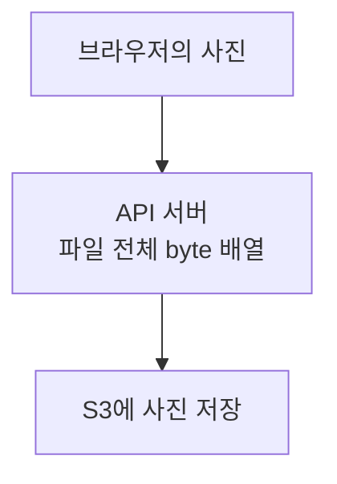
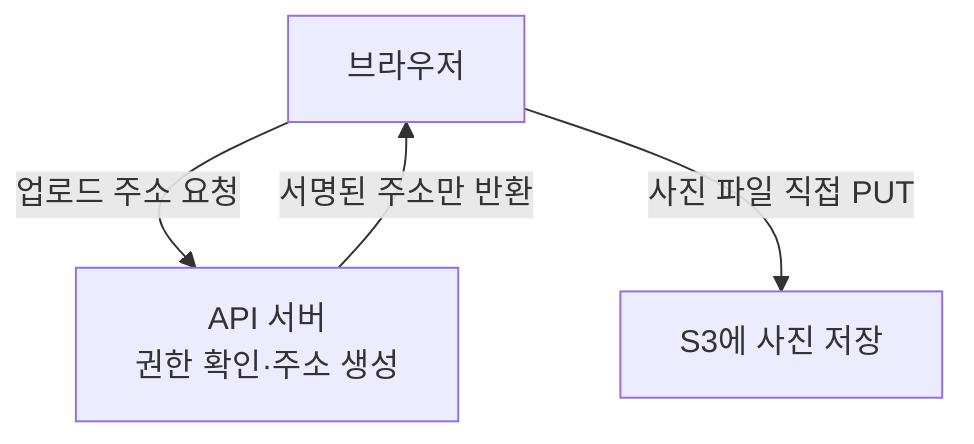

## 01 · 사진 파일이 서버를 지나간다

**S3**는 파일을 객체로 보관하는 AWS 서비스다. 사진 하나를 업로드할 때 파일이 어디를 지나가는지 보자.



결과: 서버가 파일 전체를 배열로 보관하는 방식이면 큰 파일과 동시 요청이 메모리를 압박할 수 있다. 실제 복사본 수와 사용량은 구현에 따라 다르다.

## 02 · 서버는 주소만 주고 사진은 직접 보낸다

서버에서 파일 전체를 처리해야 하는 요구가 없다면 직접 업로드를 검토할 수 있다.



결과: 이 업로드 파일의 bytes가 API 서버를 지나지 않는다. 파일 버퍼링 부담을 제거한 것이지 서버의 모든 메모리 문제를 해결한 것은 아니다.

## 03 · 서명 링크는 일회용 티켓이 아니다

서버가 만드는 **presigned URL**은 '어느 객체에, 어느 동작을, 언제까지 허용할지'를 서명한 주소다. 다운로드는 GET, 업로드는 PUT 동작을 사용한다.

```text
같은 다운로드 주소 (객체·권한·자격이 유효한 예)
발급 후 1분: 요청 가능
발급 후 2분: 같은 주소로 다시 요청 가능
설정된 만료 후: 새 요청 불가
```

결과: 링크를 가진 사람이 사용할 수 있으므로 원래 구매자만 쓸 것이라고 가정하지 않는다. URL의 설정 만료보다 서명 자격이 먼저 만료되면 더 일찍 사용할 수 없게 된다. [AWS presigned URL](https://docs.aws.amazon.com/AmazonS3/latest/userguide/using-presigned-url.html)

## 04 · 업로드한 파일을 상품에 연결한다

브라우저가 업로드를 마치면 서버에 **object key**, 즉 S3에서 파일을 가리키는 이름을 전달한다. 서버는 허용한 key와 업로드 상태를 확인한 뒤 상품과 연결한다.

다운로드할 때도 구매 권한을 먼저 확인하고 짧은 유효 기간의 주소를 제공한다. 파일 식별값과 만료되는 접근 주소는 구분해서 관리한다.

<details>
<summary>서버를 거쳐야 한다면? 메모리는 얼마나 필요할까?</summary>

파일 검사 등으로 서버를 거쳐야 한다면 전체 배열 대신 작은 버퍼로 전달하는 **스트리밍**을 검토한다.

```text
전체 버퍼링: 파일 전체와 중간 복사본을 보관할 수 있음
스트리밍:    현재 처리하는 작은 chunk를 읽어 전달
```

chunk는 파일의 작은 조각이다. 스트리밍도 요청별 버퍼와 객체가 필요하며, 서버 네트워크와 연결을 계속 사용한다.

```text
전체 버퍼링 부담 ≈ 파일 크기 × 동시 요청 × 복사본 수
스트리밍 부담   ≈ 요청별 버퍼 × 동시 요청 + 부가 비용
```

실제 사용량은 프레임워크의 버퍼 방식과 측정 시점에 따라 다르다. 영상 실험 수치를 이 프로젝트의 실측 결과로 옮기지 않는다.

</details>

<details>
<summary>heap과 GC도 같이 이해하고 싶다면</summary>

heap은 Java 객체와 배열이 사용하는 메모리 공간이다. file.getBytes()는 파일 전체의 byte 배열을 만들 수 있다. GC는 더 이상 필요한 곳에서 참조하지 않는 객체의 메모리를 회수한다.

G1 GC에서는 region 크기의 절반 이상인 객체를 humongous object로 다룬다. region은 heap을 나눈 구역이다. 파일 배열의 영향도 객체 크기와 GC 설정에 따라 달라진다. 직접 업로드는 이 파일 배열을 API 서버에 만들 필요를 없애는 선택이지 GC 튜닝을 영원히 안 해도 된다는 보장은 아니다.

[객체가 필요 없는지 판단하는 방법](/study/jvm/gc-roots-reachability-and-memory-reclaim), [heap 회수와 OS 반환](/study/jvm/heap-memory-reclaim)을 함께 본다.

</details>

<details>
<summary>S3Presigner는 누가 제공하고, 무엇까지 해줄까?</summary>

S3Presigner는 **AWS SDK for Java의 외부 라이브러리 클래스**다. SDK 의존성이 필요하다. URL 서명을 만들지만 구매 권한 확인과 업로드 완료 검증은 애플리케이션이 구현한다.

```java
S3Presigner.builder().region(Region.of(region)).build();
```

region은 애플리케이션이 제공하는 리전 문자열이다. 이 설정 발췌는 서명 도구를 만들며, 아직 특정 객체의 PUT/GET 주소를 만든 것은 아니다.

서명 계산 자체는 S3 발급 API를 호출하는 작업이 아니다. 하지만 서명에 사용할 자격을 조회·갱신하는 과정은 네트워크 통신을 할 수 있다.

2026-10-08에 읽은 로컬 PromptHub의 S3Config는 자격 공급자를 명시하지 않았다. 기본 체인은 여러 출처 중 먼저 찾은 자격을 사용하므로 코드만으로 EC2 IAM Role 사용을 확정하지 않는다. 배포 환경에서 실제 자격의 출처를 별도로 확인해야 한다. [AWS 기본 자격 체인](https://docs.aws.amazon.com/sdk-for-java/latest/developer-guide/credentials-chain.html)

Role의 임시 자격을 사용하면 자격 수명과 회전도 URL 유효 기간에 영향을 준다. 코드를 봤다는 사실만으로 장기 키가 어디에도 없다고 주장하지 않는다.

</details>

<details>
<summary>직접 업로드에도 어떤 제한이 필요할까?</summary>

- 발급 전에 사용자 권한과 허용할 object key를 확인한다.
- URL 유효 기간을 짧게 정하고 고유한 key로 의도하지 않은 덮어쓰기를 피한다.
- 파일 크기, Content-Type과 확장자의 허용 정책을 정한다.
- 완료 후 실제 객체의 크기와 상태를 확인한다.
- 구매 파일 다운로드 주소는 권한을 확인한 시점에 제공한다.

Content-Type을 서명에 포함해 요청 헤더 일치를 요구하는 것과 실제 파일 내용의 안전성을 검사하는 것은 다르다.

| 방식 | 서버 메모리 부담 | 서버 네트워크 | 선택 조건 |
| --- | --- | --- | --- |
| 전체 버퍼링 | 파일 전체와 복사본 가능 | 파일이 통과 | 단순하지만 크기·동시성 확인 필요 |
| 서버 스트리밍 | 작은 요청별 버퍼 | 파일이 통과 | 서버가 파일을 처리해야 할 때 |
| 직접 업로드 | 주소 발급·검증 수준 | 파일은 서버 우회 | 서버 전체 처리 요구가 없을 때 |

</details>

## 자기 말로 답해보기

구매자가 만료 전 다운로드 링크를 다른 사람에게 보내면 그 사람도 요청할 수 있을까?

<details>
<summary>답 확인</summary>

URL과 권한·자격·정책이 유효하면 가능하다. 발급 때 구매 권한을 확인했다고 링크 공유까지 막히는 것은 아니다.

</details>

## 참고

- [AWS — Uploading objects with presigned URLs](https://docs.aws.amazon.com/AmazonS3/latest/userguide/PresignedUrlUploadObject.html)
- [G1 humongous objects](https://docs.oracle.com/en/java/javase/21/gctuning/garbage-first-g1-garbage-collector1.html)
- 설명 관점 참고: [Instagram — 파일 업로드 몇 개에 서버가 죽는 이유](https://www.instagram.com/reel/Dcq5ft5NiMp/)
