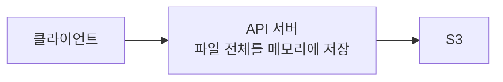
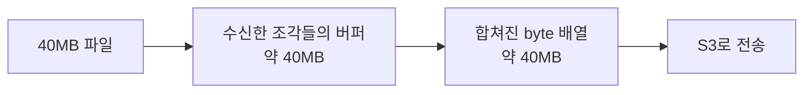

## 왜 필요했나 — 서버가 파일을 heap에 이고 있었다

택배를 전달하기 위해 중간 창고에 물건을 전부 쌓아두는 상황을 생각해보자. 택배가 한두 개일 때는 괜찮지만 여러 사람이 동시에 큰 물건을 보내면 창고가 빠르게 가득 찬다. 서버가 업로드 파일을 전부 메모리에 올리는 방식도 이와 같다.



원래 업로드는 "서버 경유"였다. 프론트가 파일을 서버로 보내면, 서버가 `file.getBytes()`로 **파일
전체를 메모리(JVM heap)에 byte 배열로 올린 뒤** S3로 다시 전송했다.

문제는 파일이 클수록(ppt/excel), 동시 업로드가 많을수록 heap이 배수로 부푼다는 것. 큰 배열은
GC 입장에서 다루기 무거운 덩어리라 GC를 압박한다. "왜 이 서버만 메모리를 많이 쓰지?"의 범인이
바로 이 byte 업로드였다.

## 40MB 파일이 80MB를 사용할 수 있다

파일 크기가 40MB라고 서버 메모리도 정확히 40MB만 사용하는 것은 아니다. 파일을 여러 조각으로 받아 모은 버퍼와 하나로 합친 배열이 같은 시점에 함께 존재할 수 있다.



```text
파일 크기:       40MB
조각 버퍼:      약 40MB
합친 byte 배열: 약 40MB
──────────────────────
동시에 존재하면 약 80MB
```

영상의 실험에서도 40MB 파일 하나를 처리할 때 약 `80.9MB`가 측정됐다.

## 동시 업로드가 메모리를 채운다

```text
업로드 메모리
≈ 파일 크기
× 메모리에 존재하는 복사본 수
× 동시 요청 수
```

영상에서는 동시 업로드 4개에서 약 `320.3MB`, 8개에서 약 `396.9MB`가 측정됐다. GC가 메모리를 회수한 시점, 프레임워크의 버퍼 관리와 측정 방식에 따라 실제 값은 정확한 곱셈 결과와 다를 수 있다. 중요한 것은 파일 크기와 동시 요청 수가 모두 커질수록 위험이 증가한다는 점이다.

<details>
<summary><b>🔍 JVM heap / GC가 뭐고, 왜 이제 튜닝 안 해도 되나</b></summary>

- **heap**: 프로그램이 만든 데이터(객체)가 사는 메모리 공간. 업로드한 파일의 `byte[]`도 여기 산다.
- **GC(Garbage Collection)**: 더 안 쓰는 객체를 자동으로 청소해 heap을 비워주는 일. 청소하는 동안
  잠깐 멈추거나(stop-the-world) CPU를 쓴다 — 자주·오래 돌수록 앱이 느려진다.

**왜 문제였나:** 파일 하나가 통째로 큰 `byte[]`가 되면, G1 GC에서 여러 region을 차지하는
**humongous object**(대형 덩어리)로 취급돼 다루기 무겁다. 동시 업로드로 이런 큰 덩어리가 여럿
생기면 heap이 금세 차서 GC가 자주·길게 돈다. 그래서 "heap을 더 키우자 / GC 옵션을 튜닝하자"는
유혹이 생긴다 — 하지만 그건 **증상 완화**일 뿐이다.

**왜 이제 안 해도 되나:** presigned PUT으로 바꾸면 파일이 **애초에 서버 heap의 `byte[]`가 되지
않는다**(프론트 → S3 직행). 압박의 **원인 자체가 사라지니**, 업로드 때문에 heap을 키우거나 GC를
튜닝할 이유가 없다. 튜닝(증상 완화) 대신 **원인 제거**를 한 셈.

</details>

## 첫 번째 방법 — 파일 전체를 모으지 않는다

서버가 파일을 받아야 한다면 전체를 `byte[]`로 만들지 않고 작은 조각을 읽은 즉시 다음 목적지로 보낼 수 있다. 이것이 **스트리밍 업로드**다.


```text
전체 버퍼링: 40MB 파일 전체가 heap에 존재
스트리밍:    현재 처리하는 작은 chunk만 존재
```

영상에서는 64KB씩 스트리밍했을 때 8명이 동시에 업로드해도 약 `1.5MB`가 측정됐다.

<details>
<summary><b>🔍 스트리밍하면 동시 요청 수와 무관하게 메모리가 완전히 일정할까?</b></summary>

완전히 일정하지는 않는다. 요청마다 작은 입출력 버퍼와 요청 객체가 필요하다.

```text
스트리밍 메모리
≈ chunk 크기 × 동시 요청 수
+ 요청별 부가 비용
```

파일 전체를 보관하지 않으므로 파일 크기에 비례해서 증가하지 않는다는 것이 핵심이다.

</details>

스트리밍은 서버 메모리를 크게 줄이지만 파일 데이터가 서버를 통과하므로 서버 네트워크 대역폭과 연결은 계속 사용한다.

해결의 방향: **서버가 파일을 아예 안 만지게 하자.** 그게 presigned URL이다.

## presigned URL이 뭐냐 — 30분짜리 일회용 출입카드

S3 파일은 기본적으로 비공개다(아무나 못 봄). presigned URL은 그 파일에 **"이 파일 하나만, 이
동작만(GET 또는 PUT), 정해진 시간만" 유효한 서명을 붙인 보통의 https 링크**다.

```
https://<bucket>.s3.<region>.amazonaws.com/products/1/file/a.pptx
    ?X-Amz-Signature=...&X-Amz-Expires=3600&X-Amz-Security-Token=...
```

- **GET presigned URL** = 다운로드용. 이 링크를 가진 사람은 만료 전까지 그 파일을 받을 수 있다.
- **PUT presigned URL** = 업로드용. 이 링크로 파일을 직접 올릴 수 있다.

비유하면 **공개(public)** 는 문을 아예 열어두는 것(아무나·영구)이고, **presigned** 는 특정 사람에게
**30분짜리 일회용 출입카드**를 쥐여주는 것(그 파일만, 시간 지나면 먹통)이다.

## 누가 서명하나 — S3가 아니라 우리 서버(그리고 IAM Role)

핵심 오해 포인트: presigned URL은 **S3가 발급해주는 게 아니라, 우리 백엔드가 만든다.**

- 백엔드가 AWS SDK의 `S3Presigner`로 **서명을 수학적으로 계산**해서 URL에 붙인다.
- 이때 **S3에 네트워크 요청조차 가지 않는다** — 그냥 로컬에서 서명을 만드는 것. 그래서 빠르고,
  S3 부하도 없다.
- 나중에 브라우저가 그 URL로 접근하면, 그제서야 **S3가 서명을 검증**한다: 유효한 자격으로
  서명됐나 / 만료 안 됐나 / 이 파일·이 동작 맞나 → 통과해야 열어준다. 서명 없이 접근하면 403.

그럼 "서명에 쓰는 자격증명"은 어디서 오나? **정적 access key를 서버에 박아두지 않았다.** 대신
**EC2 인스턴스에 IAM Role을 붙였고**, SDK가 아무 자격증명도 명시하지 않으면
`DefaultCredentialsProvider` 체인이 **EC2 메타데이터(IMDS)에서 그 Role의 임시 자격증명**을 자동으로
가져온다.

```java
// 자격증명을 명시하지 않음 → SDK 기본 체인 → EC2 IAM Role
S3Presigner.builder().region(Region.of(region)).build();
```

- 임시 자격이라 **자동 만료·자동 회전**된다(AWS가 관리). 그래서 URL에 `X-Amz-Security-Token`이
  붙는다(임시 자격이라는 표시).
- 장점: 서버에 **장기 비밀키가 없다** → 유출 위험↓, 키 교체를 사람이 신경 쓸 필요 없음. Role에
  "이 버킷 S3 권한"만 주면 그 EC2의 앱은 키 없이 그 범위로 서명한다.

## 업로드 흐름 (presigned PUT) — 서버는 URL만 준다

```
1. 프론트 → 서버: "이 파일 올릴 URL 줘" (파일명·용도만, 파일 자체는 아직 안 보냄)
2. 서버 → presignPutObject로 PUT URL 서명 (content-type 포함) → URL만 반환
3. 프론트 → S3로 파일 직접 PUT (스트리밍)   ← 서버 heap 안 거침!
4. 프론트 → 서버: 생성 요청에 그 파일 URL 포함
```

3번에서 파일 bytes가 서버를 우회해 S3로 바로 가므로, **파일 크기에 비례한 서버 heap 증가가
사라진다.** 발급할 때 content-type을 서명에 넣어두면, 프론트가 다른 타입으로 올리려 하면
S3가 거부한다(발급 시점 검증).

| 방식 | 서버 heap | 서버 대역폭 | 구현 특징 |
|---|---|---|---|
| 전체 버퍼링 | 파일 전체와 복사본 | 파일 전체가 통과 | 단순하지만 동시 업로드에 취약 |
| 서버 스트리밍 | 작은 요청별 버퍼 | 파일 전체가 통과 | 서버 검사가 필요할 때 사용 |
| Presigned URL | URL 발급 수준 | 파일이 서버를 우회 | 대용량·동시 업로드에 유리 |

## 직접 업로드에도 제한이 필요하다

- URL의 만료 시간을 짧게 설정한다.
- 사용자가 올릴 수 있는 object key를 제한한다.
- 파일 크기와 허용할 Content-Type·확장자를 검증한다.
- 임의 덮어쓰기를 막도록 고유한 object key를 사용한다.
- 업로드 완료 후 실제 크기와 파일 상태를 검증한다.

## 다운로드 흐름 (presigned GET) — 볼 때 발급

구매자가 산 파일은 이렇게 준다:

```
구매자가 "내 콘텐츠 보기" 클릭
  → 서버가 "이 사람이 이 상품 샀나?" 확인
  → 그 순간 GET presigned URL 새로 발급(30분)
  → 프론트가 <a href={url} download>로 걸면 클릭 시 S3에서 바로 다운로드
```

- **미리 발급해 저장해두면 안 된다** — 30분 뒤 만료된다. "열 때마다 fresh 발급"이 원칙.
- 링크를 가진 사람은 그 시간 동안 받을 수 있으니(임시 비밀번호처럼), **구매자에게만** 내려주고
  짧은 만료로 노출 범위를 줄인다.

## 한 줄 정리

presigned URL은 "비공개 파일에 대한 **시간·범위·동작이 제한된 임시 접근권**"을, **우리 서버가
(EC2 IAM Role의 임시 자격으로) 서명해** 프론트에 쥐여주는 것. 덕분에 파일 bytes가 서버 heap을
거치지 않고 프론트↔S3가 직접 주고받는다.

## 참고

- [Instagram — 파일 업로드 몇 개에 서버가 죽는 이유](https://www.instagram.com/reel/Dcq5ft5NiMp/)
- [AWS — Uploading objects with presigned URLs](https://docs.aws.amazon.com/AmazonS3/latest/userguide/PresignedUrlUploadObject.html)
