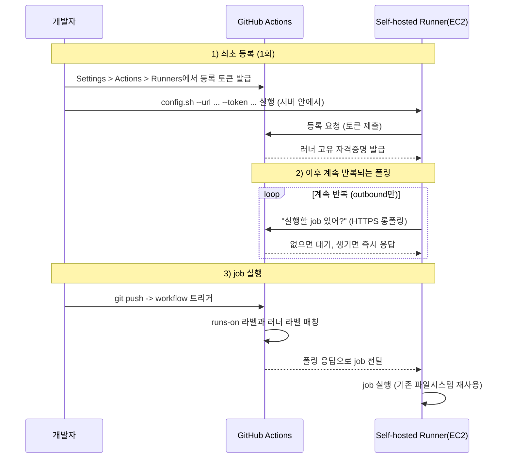
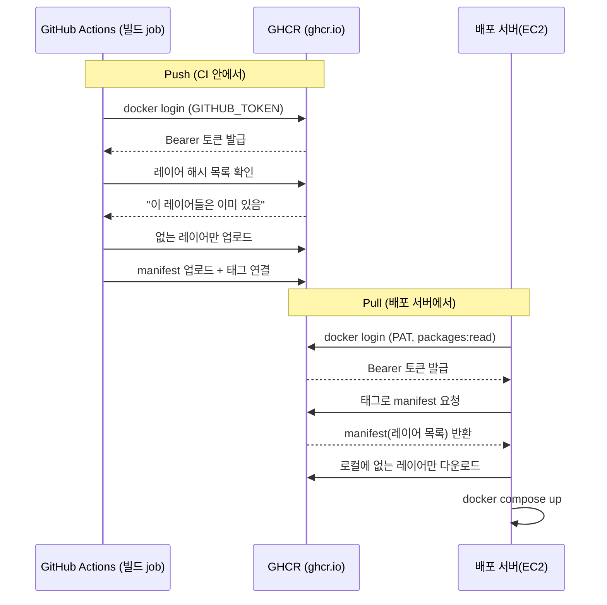

## OOM (Out Of Memory) Killer

리눅스 커널은 메모리가 부족해지면 실행 중인 프로세스마다 badness score를 계산해서 가장 높은 프로세스를 강제 종료한다. 점수는 대략 `RSS(실제 사용 메모리) + swap 사용량 + 페이지 테이블 오버헤드`로 계산되고, `oom_score_adj`(-1000~+1000)로 특정 프로세스를 보호하거나 우선 제거 대상으로 조정할 수 있다. 부모-자식 프로세스 중에서는 자식을 먼저 죽인다.

Docker 빌드(특히 컴파일이 필요한 Java 프로젝트)는 메모리 소모가 크다. 배포 서버가 "배포 대상"과 "빌드 서버" 역할을 겸하면, 무거운 빌드가 배포 중인 프로세스와 메모리를 두고 경쟁하다 OOM Killer에 걸릴 수 있다.

## GitHub-hosted runner vs Self-hosted runner

- **GitHub-hosted runner**: 요청마다 새로 뜨는 임시 VM(`ubuntu-latest` 등). 관리가 필요 없다.
- **Self-hosted runner**: 직접 준비한 서버에 Actions 에이전트를 설치해서 그 서버가 워크플로우를 실행하게 하는 방식. 자원을 팀이 직접 관리해야 하고, 다른 역할과 겸하면 자원 경쟁이 생긴다.

### Self-hosted runner는 실제로 어떻게 동작하나

- **등록(registration)**: 서버에 러너를 설치할 때 `config.sh --url <repo/org> --token <등록 토큰>`으로 1회성 등록 토큰을 사용해 GitHub에 러너를 등록한다. 등록 토큰은 발급 후 짧은 시간만 유효하고, 등록이 끝나면 러너 고유의 자격증명이 로컬에 저장돼 이후 인증에 쓰인다.

<details>
<summary><b>🔍 config.sh 등록은 어디서, 어느 서버에서 하는 건가요?</b></summary>

GitHub 저장소(또는 Organization)의 **Settings → Actions → Runners**에서 "New self-hosted runner"를 누르면, GitHub이 등록 토큰이 채워진 `config.sh` 명령어를 보여준다. 이걸 **러너로 쓸 서버**(이 글에서는 self-hosted 배포 EC2) 안에 직접 SSH로 들어가서 실행하는 것이다. GitHub이 원격으로 설치해주는 게 아니라, 서버 관리자가 그 서버 안에서 직접 실행해야 한다.

</details>

- **Outbound-only 연결**: 러너는 inbound 포트를 열 필요가 없다. 러너 프로세스가 GitHub Actions 백엔드로 아웃바운드 HTTPS 롱폴링(long-polling) 연결을 유지하면서 "실행할 작업이 있는지"를 계속 물어보는 구조다. 방화벽 인바운드 규칙 없이도 사설망/사내 서버에서 동작 가능한 이유가 여기 있다.

<details>
<summary><b>🔍 Outbound-only가 무슨 뜻이고 왜 only인가요?</b></summary>

"outbound"는 서버가 밖으로 나가는 연결, "inbound"는 밖에서 서버로 들어오는 연결이다. 러너는 항상 자기가 먼저 GitHub 쪽으로 연결을 건다(outbound) — GitHub이 러너 서버에 직접 접속해서 "이 작업 해"라고 명령하는 방식(inbound)이 아니다. 그래서 이 서버는 인바운드 방화벽 규칙을 하나도 열 필요가 없다. 사내망이나 방화벽 뒤에 있는 서버도, 바깥으로 나가는 443(HTTPS) 포트만 열려 있으면 러너로 쓸 수 있다. "only"는 이 연결이 outbound 방향으로만 일어난다는 뜻이다.

</details>

<details>
<summary><b>🔍 HTTPS 롱폴링 연결이 뭔가요?</b></summary>

보통 HTTP 요청은 물어보면 바로 답이 오지만, 롱폴링은 답할 게 생길 때까지 서버가 응답을 미루고 연결을 붙잡아둔다. 러너가 GitHub에 "나 줄 job 있어?"라고 요청을 보내면, GitHub은 새 job이 생길 때까지(또는 일정 시간이 지날 때까지) 응답을 보내지 않고 연결을 유지한다. job이 생기면 그 순간 응답으로 job 정보를 돌려준다. 응답을 받으면(또는 타임아웃되면) 러너는 곧바로 또 같은 요청을 보내서 이 과정을 반복한다. 웹소켓처럼 하나의 연결이 영원히 유지되는 게 아니라, "길게 기다리는 요청을 계속 새로 거는" 방식이라고 보면 된다.

</details>

- **라벨 매칭과 작업 배정**: 워크플로우의 `runs-on: [self-hosted, linux, x64]` 같은 라벨과 등록된 러너가 가진 라벨이 일치해야 GitHub이 그 러너에게 job을 배정한다. GitHub-hosted처럼 매번 새 VM을 만드는 게 아니라, 대기 중인 실제 서버 중 라벨이 맞는 걸 골라 job을 전달하는 방식이다.
- **실행 환경이 매번 초기화되지 않는다**: GitHub-hosted runner는 매 job마다 깨끗한 임시 VM이지만, self-hosted runner는 같은 파일시스템·프로세스 환경을 job마다 재사용한다. 이전 job이 남긴 캐시·프로세스·디스크 사용량이 다음 job에 그대로 영향을 준다 — 이 글의 OOM 문제도 결국 "빌드가 끝나도 메모리/디스크 상태가 정리되지 않고 배포 프로세스와 계속 공존한다"는 self-hosted 특성에서 비롯됐다.
- **보안 경계**: self-hosted runner는 워크플로우 안의 임의 코드를 그 서버 권한으로 실행한다. Public 저장소에서 포크된 PR이 self-hosted runner에서 기본적으로 돌지 않게 막아두는 이유도 이것이다 — 워크플로우 코드가 곧 서버에서 실행되는 셸 명령이기 때문이다.

전체 흐름(최초 등록 → 반복 폴링 → job 실행)을 그림으로 보면 다음과 같다.



## Matrix 전략과 max-parallel

`strategy.matrix`에 배열을 넣으면 배열 원소마다 독립된 job이 동시에 생성된다. 동시 실행 수를 제한하고 싶으면 `strategy.max-parallel`로 제한할 수 있다(자원이 제한된 self-hosted 러너를 여러 개 쓸 때 유용하다).

```yaml
strategy:
  max-parallel: 2
  matrix:
    service: [discovery, config, user-service, product-service]
```

직렬로 돌리면 전체 소요 시간이 "서비스 개수 × 개별 빌드 시간"에 가깝고, matrix로 병렬 실행하면 "가장 느린 서비스 1개의 빌드 시간"에 가까워진다.

## 이미지 레지스트리, ECR vs GHCR

CI가 빌드한 이미지를 레지스트리에 올려두면 배포 서버는 pull만 하면 된다. GHCR과 ECR의 실질적 차이는 인증 방식이다.

- **ECR**(Amazon Elastic Container Registry): AWS IAM 기반 인증. AWS 생태계(ECS/EKS 등) 안에서는 편하지만, GitHub Actions에서 쓰려면 별도로 AWS 자격증명을 안전하게 가져와야 한다.

<details>
<summary><b>🔍 ECR이 뭔가요?</b></summary>

AWS(아마존)가 만든 컨테이너 이미지 저장소 서비스다. GHCR이 GitHub 생태계용 이미지 저장소라면, ECR은 AWS 생태계용이라고 보면 된다. 이미지 저장 방식(OCI 규격)은 GHCR과 동일하고, 가장 큰 차이는 인증을 AWS IAM(아마존 계정의 권한 시스템)으로 한다는 점이다. ECS, EKS 같은 AWS 서비스에서 쓰기는 편하지만, GitHub Actions에서 쓰려면 AWS 자격증명을 따로 안전하게 가져오는 절차(OIDC)가 필요하다.

</details>

- **GHCR**(GitHub Container Registry): GitHub Actions 안에서는 자동 발급되는 `GITHUB_TOKEN`만으로 바로 인증된다. 대신 ECR이 기본 제공하는 이미지 취약점 스캔 같은 보안 기능은 없다.

### GHCR push/pull이 실제로 도는 방식

- **저장 모델**: GHCR은 OCI Distribution Spec을 구현한 레지스트리다. Docker Hub, ECR과 이미지 저장 형식이 같다 — 이미지는 레이어(layer, gzip tar 파일)들의 집합이고, 각 레이어는 내용의 SHA256 해시로 식별된다(content-addressable). 매니페스트(manifest)가 "이 이미지는 어떤 레이어들로 구성되는지"를 JSON으로 기술하고, 태그(tag)는 특정 매니페스트를 가리키는 이름표일 뿐이다.

<details>
<summary><b>🔍 OCI Distribution Spec이 뭔가요?</b></summary>

OCI(Open Container Initiative)는 컨테이너 관련 표준을 정하는 단체다. Distribution Spec은 그중에서도 "컨테이너 이미지를 레지스트리에 올리고(push) 받아올(pull) 때 어떤 형식으로, 어떤 API로 주고받을지"를 정한 규격이다. Docker Hub, GHCR, ECR, Harbor 등 회사마다 만든 레지스트리가 다 다르지만, 전부 이 규격을 따르기 때문에 어떤 레지스트리를 쓰든 똑같이 `docker push`/`docker pull` 명령어로 이미지를 주고받을 수 있다. HTTP가 웹의 공통 규격이라 어떤 회사 웹서버든 브라우저로 볼 수 있는 것과 같은 원리다.

</details>

<details>
<summary><b>🔍 SHA256 해시가 뭔가요?</b></summary>

어떤 데이터(파일, 텍스트 등)를 넣으면 항상 정해진 길이(64자리)의 고유한 문자열로 바꿔주는 함수다. 핵심 성질 두 가지: (1) 같은 내용을 넣으면 언제, 어디서 돌려도 항상 똑같은 결과가 나온다. (2) 내용이 단 1비트만 달라져도 완전히 다른 결과가 나온다. 그래서 "이 레이어의 해시값이 레지스트리에 이미 있는 해시값과 같다"는 건 "완전히 같은 내용의 레이어가 이미 있다"는 뜻이 되고, 파일명이 아니라 내용 자체로 중복 여부를 확인할 수 있다.

</details>

<details>
<summary><b>🔍 manifest가 정확히 뭔가요?</b></summary>

이미지 하나를 구성하는 "설명서"에 해당하는 JSON 파일이다. "이 이미지는 레이어 A, B, C로 구성되고, 총 용량은 얼마고, 실행할 때 어떤 명령을 기본으로 돌리는지(CMD)" 같은 메타데이터가 들어있다. `docker pull`을 하면 클라이언트는 제일 먼저 이 manifest부터 받아서 "어떤 레이어들이 필요한지" 확인한 다음, 그 레이어들을 하나씩 받아온다. 태그(예: `latest`, `abc1234`)는 사실 특정 시점의 manifest 하나를 가리키는 이름표일 뿐이다.

</details>

- **인증 흐름**: `docker login ghcr.io -u <user> -p $GITHUB_TOKEN` 실행 시, Docker 클라이언트가 GHCR의 토큰 서비스에 Basic 인증 정보를 보내고 짧은 수명의 Bearer 토큰을 받아온다. 이후 push/pull 요청은 이 Bearer 토큰을 Authorization 헤더에 담아 보낸다. `GITHUB_TOKEN`은 워크플로우 실행 시작 시 GitHub이 자동 발급하는 임시 토큰으로, 워크플로우 YAML의 `permissions: packages: write`로 이 토큰에 GHCR push 권한을 부여한다 — 별도 시크릿을 만들어 저장할 필요가 없다.
- **push 동작**: `docker push` 시 클라이언트는 먼저 각 레이어의 해시를 레지스트리에 물어봐서 이미 존재하는 레이어는 건너뛴다(레이어 중복 제거). 새 레이어만 업로드하고, 마지막에 매니페스트를 업로드한 뒤 태그를 그 매니페스트에 연결한다. 같은 베이스 이미지를 쓰는 여러 서비스는 대부분의 레이어를 공유해서 실제 업로드량이 적다.
- **pull 동작(배포 서버 쪽)**: 배포 서버는 GitHub Actions 컨텍스트 밖이라 `GITHUB_TOKEN`을 쓸 수 없다. 대신 `packages:read` 권한을 가진 PAT(개인 액세스 토큰)로 `docker login`해서 이미지를 pull한다. `docker compose pull`은 태그가 가리키는 매니페스트 다이제스트를 확인해서 로컬에 없는 레이어만 내려받는다.
- **패키지 가시성**: GHCR에 올라간 이미지(패키지)는 기본적으로 그 이미지를 push한 저장소에 연결되고, 저장소의 공개/비공개 설정을 따른다. 별도로 패키지 단위 가시성을 조정할 수도 있다.

push와 pull 전체 구조를 그림으로 보면 다음과 같다.



## OIDC와 id-token: write

GitHub Actions가 워크플로우 실행마다 고유한 JWT를 발급하는 기능이 OIDC다. `aws-actions/configure-aws-credentials`는 이 JWT를 AWS에 제출해서 IAM Role의 임시 자격증명(기본 최대 1시간 유효)으로 교환받는다. 이 JWT를 발급받으려면 워크플로우에 `permissions: id-token: write`가 필요하다. 장점은 AWS 액세스 키를 시크릿으로 저장하거나 로테이션할 필요가 없다는 것이다.

<details>
<summary><b>🔍 id-token: write와 OIDC가 정확히 뭔가요?</b></summary>

워크플로우는 기본적으로 "OIDC용 신원 토큰(JWT) 발급 권한"이 꺼져 있다. `permissions: id-token: write`를 워크플로우 YAML에 써주면 이 권한이 켜지고, 워크플로우 실행 중에 GitHub이 서명한 JWT(이 워크플로우가 진짜 이 저장소, 이 브랜치에서 실행된 게 맞다는 걸 증명하는 디지털 신분증)를 발급받을 수 있게 된다.

OIDC(OpenID Connect)는 "나는 이 사람이 맞다"를 증명하는 신원 인증 표준이다. 여기서는 AWS가 "이 요청이 진짜 우리가 신뢰하기로 한 그 GitHub 저장소/워크플로우에서 온 게 맞는지"를 확인하는 데 쓴다. 순서는 다음과 같다.

1. GitHub이 워크플로우 실행마다 서명된 JWT를 발급한다.
2. 워크플로우가 이 JWT를 AWS STS(Security Token Service)에 제출한다.
3. AWS가 JWT 서명을 검증(GitHub이 진짜 발급한 게 맞는지 확인)하고, 미리 등록해둔 IAM Role과 조건이 일치하면 그 Role의 임시 자격증명(1시간 정도만 유효)을 발급한다.
4. 워크플로우는 이 임시 자격증명으로 AWS 리소스에 접근한다.

장점은 AWS 액세스 키를 미리 만들어서 GitHub Secrets에 저장하고 주기적으로 교체(로테이션)할 필요가 없다는 것이다 — 매번 "신원 확인 후 그때그때 임시 열쇠 발급" 방식이라 키 유출 위험 자체가 줄어든다.

</details>

GHCR로 옮기면서 이 OIDC 교환 절차 자체가 필요 없어졌고, `id-token: write` 대신 GHCR push에 필요한 `packages: write`로 교체됐다.

## SHORT_SHA

Git 커밋 해시 앞 7~8자리. `이미지명:abc1234` 형태로 태그를 붙이면 이 이미지가 정확히 어떤 커밋에서 빌드됐는지 추적할 수 있다. `latest` 태그만 쓰면 "가장 최신"이라는 것만 알 뿐 정확한 시점을 알 수 없어 문제 추적이 어렵다.

---

Sources:
- [Running variations of jobs in a workflow - GitHub Docs](https://docs.github.com/en/actions/how-tos/write-workflows/choose-what-workflows-do/run-job-variations)
- [Configuring OpenID Connect in Amazon Web Services - GitHub Docs](https://docs.github.com/actions/security-for-github-actions/security-hardening-your-deployments/configuring-openid-connect-in-amazon-web-services)
- [aws-actions/configure-aws-credentials](https://github.com/aws-actions/configure-aws-credentials)
- [Linux OOM Killer: A Detailed Guide to Memory Management](https://last9.io/blog/understanding-the-linux-oom-killer/)
- [Amazon ECR vs GitHub Container Registry - cloudonaut](https://cloudonaut.io/versus/container-registry/ecr-vs-github-container-registry/)
- [About self-hosted runners - GitHub Docs](https://docs.github.com/en/actions/how-tos/manage-runners/self-hosted-runners)
- [Working with the Container registry - GitHub Docs](https://docs.github.com/en/packages/working-with-a-github-packages-registry/working-with-the-container-registry)
- [OCI Distribution Specification](https://github.com/opencontainers/distribution-spec)
