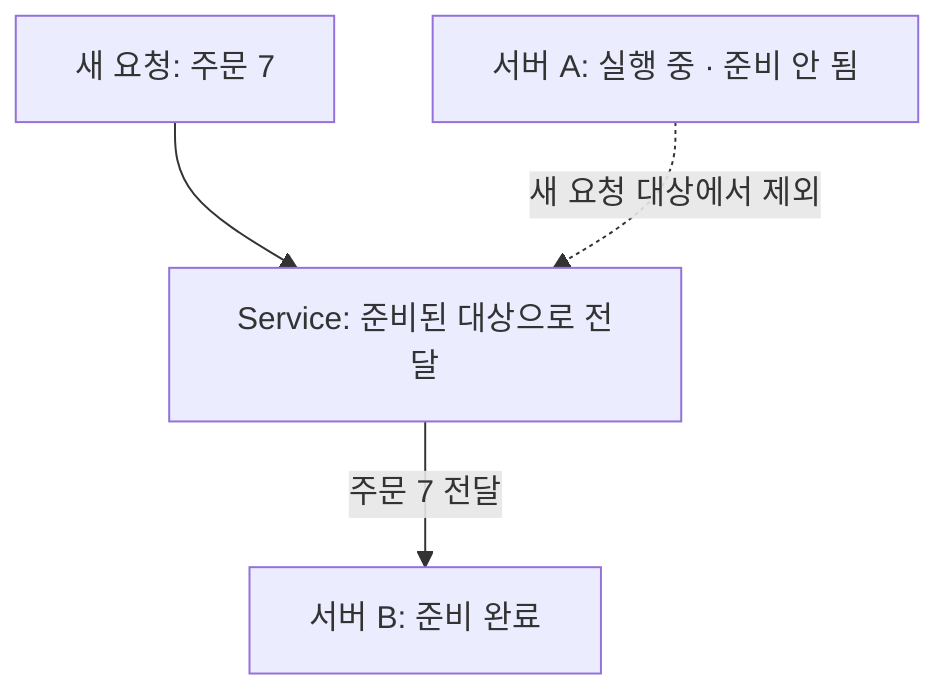

## 01 · 새 서버가 아직 준비 중이다

주문 서버 A는 실행을 시작했지만 아직 요청을 받을 준비가 안 됐다. 서버 B는 준비가 끝났다. 이때 주문 7을 A로 보내고 싶지는 않다. 서버 A/B와 주문 7은 학습용 예시다.

**살아 있는지와 새 요청을 받아도 되는지는 다른 질문이다.** Spring Boot Actuator는 앱의 상태를 확인하는 외부 라이브러리 기능이다. Java 기본 기능이 아니며 앱에 관련 의존성이 있어야 한다.

## 02 · 주문 7이 준비된 서버로 가는 모습

아래는 Kubernetes Service를 통해 새 요청을 보내는 개념 장면이다. **Service**는 여러 서버 중 준비된 대상으로 요청을 보내는 연결 지점이다. 앱이 준비 상태를 정확히 알리고 readiness probe가 이를 확인하며 대상 변경이 반영되었다는 조건이다.



이 장면에서 주문 7은 B로 간다. **readiness**는 “새 요청을 받아도 되는가?”를 확인한다. 실패한 서버를 Service의 준비된 대상에서 제외하는 데 쓴다. readiness 실패 자체는 재시작 명령이 아니며 기존 연결이 즉시 끊긴다는 뜻도 아니다. [Kubernetes probes](https://kubernetes.io/docs/tasks/configure-pod-container/configure-liveness-readiness-startup-probes/)

## 03 · 상태 확인과 조치는 누가 할까?

Actuator는 상태 확인 경로에서 응답한다. Kubernetes의 **probe**는 그 경로를 주기적으로 확인한다. probe는 상태를 확인하는 검사라는 뜻이다. 두 가지 역할을 혼동하지 않는다.

```text
/actuator/health/readiness → 지금 새 요청을 받을 준비가 됐나?
/actuator/health/liveness  → 앱이 스스로 살아 있는 상태인가?
```

**liveness** 검사 실패가 설정된 기준에 도달하면 Kubernetes는 해당 컨테이너를 재시작한다. 컨테이너는 이 예시에서 앱이 실행되는 단위다. 주문 한 건이 실패했다고 곧바로 재시작되는 구조는 아니다. [Kubernetes probes](https://kubernetes.io/docs/tasks/configure-pod-container/configure-liveness-readiness-startup-probes/)

## 04 · UP이 결제 성공 보증은 아니다

상태 확인에서 `UP`을 받아도 다음 주문의 결제가 성공한다는 보증은 아니다. 무엇을 검사하는 상태인지 확인해야 한다. 기본 readiness/liveness 그룹이 외부 결제 API까지 자동 검사하지는 않는다.

외부 API 장애를 liveness에 그대로 넣으면 여러 서버를 함께 재시작해 장애를 키울 수 있다. [Spring Boot의 Kubernetes probes](https://docs.spring.io/spring-boot/reference/actuator/endpoints.html#actuator.endpoints.kubernetes-probes)

<details>
<summary>앱에서는 어떤 의존성과 설정을 확인할까?</summary>

Spring Boot 앱에는 `org.springframework.boot:spring-boot-starter-actuator` 의존성을 사용한다. 아래는 probe 기능을 명시적으로 켜는 앱 설정 예시다. Kubernetes의 probe 등록과는 별개다.

```yaml
management:
  endpoint:
    health:
      probes:
        enabled: true
```

이 설정을 읽으면 앱에 준비 상태와 생존 상태를 확인하는 기능이 활성화된다. Kubernetes가 이를 실제로 검사하려면 배포 설정에도 `readinessProbe`와 `livenessProbe`를 연결해야 한다.

웹 경로는 기본 Actuator 경로를 전제한다. 프로젝트가 포트, 경로, 노출과 보안을 바꾸었다면 함께 확인한다. 상태 확인을 위해 모든 관리 기능을 공개할 필요는 없다. [Actuator endpoints](https://docs.spring.io/spring-boot/reference/actuator/endpoints.html)

로컬 프로젝트의 Spring Boot 설정은 4.1.0이다. 2026-10-08 조사 시 공식 문서의 최신 안정 버전은 4.1.1로 구분했다. 예제 설정을 프로젝트에 새로 적용하거나 업그레이드한 것은 아니다. [Spring Boot 공식 문서](https://docs.spring.io/spring-boot/index.html)

</details>

## 프로젝트에서는 어디를 확인했나?

2026-10-08 로컬 PromptHub의 공통 앱 의존성에 Actuator가 있고, 주문 서비스 배포 설정에 readiness/liveness 경로를 구분한 probe가 있음을 확인했다. 이것은 **설정 확인**이다. 실제 상태 응답, 트래픽 제외와 재시작 결과를 관측한 것은 아니다. 원격 저장소와 배포 상태도 확인 범위 밖이다.

시작 시간을 기다리는 startup probe와 종료 중 요청 보호는 [기존 종료 절차 글](/study/cs/graceful-shutdown-and-traffic-draining)로 이어서 읽는다.

## 자기 말로 답해보기

결제 API가 느리다. 모든 주문 서버의 liveness를 실패시키면 언제나 도움이 될까?

<details>
<summary>답 확인</summary>

아니다. 외부 API의 지연은 주문 서버를 재시작해도 해결되지 않을 수 있다. 서버 자체의 상태와 외부 의존성 실패를 구분하고, Timeout 같은 호출 보호를 따로 검토한다.

</details>

공식 자료와 로컬 설정 확인일: 2026-10-08. 실제 트래픽 제외와 재시작 시험은 이번 예시의 범위가 아니다.
