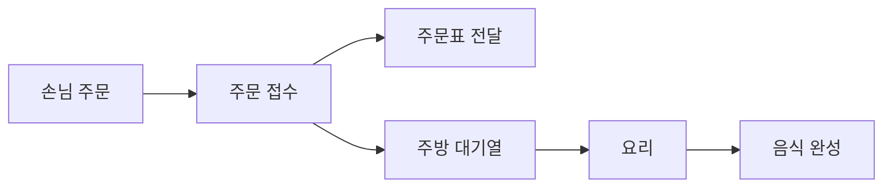
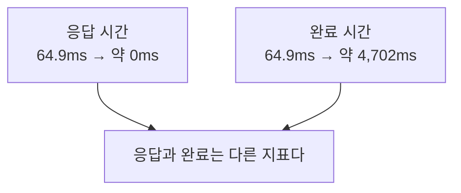
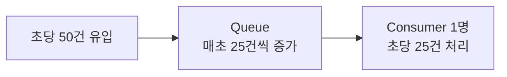
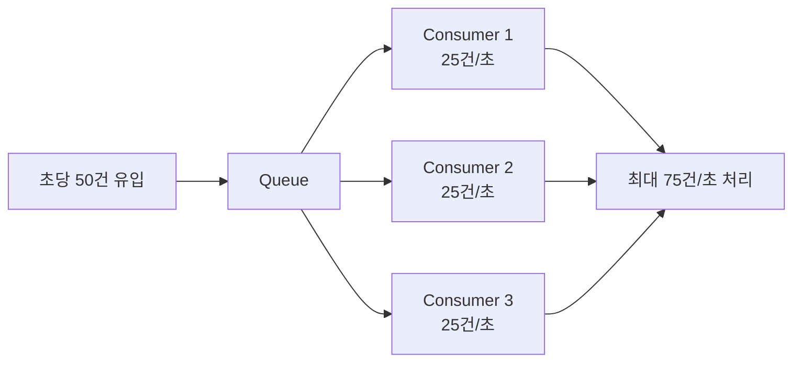
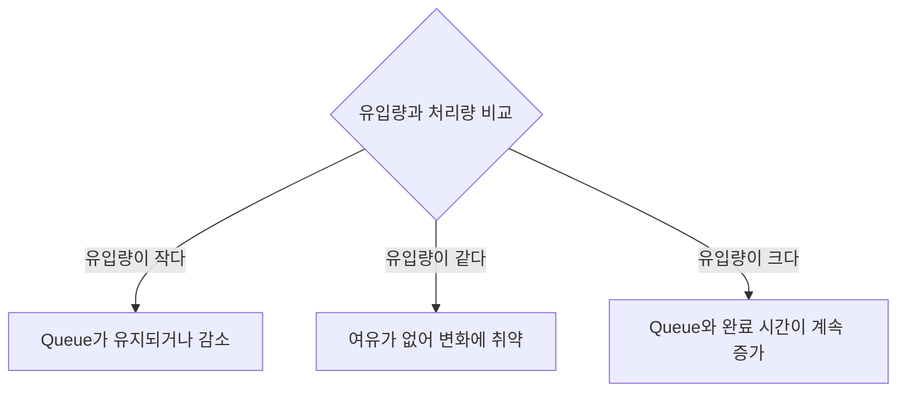

## 주문표를 빨리 줬다고 음식도 빨리 나오는 것은 아니다

손님이 몰리는 식당을 생각해보자.

직원이 주문을 주방에 전달하고 곧바로 주문표를 주면 손님은 빠르게 접수 응답을 받는다. 하지만 주방이 느리다면 음식이 나오는 시간은 계속 늦어진다.



비동기 시스템도 같다.

- 주문표 전달: 요청 접수 응답
- 주방 대기열: 메시지 queue
- 요리사: consumer
- 음식 완성: 실제 작업 완료

빠르게 주문표를 줬다고 요리 속도까지 빨라진 것은 아니다.

## 빨라진 것은 응답이었다

동기 처리에서는 작업이 끝난 뒤 응답한다.

```text
요청 → 작업 처리 → 완료 → 응답
       약 64.9ms
```

비동기 처리에서는 작업을 queue에 넣은 뒤 바로 응답할 수 있다.

```text
요청 → Queue 저장 → 즉시 응답
                       약 0ms

Queue → 대기 → Consumer 처리 → 실제 완료
                              약 4,702ms
```

응답 시간은 `64.9ms`에서 거의 `0ms`로 줄었다. 하지만 실제 작업 완료는 약 `4.7초`까지 늦어졌다.



사용자가 기다리는 것이 접수 확인인지 실제 결과인지에 따라 봐야 할 시간이 달라진다.

## 들어오는 일이 처리 능력보다 많았다

초당 50건의 작업이 들어오고, consumer가 한 건을 처리하는 데 40ms가 걸린다고 가정한다.

```text
1초 = 1,000ms

Consumer 1명의 처리량
= 1,000ms ÷ 40ms
= 초당 25건
```

그런데 초당 50건이 들어온다.

```text
들어오는 양: 초당 50건
처리하는 양: 초당 25건
────────────────────
밀리는 양:   초당 25건
```



Queue는 일을 없애지 않는다. 지금 처리하지 못한 일을 잠시 보관할 뿐이다.

## Consumer를 3명으로 늘리면

Consumer 한 명이 초당 25건을 처리한다면 세 명은 이론적으로 초당 75건을 처리할 수 있다.

```text
25건 × Consumer 3명 = 초당 75건
```



```text
유입량 50건 < 처리량 75건
```

새로 들어오는 작업을 처리하고도 여유가 있으므로 기존에 밀린 작업을 줄일 수 있다.

다만 실제 처리량이 항상 정확히 3배가 되는 것은 아니다. 모든 consumer가 같은 DB connection pool이나 외부 API를 사용한다면 그 자원이 새로운 병목이 될 수 있다.

<details>
<summary><b>🔍 병목이란 무엇인가?</b></summary>

전체 흐름에서 처리 속도를 가장 크게 제한하는 지점이다.

Consumer를 늘려도 DB가 초당 30건만 처리할 수 있다면 시스템 전체 처리량은 초당 30건 근처에서 제한된다. 이때 병목은 consumer 수가 아니라 DB다.

</details>

## 무엇을 측정해야 할까

| 지표 | 확인하는 것 |
|---|---|
| 응답 시간 | 요청을 접수했다는 응답이 얼마나 빨리 왔는가 |
| Queue 대기 시간 | 작업이 처리되기 전까지 얼마나 기다렸는가 |
| 처리 시간 | Consumer가 작업 하나를 처리하는 데 얼마나 걸렸는가 |
| 완료 시간 | 요청부터 실제 결과가 만들어질 때까지 얼마나 걸렸는가 |
| Queue depth·Consumer Lag | 아직 처리하지 못한 작업이 얼마나 쌓였는가 |
| Throughput | 초당 몇 건을 처리할 수 있는가 |

```text
실제 완료 시간
= 접수 시간 + Queue 대기 시간 + 처리 시간
```

## 정리



비동기는 작업 자체를 빠르게 만드는 기술이 아니다.

- 요청 응답과 실제 처리를 분리한다.
- 갑작스러운 요청 증가를 잠시 흡수한다.
- 실패한 작업을 다시 시도할 수 있게 한다.

하지만 처리 능력이 부족하면 지연은 queue 안에 감춰질 뿐이다.

> 비동기로 바꾼 뒤에는 응답 시간만 보지 말고 실제 완료 시간과 밀린 작업량을 함께 확인해야 한다.

## 참고

- [Instagram — 비동기로 바꿨는데 더 느려진 이유](https://www.instagram.com/reel/Dcv0WpGtIl1/)
