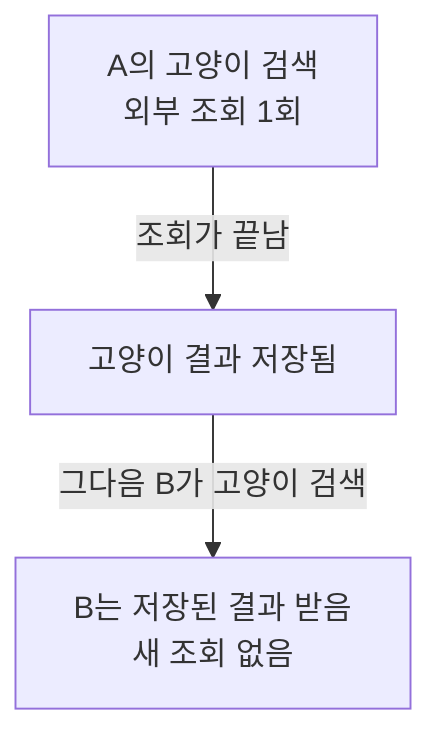
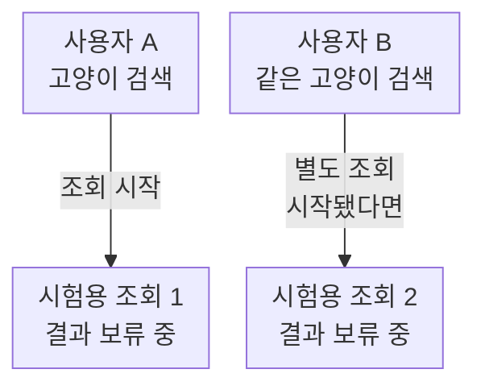

## 01 · 검색하는 사람이 늘면, 같은 일을 반복할 수도 있다

검색 앱은 다른 서비스에 요청을 보내 결과를 만든다. 이것이 외부 API 호출이다. 완성된 결과는 다음에 재사용하려고 저장한다. 이 저장 공간을 캐시라고 한다.

처음 검색할 때, 저장했던 결과가 제거됐을 때, 새 서버가 시작됐을 때는 캐시가 비어 있을 수 있다. 이때 A와 B가 같은 `고양이`를 검색하면 **결과를 기다리는 사람이 두 명인 것과 조회를 두 번 하는 것은 다른 일**이다.

이번에는 같은 결과를 공유해도 되는 검색어, 서버 한 대, 빈 캐시를 가정한다. 느리다는 사실만으로 중복이라고 판단하지 않는다.

## 02 · A가 끝난 뒤 B를 보내면, 빈틈이 보이지 않는다

한 번 검색해서 결과를 받은 다음, 같은 검색을 다시 해봤다.



결과: 조회는 한 번뿐이다. 하지만 **완성된 결과를 재사용한다는 것만 확인했다.** 첫 결과가 나오기 전에 B가 오면 어떻게 되는지는 아직 모른다.

<details>
<summary>내 프로젝트의 기존 테스트는 무엇을 확인했을까?</summary>

PromptHub의 `QueryEmbeddingCacheTest.cachesByKeyword`도 순차 재사용을 확인한다. 같은 키가 동시에 비어 있는 상황은 별도 시험이 필요하다. [확인한 테스트](https://github.com/prgrms-be-adv-devcourse/beadv6_6_3JMT_BE/blob/7a4c363f04ca96c9f641f66906a301cf22055c3b/product-service/src/test/java/com/prompthub/search/application/QueryEmbeddingCacheTest.java)

</details>

## 03 · 결과를 아직 안 준 상태에서, 같은 검색을 겹쳐 보낸다

실제 유료 서비스를 호출하지 않고 **시험용 가짜 조회**를 만든다. 조회가 시작된 횟수는 세되, 허락할 때까지 결과를 내주지 않게 한다. 운영 서비스를 멈추라는 뜻이 아니다.

이렇게 두 검색의 처리 시간이 겹치게 만들면, A의 결과가 저장되기 전에 B가 왔을 때를 확인할 수 있다.



결과: 첫 조회가 끝나기 전에 두 번째 조회도 시작됐다면, 같은 결과를 만드는 작업을 중복 시작한 것이다. 기다리는 요청이 두 개라는 사실만으로는 부족하다.

**독립 학습 예제의 병합 전 시험에서는 실제 조회 시작 2회를 확인했다.** 작업을 합친 구현에서는 같은 진행 중 작업을 100번 요청해도 조회 시작은 1회였다. 이것은 프로젝트나 운영 서버를 대상으로 측정한 결과가 아니다.

<details>
<summary>Java에서는 결과를 어떻게 보류할까?</summary>

`CountDownLatch`는 Java 기본 클래스다. 별도 설치 없이, 정해진 수의 신호가 들어올 때까지 실행을 기다리게 한다. 결과를 저장하는 캐시 라이브러리는 아니다. [Java 21 공식 설명](https://docs.oracle.com/en/java/javase/21/docs/api/java.base/java/util/concurrent/CountDownLatch.html)

시험에서는 시작 확인용 신호와 결과를 풀어주는 신호를 따로 둔다. 다음은 동작을 보여주는 발췌이며, 이 세 줄만으로 전체 시험이 실행되는 것은 아니다.

```java
calls.incrementAndGet(); // 원본 시작 횟수 기록
started.countDown();     // 시작했다고 시험에 알림
await(release);          // 시험이 허가할 때까지 결과 보류
```

`calls`는 동시 실행에서도 안전하게 숫자를 더하는 Java 기본 클래스 `AtomicInteger` 객체다. `incrementAndGet()`은 시작 횟수를 1 늘린다. `started.countDown()`은 조회가 시작됐다는 신호를 보낸다.

`await(release)`는 이 예제에서 직접 만든 함수다. 내부에서 Java의 `release.await(5, TimeUnit.SECONDS)`로 완료 허가를 최대 5초 기다린다. Java 기본 메서드와 예제 함수 이름을 구분한다.

병합 전 시험은 작업 두 개를 시작하고, 둘 다 시작했다는 신호를 받을 때까지 결과를 풀지 않는다. 시험이 끝날 때는 성공·실패와 관계없이 보류한 작업을 풀어준다. 병합 후 시험은 첫 작업 시작을 확인한 뒤 후속 요청이 같은 결과 객체를 받는지 확인한다. 100개 스레드의 동시 부하 시험은 아니다.

</details>

<details>
<summary>왜 sleep으로 타이밍만 맞추지 않을까?</summary>

컴퓨터가 바쁘면 예상한 시간 안에 두 번째 요청이 실행되지 않을 수 있다. 시작·완료 신호를 사용하면 실제로 작업이 겹쳤는지 확인할 수 있다. 단순히 스레드 두 개를 시작했다는 사실만으로 겹침을 증명하지 않는다.

</details>

## 04 · 실제 서비스에서도 시작과 끝을 같이 본다

운영에서는 시험처럼 조회를 붙잡지 않는다. 이미 남긴 실행 기록으로 **같은 서버, 같은 검색어, 같은 결과가 비어 있는 구간**의 조회 시작과 끝을 비교한다. 아래는 실제 운영 로그가 아니라 읽는 방법을 보여주는 예시다.

| 발생 순서 | 검색어 | 관찰한 일 |
| --- | --- | --- |
| 먼저 | 고양이 | 첫 조회 시작 |
| 그 조회가 끝나기 전 | 고양이 | 두 번째 조회 시작 |
| 나중에 | 고양이 | 첫 조회 종료 |

결과: 같은 일을 기다린 것이 아니라, 실제 조회가 겹쳐 시작된 것을 볼 수 있다. 서로 다른 검색어나 서버의 기록을 섞지 않는다. 재시도나 결과 공유 조건도 확인한 뒤 어떤 중복을 줄일지 판단한다.

**느린 응답이나 전체 캐시 적중률만으로는 이런 겹침을 알 수 없다.**

<details>
<summary>캐시 hit 비율이 99%여도 확인해야 할까?</summary>

hit는 저장된 결과를 찾았다는 뜻이다. 조회 1,000번 중 990번 찾으면 hit 비율은 99%다. 하지만 못 찾은 10번이 모두 한 인기 검색어에 겹쳐 몰릴 수도 있다. 전체 평균이 높다는 사실은 특정 검색어의 중복 조회가 없다는 증거가 아니다.

</details>

<details>
<summary>운영 검색어를 그대로 기록해도 될까?</summary>

검색어에 개인정보가 들어갈 수 있다. 재현 시험에는 합성 검색어를 쓰고, 운영에서는 추적 필요성과 접근 범위, 보관 기간을 정한다. 검색어마다 메트릭 label을 만들면 지표의 종류가 끝없이 늘어날 수 있다. 집계 지표와 제한적인 개별 추적을 구분한다.

</details>

## 자기 말로 답해보기

같은 검색을 순서대로 100번 했고 외부 조회는 한 번뿐이었다. 첫 결과가 나오기 전에 100명이 검색해도 조회 한 번으로 합쳐진다고 말할 수 있을까?

<details>
<summary>답 확인</summary>

말할 수 없다. 첫 결과가 만들어지기 전에 같은 키의 요청이 겹치는 시험이 필요하다.

</details>

## 확인한 범위

2026-10-06, PromptHub 코드와 테스트를 `7a4c363f` 기준으로 확인했다. 이 캐시는 TTL 없이 용량과 최근 사용 순서로 항목을 제거한다. 캐시 조회·저장은 각각 보호하지만 그 사이의 원본 호출을 합치는 등록은 없다. [프로젝트 코드](https://github.com/prgrms-be-adv-devcourse/beadv6_6_3JMT_BE/blob/7a4c363f04ca96c9f641f66906a301cf22055c3b/product-service/src/main/java/com/prompthub/search/application/QueryEmbeddingCache.java)

원본 호출 2회는 Java 21 독립 학습 예제에서 실행한 결과다. 프로젝트 코드 자체의 실행 결과나 운영 장애 발생을 증명하지 않는다. [다음 글에서는 조회 하나를 함께 기다리는 모습을 본다](/study/cs/single-flight-shared-future).
