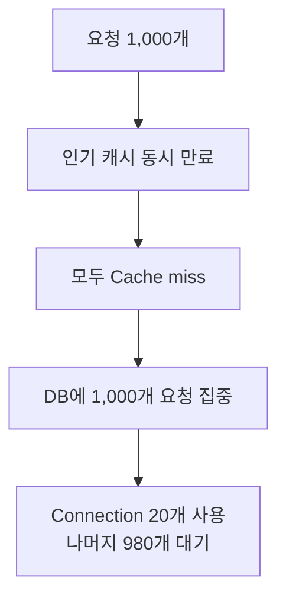
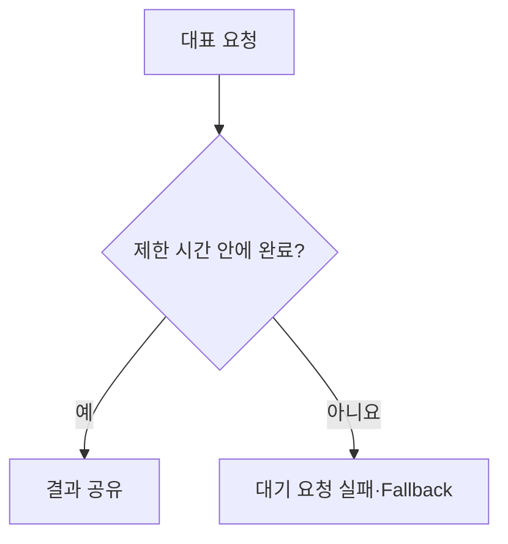
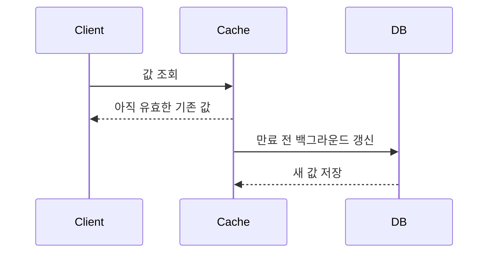
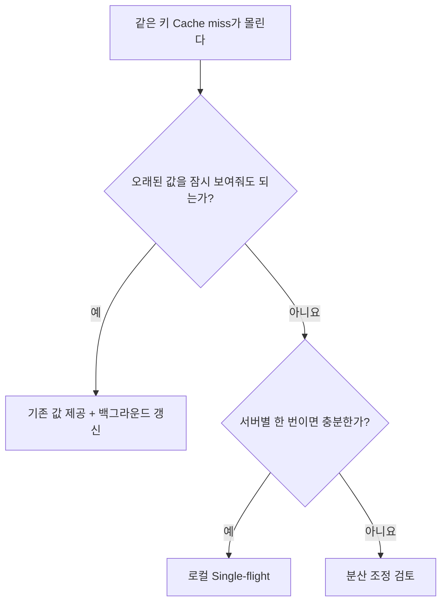

## 인기 상품표가 사라지자 모두 창고로 달려갔다

인기 상품의 재고를 적어둔 안내판이 있다고 생각해보자. 평소에는 손님 1,000명이 와도 안내판만 보면 되지만 안내판이 만료되는 순간 모두 창고 직원에게 재고를 물으면 창고가 마비된다.

```text
평소
요청 1,000개 → Cache hit → DB 호출 0

만료 순간
요청 1,000개 → Cache miss → DB 호출 1,000
```



**Cache Stampede**는 많은 요청이 같은 캐시의 만료를 동시에 만나 원본 저장소로 한꺼번에 몰리는 현상이다. 캐시가 없어서가 아니라 인기 캐시가 한순간에 사라져서 발생한다.

영상에서는 커넥션이 20개인 DB에 요청 1,000개가 몰리면서 p99 응답 시간이 3.1초를 넘었다.

<details>
<summary><b>🔍 p99는 무엇인가?</b></summary>

응답 시간을 빠른 순서로 정렬했을 때 요청의 99%가 그 값 이하로 끝났다는 뜻이다. 평균이 빠르더라도 일부 사용자가 매우 오래 기다리는 문제를 찾는 데 사용한다.

</details>

## 방법 1 — 같은 조회는 한 번만 실행한다

**Single-flight**는 같은 키에 대한 작업이 이미 실행 중이면 새 작업을 시작하지 않고 기존 작업의 결과를 함께 기다리는 방식이다.


영상에서는 DB 호출이 `1,000회 → 1회`, p99가 `3.1초 → 82.5ms`로 줄었다. 첫 번째 요청은 DB 조회를 기다려야 하지만 중복 조회가 사라져 DB와 커넥션 풀을 보호한다.

## 서버가 여러 대라면 범위가 달라진다

프로세스 메모리에서 구현한 Single-flight는 같은 서버에 들어온 요청만 합친다.

```text
서버 5대 × 서버별 대표 조회 1회
= DB 조회 최대 5회
```

DB 호출이 서버 수만큼 발생해도 감당할 수 있다면 로컬 Single-flight로 충분할 수 있다. 클러스터 전체에서 한 번만 실행해야 한다면 Redis 등의 분산 락을 고려할 수 있지만 락 만료, 소유권 확인과 장애 시 해제 문제도 함께 해결해야 한다.

## 대표 요청이 실패하면 어떻게 할까

Single-flight의 대표 요청이 끝나지 않으면 나머지 요청도 함께 기다린다.



그래서 다음 제한이 필요하다.

- DB 조회 timeout
- 대기 요청 timeout
- 실패 결과를 얼마나 공유할지에 대한 정책
- 대표 작업 종료 후 실행 상태 정리
- 오래된 캐시를 임시로 반환하는 fallback

Single-flight는 중복 실행을 합치는 장치이지 원본 조회 실패를 해결하는 장치는 아니다.

## 방법 2 — 만료 전에 일부 요청이 갱신한다

캐시가 완전히 만료되기 전에 일부 요청이 새 값을 준비한다.



| 방법 | 장점 | 비용 |
|---|---|---|
| Single-flight | 어떤 키에도 적용하기 쉬움 | 첫 요청과 나머지가 결과를 기다림 |
| 만료 전 갱신 | 만료 순간의 기다림을 줄임 | 아직 쓸 수 있는 값을 미리 갱신 |
| 오래된 값 제공 후 갱신 | 빠르게 응답 가능 | 잠시 오래된 데이터를 보여줌 |

## 모든 키가 동시에 만료되지 않게 한다

많은 키에 똑같은 TTL을 설정하면 같은 시각에 함께 만료될 수 있다. TTL에 작은 무작위 값인 **Jitter**를 더하면 만료 시점을 분산할 수 있다.

```text
기본 TTL: 10분
Jitter:   0~2분
실제 TTL: 10~12분
```

Jitter는 하나의 인기 키에 1,000개 요청이 몰리는 문제를 단독으로 해결하지 않는다. 여러 키가 동시에 만료되는 부하를 분산하는 보조 수단이다.

## 어떤 방법을 선택할까



```text
상품 설명·인기 순위 → 잠시 오래된 값 허용 가능
재고·권한          → 오래된 값이 위험할 수 있음
```

> 캐시 만료는 데이터 하나가 사라지는 사건이 아니라 같은 원본 조회가 동시에 시작될 수 있는 부하 사건이다.

## 참고

- [Instagram — 캐시가 사라지는 순간 DB가 몰린다](https://www.instagram.com/reel/DcoMjvsNx7h/)
- [Go singleflight](https://pkg.go.dev/golang.org/x/sync/singleflight)
- [Redis — EXPIRE](https://redis.io/docs/latest/commands/expire/)
