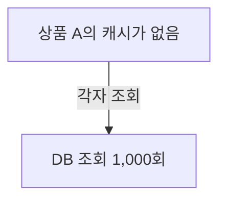
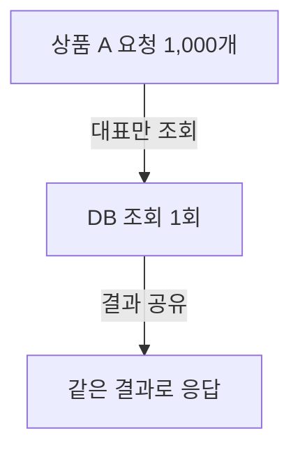

## 01 · 같은 상품을 1,000명이 보고 있다

인기 페이지가 평소에는 빠른데 캐시가 비는 순간만 느려진다면, 같은 데이터를 찾는 요청들이 원본을 각자 호출하는지 확인해볼 만하다. 원본은 DB일 수도, 검색어를 수치 벡터로 바꾸는 외부 API일 수도 있다. 캐시가 처음부터 비어 있거나 용량 때문에 항목이 제거된 직후에도 같은 일이 생길 수 있다.

느린 응답만으로 이 문제라고 단정하지 않는다. **같은 키의 cache miss와 중복 원본 호출이 같은 시간대에 겹치는지**가 확인할 단서다.

매번 DB에서 상품 설명을 가져오면 일이 반복된다. 그래서 조회 결과의 복사본을 가까운 곳에 잠시 보관한다. 이 임시 보관소가 캐시(Cache)다.

이번 예시는 **서버 1대, 상품 A, 거의 동시에 들어온 조회 1,000개**다. 각 조회는 DB에 한 번 요청하며, 갱신이 끝나기 전에 모두 캐시를 확인한다고 가정한다. 숫자는 동작을 이해하기 위한 예시다.

> 캐시에 상품 A가 있으면 → 1,000개 요청 모두 복사본을 읽는다. DB 조회는 **0회**다.

캐시를 얼마 동안 사용할지 정한 수명을 **TTL**이라고 한다. Redis에서는 [EXPIRE](https://redis.io/docs/latest/commands/expire/)로 키의 만료 시간을 설정할 수 있다.

## 02 · 복사본이 만료됐다

상품 A의 복사본이 사라졌다. 아직 새 복사본은 준비되지 않았다.

요청마다 “캐시에 없네? DB에서 가져오자”라고 판단하면 어떻게 될까?

**결과: 상품은 하나인데 DB에 조회 1,000개가 몰린다.**

캐시에 값이 없는 상태가 **cache miss**다. 같은 값의 miss를 여러 요청이 함께 만나 원본 조회가 몰리는 현상을 **Cache Stampede**라고 한다. 새 복사본을 만드는 시간이 길수록 그동안 요청이 더 쌓일 수 있다. [연구 근거](https://cseweb.ucsd.edu/~avattani/papers/cache_stampede.pdf)

DB 연결이 20개이고 한 조회가 연결 하나를 사용한다면, 다른 작업이 없다는 가정에서도 한 번에 20개만 연결을 사용할 수 있다. 나머지는 연결을 기다리거나, 제한 시간·대기열 정책에 따라 실패할 수 있다.

## 03 · 한 명만 가져오고, 나머지는 기다린다

첫 요청이 상품 A를 조회하는 동안 뒤의 요청은 새 조회를 시작하지 않는다. 이미 진행 중인 결과를 함께 기다린다.

같은 작업을 하나로 합치는 이 방식을 **Single-flight**라고 한다. 여기서 키(key)는 “어떤 결과를 함께 써도 되는가”를 구분하는 이름이다. 이번 키는 상품 A다.

**결과: 위 조건에서 DB 조회는 1,000회 → 1회다.** 대표 요청이 가져온 값으로 캐시를 채우고, 기다리던 요청도 그 값을 받는다.

[Go의 singleflight 공식 문서](https://pkg.go.dev/golang.org/x/sync/singleflight#Group.Do)도 같은 키의 진행 중 호출을 하나로 합치고, 중복 호출이 원래 호출의 결과를 기다리는 동작을 설명한다.

같은 상품이면 무조건 합쳐도 될까?

사용자마다 가격이나 공개 권한이 다르면 상품 ID만 같은 요청을 합쳐서는 안 된다. 키에는 결과를 바꾸는 조건이 들어가야 한다. 서로 다른 결과가 필요한 요청은 다른 작업으로 구분한다.

Single-flight는 진행 중인 작업을 합친다. 끝난 결과를 계속 보관하는 캐시 역할은 별도로 필요하다.

## 04 · 서버가 5대면 조회도 하나일까?

각 서버의 메모리에서만 요청을 합치면, 다른 서버가 진행 중인 조회는 알 수 없다.

> 같은 상품 A를 서버 5대가 함께 조회하면 → 이 예시에서는 **서버별 1회, 총 최대 5회**다.

이는 각 서버에서 요청들이 하나의 진행 중 조회로 합쳐지고, 재시도나 추가 조회가 없다는 조건이다. 서버 전체에서 영원히 한 번만 조회한다는 보장은 아니다.

대표 조회가 실패하면 기다리던 요청도 실패할 수 있다. 원본 조회와 대기에 제한 시간을 두고, 실패 후 진행 중 상태를 정리해야 한다.

모든 서버를 합쳐 1회로 줄여야 한다면?

서버끼리 “누가 갱신하고 있는지”를 공유하는 조정이 필요하다. Redis 분산 락도 후보지만, 소유자 확인, 락 만료, 작업 중 서버 장애를 함께 다뤄야 한다. 자세한 조건은 [Redis 공식 분산 락 문서](https://redis.io/docs/latest/develop/clients/patterns/distributed-locks/)에서 확인한다.

먼저 서버별 한 번의 조회를 원본 저장소가 감당할 수 있는지 측정한 뒤, 추가 조정이 필요한지 판단한다.

## 05 · 기다리는 동안 옛 값을 보여줘도 될까?

상품 설명은 서비스 정책에 따라 잠시 이전 값을 보여줄 수 있다. 이 경우 기존 값으로 응답하면서 뒤에서 새 값을 준비할 수 있다. **오래된 값 제공 후 갱신** 방식이다.

만료 **전에** 새 값을 준비하는 조기 갱신도 가능하다. 두 방식 모두 갱신 작업이 중복되지 않게 제어해야 한다.

| 기다리는 동안의 선택 | 필요한 판단 |
| --- | --- |
| 새 값을 기다린다 | 기다릴 수 있는 시간과 실패 응답 |
| 이전 값을 보여준다 | 얼마나 오래된 값까지 허용할지 |

재고나 권한처럼 오래된 값이 잘못된 판단으로 이어지는 데이터는 별도 검증이 필요하다. 예시의 상품 설명 캐시 정책을 그대로 적용하지 않는다.

TTL을 조금씩 다르게 주면 해결될까?

여러 키에 같은 TTL을 주면 비슷한 시점에 함께 만료될 수 있다. TTL에 무작위 차이를 주는 **Jitter**는 여러 키의 만료 시점을 분산하는 데 도움이 된다.

하지만 상품 A라는 **한 키**가 만료된 순간의 중복 조회는 그대로 생길 수 있다. 같은 키 요청을 합치는 장치와 여러 키의 만료를 흩뜨리는 장치는 해결하는 범위가 다르다.

## 이제 자기 말로 답해보기

서버 3대가 같은 상품 A를 조회한다. 각 서버에서 100개 요청이 하나의 진행 중 조회로 합쳐지고, 재시도는 없다.

**서버별 Single-flight를 쓴다면 DB 조회는 전체 1회일까, 최대 3회일까? 왜 그럴까?**

답 확인

최대 3회다. 각 서버 안에서는 100개 요청이 1회로 합쳐지지만, 서버끼리 진행 중인 작업을 공유하지 않기 때문이다.

대표 조회가 끝나지 않으면 나머지도 기다린다. 따라서 호출 수를 줄였다는 사실만으로 응답 시간이 반드시 짧아지거나 장애가 해결되는 것은 아니다.

## 프로젝트에서는 어디를 확인할까?

PromptHub의 [2026-08-14 품질 점검](/quality/prompthub/product-service-2026-08-14)에는 검색어를 수치 벡터로 바꾸는 외부 호출에서, 같은 검색어의 동시 cache miss가 중복 호출로 이어질 수 있다는 발견이 있다.

2026-10-06에 확인한 프로젝트 코드도 캐시 조회와 저장을 각각 보호하지만, 조회 결과가 없는 요청들은 외부 호출을 따로 시작한다. 이 캐시는 TTL 대신 최대 1,000개 용량과 최근 사용 순서로 항목을 관리한다. 같은 키의 동시 miss 위험은 TTL 만료에만 한정되지 않는다. [확인한 코드](https://github.com/prgrms-be-adv-devcourse/beadv6_6_3JMT_BE/blob/7a4c363f04ca96c9f641f66906a301cf22055c3b/product-service/src/main/java/com/prompthub/search/application/QueryEmbeddingCache.java)

DB 대신 외부 API에서도 같은 질문을 할 수 있다. **“같은 결과를 기다리는 요청들이 각자 원본을 호출하고 있는가?”** 코드에서 발견한 위험이며, 운영에서 실제 발생한 장애나 측정된 성능 개선을 뜻하지 않는다.

다음 [같은 검색어의 중복 원본 호출 확인하기](/study/cs/cache-miss-duplicate-load-diagnosis)에서는 첫 결과가 끝나기 전에 요청을 겹쳐 보내 이 문제를 확인한다. 이어서 [진행 중 결과를 함께 기다리는 Java 구현](/study/cs/single-flight-shared-future)과 실행 결과를 살펴본다.

조사 근거와 기존 참고 자료

기술적 주장은 2026-10-06에 Redis 공식 문서, Go singleflight 문서와 Cache Stampede 연구를 다시 확인했다. Go API는 요청 병합 동작을 설명하는 참고 구현이며, 이 프로젝트가 Go 라이브러리를 사용한다는 뜻은 아니다.

기존 글의 [Instagram 참고 영상](https://www.instagram.com/reel/DcoMjvsNx7h/)은 설명 소재의 출처로 남긴다. 이번 개편에서는 영상의 성능 수치를 다시 검증하지 못해 사용하지 않았다.

