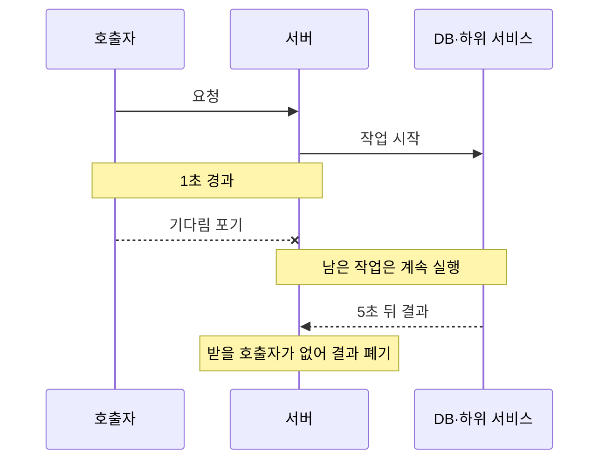
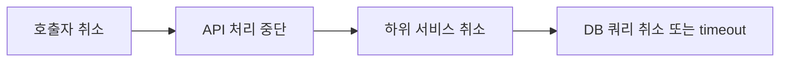

## 타임아웃이 발생해도 작업은 남을 수 있다

외부 API 호출에 1초 타임아웃을 설정했다고 가정한다. 호출자는 1초 후 기다리기를 포기하고 응답을 반환할 수 있다. 하지만 서버 내부에서 시작한 작업이나 그 서버가 다시 호출한 하위 작업까지 자동으로 종료되는 것은 아니다.

```text
클라이언트
  └─ API 서버
       └─ 하위 서비스
            └─ 데이터베이스
```

클라이언트가 기다리지 않는데도 하위 작업이 계속 실행되면 thread, connection, CPU 같은 자원이 불필요하게 사용된다. 이런 작업이 쌓이면 다른 정상 요청에도 영향을 줄 수 있다.

따라서 다음 두 동작을 구분해야 한다.

- **Timeout**: 결과를 얼마나 기다릴 것인지 제한한다.
- **Cancellation**: 결과가 더는 필요하지 않다는 사실을 실행 중인 작업에 알린다.

## 검색 화면을 닫은 경우를 생각해보자

사용자가 상품 검색을 실행한 직후 다른 화면으로 이동했다고 가정한다.

```text
1. 사용자가 "무선 이어폰"을 검색한다.
2. API 서버가 검색 서비스와 추천 서비스를 호출한다.
3. 검색 결과가 오기 전에 사용자가 화면을 닫는다.
4. 브라우저는 더 이상 검색 결과를 기다리지 않는다.
```

사용자가 화면을 닫았으므로 검색 결과는 더 이상 필요하지 않다. 그러나 취소가 전파되지 않으면 서버에서는 다음 작업이 계속될 수 있다.

```text
브라우저: 요청 취소
API 서버: 검색 결과를 기다리는 중
검색 서비스: OpenSearch 조회 중
추천 서비스: 추천 점수 계산 중
데이터베이스: 사용자 행동 이력 조회 중
```

API 서버의 timeout만 1초로 설정되어 있다면 API 서버는 1초 후 응답을 포기한다. 하지만 추천 계산이 5초짜리 작업이라면 추천 서비스는 남은 4초 동안 아무도 사용하지 않을 결과를 계속 계산할 수 있다.

취소 신호가 전파되면 각 계층은 결과가 필요 없다는 사실을 알고 가능한 작업을 중단할 수 있다.

```text
브라우저 요청 취소
  → API 서버 처리 중단
  → 검색·추천 서비스 호출 취소
  → DB·OpenSearch 요청 취소 또는 자체 timeout
```

이 예시에서 중요한 것은 “응답을 받지 않는다”와 “작업을 멈춘다”가 서로 다른 사건이라는 점이다.

## 응답 시간이 1초여도 서버는 계속 바쁠 수 있다

놀이공원에서 기다리던 사람이 줄을 이탈해도 직원이 그 사실을 모르면 이미 시작한 준비 작업은 계속된다. 타임아웃도 비슷하다. 호출자는 기다리기를 그만두지만, 호출받은 서버의 작업까지 자동으로 멈추지는 않는다.

초당 20건의 요청이 들어오고 작업 하나에 5초가 걸린다고 가정하자.

```text
요청 유입: 초당 20건
작업 시간: 5초
타임아웃: 1초

20건/초 × 5초 = 최대 약 100건이 동시에 실행
```



영상의 실험에서는 클라이언트 응답이 1초로 유지되는 동안 서버 내부에 작업 92개가 남았고, 버려진 작업 시간을 합치면 441초였다. 취소를 아래 계층까지 전달한 뒤에는 실행 중인 작업이 20개, 버려진 시간은 2초 수준으로 줄었다. 하지만 호출자가 본 응답 시간은 전과 똑같이 1초였다.

| 함께 볼 지표 | 확인할 문제 |
|---|---|
| 실행 중인 작업 수 | 끝난 요청의 작업이 남아 있는가 |
| Thread pool 대기열 | 실행 자리를 기다리는 작업이 쌓이는가 |
| 사용 중인 DB connection | 취소된 요청이 connection을 계속 점유하는가 |
| 취소된 작업 수 | 취소 신호가 실제 작업까지 도달하는가 |
| 버려진 작업 시간 | 아무도 사용하지 않을 결과에 쓴 시간은 얼마인가 |

## 취소 신호를 아래로 전달한다

취소는 실행 중인 코드를 강제로 제거하는 기능이라기보다, 작업을 중단해도 된다는 신호다. 상위 요청이 취소되면 그 요청에서 파생된 함수, 비동기 작업, 외부 호출에도 같은 신호를 전달해야 한다.



언어와 실행 환경에 따라 전달 수단은 다르다.

- Go는 `context.Context`에 deadline과 취소 신호를 담아 호출 경계를 따라 전달한다.
- Java의 `Future.cancel(true)`는 실행 중인 thread에 interrupt를 시도할 수 있다.
- JavaScript는 `AbortController`가 만든 `AbortSignal`을 비동기 API에 전달한다.

이름은 다르지만 핵심은 같다. 상위 계층이 취소 사실을 알고 있는 데서 끝내지 않고 실제 작업을 수행하는 계층까지 전달하는 것이다.

취소 전파가 필요한 이유는 결과가 필요 없는 작업에 thread, connection과 CPU를 계속 쓰지 않기 위해서다.

```text
사용자가 화면을 닫음
→ 브라우저가 요청 취소
→ API 서버가 취소 감지
→ 하위 서비스 호출 취소
→ DB 쿼리·외부 API 호출 취소
→ Thread와 Connection 반환
```

요청에서 파생되는 모든 작업에 같은 취소 신호나 deadline을 전달하고, 각 작업은 신호를 지원하는 API를 사용하거나 안전한 지점에서 상태를 확인해야 한다.

| 환경 | 전달 수단 | 하위 작업이 할 일 |
|---|---|---|
| Go | `context.Context` | 함수와 DB·HTTP 호출에 context 전달 |
| Java | interrupt, `Future.cancel(true)` | interrupt 상태를 확인하고 안전하게 종료 |
| JavaScript | `AbortSignal` | `fetch` 등 하위 호출에 같은 signal 전달 |
| HTTP·gRPC | 연결 종료, deadline | 서버와 하위 client가 취소를 감지하도록 설정 |
| DB | query timeout, statement timeout | 오래 실행되는 쿼리를 DB에서 중단 |

<details>
<summary><b>🔍 모든 작업을 취소해도 되는가?</b></summary>

검색·미리보기·추천처럼 결과가 필요 없어지면 버릴 수 있는 작업은 가능한 빨리 중단한다. 반면 결제 승인이나 주문 저장처럼 상태를 변경하는 작업은 중간에 끊으면 데이터가 불완전해질 수 있다.

이런 작업은 안전한 지점에서만 중단하거나 끝까지 처리한 뒤 실패 시 보상 작업을 수행해야 한다. 핵심은 호출자가 포기했다고 무조건 종료하는 것이 아니라, 취소해도 안전한 작업까지 신호를 전달하는 것이다.

</details>

## 취소 신호를 받은 코드도 협조해야 한다

취소 신호를 보냈다고 작업이 반드시 즉시 끝나는 것은 아니다.

Java의 interrupt는 thread를 강제로 종료하지 않는다. 실행 중인 코드가 `InterruptedException`을 처리하거나 interrupt 상태를 확인해야 중단할 수 있다. `Future.cancel(true)`도 실행 중인 작업의 종료를 보장하는 명령이 아니라 중단을 시도하는 요청이다.

JavaScript의 `AbortSignal`도 호출 대상 API가 signal을 지원해야 효과가 있다. 직접 작성한 긴 연산이라면 코드가 `signal.aborted`를 확인하고 빠져나오는 처리가 필요하다.

<details>
<summary><b>🔍 협력적 취소란 무엇인가?</b></summary>

작업을 외부에서 강제로 제거하지 않고, 실행 중인 코드가 안전한 지점에서 취소 상태를 확인한 뒤 스스로 종료하는 방식이다. 자원을 안전하게 정리할 수 있지만 코드가 신호를 확인하지 않으면 작업은 계속 실행된다.

</details>

## 신호를 확인할 수 없는 구간은 자체 timeout으로 제한한다

짧은 작업을 반복하는 코드는 반복 사이에 취소 상태를 확인할 수 있다. 반면 하나의 긴 DB 쿼리에 제어가 넘어가 있으면 애플리케이션 코드가 취소 상태를 확인할 기회가 없다.

이런 구간에는 해당 계층이 제공하는 중단 수단이 필요하다.

- HTTP·gRPC 클라이언트의 호출 deadline
- JDBC driver의 query timeout과 취소 지원
- PostgreSQL의 `statement_timeout`
- 외부 API별 timeout

```text
전체 요청 timeout
  ├─ 서비스 간 호출 timeout
  └─ DB statement timeout
```

일반적으로 안쪽 계층의 timeout을 바깥쪽보다 짧게 설정하면, 상위 요청이 먼저 포기하기 전에 하위 계층이 실패를 감지하고 자원을 정리할 시간을 확보할 수 있다.

## 정리

1. 상위 요청의 취소 신호를 하위 호출로 전파한다.
2. 실행 중인 코드는 취소 신호를 확인하고 안전하게 종료한다.
3. 신호를 직접 확인할 수 없는 DB·외부 시스템에는 해당 계층의 timeout을 설정한다.
4. timeout 이후 thread와 connection이 실제로 반환되는지도 확인한다.

대기 시간을 제한하는 것과 실행을 중단하는 것은 별개의 책임이다.

## 참고

- [Instagram — 취소를 어떻게 전파하나](https://www.instagram.com/reel/DcyRh52Np-G/)
- [Instagram — 타임아웃을 걸었는데 서버가 죽는 이유](https://www.instagram.com/reel/DcvzmLitmOA/)
- [Go — Canceling in-progress operations](https://go.dev/doc/database/cancel-operations)
- [Java Future](https://docs.oracle.com/javase/8/docs/api/java/util/concurrent/Future.html)
- [Java Interrupts](https://docs.oracle.com/javase/tutorial/essential/concurrency/interrupt.html)
- [MDN AbortSignal](https://developer.mozilla.org/en-US/docs/Web/API/AbortSignal)
- [PostgreSQL statement_timeout](https://www.postgresql.org/docs/current/runtime-config-client.html)
