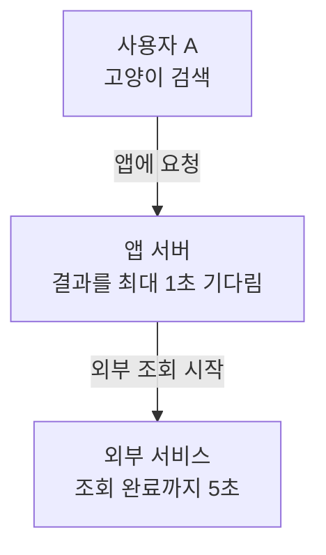
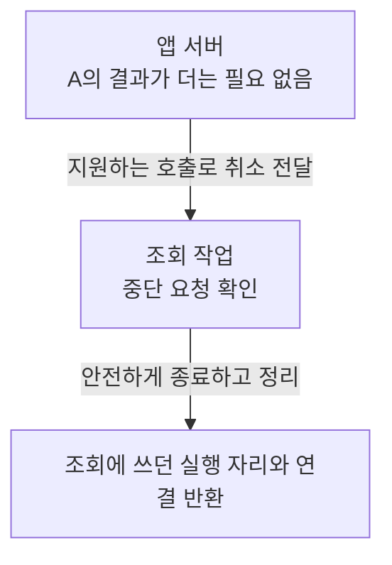
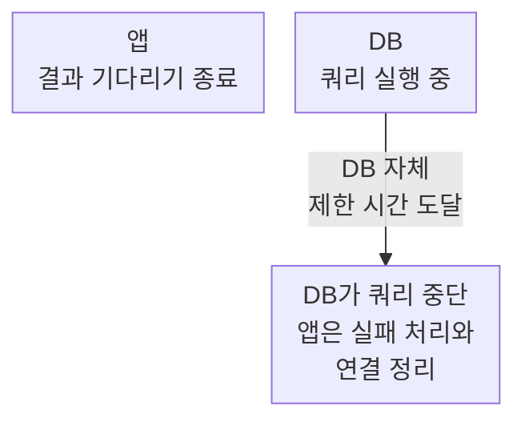
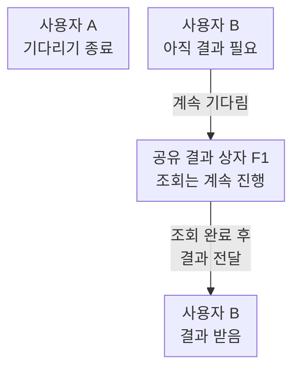

## 01 · 1초만 기다리겠다고 정했다

사용자 A가 `고양이`를 검색했다. 앱 서버는 다른 서비스에 검색 결과를 요청했다. 조회가 5초 걸리지만, 앱은 대기를 1초로 제한했다고 하자. 설명을 위한 가정이며 실측값은 아니다.

결과: **앱이 기다릴 시간은 1초지만, 조회 자체가 1초 안에 끝나도록 바뀐 것은 아니다.** 기다리는 시간을 제한하는 것이 타임아웃(Timeout)이다. 설정 대상에 따라 대기, 연결, 쿼리 등 제한하는 범위가 다르다.

## 02 · 기다림은 끝났지만 조회는 계속될 수 있다

1초가 지나 앱은 대기를 끝냈다. 하지만 이 대기 제한만 설정했다면 외부 서비스는 A가 결과를 포기한 사실을 모를 수 있다.

| 같은 시점 | A의 검색을 처리하는 상태 |
| --- | --- |
| 0초 | 앱은 기다리는 중, 외부 서비스는 조회 중 |
| 1초 | 앱은 기다림 종료, 외부 서비스는 아직 조회 중 |
| 5초 | 외부 조회 완료. 결과를 쓸 곳이 없다면 낭비 |

결과: **응답을 빨리 끝냈다고 서버의 일도 줄었다고 말할 수 없다.** 쓸모없어진 조회가 쌓이면 실행 자리가 계속 바빠지고, 다른 요청이 기다릴 수 있다.

화면을 닫은 경우도 비슷하다. 다만 화면을 닫았다는 이유만으로 브라우저부터 외부 서버까지 취소가 자동 전달된다고 가정하면 안 된다.

## 03 · 필요 없어진 작업에 중단 요청을 전달한다

다른 사람이 기다리지 않고, 나중에도 재사용하지 않을 검색이라면 “이 작업은 더는 필요 없다”고 알려준다. 이것이 취소(Cancellation)다. 강제로 코드를 지우는 것이 아니라 **안전하게 중단해달라는 요청**이다.

결과: 작업이 중단 요청을 지원하고 처리해야 자원이 돌아온다. 신호를 보냈다는 기록만으로 종료를 확인한 것은 아니다.

실제 변경 위치도 여기서 정해진다. 앱의 대기 시간만 바꾸는 것이 아니라 **외부 호출을 시작하는 코드와 그 호출을 실행하는 쪽의 중단 지원**을 확인해야 한다.

언어마다 취소를 전달하는 방법은?

각 수단은 만능 취소 기능이 아니다. 실행 환경과 하위 API의 동작을 확인한다.

| 수단의 출처 | 역할과 확인할 점 |
| --- | --- |
| Go 기본 `context` 패키지 | 취소와 종료 시한을 전달한다. DB·HTTP 호출이 그 context를 사용해야 한다. |
| Java 기본 `Future` 인터페이스 | 작업을 관리하는 구현에 취소를 요청한다. 실행 중단 방식은 구현에 따라 다르다. |
| Java 기본 `CompletableFuture` 클래스 | 결과를 받을 객체다. `cancel(true)`로 계산 스레드에 interrupt를 보내지 않는다. |
| 웹 플랫폼 `AbortController` | 취소 신호를 만든다. `fetch` 등 지원하는 API에 전달한다. 원격 서버의 처리 종료를 보장하지 않는다. |

interrupt는 Java 스레드에 중단 의사를 알리는 신호이며 강제 종료가 아니다. `FutureTask` 같은 구현은 실행 중 스레드에 interrupt를 시도할 수 있지만, 코드는 이에 협조해야 한다. 이 설명을 `CompletableFuture`에 그대로 적용하지 않는다.

- [Java 21 Future.cancel](https://docs.oracle.com/en/java/javase/21/docs/api/java.base/java/util/concurrent/Future.html#cancel(boolean))
- [Java 21 CompletableFuture.cancel](https://docs.oracle.com/en/java/javase/21/docs/api/java.base/java/util/concurrent/CompletableFuture.html#cancel(boolean))
- [Go의 진행 중 DB 작업 취소](https://go.dev/doc/database/cancel-operations)
- [웹 플랫폼 AbortSignal](https://developer.mozilla.org/en-US/docs/Web/API/AbortSignal)

## 04 · 앱의 신호만으로 멈추지 않는 구간도 있다

조회가 이미 데이터베이스로 넘어갔다면 앱은 DB가 끝나기를 기다리고 있다. DB 쿼리는 데이터를 찾거나 바꾸도록 DB에 보낸 명령이다. 앱의 대기 제한이 DB 명령까지 멈춘다는 보장은 없다.

결과: **앱 쪽 대기 제한과 DB 쪽 실행 제한을 따로 확인한다.** 실제 취소 지원도 드라이버와 호출 방식에 따라 다르다. 연결은 정리돼야 다음 요청이 다시 쓸 수 있다.

어떤 설정을 확인할까?

- HTTP 클라이언트: 연결 제한 시간, 응답·전체 호출 제한 시간과 취소 API
- gRPC: 호출의 종료 시한(deadline)과 서버의 취소 감지
- JDBC 드라이버: 쿼리 취소와 실행 제한 지원
- PostgreSQL: 쿼리 실행 시간을 제한하는 `statement_timeout`

PostgreSQL 현재 공식 문서는 18 기준이다. `statement_timeout`은 지정 시간을 넘긴 SQL 문을 중단하며, 0은 비활성화다. 특정 서비스에 적용했다는 뜻은 아니다. [PostgreSQL 공식 설정](https://www.postgresql.org/docs/current/runtime-config-client.html#GUC-STATEMENT-TIMEOUT)

안쪽 호출에는 전체 요청의 남은 시간과 실패 정리에 필요한 시간을 고려해 예산을 배분한다. 모든 계층에 같은 숫자를 기계적으로 넣지 않는다.

## 05 · B가 아직 기다리면, A 혼자 전체 작업을 취소하면 안 된다

[앞 글의 같은 검색 병합](/study/cs/single-flight-shared-future)에서는 A와 B가 하나의 결과 상자 F1을 공유했다. A만 대기 시간을 넘겼는데 F1까지 취소하면 B도 정상 결과를 받을 수 없다.

결과: **취소 여부는 한 사람이 포기했는지가 아니라, 그 작업이 아직 필요한지로 판단한다.** 재사용할 결과를 만드는 작업은 유지할 이유가 있다. 아무도 기다리지 않을 때의 취소 여부와 작업 자체의 최대 실행 시간은 별도로 정한다.

결제나 주문도 요청이 끝나면 취소할까?

호출자가 기다리기를 멈췄다고 이미 처리된 결제나 주문이 되돌아가는 것은 아니다. 상태를 바꾸는 작업은 처리 결과 확인, 중복 방지와 안전한 복구가 필요하다. 검색 조회와 같은 규칙으로 무조건 끊지 않는다.

## 06 · 확인할 것은 응답 시간만이 아니라 남은 작업이다

시험 환경에서 조회를 지연시키고, 앱의 대기가 끝난 뒤 작업 종료와 자원 정리를 관찰한다. 운영에서는 기존 실행 기록을 사용한다.

| 확인 대상 | 답해야 할 질문 |
| --- | --- |
| 같은 요청의 작업 시작·종료 기록 | 대기가 끝난 뒤에도 실행 중인가? |
| 중단 요청과 실제 종료 기록 | 취소를 보낸 뒤 작업이 종료됐는가? |
| 실행 중인 작업 수와 대기열 | 필요 없어진 작업이 다른 요청을 막는가? |
| 사용 중인 DB 연결 수 | 종료 후 빌린 연결을 반환했는가? |

결과: 응답이 1초에 끝났다는 사실만으로 자원 낭비가 해결됐다고 판단할 수 없다. 일부 작업을 의도적으로 유지했다면 그 이유와 자체 제한도 함께 확인한다.

## 자기 말로 답해보기

A와 B가 같은 조회를 기다린다. A만 1초를 넘겼다. A의 대기를 끝내는 것과 공유 결과 상자를 취소하는 것은 왜 다를까?

답 확인

A만 기다리기를 끝내면 B는 나중에 결과를 받을 수 있다. 공유 Future를 취소하면 B도 그 객체에서 정상 결과를 받을 수 없다. 그렇다고 `CompletableFuture.cancel(true)`가 실제 외부 조회까지 멈춘다는 뜻은 아니다.

## 내 프로젝트에서는 어디를 볼까?

2026-10-06에 확인한 PromptHub의 `QueryEmbeddingCache`는 외부 결과를 최대 300밀리초 기다린다. 늦으면 이번 요청에는 `null`을 돌려주고, 조회는 취소하지 않는다. 나중에 완성된 결과를 캐시에 저장해 다음 요청에서 쓰려는 의도다. [확인한 코드](https://github.com/prgrms-be-adv-devcourse/beadv6_6_3JMT_BE/blob/7a4c363f04ca96c9f641f66906a301cf22055c3b/product-service/src/main/java/com/prompthub/search/application/QueryEmbeddingCache.java)

이는 코드에서 확인한 정책이다. 취소 전파를 구현했거나 운영 자원 낭비를 측정했다는 기록이 아니다. 원본 HTTP 호출의 제한과 실행 자원 상한까지 확인해야 안전성을 평가할 수 있다.

예전 설명 자료와 이번 조사 범위

이전 글에서 설명 방향을 참고한 영상은 남기되, 실험 조건을 직접 검증하지 못한 성능 수치는 본문에서 제외했다. 영상 수치를 내 프로젝트 성과로 사용하지 않는다.

- [Instagram — 취소 전파 설명](https://www.instagram.com/reel/DcyRh52Np-G/)
- [Instagram — 타임아웃과 서버 작업 설명](https://www.instagram.com/reel/DcvzmLitmOA/)

공식 계약은 Java 21, Go 공식 문서와 PostgreSQL 현재 문서 기준으로 확인했다. 프로젝트의 사용 버전과 예시 시간은 구분하며, 외부 서비스나 DB 설정을 변경한 것은 아니다.

