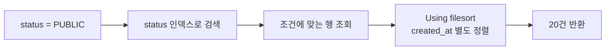
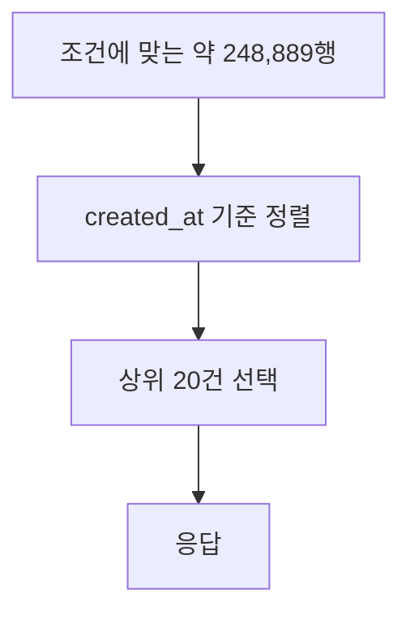

## 분류는 빨랐지만 다시 줄을 세워야 했다

도서관에서 공개된 책 중 최근에 들어온 책 20권을 찾는다고 생각해보자.

책이 공개 여부별로 나뉘어 있어 공개된 책은 빠르게 찾았다. 하지만 그 안에서 입고일 순서로 정리되어 있지 않다면 모든 공개 도서를 꺼내 다시 날짜순으로 줄을 세워야 한다.

```text
status로 공개 글 찾기
→ 공개 글을 모두 꺼내기
→ created_at으로 정렬
→ 앞의 20건 반환
```

DB 쿼리도 같은 문제가 생길 수 있다.

```sql
SELECT *
FROM post
WHERE status = 'PUBLIC'
ORDER BY created_at DESC
LIMIT 20;
```

## 인덱스를 사용한다는 것만으로 충분하지 않다

실행 계획에서 `key`에 인덱스 이름이 있고 `type`도 정상적으로 보이면 쿼리가 충분히 빠르다고 생각하기 쉽다.

하지만 `Extra`에 `Using filesort`가 표시된다면 MySQL이 인덱스 순서만으로 정렬을 끝내지 못했다는 의미다.



<details>
<summary><b>🔍 Using filesort면 반드시 디스크 파일에 정렬하는가?</b></summary>

아니다. `filesort`는 MySQL이 인덱스의 정렬 순서를 그대로 이용하지 못하고 별도의 정렬 단계를 수행한다는 의미다.

데이터 크기와 메모리 설정에 따라 메모리에서 정렬할 수도 있고, 공간이 부족하면 임시 파일을 사용할 수도 있다.

</details>

## LIMIT 20이어도 20행만 보는 것은 아니다

`LIMIT 20`은 정렬이 끝난 결과에서 20건만 반환한다는 뜻이다.

```text
조건에 맞는 행: 248,889건
반환하는 행:         20건
```



20건만 반환하더라도 정렬하기 위해 훨씬 많은 행을 읽고 비교할 수 있다. 영상의 실험에서는 이 과정에 약 `428.2ms`가 걸렸다.

## 조건과 정렬을 하나의 복합 인덱스에 넣는다

**복합 인덱스**는 여러 컬럼을 정해진 순서로 묶은 인덱스다.

```sql
CREATE INDEX idx_post_status_created_at
ON post(status, created_at DESC);
```

```text
(status, created_at DESC)

PUBLIC
├─ 2026-09-10
├─ 2026-09-09
└─ 2026-09-08

PRIVATE
├─ 2026-09-10
└─ 2026-09-07
```

`status`가 먼저 있으므로 공개 글의 범위를 찾고, 그 범위는 이미 `created_at` 순서로 정렬되어 있다.


별도의 정렬 없이 필요한 20건을 순서대로 읽고 멈출 수 있다. 영상의 실험에서는 약 `1.2ms`로 줄었다.

```text
변경 전: 428.2ms
변경 후:   1.2ms

약 355배 개선
```

이 수치는 해당 데이터와 실행 환경에서 나온 결과이며 모든 쿼리가 같은 비율로 개선되는 것은 아니다.

## 컬럼 순서가 중요한 이유

복합 인덱스는 아무 순서로나 컬럼을 넣는 목록이 아니다. 앞쪽 컬럼부터 정렬된 구조다.

```text
(status, created_at)

status로 같은 값의 범위를 찾음
→ 그 범위 안에서 created_at 순서로 읽음
```

반대로 정렬 컬럼을 앞에 놓으면 전체가 작성 시각순으로 먼저 정렬되므로 특정 `status`의 범위를 바로 찾기 어려울 수 있다.

다만 항상 조건 컬럼을 먼저 둬야 하는 것은 아니다. 동등 조건인지 범위 조건인지, 정렬 방향과 데이터 분포에 따라 적절한 순서는 달라진다.

## 같은 작성 시각의 순서를 고정한다

두 게시물의 `created_at`이 같으면 페이지를 이동할 때 순서가 달라질 수 있다. `id`를 함께 정렬하면 순서를 고정할 수 있다.

```sql
SELECT *
FROM post
WHERE status = 'PUBLIC'
ORDER BY created_at DESC, id DESC
LIMIT 20;
```

```sql
CREATE INDEX idx_post_status_created_at_id
ON post(status, created_at DESC, id DESC);
```

```text
status      → 검색 범위
created_at  → 최신순
id          → 같은 시각의 순서 고정
```

필요한 인덱스는 실제 조회 조건과 정렬 순서를 기준으로 정해야 한다.

## 실행 계획에서 함께 확인할 것

| 항목 | 확인할 내용 |
|---|---|
| `key` | 어떤 인덱스를 사용했는가 |
| `type` | 테이블에 어떤 방식으로 접근했는가 |
| `rows` | 몇 행을 확인할 것으로 예상하는가 |
| `Extra` | filesort, 임시 테이블 등 추가 작업이 있는가 |
| 실제 시간 | 실행 계획의 예상과 실제 측정 결과가 일치하는가 |

> 인덱스를 사용했는지만 보지 말고, 그 인덱스가 검색과 정렬을 함께 해결하는지 확인해야 한다.

## 참고

- [Instagram — 인덱스는 탔는데 여전히 느린 이유](https://www.instagram.com/reel/Dcq53PNNPO0/)
- [MySQL — ORDER BY Optimization](https://dev.mysql.com/doc/refman/8.4/en/order-by-optimization.html)
- [MySQL — EXPLAIN Output Format](https://dev.mysql.com/doc/refman/8.4/en/explain-output.html)
