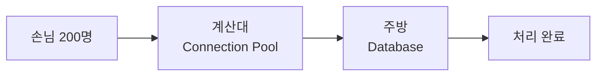
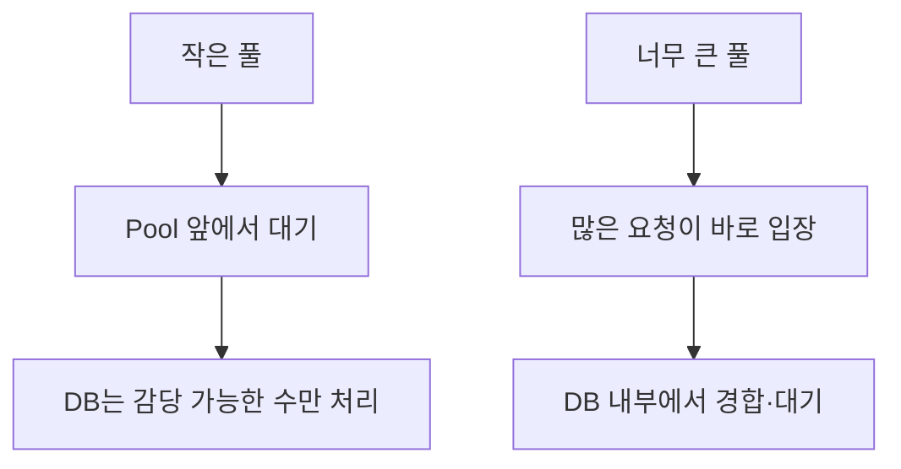
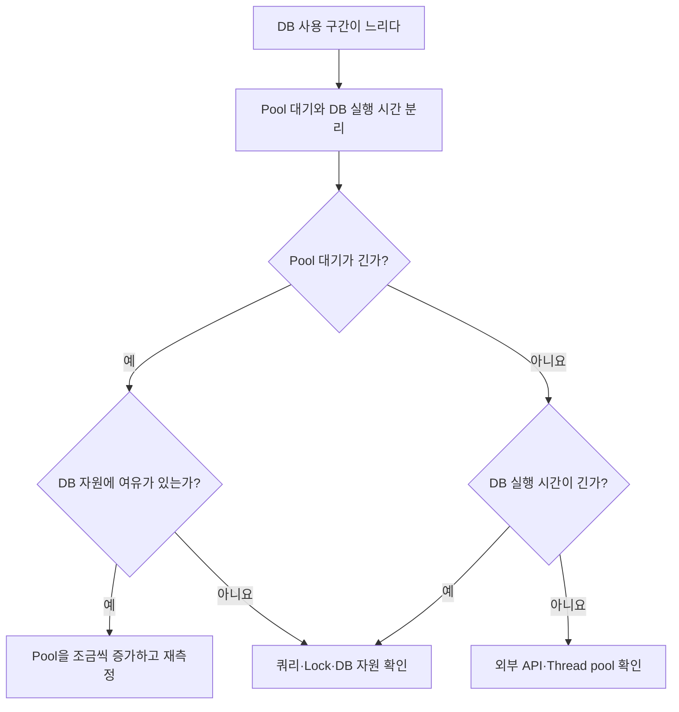

## 계산대가 많아져도 주방이 빨라지는 것은 아니다

계산대를 10개에서 100개로 늘리면 주문 접수는 빨라질 수 있다. 하지만 요리사가 그대로라면 주방 앞에 주문서만 쌓인다.



**커넥션 풀**은 애플리케이션이 DB 연결을 미리 만들어두고 빌려주는 공간이다. 연결 비용을 줄이고 DB에 동시에 들어갈 요청 수를 제한하지만, DB의 CPU·디스크·쿼리 처리 능력을 늘리지는 않는다.

## 대기열이 DB 안으로 이동할 수 있다

동시 요청 200개를 유지한 실험에서는 풀을 5개에서 10개로 늘렸을 때 처리량이 41% 증가했다. 부족했던 커넥션이 보충된 것이다. 하지만 10개에서 100개 이상으로 늘렸을 때 처리량은 약 3%만 증가했다.

```text
풀 5 → 10: 부족한 커넥션 보충 → 처리량 증가
풀 10 → 100+: DB가 병목 → 처리량 거의 동일
```

풀 크기를 10개에서 152개로 늘리자 커넥션 대기는 `3,081ms`에서 `1,003ms`로 줄었지만 DB 내부 시간은 늘었다. 전체 시간은 약 `3,117ms`에서 `3,070ms`로 조금만 줄었다.



```text
전체 DB 소요 시간
= 커넥션 획득 대기
+ DB 내부 실행·대기
```

줄이 사라진 것이 아니라 애플리케이션의 풀 앞에서 DB 내부로 이동한 것이다. 영상의 수치는 해당 실험 환경의 결과이며 모든 서비스의 기준값은 아니다.

## 언제 풀을 늘릴까

다음 상태가 함께 나타나면 풀이 너무 작을 가능성이 있다.

- 모든 커넥션이 사용 중이고 대기 요청이 계속 생긴다.
- 커넥션 획득 대기 시간이 길다.
- 쿼리 자체는 빠르다.
- DB CPU·I/O와 Lock에는 여유가 있다.
- 풀을 늘려도 DB의 최대 연결 수를 넘지 않는다.

```text
Pool 대기: 500ms
DB 실행:     20ms
DB CPU:      30%

→ DB는 여유가 있지만 입구가 좁을 가능성
→ 10 → 15 → 20처럼 조금씩 늘리며 재측정
```

## 언제 쿼리와 DB를 먼저 볼까

커넥션은 빨리 얻지만 DB 안에서 오래 걸리면 풀 부족이 아니다.

```text
Pool 대기:  10ms
DB 실행:   900ms
DB CPU:     90%

→ 느린 쿼리, 실행 계획과 DB 자원을 먼저 확인
```

다음 순서로 원인을 찾는다.

1. 느린 쿼리와 실행 계획, 필요한 index를 확인한다.
2. N+1, 불필요한 전체 조회와 긴 트랜잭션을 확인한다.
3. CPU, 디스크 I/O, 메모리와 Lock 대기를 확인한다.
4. 최적화 후에도 정상 요청량이 DB 한계를 넘으면 사양 확장, cache나 read replica를 검토한다.



## 풀 크기와 DB 최대 연결 수는 다르다

풀 크기는 애플리케이션 한 대가 보유할 수 있는 연결 수이고, DB 최대 연결 수는 DB 전체가 허용하는 수다.

```text
서버 5대 × 서버별 Pool 30개
= 최대 150개 연결
```

DB가 100개만 허용한다면 일부 연결은 실패할 수 있다. 그래서 서버 수와 관리·배치용 연결까지 함께 계산해야 한다.

## 먼저 커넥션을 쥐는 시간을 줄인다

```text
나쁜 흐름
커넥션 획득 → DB 조회 → 외부 API 대기 → 추가 DB 작업 → 반납

개선한 흐름
필요한 DB 작업 → 빠르게 반납 → 외부 API 호출
```

> Pool 앞에서 오래 기다리고 DB가 한가하면 풀을 늘린다. DB 안에서 오래 걸리거나 DB가 바쁘면 쿼리·트랜잭션·자원을 먼저 확인한다.

측정 방법은 [DB가 느릴 때 병목은 어떻게 확인하나](/study/cs/database-bottleneck-diagnosis)에서 별도로 정리한다.

## 참고

- [Instagram — 커넥션 풀을 늘려도 안 빨라지는 이유](https://www.instagram.com/reel/DcvzININtbe/)
- [HikariCP GitHub](https://github.com/brettwooldridge/HikariCP)
