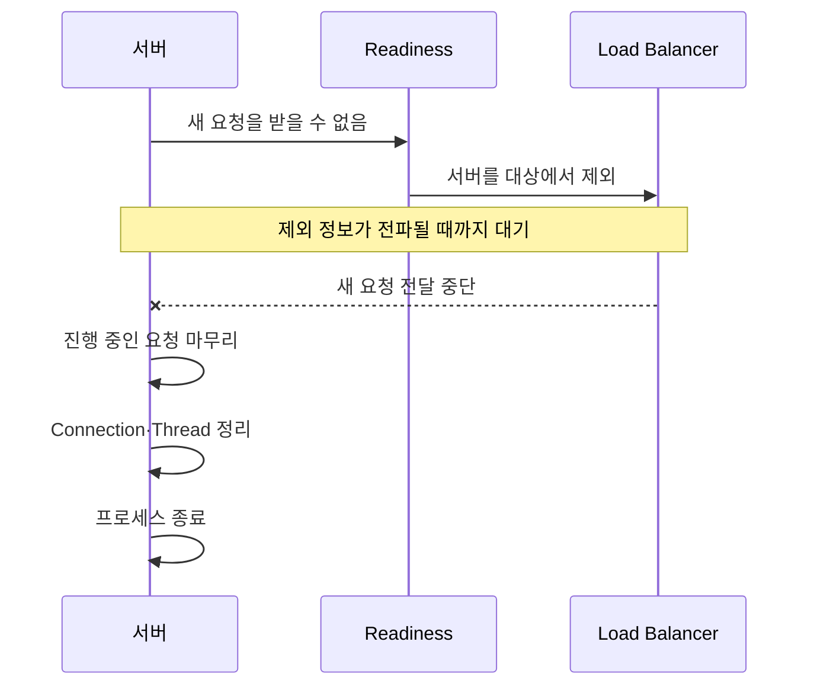

## 문을 잠갔는데 안내 데스크는 손님을 계속 보낸다

영업을 종료하는 식당을 생각해보자. 안에서 식사 중인 손님이 나갈 때까지 기다리는 것은 Graceful Shutdown과 같다. 하지만 안내 데스크가 영업 종료 사실을 모르고 새 손님을 계속 보내면 입구에서 문제가 생긴다.


**Graceful Shutdown**은 서버가 종료될 때 진행 중인 요청을 갑자기 끊지 않고 마무리할 시간을 주는 절차다. 하지만 이것만으로 새 요청 유입까지 자동으로 막히지는 않는다.

## 실패는 두 종류였다

| 실패 종류 | 의미 |
|---|---|
| 연결 후 응답 실패 | 서버가 처리 중인 요청을 끝내지 못하고 종료 |
| 연결 자체 실패 | 로드밸런서가 이미 종료된 서버로 새 요청 전달 |

영상에서는 즉시 종료했을 때 총 75건 중 17건이 실패했다. Graceful Shutdown을 적용하자 연결 후 응답 실패는 `7건 → 0건`이 됐지만 전체 실패는 `17건 → 16건`으로 거의 줄지 않았다.

```text
Graceful Shutdown 적용
진행 중이던 요청 보호: 성공
새 요청 유입 차단: 실패
```

서버는 요청을 마무리했지만 로드밸런서가 종료 사실을 아직 알지 못해 새 요청을 계속 보낸 것이다.

## Readiness와 Liveness는 질문이 다르다

| 상태 | 묻는 질문 | 실패했을 때 |
|---|---|---|
| Readiness | 새 트래픽을 받아도 되는가 | 트래픽 대상에서 제외 |
| Liveness | 프로세스를 재시작해야 하는가 | 컨테이너 재시작 |
| Startup | 애플리케이션 시작이 끝났는가 | 시작 시간을 기다림 |

종료를 시작할 때 필요한 것은 “죽었다”가 아니라 “이제 새 요청을 받지 않는다”는 신호다. Liveness부터 실패시키면 요청을 마무리하기 전에 프로세스가 재시작될 수 있다.

## 종료에는 순서가 있다



```text
1. 새 트래픽을 받지 않는다고 알림
2. 로드밸런서의 대상 제외를 기다림
3. 그동안 기존 요청은 계속 처리
4. 진행 중인 요청이 끝나면 종료
```

영상에서는 이 순서를 적용한 뒤 실패가 0건이 됐다. 이 수치는 해당 실험 결과이며 실제 결과는 로드밸런서와 배포 환경에 따라 달라진다.

## 왜 잠깐 기다려야 할까

Readiness가 실패했다고 모든 구성 요소가 같은 순간에 서버를 제외하지는 않는다.


상태 변경이 전달되는 동안 서버가 먼저 Listener를 닫으면 남아 있는 요청이 연결에 실패한다.

```text
종료 유예 시간
≥ 트래픽 제외 전파 시간
+ 진행 중인 요청의 최대 처리 시간
+ 자원 정리 시간
```

## Kubernetes에서는 어떻게 연결될까

```yaml
spec:
  terminationGracePeriodSeconds: 30
  containers:
    - name: api
      readinessProbe:
        httpGet:
          path: /ready
          port: 8080
```

- `readinessProbe`: 트래픽 수신 가능 여부를 알린다.
- `terminationGracePeriodSeconds`: 종료 신호 후 강제 종료 전까지 기다리는 시간이다.
- `preStop`: 애플리케이션 종료 전에 필요한 작업을 실행할 수 있다.

고정된 `sleep`만 넣는 것보다 실제 종료 시간과 로드밸런서 제외 지연을 측정해 유예 시간을 정해야 한다.

<details>
<summary><b>🔍 502는 항상 종료 중인 서버가 원인일까?</b></summary>

아니다. 502는 프록시나 로드밸런서가 정상적인 upstream 응답을 받지 못했다는 뜻으로, 잘못된 주소·포트, 네트워크 오류, 서버 crash 등 여러 원인이 있을 수 있다.

배포 시간과 502 발생 시간이 겹치고 종료되는 인스턴스로 향한 연결 실패가 확인될 때 종료 절차를 원인으로 판단할 수 있다.

</details>

## 확인할 지표

| 지표 | 확인하는 문제 |
|---|---|
| 배포 시각과 502 발생 시각 | 배포와 오류가 연결되는가 |
| 종료 인스턴스의 새 연결 수 | 대상 제외 후에도 새 요청이 오는가 |
| 진행 중인 요청 수 | 종료 전에 모두 끝났는가 |
| 종료 소요 시간 | 유예 시간 안에 종료되는가 |
| Load Balancer 대상 상태 | 언제 대상에서 제외됐는가 |

> 종료는 프로세스를 끄는 순간이 아니라 새 요청 차단, 기존 요청 배출과 자원 정리를 포함한 절차다.

## 참고

- [Instagram — 배포할 때마다 잠깐 502가 뜬다](https://www.instagram.com/reel/DcoNhtaNRU0/)
- [Kubernetes — Pod Lifecycle](https://kubernetes.io/docs/concepts/workloads/pods/pod-lifecycle/)
- [Kubernetes — Liveness, Readiness and Startup Probes](https://kubernetes.io/docs/concepts/configuration/liveness-readiness-startup-probes/)
