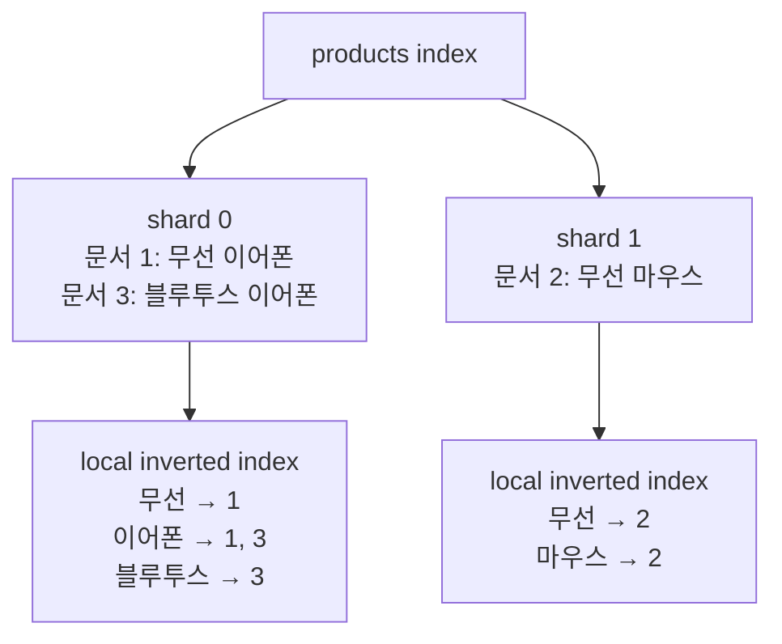

세 용어는 비슷하게 들리지만 같은 종류의 개념이 아니다.

| 용어 | 의미 | 구분 |
|---|---|---|
| Index | 검색할 문서와 검색 구조를 담는 논리적 단위 | 결과물·저장 단위 |
| Inverted index | term에서 해당 term을 포함한 문서로 연결하는 자료구조 | 내부 검색 구조 |
| Indexing | 문서를 분석해 index에 반영하는 작업 | 과정 |

## Index는 검색 가능한 논리적 단위다

OpenSearch에서 index는 비슷한 성격의 문서를 모은 논리적 단위다. 예를 들어 상품 문서는 `products` index에 저장할 수 있다.

하나의 index는 여러 primary shard로 나뉠 수 있고, 각 shard가 서로 다른 문서 일부를 맡는다.

```text
products index
  ├─ primary shard 0
  ├─ primary shard 1
  └─ primary shard 2
```

OpenSearch의 index와 RDB의 index는 이름이 같지만 범위가 다르다.

- RDB의 index는 특정 테이블 조회를 빠르게 하는 보조 자료구조다.
- OpenSearch의 index는 문서, mapping, 분석 설정과 shard를 포함하는 논리적 저장 단위다.

## Inverted index는 단어에서 문서를 찾는다

다음 상품 문서 세 개를 `products` index에 저장한다고 가정한다.

| 문서 ID | 상품명 |
|---|---|
| 1 | 무선 이어폰 |
| 2 | 무선 마우스 |
| 3 | 블루투스 이어폰 |

문서 중심으로 보면 다음과 같다.

```text
문서 1 → 무선, 이어폰
문서 2 → 무선, 마우스
문서 3 → 블루투스, 이어폰
```

inverted index는 이 관계를 반대로 저장한다.

```text
무선       → 문서 1, 문서 2
이어폰     → 문서 1, 문서 3
마우스     → 문서 2
블루투스   → 문서 3
```

검색어가 들어오면 모든 문서를 처음부터 읽지 않고 해당 term의 문서 목록을 찾아 결과 후보를 만들 수 있다.

## Shard마다 local inverted index를 가진다

세 문서가 서로 다른 shard에 배치됐다고 가정한다.

```text
products index
├─ shard 0
│  ├─ 문서 1: "무선 이어폰"
│  └─ 문서 3: "블루투스 이어폰"
└─ shard 1
   └─ 문서 2: "무선 마우스"
```

각 shard는 자신이 보관한 문서만 사용해 local inverted index를 만든다.

```text
shard 0의 local inverted index

무선       → 문서 1
이어폰     → 문서 1, 문서 3
블루투스   → 문서 3
```

```text
shard 1의 local inverted index

무선       → 문서 2
마우스     → 문서 2
```

전체 구조를 연결하면 다음과 같다.



`무선`을 검색하면 각 shard가 자기 local inverted index에서 결과를 찾는다.

```text
shard 0: 무선 → 문서 1
shard 1: 무선 → 문서 2
```

조정 노드는 두 shard의 결과를 받아 점수와 정렬 기준에 따라 하나의 검색 결과로 합친다.

```text
최종 결과 → 문서 1, 문서 2
```

즉, `products` index 전체를 위한 거대한 inverted index 하나가 별도로 존재하는 것이 아니다. 각 shard가 독립적인 검색 단위이며, 자기 문서에 대한 inverted index를 가진다.

<details>
<summary><b>🔍 실제로는 단어와 문서 ID만 저장할까?</b></summary>

개념을 이해하기 위한 그림에서는 `단어 → 문서 ID 목록`으로 단순화했다. 실제 검색엔진은 관련도 점수와 구문 검색을 위해 term의 등장 횟수, 문서 내 위치 등 추가 정보도 저장할 수 있다.

</details>

## Indexing은 문서를 검색 가능하게 만드는 과정이다

indexing은 완성된 자료구조의 이름이 아니다. 문서를 index에 넣어 검색 가능한 상태로 만드는 과정이다.


`무선 이어폰`이라는 상품명이 들어오면 다음 과정이 진행된다.

```text
원본 문서
{ "id": 1, "name": "무선 이어폰" }

        ↓ 텍스트 분석

term
["무선", "이어폰"]

        ↓ shard 선택

shard 0

        ↓ local inverted index 갱신

무선   → 문서 1
이어폰 → 문서 1
```

한 문장으로 구분하면 다음과 같다.

> 문서를 indexing해서 index에 넣으면, 해당 shard의 inverted index가 만들어지거나 갱신된다.

## 검색은 indexing과 다른 흐름이다

indexing은 문서를 저장하는 흐름이고 search는 이미 만들어진 검색 구조를 조회하는 흐름이다.


## 정리

```text
Index          = 검색 문서와 구조를 담는 논리적 단위
Inverted index = term → 문서 목록을 저장한 shard 내부 자료구조
Indexing       = 문서를 분석해 index에 반영하는 과정
Search         = 만들어진 index를 조회하고 결과를 병합하는 과정
```

`index`와 `indexing`은 결과물과 동작의 차이다. `inverted index`는 indexing 과정에서 만들어지고 검색에 사용되는 구체적인 자료구조다.

## 참고

- [OpenSearch — Introduction to OpenSearch](https://docs.opensearch.org/latest/getting-started/intro/)
- [OpenSearch — Index mapping parameter](https://docs.opensearch.org/latest/mappings/mapping-parameters/index-parameter/)
