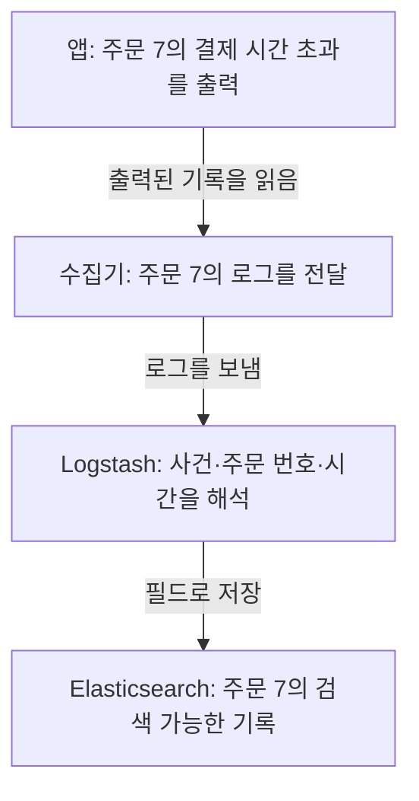

## 01 · 서버에는 기록됐는데 검색 화면에는 없다

주문 7의 결제가 3초 동안 응답하지 않았다. 앱은 `payment_timeout` 로그를 남겼다. 그런데 운영자가 검색 화면에서 주문 7을 찾아도 나오지 않는다.

**앱이 로그를 출력하는 것과 검색 저장소에 저장되는 것은 다른 단계다.** 수집과 저장이 연결되어야 검색할 수 있다. 주문 7과 사건 이름은 앞선 JSON 로그 글에서 이어지는 학습용 예시다.

## 02 · 같은 기록이 이동하는 모습을 보자

아래는 학습용 수집 경로다. 각 칸에서도 같은 주문 7의 기록을 따라간다.



수집기는 로그를 읽어 옮기는 별도 프로그램이다. 여기서는 **Fluent Bit** 같은 수집기를 생각하면 된다. **Logstash**는 입력을 받고 내용을 처리해 다른 곳으로 보내는 별도 프로그램이다. 설정 파일은 그 처리 순서를 정한다. **Elasticsearch**는 기록을 저장하고 조건에 맞는 기록을 찾는 검색 엔진이다. 셋 다 Java 기본 클래스가 아니다. [Logstash 처리 흐름](https://www.elastic.co/docs/reference/logstash/how-logstash-works)

주문 7의 로그가 필드로 저장되면 사건 이름과 주문 번호를 조건으로 찾을 수 있다. 중간 단계의 필드 해석이나 허용 조건이 맞지 않으면 이 결과까지 도달하지 못할 수 있다.

## 03 · 화면은 저장된 기록을 물어본다

```text
운영자: “주문 7의 결제 시간 초과를 찾아줘”
  ↓ Kibana에서 검색 조건 입력
Elasticsearch에 조회 → 조건에 맞는 기록 반환 → Kibana가 표시
```

**Kibana**는 Elastic 데이터를 검색하고 보는 별도 웹 애플리케이션이다. Elasticsearch가 화면으로 로그를 계속 밀어 넣는다는 뜻이 아니다. 수집 경로와 조회 경로를 구분한다. [Kibana Discover](https://www.elastic.co/docs/explore-analyze/discover/discover-get-started)

## 04 · 안 보인다면 마지막으로 확인된 지점을 찾는다

앱 출력에 주문 7이 있는지, 수집기가 읽고 보냈는지, 처리기가 거절하지 않았는지, 저장소에 기록이 있는지 차례로 확인한다. 저장소에 있다면 화면의 데이터 범위와 시간 조건을 확인한다.

검색 결과가 없다는 것만으로 앱 오류나 로그 유실을 단정하지 않는다. [다음 글: 주문 7의 오류 로그 찾기](/study/cs/kibana-data-view-and-saved-objects)

<details>
<summary>Kafka, Filebeat, OpenSearch도 꼭 필요한가?</summary>

아니다. 수집 경로는 환경에 따라 다르다. 이번 경로는 Kafka를 거치지 않는 예시다. Kafka를 중간에 넣어도 보관, 전달과 재처리 정책 없이 로그 유실 방지가 자동 완성되지는 않는다.

Filebeat도 수집에 사용할 수 있지만 이번 로컬 프로젝트 설정에서 확인한 수집기는 Fluent Bit다.

OpenSearch는 별도의 검색 엔진이고 해당 화면 제품은 OpenSearch Dashboards다. 여기의 Elasticsearch/Kibana 설정을 이름만 바꿔 그대로 사용할 수 있다고 가정하지 않는다. [OpenSearch Dashboards](https://docs.opensearch.org/latest/dashboards/)

</details>

## 프로젝트에서는 어디를 확인했나?

2026-10-08 로컬 PromptHub의 Fluent Bit 전송 설정, Logstash의 JSON 해석과 분기 설정, Elasticsearch 출력 설정을 대조했다. 애플리케이션 로그와 결제 감사 로그의 경로도 구분되어 있다.

**설정이 있다는 근거이며, 주문 7이 실제 운영 화면에 도착했거나 유실이 없다는 검증은 아니다.** 원격 저장소와 실제 배포 상태까지 확인한 것은 아니다.

[기존 검색 이벤트 수집 글](/study/es/search-event-log-pipeline)은 행동 이벤트와 상세 설정을 공부할 때 연결한다. 이번 글은 오류 로그 한 줄의 이동만 설명한다.

## 자기 말로 답해보기

저장소에는 주문 7의 기록이 있다. Kibana에서 안 보이면 수집기를 바로 고쳐야 할까?

<details>
<summary>답 확인</summary>

아니다. 먼저 선택한 데이터 범위, 시간과 검색 조건을 확인한다. 저장소까지 도착한 사실이 있으므로 조회 조건부터 좁힌다.

</details>

공식 자료와 로컬 설정 확인일: 2026-10-08. 수집 도구 설치와 실제 운영 수집 시험은 이번 예시의 범위가 아니다.
