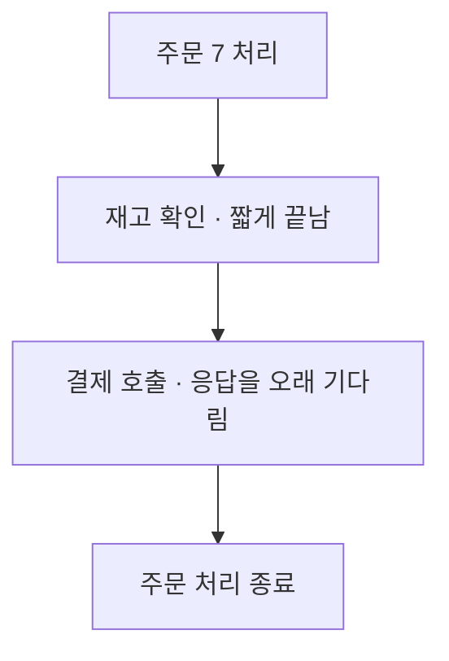

## 01 · 주문 7이 평소보다 늦게 끝났다

사용자가 “주문이 느려요”라고 알려왔다. **전체가 느린지, 주문 7만 느린지, 어느 작업에서 기다렸는지**는 아직 모른다. 이때 실행 중인 시스템을 기록으로 살펴보는 방법을 공부한다. 이를 관측성이라고 한다.

아래는 실제 장애 측정이 아닌 학습용 상황이다. 세 종류의 기록이 수집돼 있다는 조건에서 같은 주문을 따라간다.

## 02 · 메트릭: 여러 주문도 함께 느려졌나?

메트릭은 응답 시간, 오류 수처럼 실행 상태를 숫자로 측정한 기록이다. 여러 요청의 상태와 추세를 살펴본다.

```text
주문 API의 1분 평균 응답 시간 — 학습용 수치

이전   ▏       200ms
지금   █████   1000ms
```

평균이 올라갔으므로 주문 7 외의 요청도 조사할 이유가 생겼다. **이 숫자만으로 주문 7의 실패 이유나 모든 주문이 느려졌다고 단정할 수는 없다.** [OpenTelemetry Metrics](https://opentelemetry.io/docs/concepts/signals/metrics/)

## 03 · 트레이스: 주문 7은 어디서 시간을 썼나?

트레이스는 하나의 실행 흐름에 속한 작업들의 경로와 소요 시간을 연결한 기록이다. 아래는 요청 흐름의 모양만 보여주는 그림이며 길이가 정확한 시간 비례는 아니다.



이번 요청에서는 결제 호출이 시간을 많이 썼다. 결제 시스템이 느렸는지, 네트워크나 연결 대기 때문인지는 추가 확인해야 한다.

작업들을 기록하고 서비스 사이에 **추적 맥락을 전달**해야 같은 흐름으로 묶을 수 있다. 로그가 있다는 이유만으로 이 그림이 자동 생성되지는 않는다. [OpenTelemetry Traces](https://opentelemetry.io/docs/concepts/signals/traces/)

## 04 · 로그: 그 결제 호출에서 어떤 사건이 있었나?

로그는 특정 시점에 일어난 일을 남긴 기록이다. 주문 7과 해당 결제 호출을 연결해 찾았더니 다음 사건이 남아 있다.

```text
주문 7 — 결제 응답을 3000ms 기다린 뒤 시간 초과
```

이 요청은 정해 둔 대기 시간을 넘겼다. 이것은 관찰된 사건이지 결제 시스템의 근본 원인을 확정한 기록은 아니다. [OpenTelemetry Logs](https://opentelemetry.io/docs/concepts/signals/logs/)

## 05 · 같은 문제를 다른 크기로 본 것이다

**많은 요청의 변화 → 주문 7의 느린 작업 → 그때의 사건**으로 범위를 좁혔다. 조사할 때 반드시 이 순서로 시작해야 하는 것은 아니다. 오류 로그부터 시작해 영향 범위를 확인할 수도 있다.

<details>
<summary>로그만 많이 남기면 충분하지 않을까?</summary>

로그를 많이 남기는 것과 필요한 증거를 찾기 쉬운 것은 다르다. 수집·저장·검색과 추적 연결이 필요하다. 개인정보나 요청 본문 전체를 무조건 기록하면 노출 위험과 비용도 커진다.

OpenTelemetry는 이런 신호의 계측, 수집과 전달을 위한 프레임워크다. 로그 검색 저장소나 대시보드 자체를 뜻하는 이름은 아니다. [OpenTelemetry 소개](https://opentelemetry.io/docs/what-is-opentelemetry/)

</details>

## 자기 말로 답해보기

주문 7의 오류 문장을 찾고 싶다. 응답 시간 평균만 보면 알 수 있을까?

<details>
<summary>답 확인</summary>

평균만으로 그 주문의 오류 문장을 알 수 없다. 주문이나 추적 번호로 연결된 로그를 찾아야 한다. 메트릭은 전체 영향 범위를 판단하는 데 함께 쓴다.

</details>

다음은 [오류를 JSON 필드로 나눠 찾기](/study/cs/structured-json-logs)다. 이 글은 특정 프로젝트에 세 신호가 모두 구축됐다는 설명이 아니다. 공식 자료 확인일: 2026-10-08.
