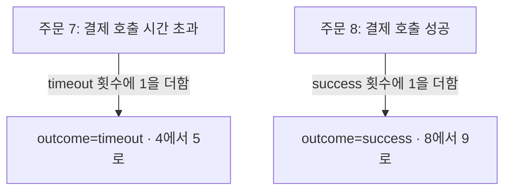

## 01 · 결제 성공과 시간 초과를 나눠 보고 싶다

주문 7의 결제 호출이 시간 초과됐다. 성공한 호출과 구분해서 숫자를 보고 싶다. 이때 메트릭에 **Label(분류 이름표)**을 붙인다. 이번 예시의 이름표는 `outcome`, 값은 `success` 또는 `timeout`이다. 실제 운영 수치가 아니라 한 앱의 학습용 장면이다.

## 02 · 같은 이름표면 같은 숫자에 더한다



하나의 지표 이름 `payment_calls_total`을 결과별로 나눠 센다. 주문 번호가 달라도 결과 이름표가 같으면 같은 시계열에 더한다. 실제로는 서버 등 다른 Label까지 모두 같아야 같은 시계열이다. [Prometheus 데이터 모델](https://prometheus.io/docs/concepts/data_model/)

이 그림에서는 시간 초과 횟수는 5, 성공 횟수는 9가 된다. 두 주문의 사건은 서로 다른 결과의 숫자에 반영된다.

## 03 · 주문마다 새 이름표를 만들면 칸이 계속 늘어난다

```text
결과만 나눔
  success: 9    timeout: 5

주문 번호까지 나눔
  orderId=7, timeout: 주문 7 전용 횟수
  orderId=8, success: 주문 8 전용 횟수
  orderId=9, timeout: 주문 9 전용 횟수
  새 주문마다 새로운 조합이 추가됨
```

Prometheus는 **지표 이름과 전체 Label 조합마다 별도 시계열**을 만든다. 값의 종류와 조합이 많아지는 것을 높은 **카디널리티(cardinality)**라고 부른다. 주문 번호, 사용자 번호, 검색어처럼 계속 새 값이 들어오면 저장과 메모리, 조회 부담이 커질 수 있다. [Prometheus Label 설계](https://prometheus.io/docs/practices/naming/)

위는 분류를 바꾸는 방식의 비교다. 주문 번호를 추가한다고 기존 14번의 호출을 주문별로 자동 복원하지는 않는다.

## 04 · 전체 숫자와 개별 사건을 다른 곳에 둔다

```text
메트릭: “시간 초과 호출이 얼마나 생겼나?” → outcome=timeout
로그:   “주문 7에서 무슨 일이 있었나?”  → 필요한 식별자로 사건 찾기
```

Label은 집계 목적에 필요한 제한된 분류로 고른다. 개별 주문을 추적하려고 주문 번호를 일반 Label에 넣지 않는다. 로그에도 개인정보를 무조건 넣는다는 뜻은 아니다. 필요한 식별자, 접근 권한과 보관 정책을 정한다. [로그의 필드와 접근 범위](/study/cs/structured-json-logs)

<details>
<summary>이름표는 적기만 하면 괜찮을까?</summary>

이름표 하나라도 값이 끝없이 늘어나면 부담이 커진다. 반대로 여러 이름표도 값과 조합이 제한되어 있으면 목적에 맞게 쓸 수 있다.

예를 들어 결과 2종류 × 결제수단 2종류 × 서버 3대는 모든 조합이 나타난다는 조건에서 최대 12개 시계열이다. 관측하지 않은 조합까지 자동으로 생긴다는 뜻은 아니며, 다른 Label/지표와 서버 교체에 따른 누적 변화도 함께 본다.

이것은 개수만 보여주는 예시다. 12개까지는 안전하고 그 이상은 위험하다는 고정 기준이 아니다. 같은 지표에는 Label의 이름 구성을 일관되게 쓴다. Micrometer에서 이 분류는 tag라고 부르며 Prometheus 출력에서는 Label이 된다. [Micrometer의 tag 구성](https://docs.micrometer.io/micrometer/reference/implementations/prometheus.html)

추적 ID를 메트릭과 연결하는 **exemplar**라는 별도 기능도 있다. 일반 Label에 모든 traceId를 넣는 것과는 다르다. 이 글에서는 해당 기능의 설정과 구현까지 다루지 않는다. [Micrometer Exemplars](https://docs.micrometer.io/micrometer/reference/implementations/prometheus.html)

</details>

## 프로젝트에서는 어디를 확인했나?

2026-10-08 로컬 PromptHub의 주문 예약/만료 메트릭 구현은 결과와 처리 출처를 enum(정해둔 값 목록)의 제한된 값으로 나눈다. 관련 테스트 소스에는 Counter 값 확인과 `orderId`, `eventId` 등의 식별자 tag를 제외하는 검사가 있다.

이번에는 **구현과 테스트 소스를 읽은 것**이다. 테스트 실행, 실제 수집 시계열 수와 운영 비용 감소를 검증한 것은 아니다. 그 프로젝트의 지표가 위 결제 지표와 같은 이름이라는 뜻도 아니다. 원격 HEAD와 실제 배포 상태도 확인하지 않았다.

## 자기 말로 답해보기

Label이 `orderId` 하나뿐이다. 이름표가 한 개니까 값이 수백만 개여도 부담이 작을까?

<details>
<summary>답 확인</summary>

아니다. 이름표 개수보다 서로 다른 값과 실제 조합이 중요하다. 새 주문 번호마다 별도 시계열이 생길 수 있다.

</details>

공식 자료와 로컬 코드 확인일: 2026-10-08. 숫자를 대시보드와 알림으로 연결하는 내용은 후속 학습 범위다.
