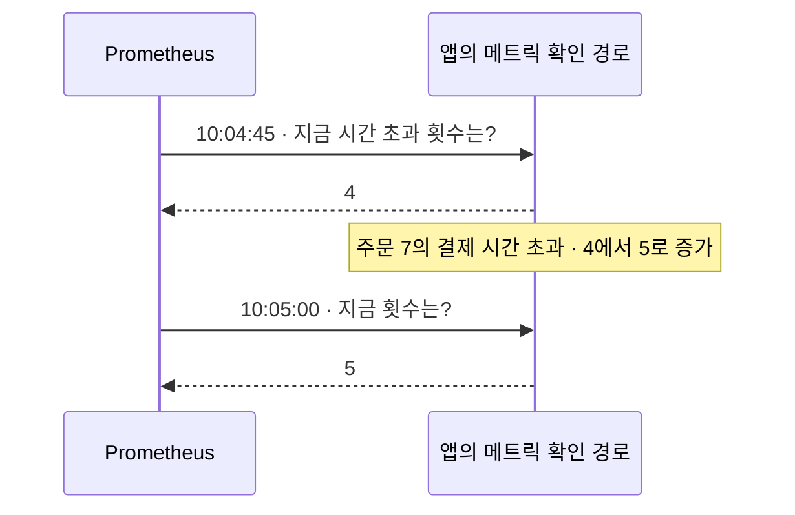

## 01 · 주문 7 말고도 결제가 실패했을까?

주문 7의 결제가 3초 뒤 시간 초과됐다. 로그로 그 사건은 찾았다. 이번에는 “시간 초과된 결제 호출이 최근 얼마나 있었지?”를 숫자로 보고 싶다.

앱에서 횟수를 세고, **Prometheus가 주기적으로 읽어 시각과 함께 저장**한다. Prometheus는 숫자의 변화를 수집하고 저장하는 별도 서버 프로그램이다. Java 기본 기능이 아니다. 아래 값은 실제 장애 측정이 아닌 학습용이다. [Prometheus 개요](https://prometheus.io/docs/introduction/overview/)

## 02 · 주문 7의 사건이 숫자 하나를 바꾼다

```text
앱의 시간 초과 횟수: 4
       ↓ 주문 7의 결제 호출이 시간 초과되어 1을 더함
앱의 시간 초과 횟수: 5
```

이런 누적 횟수를 세는 측정값이 **Counter**다. 같은 앱에서 늘어나다가 재시작 등으로 초기화될 수 있다. 호출 한 번마다 1을 더하는 예시이므로 재시도가 있으면 주문 수와 꼭 같지는 않다. [Counter의 의미](https://prometheus.io/docs/concepts/metric_types/)

## 03 · Prometheus가 숫자를 가지러 온다

아래는 앱이 측정값을 확인 경로에 제공하고, Prometheus의 수집 대상과 접근 설정이 연결된 장면이다.



수집기가 값을 요청하고 앱이 응답한다. 이렇게 주기적으로 숫자를 읽는 것을 **scrape(수집)**라고 한다. 앱이 결제 오류를 발견할 때마다 Prometheus로 오류 문장을 보내는 구조가 아니다. [Prometheus 수집 방식](https://prometheus.io/docs/introduction/overview/)

## 04 · 횟수에 시각이 붙으면 변화를 볼 수 있다

```text
10:04:45  4  →  10:05:00  5  →  10:05:15  7
               +1              +2
```

같은 앱에서 재시작과 측정 누락이 없다는 조건이면 이 사이 새 시간 초과 호출은 3번이다. 시각에 따라 쌓은 숫자 기록을 **시계열**이라고 한다. `7`만 보고 '최근 30초에 7번 실패'라고 읽으면 안 된다. [Prometheus 데이터 모델](https://prometheus.io/docs/concepts/data_model/)

이 숫자에는 주문 7의 오류 문장이나 실패 원인이 없다. 개별 사건은 [로그로 다시 확인](/study/cs/structured-json-logs)한다.

<details>
<summary>Java 앱에서 숫자는 어떻게 세고, 어디에서 보여줄까?</summary>

**Micrometer**는 앱의 숫자 측정에 사용하는 외부 Java 라이브러리다. `MeterRegistry`는 측정값을 등록하고 조회하는 객체이며, Spring Boot 앱은 관련 설정에 따라 이를 제공한다.

아래 `registry`는 그 객체다. 결제 호출의 시간 초과를 기록하는 지점에서 실행하는 부분 예시이지 독립 실행 프로그램은 아니다.

```java
Counter timeouts = registry.counter("payment.calls", "outcome", "timeout");
timeouts.increment();
```

`Counter`와 `MeterRegistry`는 `io.micrometer.core.instrument`에서 제공한다. 첫 줄은 이름이 `payment.calls`, 결과 이름표가 `outcome=timeout`인 Counter를 등록하거나 기존 것을 가져온다. 둘째 줄은 그 Counter에 1을 더한다. 위의 기존 값이 4라면 5가 된다. 주문 번호는 이 Counter에 저장하지 않는다. [Micrometer Counters](https://docs.micrometer.io/micrometer/reference/concepts/counters.html)

Spring Boot에서 Prometheus 형식으로 제공하려면 Actuator 외에 `io.micrometer:micrometer-registry-prometheus` 의존성과 endpoint 노출 설정도 확인한다. endpoint는 이 예시에서 메트릭 값을 요청할 수 있는 웹 경로다. 이 라이브러리가 이름을 Prometheus 형식으로 바꾸면 예제 출력은 다음 모양이다.

```text
payment_calls_total{outcome="timeout"} 5
```

`outcome`은 결과를 나눠 세는 이름표이며 [다음 글에서 Label 설계](/study/cs/metric-label-cardinality)를 설명한다. `/actuator/prometheus`를 Prometheus가 읽을 수 있도록 수집 대상의 주소/경로/권한을 연결해야 한다. Actuator가 설치되어 있다고 수집까지 자동 완료되는 것은 아니다. 메트릭 경로를 인터넷에 무조건 공개하지 않는다. [Micrometer Prometheus 연동](https://docs.micrometer.io/micrometer/reference/implementations/prometheus.html), [Spring Boot Metrics](https://docs.spring.io/spring-boot/reference/actuator/metrics.html)

기존 Timer로 같은 사건의 시간과 횟수를 이미 측정한다면 횟수를 세기 위한 별도 Counter가 꼭 필요한지 먼저 확인한다. Timer도 측정한 사건의 횟수를 제공한다. 위 예제는 원리를 보여주는 별도 Counter다. [Micrometer Counters](https://docs.micrometer.io/micrometer/reference/concepts/counters.html)

</details>

<details>
<summary>재시작했거나 최근 5분만 보고 싶다면?</summary>

단순히 마지막 값에서 처음 값을 빼면 재시작으로 줄어든 Counter를 잘못 해석할 수 있다. **PromQL**은 Prometheus에서 숫자를 조회하는 문법이다. 수집한 예제 지표의 최근 5분 증가량은 다음처럼 조회한다.

```text
increase(payment_calls_total{outcome="timeout"}[5m])
```

재시작으로 값이 초기화된 상황을 보정하고 시간 범위로 환산하므로 소수 결과가 나올 수도 있다. 모든 사건의 정확한 원장을 복구하는 기능은 아니다. 여러 서버의 값은 서버별 증가량을 구한 뒤 집계한다. `rate`는 구간의 증가 속도를 초당 평균으로 볼 때 사용한다. [Prometheus increase/rate](https://prometheus.io/docs/prometheus/latest/querying/functions/)

</details>

## 프로젝트에서는 어디를 확인했나?

2026-10-08 로컬 PromptHub 주문 서비스의 Micrometer 구현에서 주문 예약 시도와 만료 처리 횟수를 세는 코드, 이를 호출하는 서비스/워커와 테스트 소스를 확인했다. 위 결제 Counter가 실제 구현되어 있다는 뜻은 아니다.

확인한 Gradle과 YAML/Java/TOML 파일 검색에서는 Prometheus registry 의존성이나 수집 대상 설정을 찾지 못했다. 외부 운영 환경에도 없다는 결론은 아니다. **앱의 측정 코드와 Prometheus 운영 수집 완료는 구분한다.** 원격 HEAD/배포 상태, 실제 endpoint 응답과 수집 결과는 확인하지 않았다.

## 자기 말로 답해보기

앱에서 Counter가 4에서 5로 늘었다. Prometheus에도 반드시 저장됐을까?

<details>
<summary>답 확인</summary>

아니다. 앱의 측정값이 바뀐 것이다. 해당 값이 확인 경로에 나오고 Prometheus가 정상적으로 수집했는지 별도로 확인한다.

</details>

공식 자료와 로컬 코드 확인일: 2026-10-08. Java 부분 예제는 공식 API와 대조했으며 실행하지 않았다. 실제 Prometheus 수집 시험도 이번 범위 밖이다.
