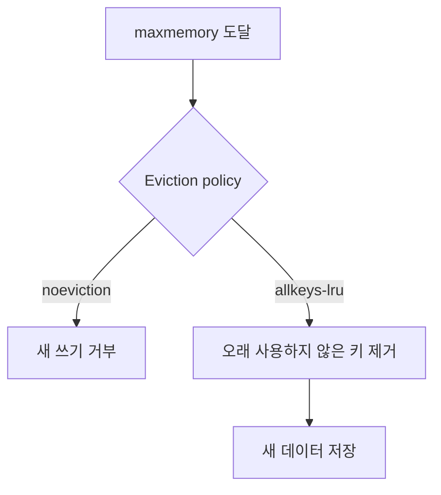
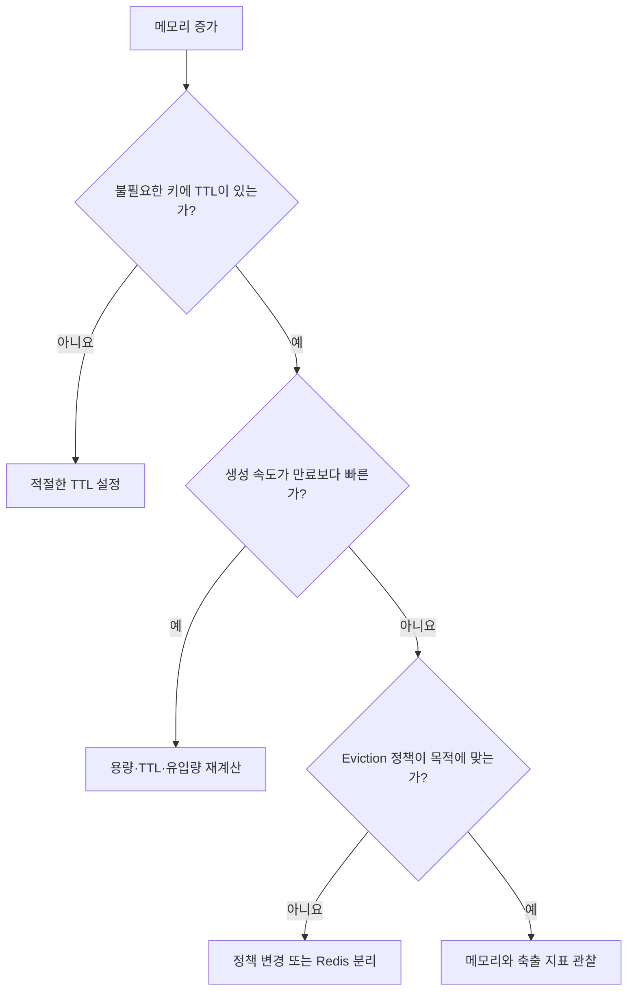

## 창고가 가득 찼는데 아무것도 버리지 않는다

상품을 임시로 보관하는 창고를 생각해보자. 새 상품은 계속 들어오는데 오래된 상품을 버리는 기준이 없다면 창고는 언젠가 가득 찬다.


Redis를 캐시로 사용해도 키의 수명과 메모리 한계에서 버릴 데이터를 정하지 않으면 같은 문제가 생긴다.

## 왜 읽기는 되는데 쓰기만 실패할까

Redis에 `maxmemory`가 설정되어 있고 `maxmemory-policy`가 `noeviction`이면, 메모리 한계에 도달해도 기존 키를 자동으로 제거하지 않는다.

```text
maxmemory 도달
      ↓
noeviction
      ↓
기존 데이터 유지
새 쓰기 → OOM 오류
기존 읽기 → 대부분 정상
```

`noeviction`은 데이터를 임의로 잃지 않는다는 점에서는 안전하지만, 새로운 캐시나 세션을 저장하지 못해 서비스 기능이 멈출 수 있다.

<details>
<summary><b>🔍 Redis는 항상 메모리가 차면 쓰기를 거부할까?</b></summary>

아니다. `maxmemory`와 eviction policy 설정에 따라 다르다.

메모리 제한 없이 운영하면 Redis의 축출 정책이 동작하기 전에 운영체제나 컨테이너의 메모리 한계로 프로세스가 종료될 수도 있다. 관리형 Redis는 서비스별 기본 설정이 다를 수 있으므로 실제 설정을 확인해야 한다.

</details>

영상에서는 `maxmemory`를 8MB로 제한하고 512바이트 세션을 계속 저장했다.

```text
noeviction 적용
→ 10,326번째 쓰기부터 실패
→ 이후 쓰기도 계속 실패
```

이 수치는 해당 실험 환경에서 측정한 값이다. 실제 메모리는 값뿐 아니라 key와 Redis 자료구조의 부가 비용도 사용한다.

## TTL은 사용 기한이다

**TTL(Time To Live)**은 키가 얼마 동안 유효한지를 나타내는 수명이다.

```text
session:123
TTL 30분
→ 30분 뒤 만료
```


세션이나 인증 코드처럼 시간이 지나면 필요 없는 데이터가 계속 남지 않도록 한다.

## TTL이 있어도 메모리는 찰 수 있다

TTL은 시간이 지난 키를 정리하지만 들어오는 속도를 제한하지는 않는다.

```text
초당 생성되는 키: 1,000개
TTL:             60초

동시에 살아 있을 수 있는 키
≈ 1,000 × 60
= 약 60,000개
```

만료되기 전에 더 많은 키가 들어오면 메모리는 계속 증가한다. 영상에서도 TTL을 적용했지만 입력 속도가 만료 속도보다 빨라 9,697번째 쓰기에서 실패했다.

> TTL은 오래된 키를 정리하지만 메모리 한계에서 즉시 공간을 만드는 정책은 아니다.

## Eviction은 한계에서 무엇을 버릴지 정한다

**Eviction policy**는 Redis가 `maxmemory`에 도달했을 때 공간을 만들기 위해 어떤 키를 제거할지 정하는 규칙이다.

| 정책 | 제거 대상 |
|---|---|
| `noeviction` | 키를 제거하지 않고 새 쓰기를 거부 |
| `allkeys-lru` | 모든 키 중 오래 사용되지 않은 키 |
| `allkeys-lfu` | 모든 키 중 사용 빈도가 낮은 키 |
| `volatile-lru` | TTL이 있는 키 중 오래 사용되지 않은 키 |
| `volatile-ttl` | TTL이 있는 키 중 만료가 가까운 키 |

```text
TTL      → 시간이 끝난 키 정리
Eviction → 메모리가 찼을 때 공간 확보
```

영상에서는 `allkeys-lru`를 적용한 뒤 19,745개의 키를 축출하면서 쓰기 실패 없이 계속 저장할 수 있었다.



Redis의 LRU는 모든 키의 완벽한 사용 순위를 계산하는 방식이 아니라 일부 키를 표본으로 뽑아 오래 사용되지 않은 키를 찾는 근사 방식이다.

## 모든 Redis에 allkeys-lru를 쓰면 안 된다

축출돼도 다시 만들 수 있는 캐시라면 `allkeys-lru`나 `allkeys-lfu`를 사용할 수 있다. 하지만 중요한 데이터가 섞여 있다면 주의해야 한다.

| 데이터 | 축출됐을 때 영향 |
|---|---|
| 상품 조회 캐시 | DB에서 다시 생성 가능 |
| 로그인 세션 | 사용자가 갑자기 로그아웃될 수 있음 |
| 분산 락 | 여러 서버가 동시에 작업할 위험 |
| 작업 Queue | 처리할 작업이 유실될 수 있음 |
| 결제 중간 상태 | 복구하기 어려운 데이터 손실 |

Redis에 여러 목적의 데이터를 함께 넣으면 하나의 eviction policy가 모든 키에 적용된다. 캐시와 중요한 상태는 용도별로 분리하는 편이 안전하다.

## 무엇을 확인해야 할까

| 지표 | 확인할 내용 |
|---|---|
| `used_memory` | Redis가 사용하는 메모리 |
| `maxmemory` | 설정된 메모리 한계 |
| `evicted_keys` | 한계 때문에 축출된 키 |
| `expired_keys` | TTL이 끝나 만료된 키 |
| `mem_fragmentation_ratio` | 메모리 단편화 상태 |
| OOM 오류 수 | 메모리 부족으로 쓰기가 실패했는지 |
| 키 생성 속도 | 만료보다 빠르게 키가 쌓이는지 |



> TTL은 키의 수명을 정하고 Eviction은 메모리 한계에서 살아남을 키를 정한다.

## 참고

- [Instagram — Redis 메모리가 차오르다 쓰기가 멈춘다](https://www.instagram.com/reel/Dcq5KgSNK76/)
- [Redis — Key eviction](https://redis.io/docs/latest/develop/reference/eviction/)
- [Redis — EXPIRE](https://redis.io/docs/latest/commands/expire/)
- [Redis — INFO](https://redis.io/docs/latest/commands/info/)
