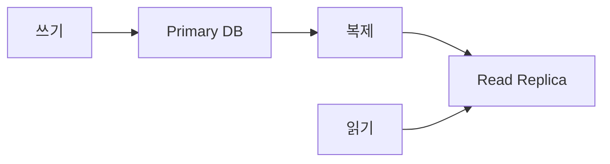
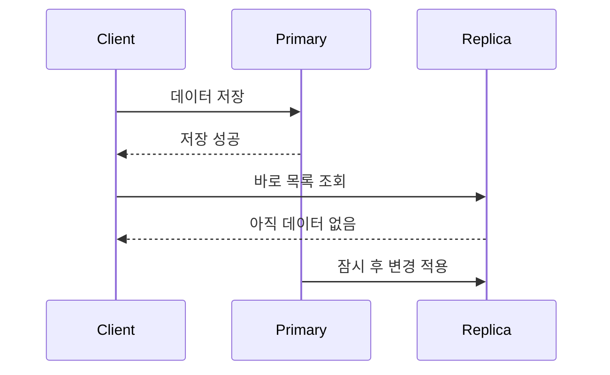
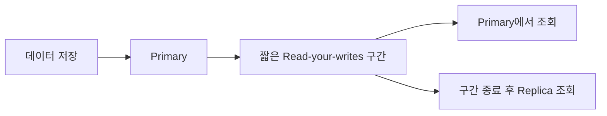
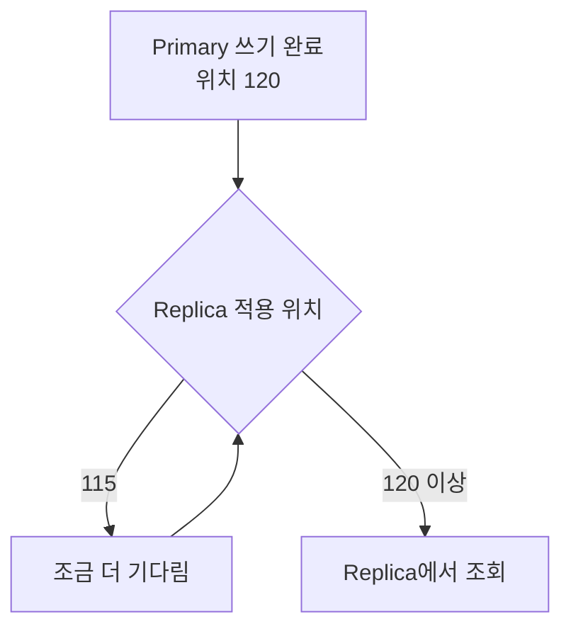

## 원본 장부에는 썼지만 복사본에는 아직 없다

직원이 원본 장부에 새 주문을 기록하고 다른 직원이 복사본으로 목록을 확인한다고 생각해보자. 복사본을 만드는 데 시간이 필요하므로 원본 기록 직후에는 새 주문이 보이지 않을 수 있다.



**Primary**는 쓰기를 담당하는 원본 DB이고, **Read Replica**는 Primary의 변경을 복제해 읽기 요청을 나눠 처리하는 DB다. 복제본은 읽기 부하를 줄이지만 Primary와 항상 같은 순간에 변경되지는 않는다.

## 저장 성공과 복제 완료는 다른 사건이다



Primary가 저장 성공을 응답한 시점에도 변경 내용이 Replica에 아직 적용되지 않았을 수 있다. 이 시간 차이가 **Replication Lag**, 즉 복제 지연이다.

## 조회 시점에 따라 결과가 달라진다

영상에서는 복제 지연을 30ms로 설정했다.

```text
저장 5ms 뒤 Replica 조회
→ 1,000번 중 942번 보이지 않음
→ 실패율 94.2%

저장 25ms 뒤 Replica 조회
→ 보이지 않는 비율 0%
```

변경이 도착하기 전에 읽으면 실패하고 도착한 뒤 읽으면 성공한다. 요청 시점에 따라 결과가 달라져 재현하기 어렵고, Replica가 없는 개발 환경에서는 나타나지 않을 수 있다. 수치는 해당 실험 환경의 결과다.

## 고정된 시간만 기다리면 될까

```text
저장 → 30ms sleep → Replica 조회
```

운영 환경의 복제 지연은 네트워크, DB 부하와 Replica의 적용 속도에 따라 달라진다. 30ms를 기다렸다는 사실이 복제 완료를 보장하지 않는다.

## 방법 1 — 쓴 직후에는 Primary에서 읽는다



사용자가 방금 저장한 데이터를 확인하는 요청만 잠시 Primary로 보낸다.

| 장점 | 단점 |
|---|---|
| 기다리지 않고 최신 데이터를 읽음 | Primary 읽기 부하 증가 |
| 구현이 비교적 단순 | 요청 라우팅 상태가 필요할 수 있음 |

모든 읽기를 Primary로 보내면 Replica를 둔 목적이 약해지므로 방금 쓴 사용자나 데이터에만 짧게 적용해야 한다.

## 방법 2 — Replica가 쓴 지점까지 왔는지 확인한다

DB는 변경 로그의 위치를 이용해 복제 진행 상태를 나타낼 수 있다.

```text
Primary 쓰기 완료 위치: 120
Replica 적용 위치:      115
→ 아직 조회하지 않음

Replica 적용 위치:      120
→ 조회 가능
```



영상에서는 이 방식으로 복제 완료까지 약 11ms를 더 기다렸고 누락 비율이 0%가 됐다. 중요한 것은 시간을 추측하는 게 아니라 내가 쓴 변경 지점까지 Replica가 도착했는지 확인하는 것이다.

## 방법 3 — 더 강한 복제 일관성을 선택한다

동기 복제를 사용하면 Primary가 Replica의 확인을 받을 때까지 쓰기 성공을 기다릴 수 있다.

| 선택 | 얻는 것 | 지불하는 비용 |
|---|---|---|
| 비동기 복제 | 빠른 쓰기와 높은 가용성 | 복제 지연 중 오래된 읽기 |
| 동기 복제 | 더 강한 일관성 | 쓰기 지연과 Replica 장애 영향 |
| 방금 쓴 데이터만 Primary 조회 | 필요한 구간의 최신 읽기 | 일부 Primary 부하 |
| 복제 위치까지 대기 | Replica에서 정확한 시점 확인 | 대기와 구현 복잡성 |

모든 데이터에 같은 수준의 일관성이 필요한 것은 아니다.

```text
내가 방금 작성한 게시글 → 즉시 보여야 함
실시간 인기 순위        → 수초 늦어도 허용 가능
```

<details>
<summary><b>🔍 Read-after-write와 Read-your-writes는 무엇이 다른가?</b></summary>

둘 다 쓰기 직후의 읽기에서 최신 값을 보장하려는 개념이다. `Read-your-writes`는 특히 같은 사용자나 세션이 자신이 방금 쓴 결과를 다시 읽을 때 그 변경을 볼 수 있어야 한다는 보장에 초점을 둔다.

</details>

## 무엇을 측정해야 할까

| 지표 | 확인하는 문제 |
|---|---|
| Primary와 Replica 로그 위치 차이 | 복제할 변경이 얼마나 밀렸는가 |
| Replay lag | 변경이 Replica 조회에 보이기까지 걸리는 시간 |
| Replica CPU·I/O | 적용 속도가 자원에 막혔는가 |
| 네트워크 지연 | 변경 로그 전달이 늦는가 |
| Primary로 우회한 읽기 비율 | 일관성 보장이 Primary를 과도하게 누르는가 |

> 읽기 복제본은 부하를 나눠주지만 방금 저장한 데이터까지 즉시 보인다는 보장은 별도로 설계해야 한다.

## 참고

- [Instagram — 저장은 성공인데 목록에 없는 이유](https://www.instagram.com/reel/DcoNGtnNmSP/)
- [PostgreSQL — Streaming Replication](https://www.postgresql.org/docs/17/warm-standby.html#STREAMING-REPLICATION)
- [PostgreSQL — Replication Statistics](https://www.postgresql.org/docs/17/monitoring-stats.html#MONITORING-PG-STAT-REPLICATION-VIEW)
