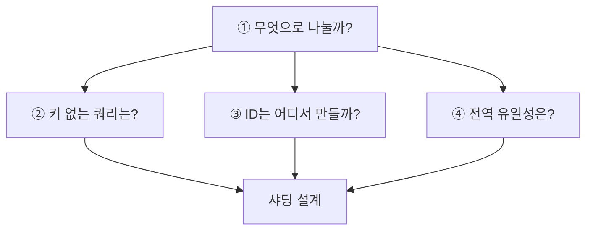

## 왜 샤딩을 하는가

서비스 초기에는 하나의 데이터베이스로도 충분하다. 데이터와 요청이 증가하면 한 서버가 감당할 수 있는 한계에 가까워질 수 있다.

- 데이터가 한 서버의 디스크에 모두 들어가지 않는다.
- 쓰기 요청이 한 서버의 CPU와 I/O 처리량을 넘어선다.
- 테이블과 인덱스가 커지면서 조회와 관리 비용이 증가한다.
- 한 서버에 트래픽이 집중되어 수평으로 처리량을 늘리기 어렵다.

읽기 요청은 read replica로 분산할 수 있지만, 모든 쓰기는 여전히 원본 데이터베이스에 모인다. 저장 용량과 쓰기 처리량을 여러 서버로 나누어야 할 때 샤딩을 검토한다.

```text
샤딩 전

모든 사용자와 주문
        ↓
   하나의 Database
```

```text
샤딩 후

사용자·주문 일부 → shard 1
사용자·주문 일부 → shard 2
사용자·주문 일부 → shard 3
```

샤딩은 하나의 데이터 집합을 여러 독립된 저장소로 나누기 때문에 저장 용량과 요청을 분산할 수 있다.

## 왜 이렇게 복잡하게 정해야 하는가

하나의 데이터베이스에서는 DB가 모든 데이터를 볼 수 있다.

- `UNIQUE` 제약으로 전체 중복을 막을 수 있다.
- auto increment로 중복되지 않는 번호를 발급할 수 있다.
- 한 번의 쿼리로 전체 데이터를 검색하고 집계할 수 있다.
- 여러 행을 하나의 transaction으로 처리할 수 있다.

샤딩한 뒤에는 각 데이터베이스가 자기 샤드의 데이터만 본다.

```text
shard 1은 shard 2의 데이터를 모른다.
shard 2는 shard 3의 제약 조건을 확인할 수 없다.
```

따라서 단일 DB가 대신 처리하던 기능을 애플리케이션이나 별도 시스템이 책임져야 한다. 어느 샤드로 요청을 보낼지 결정하고, 여러 샤드의 결과를 합치며, 전역 ID와 유일성도 별도로 보장해야 한다.

샤딩이 복잡한 이유는 단순히 서버가 많아져서가 아니다. **전체 데이터를 한곳에서 보던 경계가 여러 개로 나뉘기 때문**이다.

<details>
<summary><b>🔍 샤딩은 언제 해야 하나?</b></summary>

데이터가 많아질 가능성만으로 미리 적용하기보다, 단일 DB의 저장 용량이나 쓰기 처리량이 실제 병목이 되었고 인덱스·쿼리 개선, 캐시, read replica, 데이터 보관 정책으로 해결하기 어려울 때 검토한다.

샤딩은 성능을 자동으로 높이는 설정이 아니라 애플리케이션의 데이터 접근 방식을 바꾸는 설계 결정이다.

</details>

## 샤딩 전에 확인할 네 가지



## 1. 무엇으로 나눌 것인가

데이터가 어느 샤드에 들어갈지 결정하는 값을 **샤드 키**라고 한다.

주문을 `userId`로 나누면 한 사용자의 주문이 같은 샤드에 모인다. 사용자 주문 목록은 한 샤드만 조회하면 된다. 반면 `orderId`로 나누면 주문은 고르게 분산될 수 있지만 한 사용자의 주문이 여러 샤드로 흩어질 수 있다.

좋은 샤드 키는 다음 조건을 고려한다.

- 값이 일부 샤드에 몰리지 않고 고르게 분포하는가
- 자주 사용하는 쿼리가 그 값을 알고 있는가
- 특정 사용자의 트래픽이 하나의 샤드에 과도하게 몰리지 않는가

샤드 키를 바꾸려면 기존 데이터를 새로운 기준에 맞춰 이동해야 한다. 운영 중 전체 데이터를 옮기는 재샤딩은 비용과 위험이 크므로 초기 선택이 중요하다.

<details>
<summary><b>🔍 핫 샤드란 무엇인가?</b></summary>

특정 샤드에 데이터나 요청이 지나치게 몰린 상태다. 사용자를 기준으로 잘 분배했더라도 매우 많은 요청을 만드는 사용자가 있다면 그 사용자가 속한 샤드만 부하가 커질 수 있다.

</details>

## 2. 샤드 키가 없는 쿼리는 어떻게 할 것인가

`userId`로 샤딩한 상태에서 특정 사용자의 주문을 조회하면 대상 샤드를 바로 계산할 수 있다. 하지만 다음 요청은 대상 샤드를 특정하기 어렵다.

- 오늘 발생한 전체 주문
- 이번 달 전체 정산
- 모든 사용자를 대상으로 한 검색과 집계
- 샤드 키가 포함되지 않은 관리자 조회

이런 쿼리는 여러 샤드에 요청을 보내고 결과를 합치는 **scatter-gather**가 될 수 있다.

```text
전체 주문 조회
  ├─ shard 1 조회
  ├─ shard 2 조회
  ├─ shard 3 조회
  └─ 결과 병합
```

샤드가 늘어날수록 조회 대상과 실패 지점도 늘어난다. 샤딩 전에는 실제 주요 쿼리를 나열하고 각각 대상 샤드를 한 곳으로 제한할 수 있는지 확인해야 한다.

<details>
<summary><b>🔍 scatter-gather란 무엇인가?</b></summary>

하나의 요청을 여러 샤드에 흩어 보내고(scatter), 각 샤드가 반환한 결과를 다시 모아 합치는(gather) 방식이다. 가장 느린 샤드가 전체 응답 시간을 결정할 수 있고 정렬·집계·페이지네이션도 복잡해진다.

</details>

## 3. ID는 어디에서 만들 것인가

각 샤드의 auto increment가 독립적으로 동작하면 서로 다른 샤드에서 같은 번호가 생성될 수 있다.

```text
shard 1: order_id = 1
shard 2: order_id = 1
shard 3: order_id = 1
```

샤드 안에서는 문제가 없지만 시스템 전체의 주문 번호로는 사용할 수 없다. 고객 문의, 환불, 로그 추적처럼 샤드 밖에서 ID를 사용할 때 충돌한다.

대표적인 해결 방법은 다음과 같다.

- UUID처럼 각 노드가 독립적으로 생성할 수 있는 ID
- 시간·노드 번호·순번을 조합하는 Snowflake 계열 ID
- ID를 전담해서 발급하는 별도의 서비스
- 샤드 번호를 ID에 포함하는 방식

충돌 가능성뿐 아니라 정렬 필요성, ID 크기, 생성기의 장애 지점도 함께 고려해야 한다.

## 4. 전역 유일성을 어떻게 지킬 것인가

각 샤드에 이메일 `UNIQUE` 제약을 설정해도 시스템 전체의 이메일 중복을 막지는 못한다.

```text
shard 1: user@example.com → 성공
shard 2: user@example.com → 성공
```

각 데이터베이스는 자기 샤드 내부의 데이터만 확인하기 때문이다.

전역 유일성이 필요하다면 다음과 같은 별도 설계가 필요하다.

- 유일해야 하는 값만 중앙 저장소에서 관리한다.
- 이메일을 샤드 키로 사용해 같은 이메일이 항상 같은 샤드로 가게 한다.
- 예약 테이블이나 조정 계층에서 먼저 값을 선점한다.

이메일을 샤드 키로 선택하면 이메일 유일성은 쉬워질 수 있지만, 한 사용자의 주문을 함께 저장해야 한다는 다른 목적과 충돌할 수 있다.

## 네 결정은 서로 연결되어 있다

- 샤드 키가 쿼리 범위를 결정한다.
- 샤드 경계가 ID 발급 방법에 영향을 준다.
- 유일성 기준이 샤드 키 선택을 다시 바꿀 수 있다.
- 전체 샤드 조회가 많으면 분산으로 얻은 이익보다 병합 비용이 커질 수 있다.

샤딩은 단일 DB의 물리적 한계를 넘을 수 있게 하지만, 그동안 DB가 전체 데이터를 보며 제공하던 기능을 포기하게 만든다. 따라서 서버 수보다 실제 조회 패턴과 보장해야 할 제약을 먼저 정해야 한다.

## 참고

- [Instagram — 샤딩하기 전에 정해야 하는 것들](https://www.instagram.com/reel/DcyQ3PcNCMW/)
