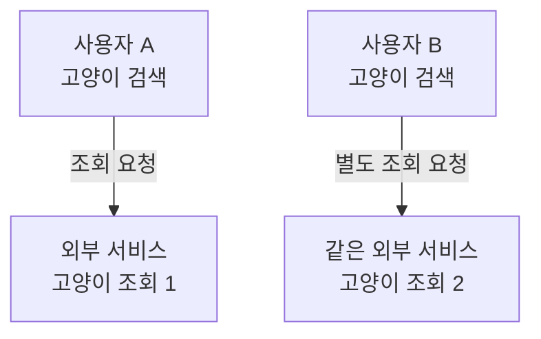
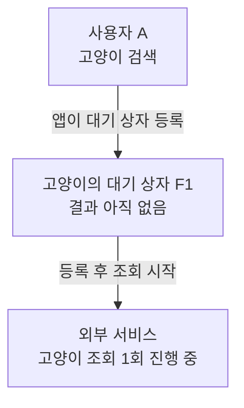
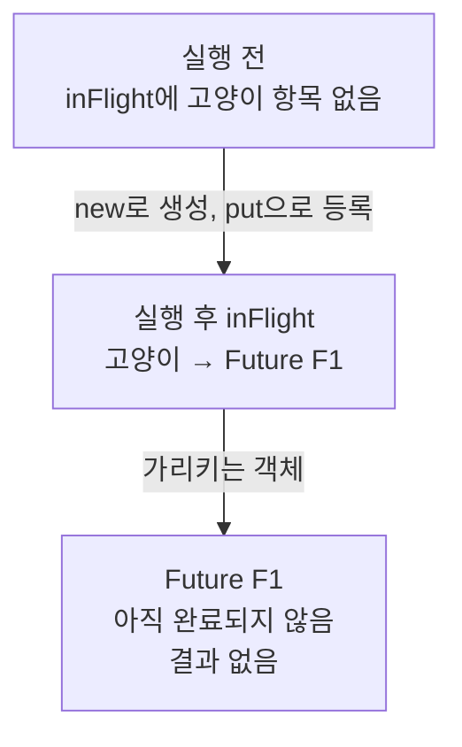
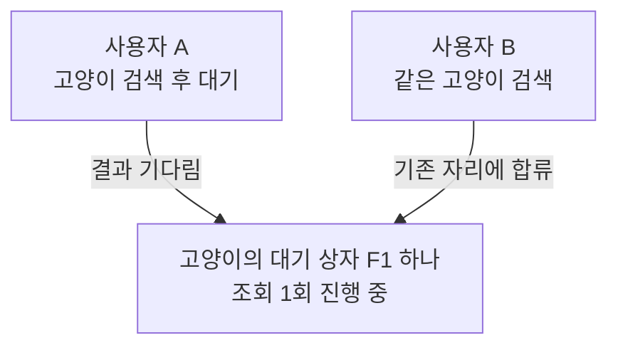
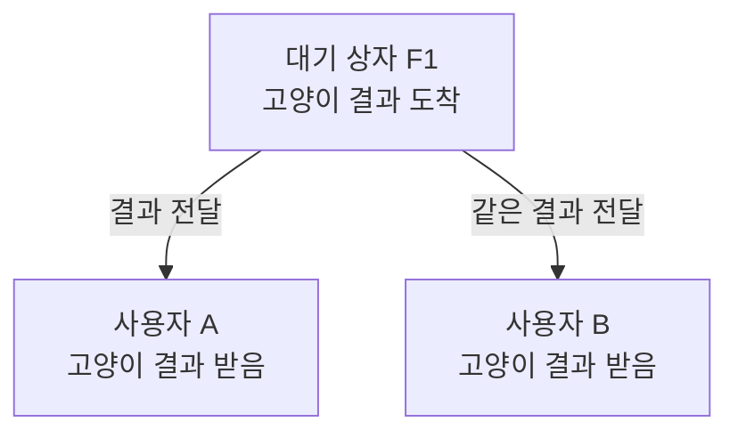
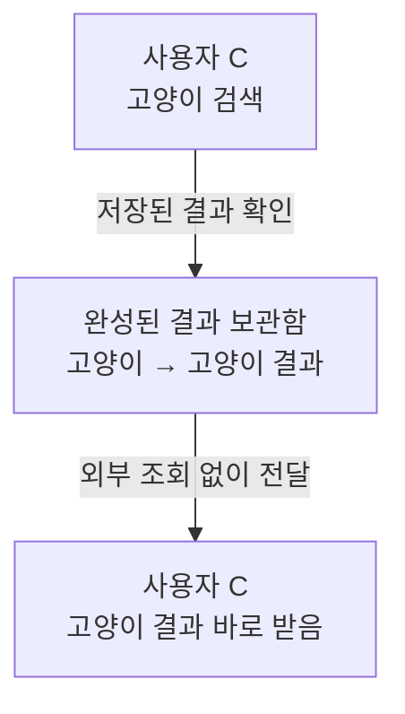
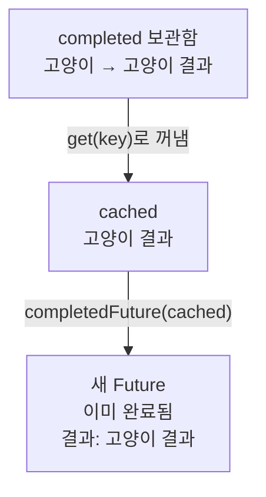

## 01 · 두 사람이 같은 검색을 했는데, 조회도 두 번 한다

검색 결과를 만들려고 다른 서비스에 조회를 보내는 앱이 있다. 이 외부 서비스에 보내는 요청을 API 호출이라고 한다. 저장된 결과가 없을 때, A와 B가 거의 동시에 `고양이`를 검색했다.



결과: 같은 검색 결과가 필요한데 외부 서비스는 일을 두 번 한다. 호출마다 비용이 들거나 요청량이 제한된 서비스라면 이런 중복을 줄일 이유가 있다.

**이번 목표는 조회 한 번의 결과를 A와 B가 함께 받는 것.** 같은 결과를 공유해도 되는 검색어이고, 한 서버 프로세스 안에서 요청들이 하나의 병합 객체를 공유한다고 가정한다. 서버 여러 대의 조회까지 합치는 방식은 아니다.

## 02 · A의 조회를 시작하며, 함께 기다릴 자리를 만든다

A의 요청을 받은 앱은 두 가지를 확인한다. **저장된 결과가 있나? 같은 검색을 이미 조회하고 있나?** 둘 다 없으므로 조회를 시작할 차례다.

그 전에 결과를 받을 상자 하나를 만들고, `고양이`의 진행 중 작업으로 등록한다. 그림에서는 이 상자를 F1이라고 부른다.



결과: 검색 결과는 아직 없지만, 다음 요청이 함께 기다릴 자리가 생겼다. 상자가 스스로 조회하는 것은 아니고 앱의 조회 코드가 별도로 실행된다.

이 상자 역할을 하는 것이 Java 기본 클래스 `CompletableFuture`다. 별도 설치 없이 사용하며, 아직 결과가 없는 객체를 먼저 만들고 나중에 결과를 채울 수 있다. 그림은 역할을 표현한 것이지 실제 메모리 구조는 아니다.

<details>
<summary>Java로 대기 상자를 만들고 등록하는 두 줄</summary>

프로젝트가 Java 21에서 `CompletableFuture`를 사용하므로 예제도 이 클래스를 사용한다. `import`는 사용할 클래스의 위치를 알려준다.

```java
import java.util.concurrent.CompletableFuture;
```

`key`는 검색어 `고양이`다. 검색어별로 결과나 객체를 보관하는 자료구조를 `Map`이라고 한다. 보관함은 예제에서 직접 만들며, Future 자체가 캐싱이나 중복 조회 방지를 해주는 것은 아니다.

| 보관함 | 저장하는 것 |
| --- | --- |
| `completed` | 검색어 → 완성된 결과값 |
| `inFlight` | 검색어 → 처리 중인 Future |

```java
pending = new CompletableFuture<>();
inFlight.put(key, pending);
```

`new`는 객체 생성이다. `pending`은 새 Future를 가리키는 이름이다. `put`은 검색어와 그 객체를 짝지어 보관한다.



결과: 02 장면의 대기 상자 F1이 진행 중 보관함에 등록됐다.

여기까지는 외부 API 호출이 아니다. **등록을 마친 A만 이 보호 구간을 나온 뒤 실제 조회를 시작하고 F1을 돌려준다.** 작업 실행을 맡은 `workers`가 조회 코드를 실행한다. Future를 생성하는 것만으로 조회가 시작되지는 않는다.

</details>

## 03 · B도 같은 검색이면, 이미 있는 자리에 합류한다

아직 조회 중인데 B도 `고양이`를 검색했다. 앱은 “이 검색은 이미 처리 중이네”라고 확인하고, **A가 기다리는 F1을 B에게도 준다.** 새로운 조회는 시작하지 않는다.



결과: 기다리는 사람은 두 명이지만, 진행 중인 조회는 하나다. 다른 검색어라면 다른 작업을 시작한다.

이 확인과 등록은 한 요청씩 처리한다. A와 B가 동시에 “아무도 조회하지 않네”라고 판단해 각자 조회를 시작하는 것을 막기 위해서다. 느린 외부 응답을 기다리는 동안까지 다른 요청을 막지는 않는다.

<details>
<summary>Java로 기존 Future를 찾아 돌려주기</summary>

```java
CompletableFuture<String> existing = inFlight.get(key);
if (existing != null) return existing;
```

`CompletableFuture<String>`은 결과가 문자열인 Future라는 뜻이다. `existing`은 찾은 객체를 가리키는 이름이다. 복사본을 만드는 코드가 아니다.

`get(key)`는 등록된 Future를 찾는다. 없으면 `null`이다. `!= null`이면 객체가 있다는 뜻이고, `return`은 그것을 돌려주고 여기서 끝내라는 뜻이다. 결과: B는 새 Future 생성이나 외부 조회로 넘어가지 않는다.

**확인과 등록은 `synchronized (this)` 안에서 한다.** 이 Java 문법은 같은 객체의 보호 구간에 한 번에 한 실행만 들어가게 한다. A가 확인하고 등록하는 중 B가 끼어들어 “아무도 조회 중이지 않네”라고 판단하는 일을 막는다. 느린 외부 조회는 구간 밖에서 한다.

</details>

<details>
<summary>지금까지 본 세 갈래를 한 코드로 연결하기</summary>

위에서부터 완성된 값, 진행 중인 Future, 새 Future 순서로 확인한다. 앞의 두 `return`을 만나면 아래 코드는 실행하지 않는다.

```java
synchronized (this) {
    String cached = completed.get(key);
    if (cached != null) return CompletableFuture.completedFuture(cached);

    CompletableFuture<String> existing = inFlight.get(key);
    if (existing != null) return existing;

    pending = new CompletableFuture<>();
    inFlight.put(key, pending);
}
```

</details>

## 04 · 결과 하나를 두 사람에게 전달한다

외부 서비스가 응답했다. 앱은 F1에 결과를 채운다. A와 B가 서로 다른 빈 상자를 받았다면 각각 채워야 하지만, **같은 상자 하나를 받았기 때문에 같은 결과를 받는다.** 결과를 두 사람이 꺼내 쓸 수 있다는 뜻이며, 상자는 한 번 쓰고 사라지는 물건이 아니다.



결과: **조회 2회가 1회로 줄었고, A와 B 모두 결과를 받았다.** 이 방식이 같은 작업을 하나로 합치는 Single-flight다.

<details>
<summary>Java로 Future에 결과 채우기</summary>

예제에서는 검색 결과를 문자열 `고양이 결과`로 단순화했다. `value`는 외부 조회가 돌려준 값이다. 전체 구현에서 관련 줄만 발췌하면 다음과 같다.

```java
completed.put(key, value);
inFlight.remove(key, pending);
pending.complete(value);
```

완성된 값은 `completed`에 저장하고, 진행 중 목록에서는 등록을 지운다. `complete(value)`가 A와 B가 받은 F1을 완료시키고 결과를 채운다. 목록에서 등록을 지워도 A와 B가 이미 받은 객체가 없어지는 것은 아니다.

</details>

## 05 · 다음 사람은 저장된 결과를 바로 받는다

앱은 완성된 결과도 따로 저장해둔다. 이렇게 나중에 재사용하려고 결과를 보관하는 것이 캐시다. 결과가 남아 있는 동안 C가 `고양이`를 검색하면 외부 서비스를 다시 조회할 필요가 없다.



결과: **끝난 작업은 저장된 결과를 재사용하고, 아직 끝나지 않은 작업은 함께 기다린다.** 둘은 다른 상황에 쓰는 방법이다.

<details>
<summary>이미 값이 있는데 completedFuture를 만드는 이유</summary>

```java
String cached = completed.get(key);
if (cached != null) return CompletableFuture.completedFuture(cached);
```

`String cached`는 보관함에서 꺼낸 문자열에 `cached`라는 이름을 붙인다. `!= null`이면 값이 있다는 뜻이다.



결과: 조회 없이, 결과가 이미 채워진 Future를 돌려준다. `completed`는 보관함이고 `completedFuture(값)`는 완료된 Future를 만드는 명령이다. 이 메서드는 결과가 지금 있든 나중에 나오든 Future 형태로 돌려주므로 저장된 값도 Future에 담는다. [Java 21 공식 설명](https://docs.oracle.com/en/java/javase/21/docs/api/java.base/java/util/concurrent/CompletableFuture.html#completedFuture(U))

</details>

<details>
<summary>검증에서는 실제로 몇 번 호출됐을까?</summary>

첫 조회를 끝내지 않은 상태에서 같은 검색어로 100번 요청했더니 받은 Future가 같았고, 원본 조회 시작은 1회였다. 100개 스레드가 동시에 시작하는 부하 시험은 아니다. 첫 작업이 끝나기 전에 후속 요청이 같은 객체를 받는지를 확인한 시험이다.

</details>

<details>
<summary>실행 검증한 전체 Java 예제</summary>

```java
import java.util.HashMap;
import java.util.LinkedHashMap;
import java.util.Map;
import java.util.concurrent.CompletableFuture;
import java.util.concurrent.Executor;
import java.util.function.Supplier;

public final class SingleFlightExample {
    private final Executor workers;
    private final Map<String, CompletableFuture<String>> inFlight = new HashMap<>();
    private final Map<String, String> completed = new LinkedHashMap<>(16, 0.75f, true) {
        @Override
        protected boolean removeEldestEntry(Map.Entry<String, String> eldest) {
            return size() > 1_000;
        }
    };

    public SingleFlightExample(Executor workers) {
        this.workers = workers;
    }

    public CompletableFuture<String> getOrStart(String key, Supplier<String> loadOrigin) {
        CompletableFuture<String> pending;
        synchronized (this) {
            String cached = completed.get(key);
            if (cached != null) return CompletableFuture.completedFuture(cached);

            CompletableFuture<String> existing = inFlight.get(key);
            if (existing != null) return existing;

            pending = new CompletableFuture<>();
            inFlight.put(key, pending);
        }

        // 원본 호출 중에도 다른 키가 등록될 수 있도록 보호 구간 밖에서 시작한다.
        try {
            workers.execute(() -> loadAndShare(key, pending, loadOrigin));
        } catch (RuntimeException rejected) {
            removeInFlight(key, pending);
            pending.completeExceptionally(rejected);
        }
        return pending;
    }

    private void loadAndShare(String key, CompletableFuture<String> pending, Supplier<String> loadOrigin) {
        try {
            String value = loadOrigin.get();
            synchronized (this) {
                if (value != null) completed.put(key, value);
                inFlight.remove(key, pending);
            }
            pending.complete(value);
        } catch (Throwable failure) {
            removeInFlight(key, pending);
            pending.completeExceptionally(failure);
            if (failure instanceof Error fatal) throw fatal;
        }
    }

    private synchronized void removeInFlight(String key, CompletableFuture<String> pending) {
        inFlight.remove(key, pending);
    }
}
```

`Executor`는 작업을 실행할 자원을 받는 자리다. 예제의 호출자는 실행기를 제공하고 종료한다. 정상 값은 최대 1,000개를 최근 사용 순서로 보관한다. 실패 결과는 보관하지 않는다.

예제의 입력은 정규화된 비어 있지 않은 키와 유효한 로더다. 운영에 적용할 때는 입력 검증, 실행 자원·대기열·진행 키 수의 상한, 원본 API 자체 제한 시간과 결과 변경 방지를 별도로 설계한다. 병합 원리를 보이는 학습 코드이며 그대로 교체하면 운영 준비가 끝나는 코드는 아니다.

</details>

## 06 · A만 기다리기를 포기할 수도 있다

조회가 오래 걸려 A는 기다리기를 포기했다. 그래도 B는 아직 기다리고 있다. **A가 포기했다고 공유한 Future까지 취소하면 B도 그 Future로 정상 결과를 받을 수 없다.** 이 예제에서는 조회를 유지하고, 늦게 도착한 결과도 저장한다. 기다리는 시간과 작업 자체의 수명은 다르다.

[대기와 취소의 차이 더 읽기](/study/cs/cancellation-propagation)

<details>
<summary>Java로 최대 300밀리초만 기다리기</summary>

PromptHub는 외부 결과를 최대 300ms 기다리고, 늦으면 키워드 검색만으로 응답한다. 뒤늦게 끝난 작업은 캐시에 저장한다.

`get`은 Future에서 결과를 받는 메서드다. 아직 결과가 없으면 기다린다. `300, TimeUnit.MILLISECONDS`는 최대 300밀리초까지만 기다리라는 뜻이다. `TimeUnit`도 Java 기본 클래스다.

```java
CompletableFuture<String> shared = cache.getOrStart(key, loadOrigin);
String result = shared.get(300, TimeUnit.MILLISECONDS);
```

시간 안에 결과가 없으면 `TimeoutException`이라는 대기 시간 초과 예외를 처리한다. **이 예제에서는 A가 기다리기를 포기해도 F1을 지우거나 취소하지 않는다.** B가 여전히 기다릴 수 있기 때문이다. [대기와 취소의 차이 더 읽기](/study/cs/cancellation-propagation)

</details>

<details>
<summary>공유 Future를 취소해도 될까?</summary>

같은 통로를 받았으므로 `cancel`, `complete`, `orTimeout`처럼 Future 자체를 바꾸는 연산은 다른 대기자에게도 영향을 줄 수 있다. 이 학습 예제의 호출자는 제한 시간 있는 `get`만 사용하고, 공유 통로를 직접 변경하지 않는다.

호출자의 대기 포기와 원본 작업 종료는 다르다. 원본 HTTP 요청의 자체 timeout과 취소 정책도 필요하다. 진행 상태를 제거하는 것은 로컬 등록 정리이며, 서버가 여러 대인 환경까지 조정하지 않는다.

</details>

<details>
<summary>실패하거나 작업 시작을 거절당했을 때도 검증했을까?</summary>

| Java 21 예제에서 실행한 시험 | 확인 결과 |
| --- | --- |
| 병합 전 원본 두 개를 완료 전에 겹침 | 원본 시작 2회 |
| 같은 키로 진행 중 통로 100번 요청 | 같은 통로, 원본 시작 1회 |
| 다른 키 요청 | 별도 작업 완료 |
| 호출자 대기 timeout | 진행 통로 유지, 늦은 결과 저장 |
| 원본 실패 후 새 요청 | 실패 상태 정리 후 재시도 성공 |
| 실행기가 작업을 거절 | 대기 통로 실패 완료, 등록 정리 |

`get`의 대기 제한은 원본 작업을 멈추는 장치가 아니다. 실패·실행 거절 시에도 결과 통로를 끝내고 등록을 정리해야 뒤의 요청이 영원히 기다리지 않는다.

</details>

## 자기 말로 답해보기

원본은 아직 응답을 기다리는데 A만 300ms를 넘겼다. 그때 진행 중 키를 지우면 어떻게 될까?

<details>
<summary>답 확인</summary>

C가 아무도 작업하지 않는다고 판단해 중복 원본 호출을 시작할 수 있다. 호출자의 대기 시간과 원본 작업의 수명을 구분해야 한다.

</details>

## 프로젝트에 적용하기 전에

예제는 원리를 독립 실행으로 확인한 것이다. PromptHub의 `float[]` 반환, 검색어 정규화, 기존 실패 응답과 제한 시간을 그대로 보존한 프로젝트 패치까지 수행한 것은 아니다. [확인한 프로젝트 코드](https://github.com/prgrms-be-adv-devcourse/beadv6_6_3JMT_BE/blob/7a4c363f04ca96c9f641f66906a301cf22055c3b/product-service/src/main/java/com/prompthub/search/application/QueryEmbeddingCache.java)

<details>
<summary>이미 캐시 라이브러리를 쓴다면?</summary>

Caffeine의 원자적 로딩 API나 Spring의 `@Cacheable(sync = true)`도 검토할 수 있다. 기존 라이브러리가 필요한 정책을 지원하면 직접 병합 코드를 추가하는 것보다 단순할 수 있다. Spring의 실제 동기화 동작은 캐시 제공자에 달려 있다.

- [Caffeine 공식 Population 문서](https://github.com/ben-manes/caffeine/wiki/Population)
- [Spring Cacheable 공식 문서](https://docs.spring.io/spring-framework/docs/current/javadoc-api/org/springframework/cache/annotation/Cacheable.html)
- [Java 21 CompletableFuture 공식 문서](https://docs.oracle.com/en/java/javase/21/docs/api/java.base/java/util/concurrent/CompletableFuture.html)

조사·예제 실행일은 2026-10-06이다. 라이브러리 설치나 최신 버전으로의 전환을 권장하는 예제는 아니다.

</details>
