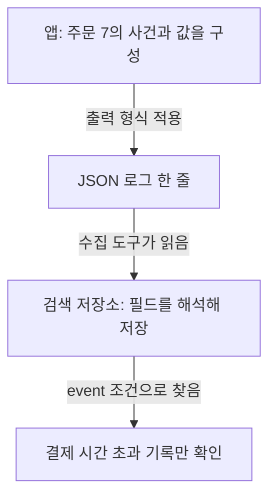

## 01 · 같은 오류인데 문장이 조금씩 다르다

주문 7의 결제 요청이 시간 초과됐다. 로그에 “결제 실패”, “결제 응답 대기 초과”처럼 표현이 섞여 있으면 같은 사건을 문장 검색으로 모으기 어렵다.

**사건을 일정한 필드로 나누고, 수집 도구가 필드를 읽도록 설정**하면 같은 조건으로 찾기 쉽다. 아래 숫자와 사건 이름은 학습용이다.

## 02 · 문장 속 값을 이름표로 나눈다

전에는 한 문장이다.

```text
주문 7 결제 실패, 3000ms 기다림
```

후에는 이름과 값으로 나눈다. JSON은 이런 데이터를 표현하는 형식이다. DB나 검색 엔진의 이름이 아니다.

```json
{"event":"payment_timeout","orderId":7,"durationMs":3000}
```

- `event`: 무슨 사건인가? → 결제 시간 초과.
- `orderId`: 어느 주문인가? → 7.
- `durationMs`: 얼마나 기다렸나? → 3000밀리초, 즉 3초.

이 이름들은 예제에서 정한 약속이다. Java 기본 필드가 아니며 프로젝트마다 이름이 다를 수 있다. 같은 의미라면 이름과 타입은 일정하게 유지한다.

## 03 · 필드를 남기는 것과 검색하는 것은 다른 단계다



JSON으로 출력해도 수집 도구가 문장 하나로 저장하면 원하는 필드 검색이 되지 않을 수 있다. `durationMs`를 숫자로 저장해야 시간 비교도 의도대로 할 수 있다. `3000`과 `"3000"`은 JSON에서 다른 타입이다.

<details>
<summary>Spring Boot에서는 JSON 출력을 어떻게 켤까?</summary>

Spring Boot는 Java 웹 앱 등에 사용하는 외부 프레임워크다. 아래는 그 구조화 로그 기능을 사용하는 설정 예시이며, 별도 캐시나 검색 라이브러리 설정은 아니다.

```yaml
logging:
  structured:
    format:
      console: logstash
```

기본 로깅 설정에서 콘솔 출력을 Logstash JSON 형식으로 바꾸는 예시다. 예제의 `event`, `orderId`, `durationMs`를 이 설정만으로 자동 생성하지는 않는다. 앱에서 사건의 값을 구성해야 한다. SLF4J의 `addKeyValue` 등으로 필드를 구성할 수 있다.

별도 Logback 설정이 있으면 구조화 출력 설정을 반영하는 appender인지도 확인한다. 로그 수집과 검색 저장소 연결은 또 다른 작업이다.

2026-10-08 공식 문서 기준으로 확인했으며 구조화 로그 지원은 Spring Boot 3.4에 도입됐다. 로컬 프로젝트는 `build.gradle`에서 Boot 4.1.0을 사용하지만, 여기의 YAML을 실제로 적용해 출력 검증한 것은 아니다. [Spring Boot Logging](https://docs.spring.io/spring-boot/reference/features/logging.html), [Spring Boot 3.4 도입 안내](https://spring.io/blog/2024/08/23/structured-logging-in-spring-boot-3-4/)

</details>

## 04 · 프로젝트에서는 필드 구성부터 확인한다

2026-10-08 로컬 PromptHub의 `GatewayAccessLogWriter`에서 `eventType`, `requestId`, `status`, `durationMs` 등을 키-값으로 구성하는 코드를 확인했다. 따라서 “필드 구성 코드가 있다”까지는 말할 수 있다.

**최종 JSON 출력과 운영 수집·검색 결과는 이번 확인 범위에 없다.** 코드에 필드가 있다는 것과 대시보드에서 검색된다는 것을 구분한다. [기존 검색 이벤트 파이프라인 노트](/study/es/search-event-log-pipeline)도 출력 이후의 수집·저장 개념을 읽는 연결 자료이지, 이 Gateway 로그의 배포 완료 근거는 아니다.

토큰, 비밀번호, 결제 정보와 요청 본문 전체를 그대로 기록하지 않는다. 예시의 주문 번호도 실제 운영에서는 접근 권한과 보관 정책을 함께 검토한다.

## 자기 말로 답해보기

JSON 로그에 `durationMs`가 있는데 검색 도구에서 숫자 비교가 되지 않는다. 어디부터 확인할까?

<details>
<summary>답 확인</summary>

앱 출력의 타입, 수집 과정의 필드 해석, 저장소의 필드 타입을 순서대로 확인한다. JSON이라는 형식만으로 숫자 색인과 조건 검색이 보장되지는 않는다.

</details>

다음은 [traceId·spanId·eventId 구분](/study/cs/trace-span-event-identifiers)이다.
