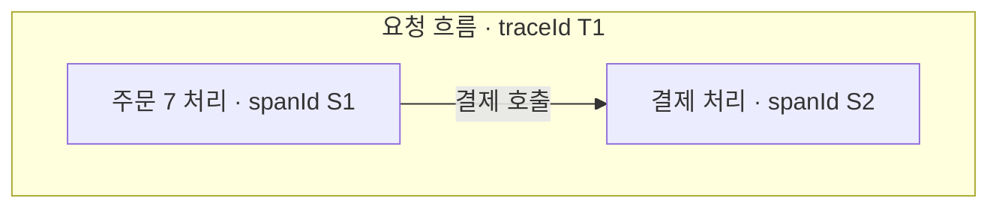
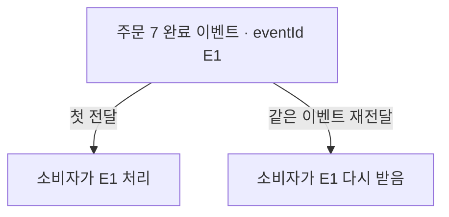

## 01 · 주문 7의 여러 기록을 연결하고 싶다

주문 API가 결제 서비스를 부르고, 주문 이벤트를 발행한다. 문제가 생겼을 때 **같은 흐름인지, 어떤 작업인지, 같은 이벤트가 다시 왔는지**를 나눠 알아야 한다.

아래 T1, S1, S2, E1은 학습용 별칭이다. 실제 표준 추적 ID 형식이 아니며 주문 번호 7과도 다르다. 서비스들이 추적 맥락을 전달하고 작업을 기록한다는 조건의 그림이다.

## 02 · traceId는 흐름, spanId는 그 안의 작업이다



같은 흐름이므로 traceId는 T1이다. 주문 처리와 결제 처리는 서로 다른 **작업 구간(span)**이므로 spanId는 다르다.

이름이 같은 필드를 두 서비스 로그에 추가하는 것만으로 연결되지는 않는다. 호출할 때 추적 맥락을 전달하고 받는 쪽이 이어서 기록해야 한다. [OpenTelemetry Traces](https://opentelemetry.io/docs/concepts/signals/traces/)

## 03 · eventId는 전달되는 이벤트 자체를 구분한다



`eventId`는 이 예시에서 애플리케이션이 정한 이벤트 식별자다. 같은 주문의 서로 다른 이벤트까지 모두 같은 ID를 쓰는 것은 아니다.

같은 E1이 다시 오면 “이미 처리한 E1인가?”를 확인할 수 있다. 하지만 **번호만 붙인다고 중복 처리가 막히지는 않는다.** 처리 여부 기록과 실제 변경의 안전한 경계가 필요하다. [중복 소비와 멱등 처리](/study/msa/kafka-offset-lag-reprocessing-idempotency)

## 04 · 같은 이벤트의 재처리가 같은 실행은 아니다

```text
전달된 이벤트: E1 → 첫 처리의 작업 구간
재전달된 이벤트: E1 → 새 재처리 작업 구간
```

재처리는 새 트레이스에서 실행되고 원래 흐름과 연결될 수도 있다. 이벤트 ID가 같다는 이유로 모든 재처리의 traceId와 spanId까지 같아야 하는 것은 아니다. 비동기 흐름을 어떻게 이어갈지에 따라 추적 관계가 달라진다. [OpenTelemetry의 Span links](https://opentelemetry.io/docs/concepts/signals/traces/#span-links)

<details>
<summary>traceparent는 뭐고, 실제 ID는 어떻게 생겼을까?</summary>

`traceparent`는 HTTP 호출에서 표준 추적 맥락을 전달하는 헤더다. W3C 명세의 version 00 형식에서 trace ID는 32자리, 부모 작업 ID는 16자리의 16진수다. T1/S1은 그림을 읽기 쉽게 줄인 별칭일 뿐 실제 헤더에 넣을 수 있는 ID가 아니다.

OpenTelemetry 같은 계측 기능은 작업과 추적 맥락을 다루는 데 사용한다. ID를 만든다고 로그 저장소, 수집기, 대시보드까지 자동으로 설치되는 것은 아니다. [W3C Trace Context](https://www.w3.org/TR/trace-context/)

</details>

## 프로젝트의 requestId와는 무엇이 다를까?

2026-10-08 로컬 PromptHub의 `RequestIdMdcFilter`를 확인했다. 유효한 `X-Request-Id` UUID를 사용하거나 새 UUID를 만들고, 로그 문맥에 `requestId`로 넣은 뒤 요청 처리가 끝나면 제거한다. UUID는 식별자 형식이고, 이 코드의 번호는 요청 로그를 묶기 위한 것이다.

**이 필터만으로 W3C 추적 맥락 전파나 분산 트레이싱이 구현됐다고 볼 수 없다.** 실제 계측과 서비스 간 전달, 수집 결과를 확인해야 한다. 로컬 코드 확인이며 원격 저장소나 배포 상태까지 확인한 것은 아니다.

## 자기 말로 답해보기

주문 7의 이벤트 E1을 재처리했다. 세 ID가 모두 처음과 같아야 할까?

<details>
<summary>답 확인</summary>

같은 이벤트의 재전달이라면 E1은 유지한다. 재처리는 별도의 작업이므로 spanId까지 같게 쓰지 않는다. traceId는 비동기 추적 설계에 따라 새 흐름일 수 있고 이전 흐름과 연결될 수 있다.

</details>

공식 자료 확인일: 2026-10-08. 수집·검색 흐름과 실제 계측 설정은 후속 학습 범위다.
