## 장부를 지워도 이미 보낸 택배는 돌아오지 않는다

상품 주문을 종이 장부에 기록하고 택배를 발송한다고 생각해보자.

주문 기록이 잘못되어 장부에서 지울 수는 있다. 하지만 택배는 이미 집을 떠났다. 장부를 지운다고 택배가 자동으로 돌아오지는 않는다.

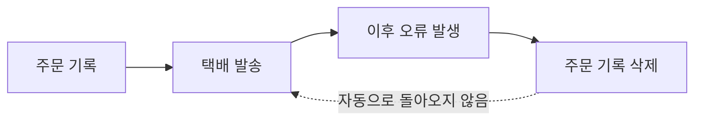

택배를 되돌리려면 배송 취소나 반송이라는 새로운 작업이 필요하다. DB transaction과 외부 결제의 관계도 이와 비슷하다.

## DB Rollback이 되돌리는 범위

주문 처리 중 다음 작업을 실행했다고 가정한다.

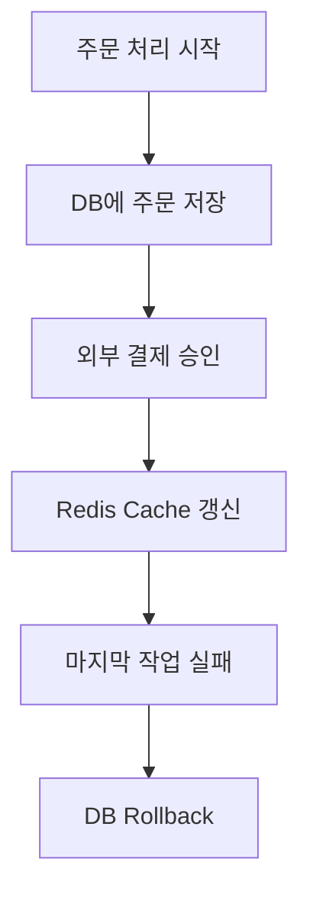

Rollback 이후 결과는 서로 다르다.

| 작업 | Rollback 후 |
|---|---|
| 같은 transaction의 주문 행 | 되돌아감 |
| 외부 결제 승인 | 그대로 남음 |
| Redis cache 변경 | 그대로 남음 |
| 발급한 sequence 번호 | 다시 사용하지 않음 |

같은 메서드 안에서 실행됐더라도 모두 같은 transaction에 포함되는 것은 아니다.

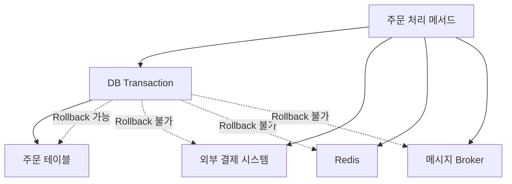

DB transaction은 자신이 관리하는 DB 변경만 직접 되돌릴 수 있다.

## 결제는 별도의 취소 작업이 필요하다

결제 승인 이후 주문 처리가 실패했다고 가정한다.

```text
주문 저장
  → 결제 승인 성공
  → 이후 처리 실패
  → 주문 DB Rollback
  → 결제는 남아 있음
```

결제를 없던 일로 만들 수는 없다. 대신 결제 취소라는 반대 작업을 실행한다.

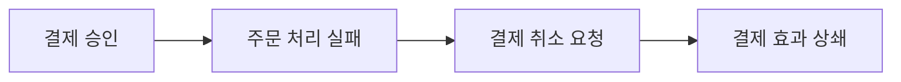

이처럼 이미 완료된 작업의 효과를 상쇄하기 위해 실행하는 반대 작업을 **보상 작업**이라고 한다.

```text
결제 승인 ↔ 결제 취소
재고 예약 ↔ 재고 예약 해제
포인트 차감 ↔ 포인트 복구
```

Rollback은 과거 작업을 지우지만, 보상은 반대 작업을 새로 실행한다.

## Sequence 번호도 되돌아가지 않는다

첫 transaction이 주문 번호 1을 발급받은 뒤 실패했다고 가정한다.

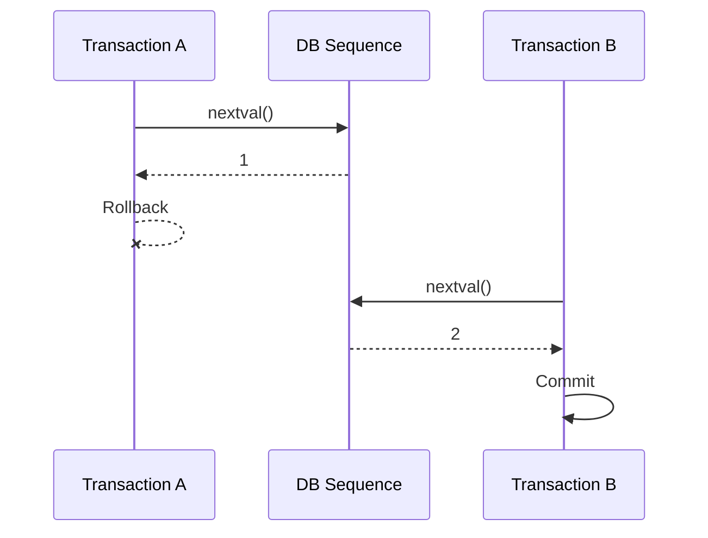

DB에는 2번 주문만 저장되고 1번은 비어 있을 수 있다.

```text
저장된 주문 ID: 2
비어 있는 ID:   1
```

PostgreSQL의 sequence는 동시에 실행되는 transaction이 서로 다른 번호를 받을 수 있도록 동작한다. 이미 발급한 번호를 회수하지 않기 때문에 rollback이나 충돌이 발생하면 번호 사이에 빈칸이 생길 수 있다.

Sequence는 **중복 없는 번호**를 위한 장치이지 **빈틈없는 번호**를 위한 장치가 아니다.

## 외부 호출을 나중에 하면 해결될까

외부 결제를 DB transaction이 끝난 뒤 호출하면 긴 DB transaction 안에서 네트워크 응답을 기다리는 문제를 줄일 수 있다. 하지만 다른 실패 구간이 생긴다.

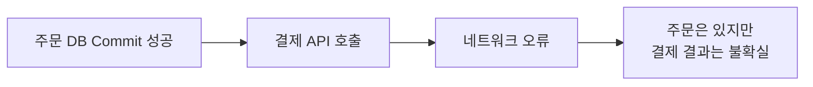

호출 순서를 바꿔도 DB와 외부 결제가 하나의 transaction이 되지는 않는다. 두 시스템 사이의 실패를 처리할 별도 설계가 필요하다.

## Saga Pattern이란 무엇인가

Saga는 하나의 긴 분산 transaction 대신 여러 개의 **로컬 transaction**을 순서대로 실행하는 방식이다.

주문과 결제를 예로 들면 다음과 같다.

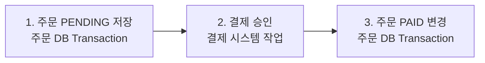

각 단계는 자기 시스템 안에서 따로 commit한다. 모든 단계를 하나의 DB rollback으로 되돌리지는 않는다.

결제가 실패하면 주문 상태를 실패로 변경한다.

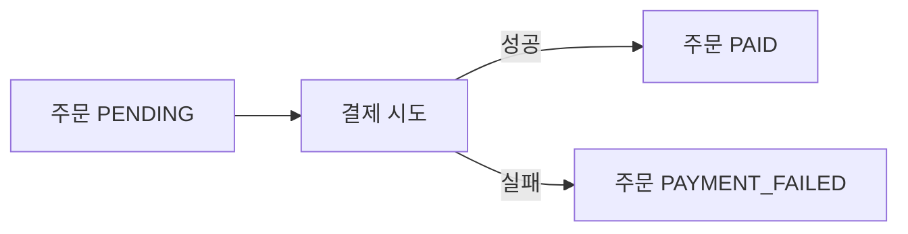

결제까지 성공한 뒤 다음 단계에서 실패했다면 결제 취소 같은 보상 작업을 실행할 수 있다.

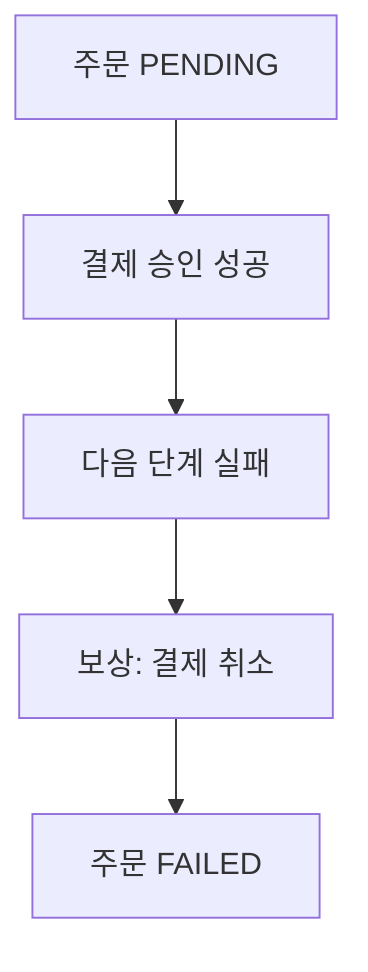

정리하면 Saga에는 세 가지가 필요하다.

1. 각 시스템이 실행하는 로컬 transaction
2. 처리 중임을 나타내는 `PENDING` 같은 중간 상태
3. 뒤 단계가 실패했을 때 실행할 보상 작업

<details>
<summary><b>🔍 Saga도 모든 실패를 자동으로 해결해주나?</b></summary>

Saga는 자동 rollback 기능이 아니다. 어떤 순서로 작업할지, 어느 단계부터 되돌릴 수 없는지, 실패하면 어떤 보상을 실행할지를 애플리케이션이 직접 설계해야 한다.

결제 취소 요청도 실패할 수 있으므로 보상 작업의 상태를 저장하고 재시도할 수 있어야 한다.

</details>

## 같은 요청이 두 번 실행되지 않게 한다

외부 결제 요청을 보냈지만 응답을 받기 전에 연결이 끊길 수 있다.

```text
결제 요청 전송
  → 결제 서버는 승인 성공
  → 응답이 오는 중 네트워크 단절
  → 호출자는 성공 여부를 모름
```

그대로 다시 요청하면 결제가 두 번 승인될 수 있다. 같은 요청을 여러 번 보내도 결과가 한 번만 반영되도록 만드는 성질을 **멱등성**이라고 한다.

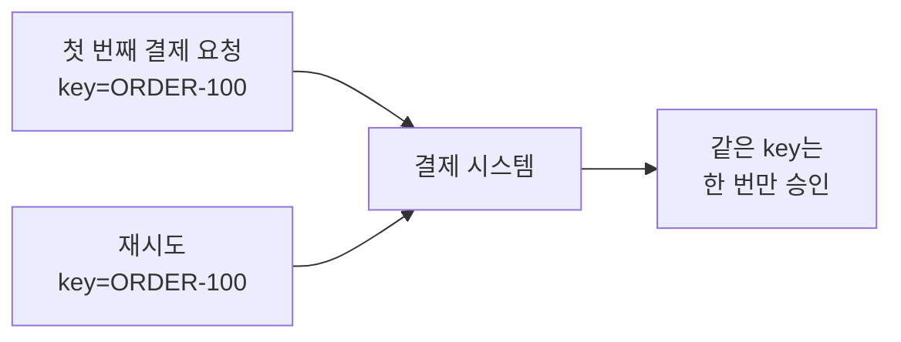

Saga의 각 단계와 보상 작업에는 중복 실행을 막을 식별자가 필요하다.

## 정리

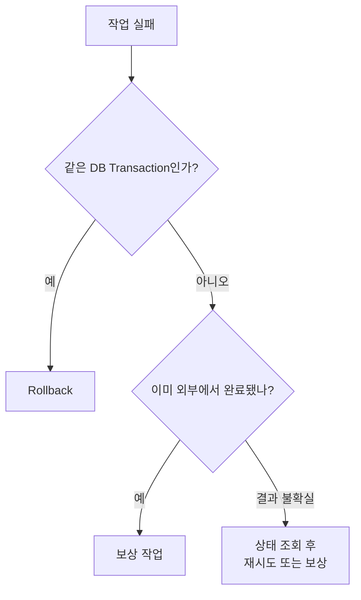

| 대상 | 필요한 처리 |
|---|---|
| 같은 DB transaction의 행 | Rollback |
| DB sequence | 번호의 빈칸 허용 |
| 외부 결제 | 상태 확인·취소 요청 |
| Redis cache | 무효화하거나 DB에서 재생성 |
| 메시지 발행 | Outbox·재시도·중복 처리 |
| 여러 서비스의 변경 | Saga와 보상 작업 |

> Rollback이 보장되는 범위를 먼저 찾고, 그 밖의 작업에는 재시도·멱등성·보상 방법을 따로 설계해야 한다.

## 참고

- [Instagram — 롤백해도 안 되돌아가는 것들](https://www.instagram.com/reel/Dcvz-yXtwmL/)
- [PostgreSQL — Sequence Manipulation Functions](https://www.postgresql.org/docs/current/functions-sequence.html)
- [Saga pattern](https://microservices.io/patterns/data/saga.html)
