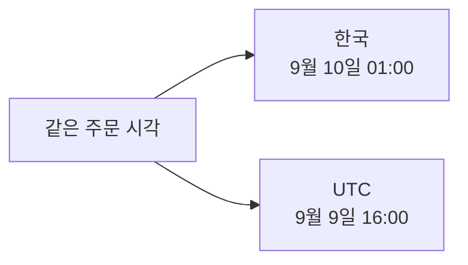
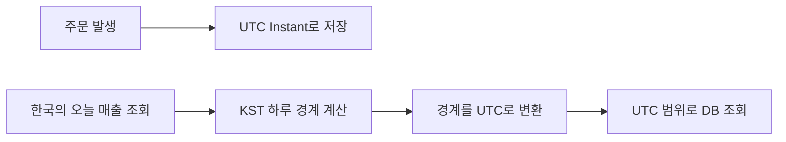

## 같은 순간도 지역에 따라 날짜가 다르다

한국에서 9월 10일 새벽 1시에 주문이 발생했다고 가정하자.

```text
한국: 2026-09-10 01:00 KST
UTC:  2026-09-09 16:00 UTC
```

하나의 주문이지만 한국에서는 9월 10일이고 UTC에서는 9월 9일이다.



시간을 UTC로 저장한 것은 맞다. 문제는 “오늘”의 범위까지 UTC 날짜로 잘랐다는 데 있다.

## UTC로 자르면 한국의 하루가 오전 9시에 시작된다

UTC의 자정은 한국에서 오전 9시다.

```text
UTC 2026-09-10 00:00
= KST 2026-09-10 09:00
```

UTC 날짜를 그대로 사용한 조회 범위는 한국 시간으로 다음과 같다.

```text
UTC 기준 9월 10일
= KST 9월 10일 09:00
~ KST 9월 11일 09:00 직전
```

대시보드가 UTC 날짜를 기준으로 집계하면 한국 시간 오전 9시에 “오늘 매출”이 갑자기 초기화될 수 있다.

영상에서는 KST 오전 8시에 `659,000원`, 오전 9시에 `1,000원`으로 바뀌었다. 올바른 KST 경계로 계산한 값은 각각 `47,000원`, `75,000원`이었다. 이 수치는 해당 실험 데이터에서 나온 결과다.

## 저장 기준과 매출 기준은 역할이 다르다

```text
저장
→ 세계에서 하나뿐인 실제 순간을 UTC로 기록

매출 집계
→ 서비스가 정한 사업 지역의 오늘·이번 달 경계 계산
```



UTC는 여러 서버와 지역에서 같은 순간을 공유하기 좋다. 하지만 “오늘”은 지역마다 시작하는 순간이 다르다.

<details>
<summary><b>🔍 매출은 어느 나라의 시간대를 기준으로 계산해야 할까?</b></summary>

주문이 발생한 실제 순간은 하나지만 그 순간의 날짜는 지역마다 다르다. 따라서 “오늘 매출”의 기준 시간대는 서비스의 사업 규칙으로 정해야 한다.

한국에서만 운영하는 쇼핑몰은 `Asia/Seoul`, 국가별 판매점이 있다면 해당 판매점의 시간대, 판매자별 정산이라면 판매자에게 설정된 정산 시간대를 사용할 수 있다. 전 세계 매출을 하나로 집계한다면 회사가 정한 회계 시간대나 UTC를 기준으로 삼을 수 있다.

사용자가 현재 접속한 위치를 매출 기준으로 사용하면 같은 판매자가 해외에서 접속했을 때 집계 결과가 달라질 수 있다. 그래서 화면을 보는 사람의 위치보다 판매점·판매자·회계 정책에 고정된 시간대를 사용하는 편이 안전하다.

</details>

## 한국의 하루를 UTC 범위로 바꾼다

한국의 2026년 9월 10일 매출을 조회한다고 가정하자.

```text
KST 시작: 2026-09-10 00:00
KST 종료: 2026-09-11 00:00

UTC 시작: 2026-09-09 15:00Z
UTC 종료: 2026-09-10 15:00Z
```

```sql
SELECT SUM(amount)
FROM orders
WHERE ordered_at >= '2026-09-09T15:00:00Z'
  AND ordered_at <  '2026-09-10T15:00:00Z';
```

종료 시각은 포함하지 않는 반개구간으로 조회한다.

```text
시작 시각 이상: >=
종료 시각 미만: <

[start, end)
```

이렇게 하면 자정에 발생한 데이터를 이전 날과 다음 날에 중복해서 포함하지 않는다.

## Java에서는 지역 경계를 먼저 만든다

```java
ZoneId businessZone = ZoneId.of("Asia/Seoul");
LocalDate businessDate = LocalDate.of(2026, 9, 10);

Instant startUtc = businessDate
        .atStartOfDay(businessZone)
        .toInstant();

Instant endUtc = businessDate
        .plusDays(1)
        .atStartOfDay(businessZone)
        .toInstant();
```

```text
LocalDate → 매출을 조회할 사업 날짜
ZoneId    → 그 날짜를 해석할 사업 지역
Instant   → DB 조회에 사용할 UTC 시각
```

`ZoneId`를 코드에 명시하면 서버의 기본 시간대 설정이 달라져도 같은 결과를 계산할 수 있다.

<details>
<summary><b>🔍 KST는 UTC+9인데 그냥 9시간을 빼면 안 될까?</b></summary>

한국만 다룬다면 현재는 UTC+9로 계산할 수 있다. 하지만 여러 국가를 지원하면 지역에 따라 서머타임 규칙이 달라진다.

어떤 지역은 시계를 한 시간 앞으로 또는 뒤로 움직여 하루가 23시간이나 25시간이 될 수 있다. `Asia/Seoul`, `America/New_York` 같은 `ZoneId`를 사용하면 해당 지역의 날짜별 시간대 규칙을 적용할 수 있다.

</details>

## DB 컬럼에는 함수를 적용하지 않는다

다음처럼 시간 컬럼을 변환해서 날짜를 비교할 수도 있다.

```sql
WHERE DATE(CONVERT_TZ(ordered_at, 'UTC', 'Asia/Seoul'))
      = '2026-09-10'
```

하지만 인덱스가 걸린 `ordered_at`에 함수를 적용하면 일반적인 인덱스 범위 탐색을 사용하기 어려울 수 있다.

경계 시각을 애플리케이션에서 계산해 파라미터로 전달하는 편이 낫다.

```sql
WHERE ordered_at >= :startUtc
  AND ordered_at < :endUtc
```

```text
컬럼은 그대로 유지
→ 인덱스의 정렬된 값에서 시작 위치 탐색
→ 종료 경계까지 읽기
```

## 일별 합계만 보면 오류가 숨을 수 있다

잘못된 집계에서는 앞의 9시간이 빠지는 대신 다음 날의 9시간이 들어온다.

```text
잘못 자른 하루: 어제 09:00 ~ 오늘 09:00
원하는 하루:   오늘 00:00 ~ 내일 00:00
```

날마다 매출 규모가 비슷하면 빠진 금액과 잘못 들어온 금액이 우연히 비슷해 합계가 정상처럼 보일 수 있다. 이벤트나 장애처럼 특정 시간대의 주문량이 크게 달라질 때 비로소 차이가 드러난다.

## 어떤 데이터에 시간대가 필요할까

| 데이터 | 권장 표현 |
|---|---|
| 주문이 발생한 실제 순간 | `Instant` 또는 UTC timestamp |
| 한국의 오늘 매출 | `Asia/Seoul`로 경계를 계산한 UTC 범위 |
| 매일 오전 9시 회의 | 날짜·시간과 `ZoneId` |
| 생일 | 시간대 없는 `LocalDate` |
| 30분 뒤 만료 | `Instant` 또는 `Duration` |

모든 시간 데이터를 무조건 UTC로 바꾸는 것이 아니라, 데이터가 실제 순간인지 사람이 정한 지역 날짜인지 구분해야 한다.

> 주문 시각은 UTC로 저장하고, 매출 날짜는 서비스가 정한 사업 시간대를 기준으로 계산한다.

## 참고

- [Instagram — 아침 9시에 오늘 매출이 리셋되는 이유](https://www.instagram.com/reel/Dcq4uv0NQnD/)
- [Java ZonedDateTime](https://docs.oracle.com/en/java/javase/26/docs/api/java.base/java/time/ZonedDateTime.html)
- [Java Instant](https://docs.oracle.com/en/java/javase/26/docs/api/java.base/java/time/Instant.html)
- [Java ZoneId](https://docs.oracle.com/en/java/javase/26/docs/api/java.base/java/time/ZoneId.html)
