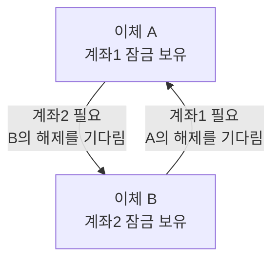

## 01 · 1번 → 2번 이체와 2번 → 1번 이체가 동시에 온다

계좌 1과 계좌 2가 있다. 이체 A는 계좌 1에서 2로, 이체 B는 계좌 2에서 1로 돈을 보낸다. 두 요청이 거의 동시에 들어왔다.

이체는 잔액이 중간에 바뀌면 안 되므로 **비관적 락**을 쓴다. 계좌를 읽을 때 `SELECT ... FOR UPDATE`로 그 행을 잠그면, 다른 트랜잭션은 이 트랜잭션이 끝날 때까지 그 행을 잠그거나 바꾸지 못하고 기다린다. 락은 트랜잭션이 commit 또는 rollback될 때 풀린다. [PostgreSQL 18 Explicit Locking](https://www.postgresql.org/docs/current/explicit-locking.html)

코드는 “보내는 계좌를 잠그고, 받는 계좌를 잠그고, 금액을 옮긴다” 순서다. 이번 예시는 PostgreSQL 한 대와 두 이체의 동시 실행을 가정한 독립 학습 예제다.

## 02 · 각자 하나씩 잠그고, 상대 것을 기다린다



결과: 서로가 가진 잠금을 기다려 둘 중 누구도 진행할 수 없다. DB가 감지해 중단하지 않으면 이 고리는 저절로 풀리지 않는다.

서로가 가진 자원을 원을 그리며 기다리는 상태가 **데드락(Deadlock, 교착 상태)**이다. 단지 동시에 접근해서가 아니라, 여러 자원을 **서로 다른 순서로** 잠갔기 때문에 생긴다.

## 03 · DB는 한쪽을 실패시켜 끊는다

PostgreSQL은 락을 기다린 시간이 `deadlock_timeout`(기본 1초)을 넘으면 데드락인지 검사한다. 데드락이면 관련 트랜잭션 하나를 중단시키고 나머지가 끝나게 한다. [PostgreSQL 18 deadlock_timeout](https://www.postgresql.org/docs/current/runtime-config-locks.html)

| 시점 | 이체 A | 이체 B |
| --- | --- | --- |
| 데드락 감지 뒤 | 데드락 오류로 rollback, 계좌 1 락 해제 | |
| 그 직후 | | 계좌 1 잠금, 이체 완료 |

**결과: DB가 한쪽을 중단시키면 다른 쪽이 진행할 수 있다.** 실제 실패 시각은 설정과 실행 상황에 따라 달라지며 정확히1초를 보장하지 않는다. 어느 쪽이 실패할지는 예측하기 어렵고 의존하면 안 된다고 공식 문서가 밝힌다. 서비스 전체가 멈추지 않고 요청 하나만 실패하므로 “가끔 나는 일시적 오류”처럼 보이기 쉽다.

## 04 · 모두 같은 순서로 잠근다

방향과 상관없이 **번호가 작은 계좌부터** 잠그기로 정한다.

```text
A (1→2): 계좌1 잠금 → 계좌2 잠금 → 이체·commit
B (2→1): 계좌1을 기다림 (계좌2를 먼저 잡지 않음)
         A가 놓으면 계좌1 → 계좌2 잠금 → 이체·commit
```

**결과: B는 잠시 기다리지만, 둘 다 성공한다.** B가 계좌 2를 쥔 채 계좌 1을 기다리는 일이 없으니 원이 만들어지지 않는다. PostgreSQL 공식 문서도 여러 객체를 잠글 때 모든 애플리케이션이 같은 순서로 잠그는 것을 가장 좋은 방어로 꼽는다.

<details>
<summary>Java 코드는 잠금 순서와 이체 방향을 어떻게 구분하나?</summary>

코드에서는 잠그는 순서만 바꾸고, 돈을 빼고 넣는 방향은 그대로 둔다. 아래는 계좌가 모두 존재하고 같은 트랜잭션에서 실행된다는 전제의 서비스 로직 발췌다.

```java
long firstId = Math.min(fromAccountId, toAccountId);
long secondId = Math.max(fromAccountId, toAccountId);

Account first = accountRepository.findByIdForUpdate(firstId);
Account second = accountRepository.findByIdForUpdate(secondId);

Account from = (firstId == fromAccountId) ? first : second;
Account to = (from == first) ? second : first;
from.withdraw(amount);
to.deposit(amount);
```

`Math.min`과 `Math.max`는 Java 기본 제공 함수다. `findByIdForUpdate`는 우리가 저장소에 만든 조회 메서드로, Spring Data JPA의 `@Lock(LockModeType.PESSIMISTIC_WRITE)`를 붙이면 Hibernate가 PostgreSQL에서 `SELECT ... FOR UPDATE`로 실행한다. 잠금 순서와 이체 방향을 구분하는 마지막 네 줄이 빠지면 1 → 2와 2 → 1이 같은 방향으로 처리되는 버그가 생긴다. 계좌 존재·금액·동일 계좌 처리 등 입력 검증은 이 발췌 밖의 책임이다.

</details>

## 05 · 순서를 맞춰도 남는 것

잠금 순서를 통일해도 다른 테이블, 인덱스 범위, 외래 키 검사에서 추가 잠금이 생겨 데드락이 날 수 있다. 그래서 두 가지를 함께 둔다.

- 트랜잭션을 짧게 유지한다. 잠근 채로 외부 API를 기다리지 않는다.
- 데드락으로 실패한 트랜잭션은 새 트랜잭션에서 횟수를 제한해 재시도한다. PostgreSQL 문서도 미리 순서를 보장하기 어렵다면 데드락으로 중단된 트랜잭션을 재시도하라고 안내한다.

## 06 · 재현 시험과 정상 시험은 다르게 맞춘다

교착 재현에서는 A가 계좌1, B가 계좌2를 각각 잠근 뒤 두 번째 잠금으로 진행시킨다. 제한된 대기 시간 안에 기대한 데드락 오류가 나는지 확인한다.

순서 통일 시험에서는 첫 잠금 전에 함께 출발시키고, 두 이체가 제한 시간 안에 완료되는지와 잔액 합을 확인한다. A와 B 중 누가 먼저 완료할지는 고정하지 않는다.

```text
잘못된 정상 시험
A: 계좌1 획득 → B도 첫 잠금을 얻기를 기다림
B: 계좌1 획득 대기 → A를 만나는 지점에 못 도착

정상 시험
첫 잠금 전에 동시 출발 → 잠금 경쟁 허용 → 두 완료·잔액 합 확인
```

결과: 순서를 통일한 뒤에도 '둘 다 첫 잠금을 얻고 만나자'고 요구하면 시험 자체가 멈출 수 있다. 이 글은 시험 설계를 설명하며 실제 DB에서 실행한 결과는 아니다.

<details>
<summary>프로젝트에서는 어디부터 볼까?</summary>

2026-10-07에 `7a4c363f` 기준으로 확인한 PromptHub는 주문, 장바구니, 결제 저장소에서 `PESSIMISTIC_WRITE` 조회를 사용한다. 한 트랜잭션이 이런 조회로 여러 행을 잠그는 경로가 있다면 잠그는 순서가 항상 같은지가 확인 대상이다. 이 글에서는 그런 경로를 점검하지 않았고, 데드락 발생 기록도 확인하지 않았다. [주문 저장소 코드](https://github.com/prgrms-be-adv-devcourse/beadv6_6_3JMT_BE/blob/7a4c363f04ca96c9f641f66906a301cf22055c3b/order-service/src/main/java/com/prompthub/order/infra/persistence/order/OrderPersistence.java)

</details>

## 자기 말로 답해보기

이체 세 건이 동시에 온다. A는 1 → 2, B는 2 → 3, C는 3 → 1이다. 각자 “보내는 계좌, 받는 계좌” 순서로 잠그면 데드락이 생길 수 있을까? “번호가 작은 계좌부터” 규칙을 쓰면?

<details>
<summary>답 확인</summary>

생길 수 있다. A가 1을 쥐고 2를, B가 2를 쥐고 3을, C가 3을 쥐고 1을 기다리면 세 트랜잭션이 원을 이룬다. 번호 순서 규칙을 쓰면 A는 1 → 2, B는 2 → 3, C는 1 → 3 순서로 잠근다. 모두 작은 번호에서 큰 번호로만 기다리므로 원이 닫히지 않는다.

</details>

## 참고

- [PostgreSQL 18 Explicit Locking — Deadlocks](https://www.postgresql.org/docs/current/explicit-locking.html#LOCKING-DEADLOCKS)
- [PostgreSQL 18 Lock Management — deadlock_timeout](https://www.postgresql.org/docs/current/runtime-config-locks.html)
- [MySQL 8.0 — How to Minimize and Handle Deadlocks](https://dev.mysql.com/doc/refman/8.0/en/innodb-deadlocks-handling.html)
- 설명 자료: [Instagram — 서로를 기다리다 둘 다 죽는다](https://www.instagram.com/reel/Dcq4R_YNY3V/)
