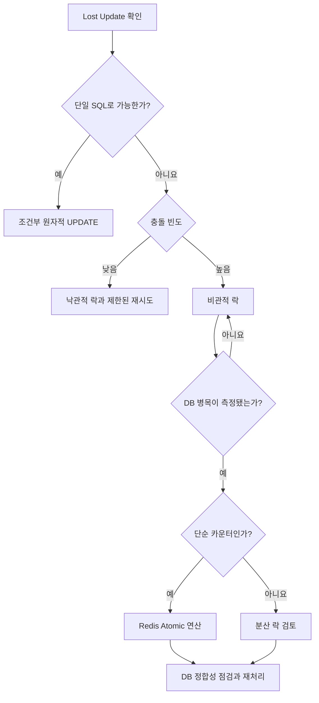

재고가 1개 남았을 때 두 요청이 동시에 들어오면 두 요청 모두 재고를 구매할 수 있다고 판단할 수 있다.

```text
요청 A: 재고 1 조회
요청 B: 재고 1 조회
요청 A: 재고 0 저장
요청 B: 재고 0 저장
```

두 주문이 성공했지만 재고는 한 번만 감소했다. 이처럼 다른 트랜잭션의 변경을 덮어써 버리는 문제를 `Lost Update`라고 한다.

## 먼저 알아둘 동시성 제어 방법

본격적인 흐름을 살펴보기 전에 각 방법을 가볍게 구분한다.

### 조건부 원자적 UPDATE

재고 확인과 차감을 하나의 SQL로 실행하는 방법이다.

```sql
UPDATE product
SET stock = stock - 1
WHERE id = 100
  AND stock > 0;
```

이 SQL은 재고가 남아 있는지 확인하고, 남아 있을 때만 차감한다. `원자적`이라는 말은 다른 작업이 끼어드는 중간 단계 없이 하나의 연산으로 처리한다는 뜻이다.

### 낙관적 락

다른 요청과 자주 충돌하지 않을 것이라고 보고, 데이터를 미리 잠그지 않는 방법이다. 저장할 때 version을 확인해 내가 읽은 이후 데이터가 변경됐다면 실패시킨다.

```text
먼저 작업한다 → 저장할 때 충돌을 발견한다
```

### 비관적 락

다른 요청도 같은 데이터를 변경할 가능성이 높다고 보고, 데이터를 먼저 잠그는 방법이다.

```text
먼저 잠근다 → 작업한다 → 트랜잭션 종료 시 잠금을 푼다
```

다른 요청은 락이 풀릴 때까지 기다리므로 충돌을 순서대로 처리하기 쉽지만 대기 시간이 생긴다.

### Redis Atomic 연산

Redis가 `INCR`, `DECR` 같은 하나의 명령을 중간에 다른 명령과 섞지 않고 처리하는 방식이다.

```text
초기 재고 2
요청 A: DECR → 1
요청 B: DECR → 0
```

두 요청이 같은 값을 읽고 덮어쓰지 않는다. 다만 “0보다 클 때만 감소”처럼 조건까지 필요하다면 Lua Script 등으로 확인과 변경을 하나의 원자적 작업으로 묶어야 한다.

### 분산 락

여러 애플리케이션 서버 중 한 서버만 특정 작업을 실행하도록 공통 저장소에 락을 두는 방법이다.

```text
서버 A ─┐
서버 B ─┼→ Redis의 공통 락 → 한 서버만 작업
서버 C ─┘
```

Redis Atomic 연산은 데이터 연산 하나를 안전하게 처리하고, 분산 락은 여러 서버가 일정 코드 구간에 동시에 진입하지 못하게 한다.

### Backoff와 Jitter

`Backoff`는 실패한 작업을 다시 시도하기 전에 기다리는 방법이다.

```text
1차 실패 → 100ms 대기
2차 실패 → 200ms 대기
3차 실패 → 400ms 대기
```

`Jitter`는 여러 요청이 똑같은 시간에 다시 몰리지 않도록 대기 시간에 작은 무작위 차이를 주는 방법이다.

```text
요청 A → 183ms 후 재시도
요청 B → 247ms 후 재시도
요청 C → 216ms 후 재시도
```

- Retry: 실패한 작업을 다시 시도한다.
- Backoff: 재시도하기 전에 기다린다.
- Jitter: 각 요청의 재시도 시점을 조금씩 다르게 만든다.

<details>
<summary><b>🔍 Backoff와 Jitter를 사용하면 충돌이 반드시 해결될까?</b></summary>

충돌 가능성을 낮출 뿐 문제를 반드시 해결하지는 않는다. 재고가 부족하거나 요청 데이터가 잘못됐다면 시간이 지나도 성공할 수 없다.

따라서 최대 재시도 횟수, 전체 timeout, 재시도할 예외와 최종 실패 처리를 함께 정해야 한다. 낙관적 락 충돌이나 짧은 네트워크 오류는 재시도할 수 있지만, 재고 부족처럼 다시 실행해도 결과가 달라지지 않는 실패는 일반적으로 재시도하지 않는다.

</details>

가볍게 구분하면 다음과 같다.

| 방법 | 한 문장 설명 |
| --- | --- |
| 조건부 원자적 UPDATE | DB 명령 하나로 조건 확인과 변경을 처리한다 |
| 낙관적 락 | 먼저 작업하고 저장할 때 충돌을 발견한다 |
| 비관적 락 | 데이터를 먼저 잠그고 작업한다 |
| Redis Atomic 연산 | Redis의 데이터 변경 명령을 중간 간섭 없이 처리한다 |
| 분산 락 | 여러 서버 중 한 서버만 작업하도록 제한한다 |
| Backoff | 재시도 전에 기다린다 |
| Jitter | 각 요청의 재시도 시간을 조금씩 다르게 만든다 |

## 1. 트랜잭션은 하나의 작업 단위를 만든다

트랜잭션은 여러 DB 작업을 하나의 작업 단위로 묶는다. 재고 차감과 주문 생성을 같은 트랜잭션에서 처리한다면 둘 다 성공하거나 둘 다 취소되어야 한다.

```text
재고 조회 → 재고 차감 → 주문 생성 → commit
```

중간에 오류가 발생하면 `rollback`하여 이전 상태로 돌아간다. 하지만 트랜잭션을 사용했다는 사실만으로 여러 트랜잭션이 같은 재고를 동시에 읽는 문제까지 해결되지는 않는다.

<details>
<summary><b>🔍 commit과 rollback은 무엇일까?</b></summary>

`commit`은 트랜잭션에서 수행한 변경을 최종 확정하고, `rollback`은 해당 트랜잭션의 변경을 취소하는 작업이다.

재고 차감 후 주문 생성이 실패하면 rollback하여 재고 차감도 취소할 수 있다. 다만 트랜잭션이 길어지면 DB Connection과 락을 오래 점유하므로 외부 API 호출 같은 오래 걸리는 작업을 무조건 포함하지 않는다.

</details>

## 2. 격리 수준은 트랜잭션끼리 데이터를 보는 규칙이다

격리 수준은 동시에 실행되는 트랜잭션이 서로의 변경을 어느 정도까지 볼 수 있는지를 정한다.

| 격리 수준 | 기본 의미 |
| --- | --- |
| READ UNCOMMITTED | commit되지 않은 변경도 볼 수 있음 |
| READ COMMITTED | commit된 변경만 볼 수 있음 |
| REPEATABLE READ | 같은 트랜잭션 안에서 같은 조회 결과를 유지 |
| SERIALIZABLE | 트랜잭션이 순차 실행된 것처럼 처리 |

격리 수준을 높이면 대기나 트랜잭션 실패, 재시도 비용도 증가할 수 있다. 사용하는 DB의 실제 동작을 확인하고 필요한 범위에 맞는 제어를 적용해야 한다.

<details>
<summary><b>🔍 격리 수준과 락은 같은 것일까?</b></summary>

같은 개념은 아니다. 격리 수준은 트랜잭션 전체가 다른 변경을 어떻게 볼지 정하는 규칙이고, 락은 특정 행이나 자원의 동시 접근을 직접 제한하는 방법이다.

서비스 전체의 격리 수준을 높이지 않고 재고 조회 쿼리에만 비관적 락을 적용할 수도 있다.

</details>

## 3. Lost Update는 조회와 저장 사이에 발생한다

```java
Product product = productRepository.findById(productId)
        .orElseThrow(ProductNotFoundException::new);

product.decreaseStock(quantity);
```

두 트랜잭션이 같은 재고를 읽으면 나중에 저장한 값이 앞선 변경을 덮어쓸 수 있다.

```text
초기 재고: 10
A가 10 조회 → B가 10 조회 → A가 9 저장 → B도 9 저장
최종 재고: 9, 기대 재고: 8
```

해결하려면 동시에 접근하지 못하게 막거나, 그사이에 데이터가 변경됐다는 사실을 감지해야 한다.

## 4. 단순한 차감은 조건부 UPDATE로 처리할 수 있다

재고처럼 단순한 숫자 변경은 조회 후 저장하지 않고 하나의 SQL로 처리할 수 있다.

```sql
UPDATE product
SET stock = stock - :quantity
WHERE id = :productId
  AND stock >= :quantity;
```

영향받은 행이 1개면 차감 성공이고, 0개면 재고 부족 또는 존재하지 않는 상품으로 판단한다. 단순한 재고 차감이라면 복잡한 락과 재시도 로직을 추가하기 전에 먼저 검토할 수 있다.

<details>
<summary><b>🔍 왜 조회 후 UPDATE보다 안전할까?</b></summary>

조회 후 UPDATE는 재고 조회, 애플리케이션 계산, 저장이 나뉘어 있어 그 사이에 다른 요청이 들어올 수 있다. 조건부 UPDATE는 재고 검사와 차감을 하나의 DB 명령으로 수행해 이 경쟁 구간을 없앤다.

</details>

## 5. 비관적 락은 먼저 잠근 뒤 처리한다

비관적 락은 충돌할 가능성이 높다고 보고 데이터를 읽을 때부터 잠근다.

```sql
SELECT *
FROM product
WHERE id = :productId
FOR UPDATE;
```

Spring Data JPA에서는 Repository 쿼리에 `@Lock`을 적용할 수 있다.

```java
@Lock(LockModeType.PESSIMISTIC_WRITE)
@Query("select p from Product p where p.id = :id")
Optional<Product> findByIdForUpdate(Long id);
```

먼저 락을 얻은 트랜잭션이 끝날 때까지 다른 충돌 작업은 기다린다. 충돌이 잦아도 순서대로 처리하기 쉽지만 락 대기가 길어지면 처리량이 감소한다.

<details>
<summary><b>🔍 `SELECT ... FOR UPDATE`는 테이블 전체를 잠글까?</b></summary>

일반적으로 조회 조건에 해당하는 행을 다른 트랜잭션이 동시에 수정하지 못하도록 잠그는 행 수준 락으로 사용한다. 락은 트랜잭션이 commit 또는 rollback될 때까지 유지된다.

실제 영향 범위는 쿼리와 실행 계획, DB 종류에 따라 달라질 수 있다. 잠근 뒤 외부 API 응답을 오래 기다리는 방식도 피해야 한다.

</details>

## 6. 비관적 락에는 대기와 Deadlock 위험이 있다

여러 트랜잭션이 서로 다른 순서로 자원을 잠그면 `Deadlock`이 발생할 수 있다.

```text
트랜잭션 A: 상품 1 잠금 → 상품 2 대기
트랜잭션 B: 상품 2 잠금 → 상품 1 대기
```

DB는 일반적으로 한 트랜잭션을 실패시켜 교착 상태를 해소한다. 여러 자원을 잠가야 한다면 가능한 한 같은 순서로 잠그고, 락 대기 timeout과 실패 처리를 정해야 한다.

<details>
<summary><b>🔍 락 획득에 실패하면 무조건 재시도할까?</b></summary>

무조건 재시도하면 요청이 몰린 상황에서 DB 부하가 더 커질 수 있다. 최대 횟수와 timeout을 제한하고 Backoff와 Jitter를 적용하며, 재시도할 가치가 있는 예외인지 구분해야 한다.

</details>

## 7. 낙관적 락은 저장할 때 변경 여부를 확인한다

낙관적 락은 데이터를 미리 잠그지 않고, 읽은 이후 다른 트랜잭션이 변경했는지 version으로 확인한다.

```java
@Entity
public class Product {

    @Version
    private Long version;

    private int stock;
}
```

JPA는 수정할 때 ID와 기존 version을 조건으로 사용한다.

```sql
UPDATE product
SET stock = ?, version = version + 1
WHERE id = ?
  AND version = ?;
```

다른 트랜잭션이 version을 먼저 변경했다면 낙관적 락 충돌이 발생한다. 충돌이 드물면 대기 없이 처리할 수 있지만 선착순 요청처럼 한 데이터에 요청이 몰리면 실패와 재시도가 늘어난다.

<details>
<summary><b>🔍 `@Version` 값은 직접 증가시켜야 할까?</b></summary>

직접 증가시키지 않는다. JPA Provider가 엔티티 저장 시 version 확인과 증가를 담당한다.

Jakarta Persistence 명세는 version이 일치하지 않으면 `OptimisticLockException`을 발생시키도록 규정한다. Spring에서 변환되는 실제 예외 타입과 발생 시점은 통합 테스트로 확인하는 것이 안전하다.

</details>

## 8. 낙관적 락은 새 트랜잭션에서 재시도한다

낙관적 락 충돌이 발생한 트랜잭션은 rollback 대상이 된다. 최신 데이터를 다시 읽을 수 있도록 새 트랜잭션에서 재시도한다.

```text
1차 트랜잭션 → 충돌 → rollback
Backoff + Jitter
새 트랜잭션 → 최신 데이터 조회 → 조건 재검사
```

이전에 읽은 재고를 그대로 사용해서는 안 된다. 최신 재고를 읽고 비즈니스 조건도 다시 검사해야 한다.

<details>
<summary><b>🔍 재시도 로직은 어디에 둘까?</b></summary>

재시도 조정 역할과 실제 재고 차감 트랜잭션을 분리할 수 있다. 바깥 서비스가 충돌을 감지해 안쪽 트랜잭션 서비스를 다시 호출하면 매 시도마다 새 트랜잭션에서 최신 데이터를 조회할 수 있다.

Spring Retry나 명시적인 반복문을 사용할 수 있지만 최대 횟수, 대기 정책과 대상 예외가 코드에서 분명해야 한다.

</details>

## 9. Redis Atomic 연산은 단순 카운터 경쟁을 줄인다

많은 요청이 하나의 DB 행에 집중되어 DB 락이 실제 병목이 됐다면 단순 수량 증감에 Redis 원자적 연산을 검토할 수 있다.

```text
DECR stock:product-100
```

그러나 Redis 재고 차감과 DB 주문 생성은 서로 다른 작업이다. Redis 차감 후 DB 저장에 실패할 수 있으므로 이벤트 기록, 보상, 재처리와 정합성 점검이 필요하다.

<details>
<summary><b>🔍 Redis 재고가 음수가 되지 않게 하려면?</b></summary>

단순히 `DECR`한 뒤 음수이면 다시 증가시키는 방식은 여러 명령 사이에 장애가 끼어들 수 있다. “현재 재고가 충분하면 차감”이라는 조건과 변경을 Redis Lua Script 등으로 묶어 하나의 원자적 작업으로 실행할 수 있다.

</details>

## 10. Redis 분산 락은 여러 서버의 진입을 제한한다

애플리케이션 인스턴스가 여러 개라면 Java의 `synchronized`만으로 다른 서버의 실행을 막을 수 없다. Redis 분산 락은 공통 Redis에 락 key를 저장해 여러 서버 중 하나만 임계 구역에 들어가도록 만든다.

분산 락에는 다음 요소가 필요하다.

- 소유자를 구분하는 고유 값
- 자동 만료 시간
- 락 획득 timeout
- 소유자만 락을 해제하는 검증
- 작업보다 락이 먼저 만료되는 상황에 대한 대응

<details>
<summary><b>🔍 Redis에 `SETNX`만 사용하면 충분할까?</b></summary>

단순한 `SETNX`만 사용하면 서버가 종료됐을 때 락이 계속 남을 수 있다. 락 생성과 만료 시간을 하나의 원자적인 명령으로 설정하고, 해제할 때도 현재 값이 자신의 고유 토큰인지 확인해야 한다.

TTL이 끝난 뒤 첫 번째 작업이 계속 실행 중이면 두 서버가 동시에 작업할 수도 있다. 검증된 라이브러리를 사용하더라도 장애 상황에서 제공하는 안전성 범위를 확인해야 한다.

</details>

## 11. 충돌 빈도와 정합성 범위로 선택한다

| 방법 | 적합한 상황 | 주의점 |
| --- | --- | --- |
| 조건부 UPDATE | 단순한 숫자 차감 | 복잡한 도메인 판단 표현이 어려움 |
| 낙관적 락 | 충돌이 드문 일반 수정 | 충돌이 많으면 재시도 증가 |
| 비관적 락 | 충돌이 잦고 DB 한 곳에서 처리 | 락 대기와 Deadlock |
| Redis Atomic | 대량의 단순 카운터 처리 | DB와 Redis 사이의 정합성 |
| Redis 분산 락 | 여러 서버의 작업을 하나로 제한 | TTL, 장애와 락 소유권 관리 |



다음 흐름으로 설명한다.

> 동시 요청에서 Lost Update가 발생할 지점을 찾고, 먼저 조건부 UPDATE가 가능한지 확인한다. 복잡한 수정이라면 충돌 빈도에 따라 낙관적 락과 비관적 락을 선택한다. 실제 부하 측정에서 DB 경합이 병목으로 확인된 경우에만 Redis 방식으로 확장하고, Redis와 DB 사이의 정합성 대책을 함께 마련한다.

## 공식 자료

- [PostgreSQL 18 Transaction Isolation](https://www.postgresql.org/docs/current/transaction-iso.html)
- [PostgreSQL 18 Explicit Locking](https://www.postgresql.org/docs/current/explicit-locking.html)
- [Spring Data JPA Locking](https://docs.spring.io/spring-data/jpa/reference/jpa/locking.html)
- [Jakarta Persistence `@Version`](https://jakarta.ee/specifications/persistence/3.2/apidocs/jakarta.persistence/jakarta/persistence/version)
- [Jakarta EE의 Entity Locking 안내](https://jakarta.ee/learn/docs/jakartaee-tutorial/current/persist/persistence-locking/persistence-locking.html)
- [Redis `INCR`](https://redis.io/docs/latest/commands/incr/)
- [Redis Distributed Locks](https://redis.io/docs/latest/develop/clients/patterns/distributed-locks/)
