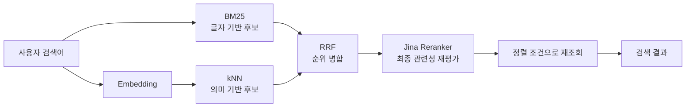

## 무엇을 해결하려고 했는가

상품 검색에서 원하는 것은 단순히 검색어가 들어간 문서를 찾는 일이 아니었다.

- `자기소개서`를 입력하면 해당 단어가 있는 상품을 정확히 찾아야 한다.
- `면접`을 입력했을 때 면접 준비에 유용한 취업 상품도 후보가 될 수 있어야 한다.
- `취업 자기소개서`를 입력했는데 프로젝트 보고서나 주식 분석 상품이 나오면 안 된다.
- 관련 상품이 없다면 무관한 상품으로 목록을 채우기보다 0건을 허용해야 한다.

하나의 알고리즘으로 이 요구를 모두 만족시키기 어려워 역할이 다른 검색 알고리즘을 순서대로 조합했다.



핵심은 각 단계가 앞 단계보다 무조건 더 좋은 검색기가 아니라는 점이다. 각 알고리즘은 서로 다른 질문에 답한다.

| 단계 | 답하려는 질문 |
| --- | --- |
| BM25 | 검색어가 상품의 중요한 필드에 얼마나 잘 등장하는가? |
| 임베딩·kNN | 표현이 달라도 의미가 가까운 상품은 무엇인가? |
| RRF | 서로 다른 두 순위 목록을 어떻게 안정적으로 합칠까? |
| Jina Reranker | 모은 후보 중 실제 검색 의도에 더 맞는 상품은 무엇인가? |

## BM25: 정확한 단어 일치를 놓치지 않는다

BM25는 검색어가 문서에 등장한 빈도, 문서 길이, 전체 문서에서 그 단어가 얼마나 희귀한지를 이용해 점수를 계산한다. 상품명처럼 중요한 필드는 더 크게 반영할 수 있다.

이 프로젝트에서는 다음 필드 가중치를 사용했다.

```text
name^3
tags.text^2
description^1.5
model.text^1
```

예를 들어 `자기소개서`가 상품명에 있는 문서는 설명에만 있는 문서보다 높은 점수를 받는다. 사용자가 정확한 상품명, 모델명, 태그를 입력했을 때 BM25가 강한 이유다.

<details>
<summary><b>BM25는 단순 문자열 포함 검색과 무엇이 다른가?</b></summary>

단순 포함 검색은 단어가 있거나 없는지만 본다. BM25는 같은 단어가 있더라도 제목처럼 중요한 필드에 있는지, 여러 번 등장하는지, 흔한 단어인지까지 고려해 관련성 점수를 만든다.

다만 문서에 없는 단어의 의미까지 추론하지는 않는다. `펭귄` 상품에 `동물`이라는 표현이 전혀 없다면 BM25만으로 연결하기 어렵다.

</details>

### 여러 단어를 얼마나 일치시킬 것인가

BM25 최종 검색과 장애 폴백에는 다음 조건을 사용했다.

```text
minimum_should_match = "2<75%"
```

- 검색어가 2단어면 2단어 모두 일치해야 한다.
- 3단어 이상이면 75% 이상 일치해야 한다.

이 설정은 `주식 프롬프트` 검색에서 `프롬프트` 하나만 들어간 무관한 상품이 노출되는 문제를 막는다. 반대로 reranker에 전달할 후보까지 이 조건으로 제한하면 `이력서 작성` 중 `이력서`만 직접 포함한 관련 상품이 평가 기회조차 얻지 못한다.

그래서 같은 BM25라도 목적에 따라 정책을 나눴다.

| 용도 | 단어 일치 정책 |
| --- | --- |
| Jina가 평가할 후보 수집 | 기본 OR, 한 단어 일치도 포함 |
| Jina 장애 시 최종 BM25 결과 | `2<75%`, 강한 일치 요구 |

## 임베딩과 코사인 유사도: 표현이 달라도 의미 후보를 찾는다

임베딩 모델은 문장을 고정 길이 숫자 배열인 벡터로 바꾼다. 의미가 비슷한 텍스트는 벡터 공간에서 비슷한 방향에 놓이도록 학습된다.

코사인 유사도는 두 벡터 사이의 각도를 이용해 방향이 얼마나 비슷한지 측정한다.

```text
cosine_similarity(A, B) = (A · B) / (|A| × |B|)
```

- `1`에 가까울수록 같은 방향이다.
- `0`에 가까우면 방향의 관련성이 약하다.
- `-1`에 가까우면 반대 방향이다.

이 값은 “펭귄이 동물일 확률”이 아니다. 모델이 만든 두 텍스트 벡터의 방향이 얼마나 가까운지를 나타낸다.

<details>
<summary><b>왜 단어가 정확히 같은데도 코사인 유사도가 낮을 수 있나?</b></summary>

검색어 `펭귄`은 한 단어뿐이라 문맥이 거의 없다. 상품 임베딩은 상품명·설명·태그처럼 더 긴 문맥을 합쳐 만든다. 두 입력의 정보량과 표현 방식이 달라 같은 단어가 있어도 벡터 방향이 완전히 겹치지 않을 수 있다.

따라서 코사인 유사도는 문자열 일치 점수나 분류 관계의 보증값으로 해석하면 안 된다.

</details>

## kNN: 의미상 가까운 상위 후보를 빠르게 고른다

kNN 검색은 검색어 벡터와 가까운 상품 벡터를 상위 `k`개 찾는다. 이 프로젝트에서는 Elasticsearch의 HNSW 근사 최근접 검색을 사용했다.

```text
field          = embedding
k              = 50
num_candidates = 100
similarity     = 0.35
```

- `k=50`: 최종 의미 후보를 최대 50건 가져온다.
- `num_candidates=100`: 근사 검색 내부에서 100건을 먼저 검토한다.
- `similarity=0.35`: 코사인 유사도가 이 값보다 낮으면 후보에서 제외한다.

`num_candidates`를 `k`보다 크게 잡는 이유는 HNSW가 전체 문서를 정확히 비교하지 않고 빠르게 근사 탐색하기 때문이다. 내부 검토 범위를 넓히면 정확도는 좋아질 수 있지만 연산 비용도 증가한다.

<details>
<summary><b>HNSW와 근사 최근접 검색이란?</b></summary>

모든 상품 벡터와 검색어 벡터를 하나씩 비교하면 상품 수가 늘수록 느려진다. HNSW는 가까운 벡터끼리 연결한 그래프를 미리 만들고, 그 경로를 따라 유력한 후보를 빠르게 찾는다.

전체를 비교하지 않으므로 정확한 최근접 결과를 일부 놓칠 수 있지만, 대규모 검색에서 속도와 정확도의 균형이 좋다.

</details>

### 유사도 하한이 필요한 이유

kNN은 본질적으로 가장 가까운 `k`개를 찾는 순위 검색이다. 관련 상품이 하나도 없어도 하한이 없다면 현재 데이터 중 그나마 가까운 상품을 채울 수 있다.

서비스 정책이 “무관한 결과보다 0건이 낫다”라면 최소 유사도가 필요하다. 하지만 하한을 너무 높이면 의미상 관련된 후보까지 Jina에 도달하지 못한다.

```text
하한이 너무 낮음 → 무관한 의미 후보 증가
하한이 너무 높음 → 관련 후보의 재현율 감소
```

`0.35`는 모든 임베딩 모델과 데이터에 통용되는 정답이 아니다. 현재 모델, 검색용 텍스트 구성과 실제 상품 데이터에서 관련·무관 쌍을 측정해 정한 운영값이다.

## RRF: 크기가 다른 점수 대신 순위를 합친다

BM25 점수와 코사인 유사도는 의미와 범위가 다르다. 두 값을 그대로 더하면 어느 한쪽의 숫자 크기가 결과를 지배할 수 있다.

RRF(Reciprocal Rank Fusion)는 원래 점수를 버리고 각 목록의 순위만 사용한다.

```text
RRF 점수 = 1 / (k + BM25 순위)
         + 1 / (k + 벡터 순위)
```

이 프로젝트의 `k`는 RRF 논문에서 널리 사용하는 `60`이다.

예를 들어 한 상품이 BM25 1위, 벡터 3위라면 다음과 같다.

```text
1 / (60 + 1) + 1 / (60 + 3)
= 0.01639 + 0.01587
= 0.03226
```

다른 상품이 벡터 검색에만 1위로 등장했다면 점수는 `0.01639`다. 두 검색에서 고르게 높은 상품이 한 검색에만 등장한 상품보다 위로 올라간다.

<details>
<summary><b>RRF의 k=60은 kNN의 k=50과 같은 값인가?</b></summary>

이름만 같고 역할은 완전히 다르다.

- kNN의 `k=50`은 가져올 벡터 후보 개수다.
- RRF의 `k=60`은 순위 차이의 영향을 완만하게 만드는 분모 상수다.

RRF의 상수가 작으면 1위와 2위 차이가 커지고, 크면 상위권 순위 차이가 완만해진다.

</details>

### RRF 점수는 관련성 점수가 아니다

RRF는 후보를 합치는 역할만 한다. `0.03`이라는 점수 자체로 관련 상품인지 판단할 수 없다.

`취업 자기소개서` 검색에서 프로젝트 보고서나 주식 분석 상품이 등장한 원인도 여기에 있었다. 벡터 후보에 들어온 문서가 RRF 순위를 얻었고, 이를 다시 검증하지 않은 채 노출했다.

## Jina Reranker: 후보를 검색 의도에 맞게 다시 읽는다

Jina Reranker는 검색어와 후보 문서들을 함께 입력받아 관련성 순서를 다시 계산한다. 빠르게 후보를 찾는 BM25·kNN과 달리, 제한된 후보를 더 정교하게 비교하는 마지막 단계다.

```json
{
  "model": "jina-reranker-v3",
  "query": "취업 자기소개서",
  "documents": [
    "합격하는 자기소개서 첨삭 ...",
    "프로젝트 종료 보고서 작성 ..."
  ],
  "top_n": 2
}
```

상품 후보는 다음 검색용 정보로 구성했다.

```text
상품명
태그
상품 설명
PROMPT 상품이면 모델명
```

본문 비밀값처럼 검색 판단에 필요하지 않은 정보는 보내지 않았다.

초기 설정은 다음과 같았다.

```text
model     = jina-reranker-v3
top_n     = 후보 전체, 최대 50건
min_score = 0.5
timeout   = 2초
```

`min_score=0.5`는 무관한 상품을 보여주기보다 결과를 적게 보여주는 서비스 정책에 맞춘 초기 운영값이다. 하지만 Jina 점수는 단어 유사도나 분류 확률이 아니다. 질의에 대해 해당 문서가 얼마나 유용한지를 모델이 평가한 값이므로, 실제 상품 평가 세트 없이 임계값을 일반화하면 관련 결과까지 제거할 수 있다.

<details>
<summary><b>왜 Jina를 후보 검색 대신 마지막에 사용하는가?</b></summary>

Reranker는 검색어와 문서를 함께 읽기 때문에 BM25나 벡터 검색보다 후보 하나당 비용이 크다. 전체 상품을 매번 평가하면 응답 시간과 외부 API 비용이 증가한다.

그래서 BM25와 kNN으로 최대 50건까지 후보를 좁히고, 그 후보만 Jina가 재평가한다.

</details>

## 알고리즘이 다른 이유는 책임이 다르기 때문이다

각 알고리즘의 장단점은 서로를 대체하기보다 보완한다.

| 알고리즘 | 강점 | 약점 | 맡긴 책임 |
| --- | --- | --- | --- |
| BM25 | 정확한 단어·고유명사 검색 | 문서에 없는 의미 관계를 찾기 어려움 | 글자 기반 후보 |
| 임베딩·kNN | 표현이 다른 의미 후보 발견 | 짧고 모호한 질의, 임계값에 민감 | 의미 기반 후보 |
| RRF | 서로 다른 점수 체계를 안전하게 병합 | 관련·무관을 판정하지 못함 | 후보 순위 통합 |
| Jina Reranker | 질의와 문서를 함께 비교 | 외부 호출 비용·지연, 절대 점수 해석 주의 | 최종 관련성 재평가 |

한 알고리즘에 모든 역할을 맡기면 약점도 그대로 최종 결과에 드러난다.

- BM25만 사용하면 `동물 → 펭귄` 같은 의미 관계를 놓칠 수 있다.
- 벡터 검색만 사용하면 관련 상품이 없어도 가장 가까운 무관 상품을 채울 수 있다.
- RRF까지만 사용하면 후보 병합 점수를 관련성 판정으로 오해할 수 있다.
- Jina만 사용하면 전체 상품을 외부 API로 평가해야 해 비용과 응답 시간이 커진다.

## 설정값은 서로 다른 단계에 적용된다

검색 품질을 조정할 때 모든 점수를 하나의 척도로 보면 안 된다.

| 설정 | 적용 단계 | 의미 |
| --- | --- | --- |
| `name^3` 등 필드 가중치 | BM25 | 단어가 어느 필드에 있을 때 더 중요하게 볼지 |
| `2<75%` | BM25 | 여러 검색어 중 몇 개가 일치해야 하는지 |
| `similarity=0.35` | kNN | 의미 후보로 인정할 최소 코사인 유사도 |
| `k=50` | kNN | 가져올 의미 후보 수 |
| `num_candidates=100` | HNSW | 근사 검색 내부 검토 범위 |
| `k=60` | RRF | 순위 차이를 완만하게 만드는 상수 |
| 후보 창 50건 | 파이프라인 | Jina에 전달할 최대 후보 수 |
| `min_score=0.5` | Jina | 초기 운영 관련성 통과 기준 |
| `timeout=2초` | Jina | 외부 호출이 검색 응답을 지연시킬 최대 시간 |

예를 들어 `동물` 검색에서 펭귄 상품이 없다면 다음 원인이 모두 가능하다.

1. BM25에는 `동물`이라는 글자가 없어 후보가 아니었다.
2. 벡터 유사도가 `0.35`보다 낮아 kNN 후보에서 제외됐다.
3. 상위 50건 밖이라 RRF에 들어오지 못했다.
4. Jina에는 전달됐지만 `min_score=0.5`보다 낮았다.
5. Jina 통과 후 최종 재조회 정렬에서 뒤로 밀렸다.

최종 화면만 보고 특정 알고리즘이 원인이라고 단정할 수 없는 이유다.

## 정상 경로와 장애 경로의 목표도 다르다

Jina가 정상일 때는 BM25 후보를 기본 OR로 넓게 모은다. 한 단어만 일치한 상품도 Jina가 검증할 기회를 얻는다.

Jina API 키가 없거나 timeout·오류가 발생하면 의미 후보를 그대로 노출하지 않고 엄격한 BM25-only 결과로 축소한다.

```text
정상 경로: 후보 재현율 확보 → Jina로 정밀도 보완
장애 경로: Jina 검증 불가 → 엄격한 BM25로 정밀도 우선
```

외부 서비스가 실패했다고 검색 API 전체를 실패시키지 않으면서, 검증되지 않은 의미 후보가 노출되는 것도 막는 선택이다.

## `동물 → 펭귄`은 왜 자동으로 보장되지 않는가

펭귄은 명백히 동물이지만 검색 모델의 점수는 지식 그래프의 포함 관계가 아니다.

- BM25는 `동물`이라는 글자가 없으면 연결하지 못한다.
- 임베딩은 학습된 벡터 공간에서 두 표현의 방향을 비교할 뿐이다.
- Jina는 “펭귄이 동물인가?”가 아니라 “이 상품이 `동물` 검색에 얼마나 유용한가?”를 평가한다.

따라서 의미 모델은 관련성을 높일 수 있지만 `펭귄 ⊂ 동물` 같은 도메인 규칙을 항상 보장하지 않는다. 반드시 검색돼야 하는 포함 관계라면 `펭귄 → 조류 → 동물` 같은 카테고리·상위 태그를 검색 데이터로 명시하는 방법이 더 확실하다.

이 프로젝트의 상품 임베딩 입력은 다음 순서로 줄바꿈해 결합한다.

```text
name → tags → description → PROMPT model → content
```

펭귄 상품에는 `동물`이나 `야생동물` 같은 상위 카테고리 표현이 없었다. 배포 환경에서 실제 임베딩을 비교했을 때 `펭귄 → 펭귄 생성 프롬프트`도 `0.271`로 kNN 하한 `0.35`에 미달했고, `동물` 질의에서는 상위 5위 밖이었다.

하한만 낮추는 방법도 안전하지 않았다.

| 검색 쌍 | 코사인 유사도 | 판단 |
| --- | ---: | --- |
| 펭귄 → 펭귄 생성 프롬프트 | 0.271 | 관련 |
| 축구 경기 → 아키텍처·DB 설계 가이드 | 0.283 | 무관 |

관련 쌍을 살릴 수준까지 하한을 내리면 더 높은 점수의 무관 쌍도 먼저 들어온다. 그래서 `0.35`를 유지하고, 반드시 보장할 상위어 관계는 태그·카테고리 데이터로 보강하는 방향을 선택했다.

자세한 실측 과정: [“동물”을 검색했는데 펭귄이 안 나온다 — 한 단어 질의에서 의미 검색은 침묵한다](/troubleshooting/prompthub/search/single-word-query-semantic-silence)

## 검색 품질은 단계별로 측정한다

하나의 검색어를 다음 표로 추적하면 어느 단계가 의미 검색을 죽이는지 구분할 수 있다.

| 상품 | BM25 순위 | 벡터 순위·유사도 | RRF 순위 | Jina 순위·점수 | 최종 순위 |
| --- | ---: | ---: | ---: | ---: | ---: |
| 자기소개서 첨삭 | 1 | 5 · 0.48 | 1 | 1 · 0.82 | 1 |
| 이력서 첨삭 | 없음 | 2 · 0.51 | 8 | 3 · 0.64 | 3 |
| 프로젝트 보고서 | 4 | 없음 | 10 | 18 · 0.08 | 탈락 |

판단 순서는 다음과 같다.

1. 벡터 상위 후보에도 없다면 임베딩 텍스트와 코사인 유사도 하한을 본다.
2. 벡터에는 있지만 RRF에서 밀리면 후보 수와 두 순위의 결합 방식을 본다.
3. Jina 요청에는 있지만 탈락하면 실제 관련·무관 평가 세트로 점수 분포를 본다.
4. Jina 순위와 화면 순위가 다르면 최종 재조회가 순서를 보존하는지 본다.

임계값은 한 사례의 점수를 보고 정하지 않는다. 반드시 나와야 하는 검색 쌍과 나오면 안 되는 검색 쌍을 모아, 무관 결과를 막으면서 관련 결과를 가장 많이 남기는 구간을 찾는다.

## 정리

하이브리드 검색에서 알고리즘을 여러 개 사용한 이유는 복잡하게 만들기 위해서가 아니다. 정확한 단어, 의미가 가까운 표현, 서로 다른 순위의 병합, 최종 검색 의도 검증이 각각 다른 문제이기 때문이다.

```text
BM25          → 정확한 글자 후보
Embedding+kNN → 의미 후보
RRF           → 두 후보 목록의 순위 병합
Jina          → 제한된 후보의 최종 관련성 재평가
```

가장 중요한 설계 원칙은 다음 두 가지다.

> 앞 단계는 뒤 단계가 판단할 관련 후보를 너무 일찍 제거하지 않는다.

> 각 점수는 그 알고리즘의 목적 안에서 해석하고, 실제 검색 평가 세트로 임계값을 검증한다.
